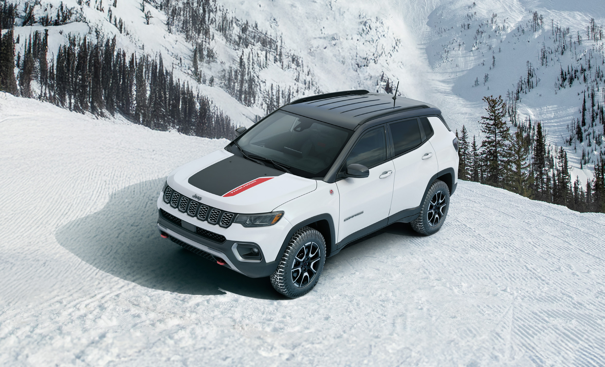
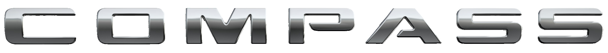
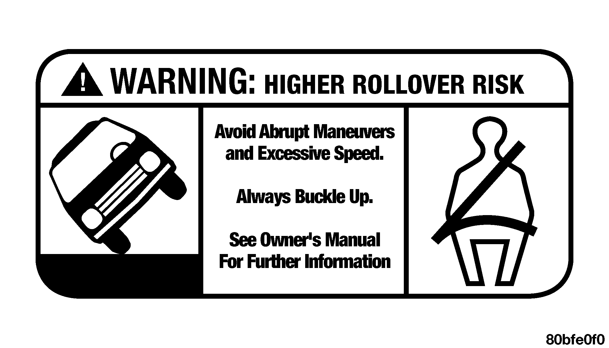
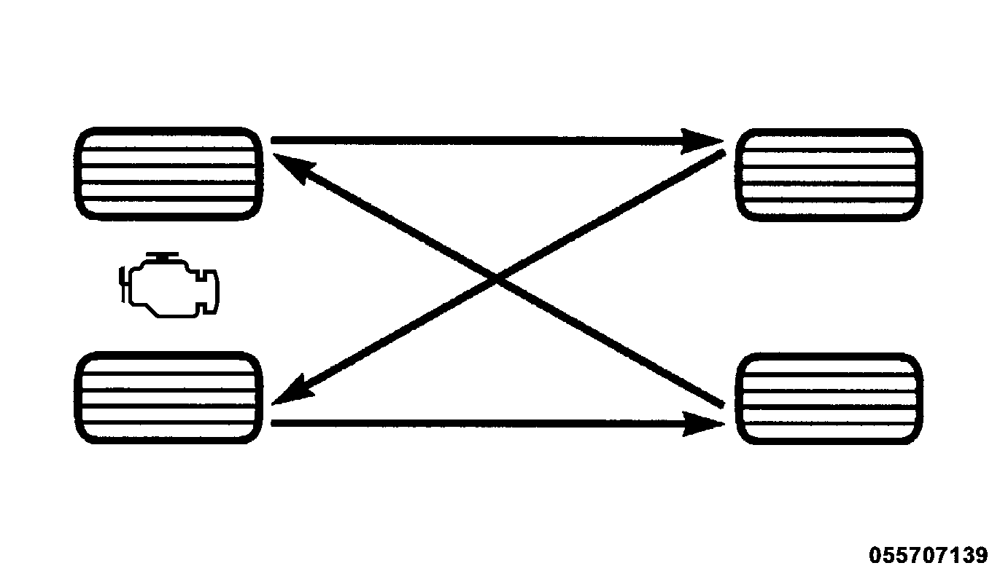
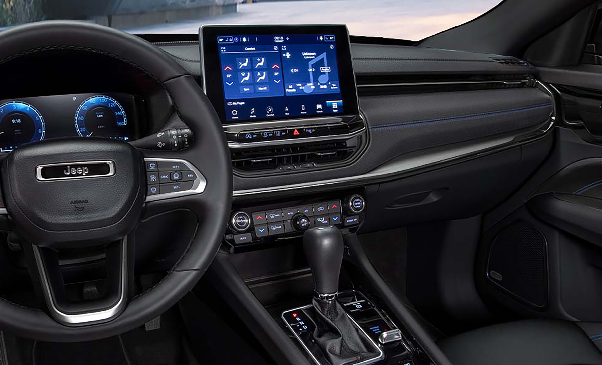
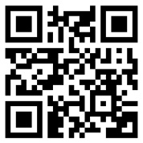
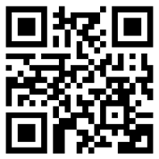

# Extracted Document

---
## Page 1

### 2026 O W N E R’S M A N U A L

#### Table

|  |
| --- |
|  |

#### Images

---
## Page 2

### ROADSIDE ASSISTANCE

24 HOURS, 7 DAYS A WEEK AT YOUR SERVICE. CALL 1-800-521-2779 OR VISIT CHRYSLER.RSAHELP.COM (USA) CALL 1-800-363-4869 OR VISIT FCA.ROADSIDEAID.COM (CANADA) SERVICES: Flat Tire Service, Out of Gas/Fuel Delivery, 12 Volt Battery Jump Assistance, Lockout Service and Towing Service. Please see the Customer Assistance chapter in this Owner’s Manual for further information. FCA US LLC reserves the right to modify the terms or discontinue the Roadside Assistance Program at any time. The Roadside Assistance Program is subject to restrictions and conditions of use, that are determined solely by FCA US LLC. Vehicle images are for illustration purposes only. Actual products sold may vary. This Owner’s Manual illustrates and describes the operation of features and equipment that are either standard or optional on this vehicle. This manual may also include a description of features and equipment that are no longer available or were not ordered on this vehicle. Please disregard any features and equipment described in this manual that are not on this vehicle. FCA US LLC reserves the right to make changes in design and specifications, and/or make additions to or improvements to its products without imposing any obligation upon itself to install them on products previously manufactured. With respect to any vehicles sold in Canada, the name FCA US LLC shall be deemed to be deleted and the name FCA Canada Inc. used in substitution therefore. This Owner’s Manual is intended to familiarize you with the important features of your vehicle. Your most up-to-date Owner Handbook, Owner’s Manual, Radio Instruction Manual and Warranty Booklet can be found by visiting the website on the back cover.

> ⚠️ WARNING: Operating, servicing and maintaining a passenger vehicle or off-highway motor vehicle can expose you to chemicals including engine exhaust, carbon monoxide, phthalates, and lead, which are known to the State of California to cause cancer and birth defects or other reproductive harm. To minimize exposure, avoid breathing exhaust, do not idle the engine except as necessary, service your vehicle in a well-ventilated area and wear gloves or wash your hands frequently when servicing your vehicle. For more information go to www.P65Warnings.ca.gov/passenger-vehicle.

#### Table

|  |
| --- |
| R OADSIDE ASSISTANCE |
| 24 HOURS, 7 DAYS A WEEK AT YOUR SERVICE.
CALL 1-800-521-2779 OR VISIT CHRYSLER.RSAHELP.COM (USA)
CALL 1-800-363-4869 OR VISIT FCA.ROADSIDEAID.COM (CANADA)
SERVICES: Flat Tire Service, Out of Gas/Fuel Delivery, 12 Volt Battery Jump
Assistance, Lockout Service and Towing Service.
Please see the Customer Assistance chapter in this Owner’s Manual for further
information.
FCA US LLC reserves the right to modify the terms or discontinue the Roadside
Assistance Program at any time. The Roadside Assistance Program is subject
to restrictions and conditions of use, that are determined solely by FCA US LLC.
Vehicle images are for illustration purposes only.
Actual products sold may vary. |

#### Images

---
## Page 3

### CONTENTS

4 INFOTAINMENT....................................................................................................105 4 6 ENHANCED DRIVING ASSISTANCE SYSTEMS ........................................131 6 8 MAINTENANCE AND VEHICLE CARE........................................................ 189 8 9 TECHNICAL SPECIFICATIONS......................................................................240 9 1 INTRODUCTION.......................................................................................................8 1 2 GETTING TO KNOW YOUR VEHICLE............................................................ 14 2 3 DASHBOARD INSTRUMENTS AND CONTROLS.......................................78 3 5 STARTING AND OPERATING...........................................................................110 5 7 IN CASE OF EMERGENCY.................................................................................171 7 10 CUSTOMER ASSISTANCE............................................................................... 246 10 11 INDEX....................................................................................................................... 251 11

---
## Page 4

2

> ⚠️ INTRODUCTION WELCOME .............................................................8 ROLLOVER WARNING............................................9 SYMBOLS KEY — DANGER, WARNINGS AND CAUTIONS.................................................9 VEHICLE MODIFICATIONS ALTERATIONS .......... 10 Description ....................................................10 SYMBOL GLOSSARY............................................10 FRONT SEATS .....................................................29 Manual Adjustment (Front Seats) — If Equipped................................................... 29 Power Adjustment (Front Seats) — If Equipped................................................... 30 Heated Seats — If Equipped..........................31 REAR SEATS ....................................................... 32 Manual Adjustment (Rear Seats)................. 32 40/20/40 Rear Seat Armrest— If Equipped................................................... 33 OCCUPANT RESTRAINT SYSTEMS .....................33 Occupant Restraint Systems Features ........33 Important Safety Precautions.......................33 Seat Belt Systems .........................................34 SUPPLEMENTAL RESTRAINT SYSTEMS (SRS)...40 Air Bag System Components ........................40 Air Bag Warning Light ................................... 40 Redundant Air Bag Warning Light ................41 Front Air Bags.................................................41 Driver And Passenger Front Air Bag Features.................................................... 42 Front Air Bag Operation ................................42 Occupant Classification System (OCS) — Front Passenger Seat........................... 42 Knee Impact Bolsters ...................................46 Supplemental Driver Knee Air Bag...............46 Supplemental Side Air Bags......................... 46 Air Bag System Components.........................48 If A Deployment Occurs ................................48 Enhanced Accident Response System ........48 Power Door Locks..........................................20 Keyless Enter ‘n Go™ — Passive Entry......... 20 Automatic Door Locks — If Equipped............22 Automatic Unlock Doors On Exit................... 22 Child-Protection Door Lock System — Rear Doors................................................ 22 WINDOWS ...........................................................23 Power Window Controls.................................23 Automatic Window Features ........................ 23 Reset Auto-Up.................................................24 Window Lockout Switch.................................24 Wind Buffeting .............................................. 24 MIRRORS ............................................................24 Inside Rearview Mirror...................................24 Illuminated Vanity Mirrors............................. 25 Outside Mirrors.............................................. 25 Outside Mirrors With Turn Signal — If Equipped................................................... 26 Power Adjustment Mirrors.............................26 Folding Mirrors...............................................26 Heated Mirrors — If Equipped ...................... 26 USER MEMORY SETTINGS — IF EQUIPPED....... 26 Description.....................................................26 Programming The Memory Feature..............27 Linking And Unlinking The Remote Keyless Entry Key Fob To Memory...........27 Memory Position Recall.................................27 HEAD RESTRAINTS ............................................ 28 Description ....................................................28 Front Head Restraint Adjustment.................28 Rear Head Restraints.................................... 28 GETTING TO KNOW YOUR VEHICLE KEYS ................................................................... 14 Key Fobs.........................................................14 REMOTE START — IF EQUIPPED......................... 16 Description ....................................................16 How To Use Remote Start..............................17 To Exit Remote Start Mode ...........................17 Remote Start Front Defrost Activation — If Equipped................................................18 Remote Start Comfort Systems — If Equipped .................................................. 18 Remote Start Windshield Wiper De-Icer Activation — If Equipped...........................18 Remote Start Cancel Message..................... 18 VEHICLE SECURITY SYSTEM — IF EQUIPPED....18 Description ....................................................18 To Arm The System ....................................... 19 To Disarm The System ..................................19 Rearming Of The System...............................19 Security System Manual Override................ 19 DOORS ................................................................19 Manual Door Locks........................................19

---
## Page 5

Installing Child Restraints Using The Top Tether Anchorage:..............................60 STEERING WHEEL AND CONTROLS...................60 Tilt/Telescoping Steering Column.................60 Heated Steering Wheel..................................61 Electric Power Steering..................................61 START BUTTON....................................................61 Keyless Enter ‘n Go™ Ignition....................... 61 WIPERS AND WASHERS .................................... 63 Description.....................................................63 Windshield Wiper Operation......................... 63 Rain Sensing Wipers — If Equipped..............63 Rear Window Wiper/Washer.........................64 Windshield Wiper De-Icer — If Equipped......64 EXTERIOR LIGHTS ..............................................65 Multifunction Lever........................................65 Headlight Switch............................................65 Daytime Running Lights (DRLs) — If Equipped................................................... 65 High/Low Beam Switch.................................66 Automatic High Beam Headlamp Control — If Equipped............................... 66 Flash-To-Pass ................................................ 66 Automatic Headlights — If Equipped............ 66 Headlight Time Delay.................................... 66 Lights-On Reminder — If Equipped .............. 66 Fog Lights.......................................................66 Turn Signals....................................................67 Lane Change Assist — If Equipped .............. 67 Battery Saver Feature....................................67 INTERIOR LIGHTS ...............................................67

> ⚠️ Enhanced Accident Response System Reset Procedure....................................... 49 Maintaining Your Air Bag System .................51 Event Data Recorder (EDR)...........................51 CHILD RESTRAINTS ............................................51 Summary Of Recommendations For Restraining Children In Vehicles..............52 Infant And Child Restraints........................... 52 Older Children And Child Restraints ............53 Children Too Large For Booster Seats .........53 Recommendations For Attaching Child Restraints .................................................54 Lower Anchors And Tethers For CHildren (LATCH) Restraint System ........ 54 LATCH Positions For Installing Child Restraints In This Vehicle.........................55 Locating The LATCH Anchorages.................. 56 Locating The Upper Tether Anchorages....... 56 Center Seat LATCH.........................................57 To Install A LATCH-Compatible Child Restraint....................................................57 How To Stow An Unused SwitchableALR (ALR) Seat Belt:................................. 57 Installing Child Restraints Using The Vehicle Seat Belt.......................................58 Lap/Shoulder Belt Systems For Installing Child Restraints In This Vehicle.......................................................58 Installing A Child Restraint With A Switchable Automatic Locking Retractor (ALR): ........................................59 3 Interior Courtesy Lights................................. 67 Instrument Panel Dimmer Control................67 Ambient Light Control — If Equipped............ 68 Illuminated Entry — If Equipped....................68 INTERIOR STORAGE AND FEATURES................. 68 Glove Compartment...................................... 68 Console Storage Compartment.................... 69 USB Control....................................................69 Power Inverter — If Equipped........................ 70 ROOF SYSTEMS...................................................70 Power Sunroof With Power Shade — If Equipped................................................... 70 Roof Luggage Rack — If Equipped................72 LIFTGATE..............................................................72 Unlock/Open The Liftgate ............................72 Lock/Close The Liftgate................................ 73 Power Liftgate — If Equipped........................ 73 Hands-Free Liftgate — If Equipped ...............74 Cargo Area Features......................................75 HOOD...................................................................77 Opening The Hood......................................... 77 Closing The Hood...........................................77 DASHBOARD INSTRUMENTS AND CONTROLS INSTRUMENT CLUSTER .....................................78 Base / Midline Instrument Cluster............... 78 Premium Instrument Cluster ........................80 Instrument Cluster Display............................81 WARNING LIGHTS AND MESSAGES...................89 Red Warning Lights........................................90

---
## Page 6

4

> ⚠️ Yellow Warning Lights....................................92 Yellow Indicator Lights...................................95 Green Indicator Lights...................................95 White Indicator Lights....................................96 Blue Indicator Lights......................................96 EMISSIONS INSPECTION AND MAINTENANCE PROGRAMS ......................... 97 Description .................................................... 97 ONBOARD DIAGNOSTIC SYSTEM .......................97 Description .................................................... 97 Onboard Diagnostic System (OBD II) Cybersecurity............................................ 98 CLIMATE CONTROLS ..........................................98 Description.....................................................98 Automatic Climate Control Descriptions And Functions........................................... 98 Manual Climate Control Descriptions And Functions......................................... 101 Automatic Temperature Control (ATC)........ 102 Climate Voice Commands...........................103 Operating Tips .............................................103

INFOTAINMENT INTRODUCTION ................................................105 Identifying Your Radio ................................ 105 RADIO OPERATION, MOBILE PHONES, AND CYBERSECURITY .........................................105 Radio Operation And Mobile Phones ........ 105 Cybersecuity ................................................105 MULTIMEDIA SYSTEMS.................................... 106 Uconnect Voice Recognition Quick Tip — If Equipped.......................................... 106 Steering Wheel Audio Controls — If Equipped................................................. 107 Uconnect Settings........................................107 Certifiation Label.........................................123 Gross Vehicle Weight Rating (GVWR).........123 Payload.........................................................123 Gross Axle Weight Rating (GAWR).............. 123 Tire Size........................................................123 Rim Size....................................................... 124 Inflatinon Pressure......................................124 Curb Weight................................................. 124 Loading.........................................................124 TRAILER TOWING..............................................124 Description ..................................................124 Common Towing Definitions....................... 124 Trailer Towing Weights (Maximum Trailer Weight Ratings)...........................125 Trailer And Tongue Weight.......................... 126 Towing Requirements .................................126 Towing Tips ................................................. 128 RECREATIONAL TOWING ................................. 128 Towing This Vehicle Behind Another Vehicle.....................................................128 Recreational Towing — 4X4 Models........... 128 DRIVING TIPS....................................................128 On-Road Driving Tips...................................128 Off-Road Driving Tips.................................. 129 STARTING AND OPERATING STARTING PROCEDURE ...................................110 Description ..................................................110 Normal Starting .......................................... 110 Cold Weather Operation (Below –22°F Or −30°C)............................................... 111 Extended Park Starting............................... 111 After Starting — Warming Up The Engine...111 If Engine Fails To Start................................ 111 Stopping The Engine................................... 112 Stop/Start System — If Equipped...............112 BRAKES ............................................................114 Description...................................................114 Electric Park Brake (EPB)............................114 TRANSMISSIONS ............................................. 117 Description ..................................................117 Ignition Park Interlock................................. 117 Brake/Transmission Shift Interlock (BTSI) System..........................................117 8-Speed Automatic Transmission ..............117 FOUR WHEEL DRIVE — IF EQUIPPED...............121 Jeep® Active Drive...................................... 121 SELEC-TERRAIN ............................................... 122 Description...................................................122 Mode Selection Guide.................................122 REFUELING THE VEHICLE ............................... 122 Description...................................................122 VEHICLE LOADING ........................................... 123 ENHANCED DRIVING ASSISTANCE SYSTEMS SENSORS.......................................................... 131 Rear Seat Reminder Alert (RSRA)...............131 COLLISION AVOIDANCE ASSISTANCE SYSTEM131

---
## Page 7

Drowsy Driver Detection (DDD) — If Equipped.................................................154 Emergency Stop Signal (ESS) — If Equipped.................................................155 SPEED CONTROL ASSISTANCE SYSTEM......... 155 Description...................................................155 Cruise Control.............................................. 155 Adaptive Cruise Control (ACC).....................157 OFF ROAD AND LOW-RANGE OPERATIONS ASSISTANCE SYSTEM.................................. 164 Hill Descent Control (HDC) — If Equipped..164 Hill Start Assist (HSA) .................................164 UTILITY FEATURES ASSISTANCE SYSTEM....... 165 Traffic Sign Recognition Assist System — If Equipped.......................................... 165 Tire Pressure Monitoring System (TPMS).. 167

> ⚠️ Forward Collision Warning (FCW) With Mitigation — If Equipped........................ 131 VEHICLE STABILITY ASSISTANCE SYSTEM...... 133 Dynamic Steering Torque (DST)..................133 Electronic Roll Mitigation (ERM).................134 Electronic Stability Control (ESC) ...............134 Traction Control System (TCS).................... 136 Trailer Sway Control (TSC) ..........................136 BRAKING PERFORMANCE ASSISTANCE SYSTEM........................................................136 Anti-Lock Brake System (ABS) ...................136 Brake System Warning Light.......................137 Electronic Brake Force Distribution (EBD). 137 Ready Alert Braking (RAB).......................... 137 Rain Brake Support (RBS)...........................137 VISIBILITY ASSISTANCE SYSTEM..................... 137 Blind Spot Monitoring (BSM) — If Equipped.................................................137 LANE CENTERING ASSISTANCE SYSTEM.........141 Active Lane Management System — If Equipped................................................. 141 Active Driving Assist D — If Equipped ........143 PARKING AND REVERSE OPERATIONS ASSISTANCE SYSTEM...................................147 ParkSense Front/Rear Park Assist System — If Equipped.............................147 ParkView Rear Backup Camera .................151 Surround View Camera System — If Equipped.................................................152 DRIVER ATTENTION ASSISTANCE SYSTEM......154

> ⚠️ IN CASE OF EMERGENCY HAZARD WARNING FLASHERS ........................171 Description................................................... 171 ASSIST AND SOS — IF EQUIPPED.....................171 Description................................................... 171 JACKING THE VEHICLE AND WHEEL CHANGING — IF EQUIPPED......................... 173 Description................................................... 174 Preparations For Jacking ............................174 Jack Location/Spare Tire Stowage............. 174 Jacking Instructions.....................................175 TIRE REPAIR KIT — IF EQUIPPED......................178 Description...................................................178 JUMP STARTING................................................182 Description...................................................182 5 Preparations For Jump Start.......................182 Jump Starting Procedure............................ 183 REFUELING IN AN EMERGENCY — IF EQUIPPED.................................................... 184 Description...................................................184 IF YOUR ENGINE OVERHEATS ......................... 185 Description...................................................185 OVERRIDE......................................................... 185 Description...................................................185 FREEING A STUCK VEHICLE.............................186 Description...................................................186 TOWING A DISABLED VEHICLE........................ 186 Description...................................................186 Without The Key Fob................................... 187 4x4 Models.................................................. 187 TOW HOOKS — IF EQUIPPED............................187 Emergency Tow Hooks — If Equipped.........187 ENHANCED ACCIDENT RESPONSE SYSTEM (EARS)............................................188 Description...................................................188 EVENT DATA RECORDER (EDR)........................188 Description...................................................188 MAINTENANCE AND VEHICLE CARE SAFETY TIPS .....................................................189 Transporting Passengers............................ 189 Transporting Pets ....................................... 189 Safety Checks You Should Make Inside The Vehicle .............................................189

---
## Page 8

6

> ⚠️ Periodic Safety Checks You Should Make Outside The Vehicle..................... 190 Exhaust Gas ................................................190 Carbon Monoxide Warnings .......................191 SCHEDULED SERVICING ................................. 191 Descripton....................................................191 ENGINE COMPARTMENT .................................195 2.0L Engine..................................................195 Engine Break-In Recommendations...........196 Checking Oil Level....................................... 196 Adding Washer Fluid................................... 196 Maintenance-Free Battery ......................... 196 Pressure Washing........................................197 VEHICLE MAINTENANCE...................................197 Description...................................................197 Engine Oil .................................................... 197 Engine Oil Filter ...........................................198 Engine Air Cleaner Filter............................. 198 Air Conditioner Maintenance......................199 Accessory Drive Belt Inspection................. 199 Body Lubrication .........................................200 Wiper Blades............................................... 200 Exhaust System ..........................................203 Cooling System............................................204 Brake System ..............................................206 Automatic Transmission..............................206 FUSES ...............................................................207 General Information.................................... 207 Fuse Location.............................................. 208 Power Distribution Center/Fuses............... 208 Interior Fuses...............................................213 TECHNICAL SPECIFICATIONS VEHICLE IDENTIFICATION NUMBER (VIN)....... 240 Description...................................................240 FUEL REQUIREMENTS .....................................240 Description...................................................240 2.0L Engine..................................................240 Methanol .....................................................240 Ethanol.........................................................240 Clean Air Gasoline....................................... 241 Reformulated Gasoline ...............................241 Gasoline/Oxygenate Blends .......................241 Do Not Use E-85 In Non-Flex Fuel Vehicles................................................... 241 Compressed Natural Gas (CNG) And Liquid Propane (LP) Fuel System Modifications.......................................... 241 Methylcyclopentadienyl Manganese Tricarbonyl (MMT)................................... 241 Materials Added To Fuel .............................241 Fuel System Cautions..................................242 WHEEL AND TIRES ...........................................242 Description ..................................................242 FLUIDS AND LUBRICANTS................................243 Engine Fluids and Lubricants..................... 243 Chassis Fluids and Lubricants....................244 FLUID CAPACITIES ............................................244 Specifications.............................................. 244 Rear Cargo Fuse/Relay Distribution Unit - If Equipped.................................... 215 LIGHT REPLACEMENT ......................................216 Replacement Bulbs, Names, And Part Numbers..................................................216 Replacing Exterior Bulbs............................. 217 Replacing Interior Bulbs..............................219 TIRES AND WHEELS......................................... 221 Tire Safety Information ...............................221 Tires — General Information ...................... 228 Tire Types..................................................... 231 Spare Tires — If Equipped........................... 231 Snow Traction Devices................................ 232 Wheel And Wheel Trim Care ...................... 233 Tire Rotation Recommendations................234 DEPARTMENT OF TRANSPORTATION...............234 Description...................................................234 Treadwear.................................................... 235 Traction Grades........................................... 235 Temperature Grades................................... 235 VEHICLE STORAGE ...........................................235 Description...................................................235 BODYWORK AND EXTERIOR CARE ................. 236 Protection From Atmospheric Agents ........236 Body And Underbody Maintenance............236 Preserving The Bodywork............................237 INTERIOR CARE ............................................... 238 Seats And Fabric Parts................................238 Plastic And Coated Parts............................ 238 Leather Surfaces.........................................239 Glass Surfaces ........................................... 239 CUSTOMER ASSISTANCE CUSTOMER ASSISTANCE..................................246 Roadside Assistance...................................246

---
## Page 9

FCA US LLC Customer Center..................... 247 FCA Canada Customer Care........................247 Mexico.......................................................... 247 Puerto Rico And US Virgin Islands..............247 Customer Assistance For The Hearing Or Speech Impaired (TDD/TTY)............. 247 Service Contract.......................................... 248 Warranty Information.................................. 248 Mopar® Parts..............................................248 Reporting Safety Defects............................ 248 Ordering and Accessing Additional Owner’s Information...............................249 Change Of Ownership Or Address.............. 249 General Information.................................... 249 7

---
## Page 10

### 8 INTRODUCTION

### WELCOME

Congratulations on the purchase of your new Jeep® vehicle. Be assured that it represents precision workmanship, distinctive styling, and high quality. INTRODUCTION This Owner's Manual has been prepared with the assistance of service and engineering specialists to acquaint you with the operation and maintenance of your vehicle. It is supplemented by customer-oriented documents. Within this information, you will find a description of the services that FCA US LLC offers to its customers as well as the details of the terms and conditions for maintaining its validity. Please take the time to read these publications carefully. Following the instructions and recommendations in this manual will help ensure safe and enjoyable operation of your vehicle. This Owner’s Manual describes all versions of this vehicle. Options and equipment dedicated to specific markets or versions are not expressly indicated in the text. Therefore, you should only consider the information that is related to the trim level, engine, and version that you have purchased. Any content introduced throughout the Owner’s Information, which may or may not be applicable to your vehicle, will be identified with the wording “If Equipped”. All data contained in this publication are intended to help you use your vehicle in the best possible way. FCA US LLC reserves the right to make changes to the model described for technical and/or commercial reasons. For further information, contact an authorized dealer. When it comes to service, remember that authorized dealers know your Jeep® best, have factory-trained technicians and genuine Mopar® parts, and care about your satisfaction.

---
## Page 11

> ⚠️ ROLLOVER WARNING

disabling injuries by two million annually. In a rollover crash, an unbelted person is significantly more likely to die than a person wearing a seat belt. Always buckle up. Utility vehicles have a significantly higher rollover rate than other types of vehicles. This vehicle has a higher ground clearance and a higher center of gravity than many passenger vehicles. It is capable of performing better in a wide variety of off-road applications. Driven in an unsafe manner, all vehicles can go out of control. Because of the higher center of gravity, if this vehicle is out of control it may roll over while some other vehicles may not.

> ⚠️ SYMBOLS KEY — DANGER, WARNINGS AND CAUTIONS

Do not attempt sharp turns, abrupt maneuvers, or other unsafe driving actions that can cause loss of vehicle control. Failure to operate this vehicle safely may result in a collision, rollover of the vehicle, and severe or fatal injury. Drive carefully.

> ⚠️ If you do not read the entire Owner’s Manual, you may miss important information. Observe all Cautions and Warnings.

> ⚠️ Rollover Warning Label

> ⚠️ Failure to use the driver and passenger seat belts provided is a major cause of severe or fatal injury. In fact, the US government notes that the universal use of existing seat belts could cut the highway death toll by 10,000 or more each year and could reduce INTRODUCTION 9 1 WARNING! These statements apply to operating procedures that could result in a collision, bodily injury and/or death.

CAUTION! These statements apply to procedures that could result in damage to your vehicle. NOTE: A suggestion which will improve installation, operation, and reliability. If not followed, may result in damage. TIP: General ideas/solutions/suggestions on easier use of the product or functionality. PAGE REFERENCE ARROW Follow this reference for additional information on a particular feature. FOOTNOTE Supplementary and relevant information pertaining to the topic.

#### Table

| WARNING! | These statements apply to operating
procedures that could result in a colli-
sion, bodily injury and/or death. |
| --- | --- |
| CAUTION! | These statements apply to procedures
that could result in damage to your vehi-
cle. |
| NOTE: | A suggestion which will improve installa-
tion, operation, and reliability. If not fol-
lowed, may result in damage. |
| TIP: | General ideas/solutions/suggestions on
easier use of the product or functionali-
ty. |
| PAGE REFERENCE ARROW | Follow this reference for additional infor-
mation on a particular feature. |
| FOOTNOTE | Supplementary and relevant information
pertaining to the topic. |

#### Images

---
## Page 12

### 10 INTRODUCTION

### VEHICLE MODIFICATIONS ALTERATIONS

### DESCRIPTION

> ⚠️ WARNING!

Any modifications or alterations to this vehicle could seriously affect its roadworthiness and safety and may lead to a collision resulting in serious injury or death.

### SYMBOL GLOSSARY

> ⚠️ Some car components have colored labels with symbols indicating precautions to be observed when using this component. It is important to follow all warnings when operating your vehicle. See below for the definition of each symbol ⇨ page 89.

> ⚠️ NOTE: Warning and Indicator lights are different based upon equipment options and current vehicle status. Some telltales are optional and may not appear.

> ⚠️ Red Warning Lights

> ⚠️ Air Bag Warning Light ⇨ page 90 Red Warning Lights Door Open Warning Light ⇨ page 90 Drowsiness Detected Warning Light ⇨ page 90 Electric Power Steering (EPS) Fault Warning Light ⇨ page 91 Electronic Throttle Control (ETC) Warning Light ⇨ page 91 Engine Temperature Warning Light ⇨ page 91 Hood Open Warning Light ⇨ page 91 Liftgate Open Warning Light ⇨ page 91 Brake Warning Light ⇨ page 90 Oil Pressure Warning Light ⇨ page 91 Battery Charge Warning Light ⇨ page 90

#### Table

| Red Warning Lights | None |
| --- | --- |
|  | Door Open Warning Light
⇨ page 90 |
|  | Drowsiness Detected Warning Light
⇨ page 90 |
|  | Electric Power Steering (EPS) Fault Warning Light
⇨ page 91 |
|  | Electronic Throttle Control (ETC) Warning Light
⇨ page 91 |
|  | Engine Temperature Warning Light
⇨ page 91 |
|  | Hood Open Warning Light
⇨ page 91 |
|  | Liftgate Open Warning Light
⇨ page 91 |
|  | Oil Pressure Warning Light
⇨ page 91 |

#### Table

| WARNING! |
| --- |
| Any modifications or alterations to this vehicle could seriously affect its
roadworthiness and safety and may lead to a collision resulting in serious injury
or death. |

#### Table

| Red Warning Lights | None |
| --- | --- |
|  | Air Bag Warning Light
⇨ page 90 |
|  | Brake Warning Light
⇨ page 90 |
|  | Battery Charge Warning Light
⇨ page 90 |

#### Images

---
## Page 13

> ⚠️ Red Warning Lights

> ⚠️ Yellow Warning Lights

> ⚠️ Oil Temperature Warning Light ⇨ page 91

> ⚠️ Seat Belt Reminder Warning Light ⇨ page 91

> ⚠️ Transmission Fault Warning Light ⇨ page 92

> ⚠️ Transmission Temperature Warning Light ⇨ page 92

> ⚠️ Vehicle Security Warning Light ⇨ page 92

> ⚠️ Yellow Warning Lights

> ⚠️ Anti-Lock Brake System (ABS) Warning Light ⇨ page 92

> ⚠️ Electric Park Brake Warning Light ⇨ page 92 INTRODUCTION 11 Electronic Stability Control (ESC) Active Warning Light ⇨ page 92 1 Electronic Stability Control (ESC) OFF Warning Light ⇨ page 93 Fuel Cutoff Warning Light ⇨ page 93 Fuel Level Sensor Failure Warning Light ⇨ page 93 Active Lane Management Warning Light ⇨ page 93 Service Active Lane Management Warning Light ⇨ page 93 Low Coolant Level Warning Light ⇨ page 93 Low Fuel Warning Light ⇨ page 93

#### Table

| Red Warning Lights | None |
| --- | --- |
|  | Oil Temperature Warning Light
⇨ page 91 |
|  | Seat Belt Reminder Warning Light
⇨ page 91 |
|  | Transmission Fault Warning Light
⇨ page 92 |
|  | Transmission Temperature Warning Light
⇨ page 92 |
|  | Vehicle Security Warning Light
⇨ page 92 |

#### Table

| Yellow Warning Lights | None |
| --- | --- |
|  | Electronic Stability Control (ESC) Active Warning Light
⇨ page 92 |
|  | Electronic Stability Control (ESC) OFF Warning Light
⇨ page 93 |
|  | Fuel Cutoff Warning Light
⇨ page 93 |
|  | Fuel Level Sensor Failure Warning Light
⇨ page 93 |
|  | Active Lane Management Warning Light
⇨ page 93 |
|  | Service Active Lane Management Warning Light
⇨ page 93 |
|  | Low Coolant Level Warning Light
⇨ page 93 |
|  | Low Fuel Warning Light
⇨ page 93 |

#### Table

| Yellow Warning Lights | None |
| --- | --- |
|  | Anti-Lock Brake System (ABS) Warning Light
⇨ page 92 |
|  | Electric Park Brake Warning Light
⇨ page 92 |

#### Images

---
## Page 14

### 12 INTRODUCTION

> ⚠️ Yellow Warning Lights

> ⚠️ Low Washer Fluid Warning Light ⇨ page 93

> ⚠️ Engine Check/Malfunction Indicator (MIL) Warning Light ⇨ page 93

> ⚠️ Service 4WD Warning Light ⇨ page 94

> ⚠️ Service Forward Collision Warning (FCW) Light ⇨ page 94

> ⚠️ Service Stop/Start System Warning Light ⇨ page 94

> ⚠️ Tire Pressure Monitoring System (TPMS) Warning Light ⇨ page 94

> ⚠️ Towing Hook Breakdown Warning Light ⇨ page 95 Yellow Indicator Lights 4WD Low Indicator Light ⇨ page 95 4WD Lock Indicator Light ⇨ page 95 Service Adaptive Cruise Control (ACC) Warning Light ⇨ page 93 Auto HOLD! Fault Indicator Light ⇨ page 95 Forward Collision Warning (FCW) Indicator Light ⇨ page 95 Forward Collision Warning (FCW) OFF Indicator Light ⇨ page 95 Immobilizer Fail/VPS Electrical Alarm Indicator Light ⇨ page 95 Green Indicator Lights Active Lane Management Indicator Light ⇨ page 96

#### Table

| Yellow Warning Lights | None |
| --- | --- |
|  | Low Washer Fluid Warning Light
⇨ page 93 |
|  | Engine Check/Malfunction Indicator (MIL) Warning Light
⇨ page 93 |
|  | Service Adaptive Cruise Control (ACC) Warning Light
⇨ page 93 |
|  | Service 4WD Warning Light
⇨ page 94 |
|  | Service Forward Collision Warning (FCW) Light
⇨ page 94 |
|  | Service Stop/Start System Warning Light
⇨ page 94 |
|  | Tire Pressure Monitoring System (TPMS) Warning Light
⇨ page 94 |
|  | Towing Hook Breakdown Warning Light
⇨ page 95 |

#### Table

| Yellow Indicator Lights | None |
| --- | --- |
|  | 4WD Low Indicator Light
⇨ page 95 |
|  | 4WD Lock Indicator Light
⇨ page 95 |
|  | Auto HOLD! Fault Indicator Light
⇨ page 95 |
|  | Forward Collision Warning (FCW) Indicator Light
⇨ page 95 |
|  | Forward Collision Warning (FCW) OFF Indicator Light
⇨ page 95 |
|  | Immobilizer Fail/VPS Electrical Alarm Indicator Light
⇨ page 95 |

#### Table

| Green Indicator Lights | None |
| --- | --- |
|  | Active Lane Management Indicator Light
⇨ page 96 |

#### Images

---
## Page 15

Green Indicator Lights Adaptive Cruise Control (ACC) Set With No Target Detected Indicator Light ⇨ page 95 Adaptive Cruise Control (ACC) Set With Target Detected Light ⇨ page 95 Auto HOLD Indicator Light ⇨ page 95 Automatic High Beam Indicator Light ⇨ page 95 Cruise Control SET Indicator Light ⇨ page 96 Front Fog Indicator Light ⇨ page 96 Parking/Headlights On Indicator Light ⇨ page 96 Blue Indicator Lights Sport Mode Indicator Light ⇨ page 96 INTRODUCTION 13 Green Indicator Lights Stop/Start Active Indicator Light ⇨ page 96 1 Turn Signal Indicator Lights ⇨ page 96 White Indicator Lights Active Lane Management Indicator Light ⇨ page 96 Cruise Control Ready Indicator Light ⇨ page 96 Hill Descent Control (HDC) Indicator Light ⇨ page 96 Idle Coasting Indicator Light ⇨ page 96 High Beam Indicator Light ⇨ page 96

#### Table

| Green Indicator Lights | None |
| --- | --- |
|  | Adaptive Cruise Control (ACC) Set With No Target Detected Indicator
Light
⇨ page 95 |
|  | Adaptive Cruise Control (ACC) Set With Target Detected Light
⇨ page 95 |
|  | Auto HOLD Indicator Light
⇨ page 95 |
|  | Automatic High Beam Indicator Light
⇨ page 95 |
|  | Cruise Control SET Indicator Light
⇨ page 96 |
|  | Front Fog Indicator Light
⇨ page 96 |
|  | Parking/Headlights On Indicator Light
⇨ page 96 |
|  | Sport Mode Indicator Light
⇨ page 96 |

#### Table

| Green Indicator Lights | None |
| --- | --- |
|  | Stop/Start Active Indicator Light
⇨ page 96 |
|  | Turn Signal Indicator Lights
⇨ page 96 |

#### Table

| White Indicator Lights | None |
| --- | --- |
|  | Active Lane Management Indicator Light
⇨ page 96 |
|  | Cruise Control Ready Indicator Light
⇨ page 96 |
|  | Hill Descent Control (HDC) Indicator Light
⇨ page 96 |
|  | Idle Coasting Indicator Light
⇨ page 96 |

#### Table

| Blue Indicator Lights | None |
| --- | --- |
|  | High Beam Indicator Light
⇨ page 96 |

#### Images

---
## Page 16

### 14 GETTING TO KNOW YOUR VEHICLE

### KEYS

### KEY FOBS

Your vehicle is equipped with a keyless ignition key fob. The keyless ignition key fob supports Passive Entry, Remote Keyless Entry (RKE), Keyless Enter ‘n Go™ (if equipped), Remote Start (if equipped), and remote power liftgate operation. The keyless ignition key fob supports vehicles equipped with a START/STOP ignition button. The keyless ignition key fob also includes an emergency key, which is stored in the rear of the key fob. The key fob allows you to lock or unlock the doors and liftgate from distances up to approximately 66 ft (20 m). The key fob does not need to be pointed at the vehicle to activate the system. 1 — Unlock Button 2 — Liftgate Button 3 — Emergency Key 4 — Lock Button 5 — Remote Start Button 6 — Panic Button NOTE: ●The key fob’s wireless signal may be blocked if the key fob is located next to a mobile phone, laptop, or other electronic device. This may result in poor performance. ●With the ignition on and the vehicle moving at 2 mph (4 km/h), all RKE commands are disabled. NOTE: In case the ignition switch does not change with the push of a button, the key fob may have a low or fully depleted battery. A low key fob battery can be verified by referring to the instrument cluster, which will display directions to follow ⇨ page 249. GETTING TO KNOW YOUR VEHICLE To Unlock/Lock The Doors And Liftgate Push and release the unlock button on the key fob once to unlock the driver’s door. If selected within Uconnect Settings, pushing the unlock button twice within five seconds will unlock all the doors and the liftgate. To lock all the doors and the liftgate, push the lock button once ⇨ page 107. When the doors are unlocked, the turn signals will flash and the illuminated entry system will be activated. When the doors are locked, the turn signals will flash and the horn will chirp. Key Left Vehicle Feature If a valid key fob is no longer detected inside the vehicle while the vehicle’s ignition system is in the ON/RUN or START position, the message “Key Fob Has Left The Vehicle” will be shown in the instrument cluster display along with an interior chime. An exterior audible and visual alert will also be activated to warn the driver. Key Fob The vehicle’s horn will rapidly chirp three times along with a single flash of the vehicle’s exterior lights.

> ⚠️ NOTE: ●The doors have to be open and then closed in order for the vehicle to detect a key fob. The Key Left Vehicle feature will activate when the first door is closed and no key fob is detected in the vehicle. If the warning has been activated, and the other doors are closed, no other warnings will be issued.

#### Images

---
## Page 17

●These alerts will not be activated in situations where either the vehicle’s engine is left running with the key fob inside, or the key fob’s wireless signals are blocked. Replacing The Battery In The Key Fob The replacement battery is one CR2032 battery. NOTE: ●Customers are recommended to use a battery obtained from Mopar®. Aftermarket coin battery dimensions may not meet the original OEM coin battery dimensions. ●Perchlorate material — special handling may apply. See https://dtsc.ca.gov/perchlorate/ for further information. ●Do not touch the battery terminals that are on the back housing or the printed circuit board. 1 — Emergency Key Release 2 — Emergency Key 2. Separate the key fob halves using a #2 flat-blade screwdriver or a coin, and gently pry the two halves of the key fob apart. Make sure not to damage the seal during removal. Key Fob: 1. Remove the emergency key (2) by sliding the emergency key release (1) on the back of the key fob and pulling the emergency key out with your other hand. GETTING TO KNOW YOUR VEHICLE 15 2 Emergency Key Removal Key Fob Battery Replacement 3. Remove the back cover to access and replace the battery. When replacing the battery, match the (+) sign on the battery to the (+) sign on the inside of the battery clip, located on the back cover. Avoid touching the new battery with your fingers. Skin oils may cause battery deterioration. If you touch a battery, clean it with rubbing alcohol. 4. To assemble the key fob case, snap the two halves together.

> ⚠️ WARNING!

●The integrated key fob contains a coin cell battery. Do not ingest the battery; there is a chemical burn hazard. If the coin cell battery is swallowed, it can cause severe internal burns in just two hours and can lead to death. ●If you think a battery may have been swallowed or placed inside any part of the body, seek immediate medical attention. (Continued) Separating Case With A Coin

#### Table

| WARNING! |
| --- |
| ● The integrated key fob contains a coin cell battery.
Do not ingest the battery; there is a chemical burn
hazard. If the coin cell battery is swallowed, it can
cause severe internal burns in just two hours and
can lead to death.
● If you think a battery may have been swallowed
or placed inside any part of the body, seek
immediate medical attention. |

#### Images

---
## Page 18

### 16 GETTING TO KNOW YOUR VEHICLE

NOTE: ●When having the Sentry Key Immobilizer system serviced, bring all vehicle keys with you to an authorized dealer. ●Emergency keys must be ordered to the correct key cut to match the vehicle locks. ●It is not mandatory to replace the key fob if a new emergency key is needed, and vice versa.

> ⚠️ WARNING!

●Keep new and used batteries away from children. If the battery compartment does not close securely, stop using the product and keep it away from children. Programming And Requesting Additional Key Fobs Sentry Key Programming the key fob may be performed by an authorized dealer. NOTE: ●Once a key fob is programmed to a vehicle, it cannot be repurposed and reprogrammed to another vehicle. ●Only key fobs that are programmed to the vehicle electronics can be used to start and operate the vehicle.

> ⚠️ WARNING!

●Always remove the key fobs from the vehicle and lock all doors when leaving the vehicle unattended. ●For vehicles equipped with Keyless Enter ‘n Go™ Ignition, always remember to place the ignition in the OFF position when exiting the vehicle. Duplication of key fobs may be performed at an authorized dealer. This procedure consists of programming a blank key fob to the vehicle electronics. A blank key fob is one that has never been programmed. If the Vehicle Security Light turns on during normal vehicle operation (vehicle running for longer than 10 seconds), it indicates that there is a fault in the electronics. Should this occur, have the vehicle serviced as soon as possible by an authorized dealer.

### CAUTION!

The Sentry Key Immobilizer system is not compatible with some aftermarket Remote Start systems. Use of these systems may result in vehicle starting problems and loss of security protection. All of the key fobs provided with your new vehicle have been programmed to the vehicle electronics ⇨ page 249. The Sentry Key Immobilizer system prevents unauthorized vehicle operation by disabling the engine. The system does not need to be armed or activated. Operation is automatic, regardless of whether the vehicle is locked or unlocked. NOTE: A key fob that has not been programmed is also considered an invalid key. The system uses a key fob, keyless push button ignition and a Radio Frequency (RF) receiver to prevent unauthorized vehicle operation. Therefore, only key fobs that are programmed to the vehicle can be used to start and operate the vehicle. The system cannot reprogram a key fob obtained from another vehicle. REMOTE START — IF EQUIPPED DESCRIPTION This system uses the key fob to start the engine conveniently from outside the vehicle while still maintaining security. The system has a range of approximately 328 ft (100 m). After placing the ignition in the ON/RUN position, the Vehicle Security Light will turn on for three seconds for a bulb check. If the light remains on after the bulb check, it indicates that there is a problem with the electronics. In addition, if the light begins to flash after the bulb check, it indicates that someone attempted to start the engine with an invalid key fob. If a valid key fob is used to start the engine but there is an issue with the vehicle electronics, the engine will start and shut off after two seconds. Remote Start is used to defrost windows in cold weather, and to reach a comfortable climate in all ambient conditions before the customer enters the vehicle. NOTE: Obstructions between the vehicle and key fob may reduce this range ⇨ page 249.

#### Table

| WARNING! |
| --- |
| ● Keep new and used batteries away from children.
If the battery compartment does not close
securely, stop using the product and keep it away
from children. |

#### Table

| CAUTION! |
| --- |
| The Sentry Key Immobilizer system is not compatible
with some aftermarket Remote Start systems. Use of
these systems may result in vehicle starting problems
and loss of security protection. |

#### Table

| WARNING! |
| --- |
| ● Always remove the key fobs from the vehicle
and lock all doors when leaving the vehicle
unattended.
● For vehicles equipped with Keyless Enter ‘n Go™
Ignition, always remember to place the ignition in
the OFF position when exiting the vehicle. |

#### Images

---
## Page 19

●The ignition must be placed in the ON/RUN position before the Remote Start sequence can be repeated for a third cycle.

> ⚠️ WARNING!

●Do not start or run an engine in a closed garage or confined area. Exhaust gas contains carbon monoxide which is odorless and colorless. Carbon monoxide is poisonous and can cause serious injury or death when inhaled. ●Keep key fobs away from children. Operation of the Remote Start system, windows, door locks or other controls could cause serious injury or death. All of the following conditions must be met before the engine will remote start: ●Gear selector in PARK ●Doors closed ●Hood closed ●Liftgate closed ●Hazard switch off ●Brake switch inactive (brake pedal not pressed) ●Battery at an acceptable charge level ●Panic button not pushed ●System not disabled from previous Remote Start event ●Vehicle Security Light flashing (if equipped) ●Ignition in the OFF position ●Fuel level meets minimum requirement ●Vehicle Security system is not signaling an intrusion ●Malfunction Indicator Light is not illuminated

### HOW TO USE REMOTE START

Push and release the Remote Start button on the key fob twice within five seconds. The vehicle doors will lock, the parking lights will flash, and the horn will chirp twice (if programmed). Then, the engine will start, and the vehicle will remain in the Remote Start mode for a 15 minute cycle. Pushing the Remote Start button a third time shuts the engine off. To drive the vehicle, push the unlock button and place the ignition in the ON/RUN position. NOTE: ●With Remote Start, the engine will only run for 15 minutes. ●Remote Start can only be used twice. ●If an engine fault is present or fuel level is low, the vehicle will start and then shut down in 10 seconds. ●The parking lights will turn on and remain on during Remote Start mode. ●For security, power window and power sunroof operation (if equipped) are disabled when the vehicle is in the Remote Start mode.

> ⚠️ GETTING TO KNOW YOUR VEHICLE 17 WARNING!

monoxide is poisonous and can cause serious injury or death when inhaled. ●Keep key fobs away from children. Operation of the Remote Start system, windows, door locks or other controls could cause serious injury or death. 2 TO EXIT REMOTE START MODE To drive the vehicle after starting the Remote Start system, push and release the START/STOP ignition button prior to the end of the 15 minute cycle. The Remote Start system will turn the engine off if the Remote Start button on the key fob is pushed again, or if the engine is allowed to run for the entire 15 minute cycle. Once the ignition is placed in the ON/RUN position, the climate controls will resume previously set operations (temperature, blower control, etc.). NOTE: ●For vehicles not equipped with the Keyless Enter ‘n Go™ — Passive Entry feature, the ignition switch must be in the ON/RUN position in order to drive the vehicle. ●For vehicles equipped with the Keyless Enter ‘n Go™ — Passive Entry feature, the message “Remote Start Active — Push Start Button” will show in the instrument cluster display until you push the START/ STOP ignition button. ●To avoid unintentional shutdowns, the system will disable for two seconds after receiving a valid Remote Start request.

> ⚠️ WARNING!

●Do not start or run an engine in a closed garage or confined area. Exhaust gas contains carbon monoxide which is odorless and colorless. Carbon (Continued)

#### Table

| WARNING! |
| --- |
| ● Do not start or run an engine in a closed garage
or confined area. Exhaust gas contains carbon
monoxide which is odorless and colorless. Carbon
monoxide is poisonous and can cause serious
injury or death when inhaled.
● Keep key fobs away from children. Operation of
the Remote Start system, windows, door locks or
other controls could cause serious injury or death. |

#### Table

| WARNING! |
| --- |
| monoxide is poisonous and can cause serious
injury or death when inhaled.
● Keep key fobs away from children. Operation of
the Remote Start system, windows, door locks or
other controls could cause serious injury or death. |

#### Table

| WARNING! |
| --- |
| ● Do not start or run an engine in a closed garage
or confined area. Exhaust gas contains carbon
monoxide which is odorless and colorless. Carbon |

---
## Page 20

### 18 GETTING TO KNOW YOUR VEHICLE

### REMOTE START FRONT DEFROST ACTIVATION — IF EQUIPPED

Manual Temperature Control (MTC) — If Equipped When Remote Start is active, and the outside ambient temperature is 40°F (4.5°C) or below, the system will automatically activate front defrost for 15 minutes or less. The timing is dependent on the ambient temperature. Once the timer expires, the system will automatically adjust the settings depending on ambient conditions. See “Remote Start Comfort Systems — If Equipped” in the next section for detailed operation.

### REMOTE START COMFORT SYSTEMS — IF EQUIPPED

For more information on ATC, MTC, and climate control settings, see ⇨ page 98. NOTE: These features will stay on through the duration of Remote Start, or until the ignition is placed in the ON/RUN position. The climate control settings will change, and exit the automatic defaults, if manually adjusted by the driver while the vehicle is in Remote Start mode. This includes turning the climate controls off using the OFF button. When Remote Start is activated, the front and rear defroster will automatically turn on in cold weather conditions. The heated steering wheel and driver heated seat feature will turn on if programmed in the Comfort menu screen within Uconnect Settings ⇨ page 107. In warm weather, the driver vented seat feature will automatically turn on when Remote Start is activated, if programmed in the Comfort menu screen. The vehicle will adjust the climate control settings depending on the outside ambient temperature. Automatic Temperature Control (ATC) — If Equipped The climate controls will automatically adjust to the optimal temperature and mode settings depending on the outside ambient temperature. This will occur until the ignition is placed in the ON/RUN position where the climate controls will resume their previous settings. REMOTE START CANCEL MESSAGE ●In ambient temperatures of 40°F (4.5°C) or below, the climate settings will default to maximum heat, with fresh air entering the cabin. If the front defrost timer expires, the vehicle will enter Mix mode. ●In ambient temperatures from 40°F (4.5°C) to 78°F (26°C), the climate settings will be based on the last settings selected by the driver. ●In ambient temperatures of 78°F (26°C) or above, the climate settings will default to MAX A/C, Bi-Level mode, with Recirculation on. One of the following messages will display in the instrument cluster display if the vehicle fails to remote start or exits Remote Start prematurely: ●Remote Start Canceled — Door Open ●Remote Start Canceled — Hood Open ●Remote Start Canceled — Liftgate Open ●Remote Start Canceled — Fuel Low ●Remote Start Canceled — Time Expired ●Remote Start Canceled — System Fault ●Remote Start Disabled — Start Vehicle to Reset The instrument cluster display message stays active until the ignition is placed in the ON/RUN position. VEHICLE SECURITY SYSTEM — IF EQUIPPED DESCRIPTION REMOTE START WINDSHIELD WIPER DE-ICER ACTIVATION — IF EQUIPPED The Vehicle Security system monitors the vehicle doors, hood, liftgate, and the Keyless Enter ‘n Go™ Ignition for unauthorized operation. While the Vehicle Security system is armed, interior switches for door locks and liftgate release are disabled. If something triggers the system, the Vehicle Security system will provide the following audible and visible signals: When Remote Start is active and the outside ambient temperature is less than 33°F (0.6°C), the Windshield Wiper De-Icer will activate. Exiting Remote Start will resume its previous operation. If the Windshield Wiper De-Icer was active, the timer and operation will continue. ●The horn will pulse ●The turn signals will flash

---
## Page 21

●The Vehicle Security Light in the instrument cluster will flash 3. If any doors are open, close them. NOTE: ●The Vehicle Security system is factory adjusted to standards from different countries. ●The Vehicle Security system is a complementary security system developed to hinder the occurrence of vehicle theft and prevent vandalism. It does not prevent the theft of your vehicle; the system is a deterrent. ●The Vehicle Security system does not monitor glass breakage or the movement of objects or people inside the vehicle. The alarm does not intervene in the case of vehicle tilt variations when it is parked. NOTE: If the system is armed by pushing the lock button on the interior door panel, the Vehicle Security Light will flash rapidly for about 15 seconds once the door is closed, then slow down to every three seconds.

### TO DISARM THE SYSTEM

### TO ARM THE SYSTEM

●Push the unlock button on the key fob. ●Grab the Passive Entry door handle to unlock the door ⇨ page 20. Follow these steps to arm the Vehicle Security system: 1. Make sure the vehicle’s ignition is placed in the OFF position. ●Cycle the ignition out of the OFF position to disarm the system. ●For vehicles equipped with Keyless Entry, make sure the vehicle’s keyless ignition system is OFF. 2. Perform one of the following methods to lock the vehicle: ●Push the lock button on the interior power door lock switch with the driver and/or passenger door open. ●Push the lock button on the exterior Passive Entry door handle with a valid key fob available in the same exterior zone ⇨ page 20. ●Push the lock button on the key fob. GETTING TO KNOW YOUR VEHICLE 19 The Vehicle Security system is designed to protect your vehicle. However, you can create conditions where the system will give you a false alarm. If one of the previously described arming sequences has occurred, the Vehicle Security system will arm regardless of whether you are in the vehicle or not. If you remain in the vehicle and open a door, the alarm will sound. If this occurs, disarm the Vehicle Security system. When the Vehicle Security system is armed, the Vehicle Security Light (located in the lower left portion of the instrument cluster display) will begin to flash every three seconds until it is disarmed. 2 If the Vehicle Security system is armed and the battery becomes disconnected, the Vehicle Security system will remain armed when the battery is reconnected; the exterior lights will flash, and the horn will sound. If this occurs, disarm the Vehicle Security system. The Vehicle Security system can be disarmed using any of the following methods: REARMING OF THE SYSTEM If something triggers the alarm, and no action is taken to disarm it, the Vehicle Security system will turn the horn off after approximately 90 seconds, and then the Vehicle Security system will rearm itself. SECURITY SYSTEM MANUAL OVERRIDE The Vehicle Security system will not arm if you lock the doors using the manual door lock. NOTE: ●The driver's door key cylinder and the liftgate button on the key fob cannot arm or disarm the Vehicle Security system. ●The Vehicle Security system remains armed during power liftgate entry. Pushing the liftgate button will not disarm the Vehicle Security system. If someone enters the vehicle through the opened liftgate, then opens any door, the alarm will sound. ●When the Vehicle Security system is armed, the interior power door lock switches will not unlock the doors. DOORS MANUAL DOOR LOCKS The door locks can be manually locked from inside the vehicle by using the door lock knob.

---
## Page 22

### 20 GETTING TO KNOW YOUR VEHICLE

Manual Door Lock Knob To lock each door, rotate the door lock knob on each door trim panel forward until the lock indicator is shown. To unlock the front doors, pull the inside door handle to the first detent or rotate the door lock button until the lock indicator is hidden. To unlock the rear doors, rotate the door lock button until the lock indicator is hidden. If the door lock button is locked (lock indicator visible) when you shut the door, the door will remain locked. Therefore, make sure the key fob is not inside the vehicle before closing the door. NOTE: ●Manually locking the vehicle will not arm the Vehicle Security system. ●The manual door locks will not lock or unlock the liftgate.

### POWER DOOR LOCKS

The power door lock switches are located on each front door panel. Push the switch to lock or unlock the doors and liftgate.

> ⚠️ WARNING!

●For personal security and safety in the event of a collision, lock the vehicle doors before you drive as well as when you park and exit the vehicle. ●When exiting the vehicle, always remove the key fob from the vehicle and lock your vehicle. If equipped with a Keyless Enter ‘n Go™ Ignition, always make sure the keyless ignition is in the OFF position, remove the key fob from the vehicle and lock the vehicle. Unsupervised use of vehicle equipment may cause severe personal injuries or death. ●Never leave children alone in a vehicle, or with access to an unlocked vehicle. Allowing children to be in a vehicle unattended is dangerous for a number of reasons. A child or others could be seriously or fatally injured. Children should be warned not to touch the parking brake, brake pedal or the gear selector. ●Do not leave the key fob in or near the vehicle, or in a location accessible to children. Do not leave the Keyless Enter ‘n Go™ Ignition in the ON/RUN position. A child could operate power windows, other controls, or move the vehicle. Power Door Lock Switch If you push the power door lock switch while the ignition is in the ON/RUN position, and any door or the liftgate is open, the power locks will not operate. This prevents you from accidentally locking the key fob in the vehicle. Placing the ignition in the OFF position or closing the doors and liftgate will allow the locks to operate. KEYLESS ENTER ‘N GO™ — PASSIVE ENTRY The Passive Entry system is an enhancement to the vehicle’s Remote Keyless Entry system and a feature of Keyless Enter ‘n Go™ — Passive Entry. This feature allows you to lock and unlock the vehicle’s door(s) without having to push the key fob lock or unlock buttons. NOTE: ●Passive Entry may be programmed on/off through Uconnect Settings ⇨ page 107. ●The key fob may not detect the Passive Entry system if it is located next to a mobile phone, laptop or other electronic device; these devices may block the key

#### Table

| WARNING! |
| --- |
| ● For personal security and safety in the event of a
collision, lock the vehicle doors before you drive as
well as when you park and exit the vehicle.
● When exiting the vehicle, always remove the key
fob from the vehicle and lock your vehicle. If
equipped with a Keyless Enter ‘n Go™ Ignition,
always make sure the keyless ignition is in the
OFF position, remove the key fob from the vehicle
and lock the vehicle. Unsupervised use of vehicle
equipment may cause severe personal injuries or
death.
● Never leave children alone in a vehicle, or with
access to an unlocked vehicle. Allowing children
to be in a vehicle unattended is dangerous for
a number of reasons. A child or others could be
seriously or fatally injured. Children should be
warned not to touch the parking brake, brake
pedal or the gear selector.
● Do not leave the key fob in or near the vehicle, or
in a location accessible to children. Do not leave
the Keyless Enter ‘n Go™ Ignition in the ON/RUN
position. A child could operate power windows,
other controls, or move the vehicle. |

#### Images

---
## Page 23

fob’s wireless signal and prevent the Passive Entry system from locking and unlocking the vehicle. ●If wearing gloves, if it has been raining/snowing, or there is salt/dirt covering the Passive Entry door handle, the unlock sensitivity can be affected, resulting in a slower response time. ●The doors may unlock when water is sprayed on the Passive Entry door handles, if the key fob is located outside of the vehicle within 5 ft (1.5 m) of the handle. ●If the vehicle is unlocked by Passive Entry and no door is opened within 60 seconds, the vehicle will relock and, if equipped, will arm the Vehicle Security system. ●All doors and the liftgate will unlock when the front passenger door handle is grabbed regardless of the driver’s door unlock preference setting. To minimize the possibility of unintentionally locking a Passive Entry key fob inside your vehicle, the Passive Entry system is equipped with an automatic door unlock feature which will function if the ignition switch is in the OFF position. There are three situations that trigger a FOBIK-Safe search in any Passive Entry vehicle: To Unlock From The Driver's Side Or Passenger’s Side ●A lock request is made by a valid Passive Entry key fob while a door is open. ●A lock request is made by the Passive Entry door handle while a door is open. ●A lock request is made by the door panel switch while the door is open. With a valid Passive Entry key fob within 5 ft (1.5 m) of either front door handle, grab the door handle to unlock the door automatically. NOTE: The vehicle will only unlock the doors when a valid Passive Entry key fob is detected inside the vehicle. Grab The Door Handle To Unlock ●Either the driver door only or all doors will unlock when you grab hold of the front driver’s door handle, GETTING TO KNOW YOUR VEHICLE 21 depending on the selected setting in the Uconnect system ⇨ page 107. The vehicle will not unlock the doors when any of the following conditions are true: ●The doors are manually locked using the door lock knobs. ●Three attempts are made to lock the doors using the door panel switch and then the doors are closed. ●There is a valid Passive Entry key fob outside the vehicle and within 5 ft (1.5 m) of either Passive Entry door handle. Frequency Operated Button Integrated Key (FOBIK-Safe) 2 To Lock The Vehicle’s Doors And Liftgate With one of the vehicle’s Passive Entry key fobs within 5 ft (1.5 m) of either front door handle, push the Passive Entry lock button located on the outside door handle to lock the vehicle doors and liftgate. When any of these situations occur, after all open doors are shut, the FOBIK-Safe search will be executed. If it detects a Passive Entry key fob inside the vehicle and it does not detect any Passive Entry key fobs outside the vehicle, then the vehicle will unlock and alert the customer. Push The Door Handle Button To Lock NOTE: DO NOT grab the door handle when pushing the door handle lock button. This could unlock the door(s).

#### Images

---
## Page 24

### 22 GETTING TO KNOW YOUR VEHICLE

To Unlock/Enter The Liftgate DO NOT Grab The Door Handle When Locking Electronic Liftgate Release Handle NOTE: ●After pushing the door handle button, you must wait two seconds before you can lock or unlock the doors, using either Passive Entry door handle. This is done to allow you to check if the vehicle is locked by pulling the door handle without the vehicle unlocking. ●If Passive Entry is disabled using the Uconnect settings, the key fob protection described in "Frequency Operated Button Integrated Key (FOBIKSafe)" remains active/functional. ●The Passive Entry system will not operate if the key fob battery is depleted. The liftgate Passive Entry unlock feature is built into the electronic liftgate release handle. With a valid Passive Entry key fob within 5 ft (1.5 m) of the liftgate, push the electronic liftgate release handle to open⇨ page 249.

### AUTOMATIC DOOR LOCKS — IF EQUIPPED

The auto door lock feature default condition is enabled. When enabled, the door locks will lock automatically when the vehicle speed exceeds 15 mph (24 km/h). The auto door lock feature is enabled or disabled by an authorized dealer per written request of the customer. Please see an authorized dealer for service. AUTOMATIC UNLOCK DOORS ON EXIT The doors will unlock automatically on vehicles with power door locks if: 1. The Automatic Unlock Doors On Exit feature is enabled. 2. All doors are closed. 3. The gear selector was not in PARK, then is placed in PARK. 4. Any door is opened. CHILD-PROTECTION DOOR LOCK SYSTEM — REAR DOORS To provide a safer environment for small children riding in the rear seats, the rear doors are equipped with a Child-Protection Door Lock system. To use the system, open each rear door, use a flatblade screwdriver (or emergency key) and rotate the dial to the lock or unlock position. When the system on a door is engaged, that door can only be opened by using the outside door handle even if the inside door lock is in the unlocked position.

#### Images

---
## Page 25

> ⚠️ WARNING!

from the outside when the Child-Protection locks are engaged (locked). NOTE: Always use this device when carrying children. After engaging the child lock on both rear doors, check for effective engagement by trying to open a door with the internal handle. Once the Child-Protection Door Lock system is engaged, it is impossible to open the doors from inside the vehicle. Before getting out of the vehicle, be sure to check that there is no one left inside. Child-Protection Door Lock Function NOTE: ●When the Child-Protection Door Lock system is engaged, the door can be opened only by using the outside door handle even though the inside door lock is in the unlocked position. ●After disengaging the Child-Protection Door Lock system, always test the door from the inside to make certain it is in the desired position. ●After engaging the Child-Protection Door Lock system, always test the door from the inside to make certain it is in the desired position. ●For emergency exit with the system engaged, rotate the door lock button until the lock indicator is hidden (unlocked position), roll down the window, and open the door with the outside door handle.

### WINDOWS

### POWER WINDOW CONTROLS

The window controls on the driver's door control all the door windows.

> ⚠️ WARNING!

Avoid trapping anyone in a vehicle in a collision. Remember that the rear doors can only be opened (Continued) Power Window Controls GETTING TO KNOW YOUR VEHICLE 23 The passenger door windows can also be operated by using the single window controls on each passenger door trim panel. The window controls will operate only when the ignition is in the ON/RUN position. To open the window part way, push the window switch down briefly and release it when you want the window to stop. 2 NOTE: The power window switches will remain active for up to 10 minutes after the ignition is placed in the OFF position. Opening either front door will cancel this feature. The timing is programmable within Uconnect Settings ⇨ page 107.

> ⚠️ WARNING!

Never leave children unattended in a vehicle. Do not leave the key fob in or near the vehicle or in a location accessible to children, and do not leave the ignition of a vehicle equipped with Keyless Enter ‘n Go™ in the ON/RUN position. Occupants, particularly unattended children, can become entrapped by the windows while operating the power window switches. Such entrapment may result in serious injury or death. AUTOMATIC WINDOW FEATURES Auto-Down Feature The driver and front passenger door power window switches have an Auto-Down feature. Push the window switch down briefly, then release, and the window will go down automatically.

#### Table

| WARNING! |
| --- |
| from the outside when the Child-Protection locks are
engaged (locked). |

#### Table

| WARNING! |
| --- |
| Never leave children unattended in a vehicle. Do
not leave the key fob in or near the vehicle or in a
location accessible to children, and do not leave the
ignition of a vehicle equipped with Keyless Enter ‘n
Go™ in the ON/RUN position. Occupants, particularly
unattended children, can become entrapped by the
windows while operating the power window switches.
Such entrapment may result in serious injury or
death. |

#### Table

| WARNING! |
| --- |
| Avoid trapping anyone in a vehicle in a collision.
Remember that the rear doors can only be opened |

#### Images

---
## Page 26

### 24 GETTING TO KNOW YOUR VEHICLE

### RESET AUTO-UP

To stop the window from going all the way down during the Auto-Down operation, pull up or push the switch briefly. Auto-Up Feature With Anti-Pinch Protection Lift the window switch up briefly and release; the window will go up automatically. To stop the window from going all the way up during the Auto-Up operation, push down or pull the switch briefly. To close the window part way, lift the window switch briefly and release it when you want the window to stop. If the window runs into any obstacle during autoclosure, it will reverse direction and then go back down. Remove the obstacle and use the window switch again to close the window. NOTE: Any impact due to rough road conditions may trigger the auto-reverse function unexpectedly during auto-closure. If this happens, pull the switch lightly and hold to close the window manually.

> ⚠️ WARNING!

There is no anti-pinch protection when the window is almost closed. To avoid personal injury be sure to clear your arms, hands, fingers and all objects from the window path before closing. Should the Auto-Up feature stop working, the window probably needs to be reset. To reset Auto-Up: 1. Pull the window switch up to close the window completely and continue to hold the switch up for an additional two seconds after the window is closed. 2. Push the window switch down firmly to open the window completely and continue to hold the switch down for an additional two seconds after the window is fully open. Window Lockout Switch WIND BUFFETING WINDOW LOCKOUT SWITCH Wind buffeting can be described as the perception of pressure on the ears or a helicopter-type sound in the ears. Your vehicle may exhibit wind buffeting with the windows down, or the sunroof (if equipped) in certain open or partially open positions. This is a normal occurrence and can be minimized. If the buffeting occurs with the rear windows open, open the front and rear windows together to minimize the buffeting. If the buffeting occurs with the sunroof open, adjust the sunroof opening to minimize the buffeting or open any window. The window lockout switch on the driver's door trim panel allows you to disable the window controls on the rear passenger doors. To disable the window controls, push and release the window lockout switch (the indicator light on the switch will turn on). To enable the window controls, push and release the window lockout switch again (the indicator light on the switch will turn off). MIRRORS INSIDE REARVIEW MIRROR Manual Mirror — If Equipped This is a single ball joint mirror that fixes to the windshield with a counterclockwise rotation. No tools

#### Table

| WARNING! |
| --- |
| There is no anti-pinch protection when the window
is almost closed. To avoid personal injury be sure to
clear your arms, hands, fingers and all objects from
the window path before closing. |

#### Images

---
## Page 27

NOTE: The Automatic Dimming Mirror feature is disabled when the vehicle is in REVERSE to improve the driver’s rear view. If your vehicle is equipped with an on/off button on the mirror, the mirror will default to on and can be turned on/off through the touchscreen. are needed for mounting. The rearview mirror can be adjusted left and right, or tilted up and down. The mirror should be adjusted to center on the view through the rear window. Headlight glare from vehicles behind you can be reduced by moving the small control under the mirror to the night position (toward the rear of the vehicle). The mirror should be adjusted while set in the day position (toward the windshield). You can turn the Automatic Dimming Mirror feature on or off by pushing the button at the base of the mirror (if equipped). If your vehicle is not equipped with an on/off button, the auto dimming feature is always on. Adjusting Rearview Mirror Automatic Dimming Mirror — If Equipped

### CAUTION!

This is a single ball joint mirror that fixes to the windshield button with a counterclockwise rotation. No tools are needed for mounting. The rearview mirror can be adjusted left and right, or tilted up and down. The mirror should be adjusted to center on the view through the rear window. To avoid damage to the mirror during cleaning, never spray any cleaning solution directly onto the mirror. Apply the solution onto a clean cloth and wipe the mirror clean.

### ILLUMINATED VANITY MIRRORS

This mirror automatically adjusts for headlight glare from vehicles behind you. To access an illuminated vanity mirror, flip down one of the visors and lift the mirror cover. GETTING TO KNOW YOUR VEHICLE 25 2 Illuminated Vanity Mirror Cover Sun Visor Slide-On-Rod Feature — If Equipped The sun visor Slide-On-Rod feature allows for additional flexibility in positioning the sun visor to block out the sun. 1. Fold down the sun visor. Automatic Dimming Button 2. Unclip the visor from the center clip. 3. Pivot the sun visor toward the side window. 4. Extend the sun visor for additional sun blockage. NOTE: The sun visor can also be extended while the sun visor is against the windshield for additional sun blockage through the front of the vehicle. OUTSIDE MIRRORS The outside mirror(s) can be adjusted to the center of the adjacent lane of traffic to achieve the optimal view.

#### Table

| CAUTION! |
| --- |
| To avoid damage to the mirror during cleaning, never
spray any cleaning solution directly onto the mirror.
Apply the solution onto a clean cloth and wipe the
mirror clean. |

#### Images

---
## Page 28

### 26 GETTING TO KNOW YOUR VEHICLE

NOTE: The passenger side convex outside mirror will give a much wider view to the rear, and especially of the lane next to your vehicle.

> ⚠️ WARNING!

Vehicles and other objects seen in the passenger side convex mirror will look smaller and farther away than they really are. Relying too much on your passenger side convex mirror could cause you to collide with another vehicle or other object. Use your inside mirror when judging the size or distance of a vehicle seen in the passenger side convex mirror. 1 — Neutral Position 2 — Left Mirror 3 — Control Switch 4 — Right Mirror 5 — Power Folding Position (If Equipped)

### OUTSIDE MIRRORS WITH TURN SIGNAL — IF EQUIPPED

Driver and passenger outside mirrors with turn signal lighting contain LEDs, which are located in the upper outer corner of each mirror.

> ⚠️ The LEDs are turn signal indicators, which flash with the corresponding turn signal lights in the front and rear of the vehicle. Turning on the Hazard Warning flashers will also activate these LEDs.

Power Folding — If Equipped

### POWER ADJUSTMENT MIRRORS

The power mirror control switch is located on the driver's side door trim panel. To adjust a mirror, rotate the control switch to the desired mirror: (L) or (R). Then push the switch in the direction that you want the mirror to move. FOLDING MIRRORS The exterior mirrors are hinged to allow the mirror to pivot forward or rearward to help avoid damage. The mirror has three detent positions: full forward, normal and full rearward. Power Mirror Switch Folding Exterior Mirror NOTE: Once adjustment is complete, rotate the knob to the neutral position to prevent accidental movements. HEATED MIRRORS — IF EQUIPPED These mirrors are heated to melt frost or ice. This feature will be activated whenever you turn on the rear window defroster (if equipped) ⇨ page 98. To fold the door mirrors in using the Power Folding Mirror function, rotate the control switch to the power folding position. Rotating the control to the left, right, or neutral position will return the mirrors to the driving position. USER MEMORY SETTINGS — IF EQUIPPED If the power mirror control switch is moved again during door mirror folding (from closed to open position and vice versa), the movement direction is reversed. DESCRIPTION This feature allows the driver to save up to two different memory profiles for easy recall through a memory Power mirror position can be saved as part of the Driver Memory Settings (if equipped) ⇨ page 26.

#### Table

| WARNING! |
| --- |
| Vehicles and other objects seen in the passenger
side convex mirror will look smaller and farther
away than they really are. Relying too much on your
passenger side convex mirror could cause you to
collide with another vehicle or other object. Use your
inside mirror when judging the size or distance of a
vehicle seen in the passenger side convex mirror. |

#### Images

---
## Page 29

### PROGRAMMING THE MEMORY FEATURE

switch. Each memory profile saves desired position settings for the following features: ●Driver seat position ●Easy Entry/Exit seat (if equipped) ●A set of desired radio station presets NOTE: Saving a new memory profile will erase an existing profile from memory. NOTE: Your vehicle is equipped with two key fobs, each can be linked to either memory position 1 or 2. 1. Place the vehicle’s ignition in the ON position. 2. Adjust all memory profile settings to desired preferences (i.e., seat and radio station presets). The memory setting switch is located on the driver’s door trim panel. The switch consists of three buttons: ●The set (S) button, which is used to activate the memory save function. ●The (1) and (2) buttons which are used to recall either of two saved memory profiles.

### LINKING AND UNLINKING THE REMOTE KEYLESS ENTRY KEY FOB TO MEMORY

Memory Switches To program your key fob, perform the following: 1. Place the vehicle’s ignition in the OFF position. 2. Select the desired memory profile (1) or (2). GETTING TO KNOW YOUR VEHICLE 27 3. Push and release the set (S) button on the memory switch, then within five seconds push and release the button labeled (1) or (2) accordingly. “Memory Profile Set” (1 or 2) will display in the instrument cluster display. To create a new memory profile, perform the following: 4. Push and release the lock button on the key fob within 10 seconds. 2 NOTE: Your key fob can be unlinked from your memory settings by pushing the set (S) button, followed by pushing the unlock button on the key fob within 10 seconds. 3. Push the set (S) button on the memory switch, and then push the desired memory button (1 or 2) within five seconds. The instrument cluster display will display which memory position is being set. MEMORY POSITION RECALL NOTE: Memory profiles can be set without the vehicle in PARK, but the vehicle must be in PARK to recall a memory profile. NOTE: The vehicle must be in PARK to recall memory positions. If a recall is attempted when the vehicle is not in PARK, a message will display in the instrument cluster display. To recall the memory settings for driver one or two, push the desired memory button number (1 or 2) or the unlock button on the key fob linked to the desired memory position. Your remote keyless entry key fob can be programmed to recall one of two saved memory profiles. A recall can be canceled by pushing any of the memory buttons (S, 1, or 2) during a recall. When a recall is canceled, the driver seat will stop moving. A delay of one second will occur before another recall can be selected. NOTE: Before programming your key fob you must select the “Memory Linked To FOB” feature through the Uconnect Settings ⇨ page 107.

#### Images

---
## Page 30

### 28 GETTING TO KNOW YOUR VEHICLE

### HEAD RESTRAINTS

### DESCRIPTION

Head restraints are designed to reduce the risk of injury by restricting head movement in the event of a rear impact. Head restraints should be adjusted so that the top of the head restraint is located above the top of your ear.

> ⚠️ WARNING!

NOTE: Do not reverse the head restraints (making the rear of the head restraint face forward) in an attempt to gain additional clearance to the back of your head.

### FRONT HEAD RESTRAINT ADJUSTMENT

Your vehicle is equipped with front two way driver and passenger head restraints. To raise the head restraint, pull upward on the head restraint. To lower the head restraint, push the REAR HEAD RESTRAINTS adjustment button, located at the base of the head restraint, and push downward on the head restraint. The rear head restraints have two positions: up or down. When the center seat is being occupied, the head restraint should be in the raised position. When there is no occupant in the center seat, the head restraint can be lowered for maximum visibility for the driver. To raise the head restraint, pull upward on the head restraint. To lower the head restraint, push the adjustment button, located at the base of the head restraint, and push downward on the head restraint. ●All occupants, including the driver, should not operate a vehicle or sit in a vehicle’s seat until the head restraints are placed in their proper positions in order to minimize the risk of neck injury in the event of a crash. ●Head restraints should never be adjusted while the vehicle is in motion. Driving a vehicle with the head restraints improperly adjusted or removed could cause serious injury or death in the event of a collision.

> ⚠️ Head Restraint Adjustment Button WARNING!

●All occupants, including the driver, should not operate a vehicle or sit in a vehicle’s seat until the head restraints are placed in their proper positions in order to minimize the risk of neck injury in the event of a crash. ●Head restraints should never be adjusted while the vehicle is in motion. Driving a vehicle with the head restraints improperly adjusted or removed could cause serious injury or death in the event of a collision. Outboard Head Restraint Adjustment Button NOTE: The head restraints should only be removed by qualified technicians, for service purposes only. If either of the head restraints require removal, see an authorized dealer.

#### Table

| WARNING! |
| --- |
| ● All occupants, including the driver, should not
operate a vehicle or sit in a vehicle’s seat until the
head restraints are placed in their proper positions
in order to minimize the risk of neck injury in the
event of a crash.
● Head restraints should never be adjusted while
the vehicle is in motion. Driving a vehicle with the
head restraints improperly adjusted or removed
could cause serious injury or death in the event of
a collision. |

#### Table

| WARNING! |
| --- |
| ● All occupants, including the driver, should not
operate a vehicle or sit in a vehicle’s seat until the
head restraints are placed in their proper positions
in order to minimize the risk of neck injury in the
event of a crash.
● Head restraints should never be adjusted while
the vehicle is in motion. Driving a vehicle with the
head restraints improperly adjusted or removed
could cause serious injury or death in the event of
a collision. |

#### Images

---
## Page 31

by using a bar located by the front of the seat cushion, near the floor. Center Head Restraint Adjustment Button NOTE: The head restraints should only be removed by qualified technicians, for service purposes only. If either of the head restraints require removal, see an authorized dealer. While sitting in the seat, lift up on the bar and move the seat forward or rearward. Release the bar once you have reached the desired position. Then, using body pressure, move forward and rearward on the seat to be sure that the seat adjusters have latched.

> ⚠️ WARNING!

ALL the head restraints MUST be reinstalled in the vehicle to properly protect the occupants.

### FRONT SEATS

### MANUAL ADJUSTMENT (FRONT SEATS) — IF EQUIPPED

Manual Front Seat Forward/Rearward Adjustment Some models may be equipped with manual front seats. The seats can be adjusted forward or rearward GETTING TO KNOW YOUR VEHICLE 29 Manual Seat Height Adjustment — If Equipped The driver’s seat height can be raised or lowered by using a lever, located on the outboard side of the seat. Pull upward on the lever to raise the seat height or push downward on the lever to lower the seat height.

> ⚠️ 2 Front Seat Adjustment Seat Height Adjustment Manual Front Seat Recline Adjustment WARNING!

To adjust the seatback, lift the lever located on the outboard side of the seat, lean back to the desired position and release the lever. To return the seatback, lift the lever, lean forward and release the lever. ●Adjusting a seat while driving may be dangerous. Moving a seat while driving could result in loss of control which could cause a collision and serious injury or death. ●Seats should be adjusted before fastening the seat belts and while the vehicle is parked. Serious injury or death could result from a poorly adjusted seat belt.

#### Table

| WARNING! |
| --- |
| ALL the head restraints MUST be reinstalled in the
vehicle to properly protect the occupants. |

#### Table

| WARNING! |
| --- |
| ● Adjusting a seat while driving may be dangerous.
Moving a seat while driving could result in loss of
control which could cause a collision and serious
injury or death.
● Seats should be adjusted before fastening the
seat belts and while the vehicle is parked. Serious
injury or death could result from a poorly adjusted
seat belt. |

#### Images

---
## Page 32

### 30 GETTING TO KNOW YOUR VEHICLE

NOTE: You may experience deformation in the seat cushion from the seat belt buckles if the seats are left folded for an extended period of time. This is normal and by simply unfolding the seats to the open position, over time the seat cushion will return to its normal shape. Recline Lever

### POWER ADJUSTMENT (FRONT SEATS) — IF EQUIPPED

> ⚠️ WARNING!

Do not ride with the seatback reclined so that the shoulder belt is no longer resting against your chest. In a collision you could slide under the seat belt, which could result in serious injury or death. Some models may be equipped with a power driver's seat and/or power passenger seat. The power seat switch and power seat recliner switch are located on the outboard side of the seat near the floor. Use the power seat switch to adjust seat height, angle, or forward/rearward position. Use the power seat recline switch to adjust the angle of the seatback. Fold-Forward Front Passenger Seat — If Equipped This feature allows for extended cargo space. When the seat is folded flat, it is an extension of the load floor surface (allowing long cargo to fit from the rear hatch up to the instrument panel). The fold-forward seatback has a softback surface that you can use as a work surface when the seat is folded forward and the vehicle is not in motion. Pull upward on the recline lever to fold or unfold the seat.

> ⚠️ WARNING!

Adjusting a seat while the vehicle is moving is dangerous. The sudden movement of the seat could cause you to lose control. Adjust any seat only while the vehicle is parked. Power Seat Switches 1 — Power Seat Switch 2 — Power Recline Switch Forward Or Rearward Adjustment The seat can be adjusted both forward and rearward. Push the seat switch forward or rearward, the seat will move in the direction of the switch. Release the switch when the desired position has been reached. Height Adjustment The height of the seats can be adjusted up or down. Pull upward or push downward on the seat switch, the seat will move in the direction of the switch. Release the switch when the desired position is reached. Tilt Adjustment The angle of the seat cushion can be adjusted up or down. Pull upward or push downward on the front of the seat switch and the front of the seat cushion will move in the direction of the switch.

#### Table

| WARNING! |
| --- |
| Adjusting a seat while the vehicle is moving is
dangerous. The sudden movement of the seat could
cause you to lose control. Adjust any seat only while
the vehicle is parked. |

#### Table

| WARNING! |
| --- |
| Do not ride with the seatback reclined so that the
shoulder belt is no longer resting against your chest.
In a collision you could slide under the seat belt,
which could result in serious injury or death. |

#### Images

---
## Page 33

Reclining The Seatback Forward Or Rearward The seatback can be reclined both forward and rearward. Push the seat recliner switch forward or rearward. The seatback will move in the direction of the switch. Release the switch when the desired position has been reached.

> ⚠️ WARNING!

Do not ride with the seatback reclined so that the shoulder belt is no longer resting against your chest. In a collision you could slide under the seat belt, which could result in serious injury or death. Easy Entry/Exit Seat — If Equipped This feature provides automatic driver seat positioning to enhance driver mobility when entering and exiting the vehicle. Power Lumbar — If Equipped Vehicles equipped with power driver or passenger seats may be equipped with power lumbar. The power lumbar switch is located on the outboard side of the power seat. Push the switch forward to increase the lumbar support. Push the switch rearward to decrease the lumbar support. ●When you place the vehicle’s ignition in the OFF position, the driver seat will move about 2.4 inches (60 mm) rearward if the driver seat position is greater than or equal to 2.7 inches (67.7 mm) forward of the rear stop. The seat will return to its previously set position when you place the vehicle’s ignition in the RUN position. ●The Easy Entry/Easy Exit feature is disabled when the driver seat position is less than 0.9 of an inch (22.7 mm) forward of the rear stop. At this position, there is no benefit to the driver by moving the seat for Easy Exit or Easy Entry. GETTING TO KNOW YOUR VEHICLE 31 ●The Easy Entry/Easy Exit feature is disabled when the driver seat position is less than 22.7 mm (.9 of an inch) forward of the rear stop. At this position, there is no benefit to the driver by moving the seat for Easy Exit or Easy Entry. When enabled in Uconnect Settings, Easy Entry and Easy Exit positions are stored in each memory setting profile of the Driver Memory Settings ⇨ page 26. 2 NOTE: The Easy Entry/Exit feature is not enabled when the vehicle is delivered from the factory. The Easy Entry/ Exit feature is enabled (or later disabled) through the programmable features in the Uconnect Settings ⇨ page 107.

> ⚠️ Power Lumbar Switch HEATED SEATS — IF EQUIPPED WARNING!

The distance the driver seat moves depends on where you have the driver seat positioned when you place the vehicle’s ignition in the OFF position. ●Persons who are unable to feel pain to the skin because of advanced age, chronic illness, diabetes, spinal cord injury, medication, alcohol use, exhaustion or other physical condition must exercise care when using the seat heater. It may cause burns even at low temperatures, especially if used for long periods of time. ●Do not place anything on the seat or seatback that insulates against heat, such as a blanket or cushion. This may cause the seat heater to overheat. Sitting in a seat that has been overheated could cause serious burns due to the increased surface temperature of the seat.

#### Table

| WARNING! |
| --- |
| Do not ride with the seatback reclined so that the
shoulder belt is no longer resting against your chest.
In a collision you could slide under the seat belt,
which could result in serious injury or death. |

#### Table

| WARNING! |
| --- |
| ● Persons who are unable to feel pain to the
skin because of advanced age, chronic illness,
diabetes, spinal cord injury, medication, alcohol
use, exhaustion or other physical condition must
exercise care when using the seat heater. It may
cause burns even at low temperatures, especially
if used for long periods of time.
● Do not place anything on the seat or seatback
that insulates against heat, such as a blanket
or cushion. This may cause the seat heater
to overheat. Sitting in a seat that has been
overheated could cause serious burns due to the
increased surface temperature of the seat. |

#### Images

---
## Page 34

### 32 GETTING TO KNOW YOUR VEHICLE

Front Heated Seats For information on use with the Remote Start system, see ⇨ page 18. The front heated seats control buttons are located within the Uconnect system. You can gain access to the control buttons through the climate screen or the controls screen.

### REAR SEATS

### MANUAL ADJUSTMENT (REAR SEATS)

●Press the heated seat button once to turn the HI setting on. ●Press the heated seat button a second time to turn the LO setting on. ●Press the heated seat button a third time to turn the heating elements off. Do not place luggage or cargo higher than the top of the seatback. This could impair visibility or become a dangerous projectile in a sudden stop or collision. 60/40 Split Folding Rear Seat With FoldFlat Feature If your vehicle is equipped with a medium heat setting: ●Press the heated seat button once to turn the HI setting on. ●Press the heated seat button a second time to turn the MED setting on. ●Press the heated seat button a third time to turn the LO setting on. ●Press the heated seat button a fourth time to turn the heating elements off. If the HI level setting is selected, the system will automatically switch to LO level after approximately 60 minutes of continuous operation. At that time, the display will change from HI to LO, indicating the change. The LO level setting will turn off automatically after approximately 45 minutes. NOTE: The engine must be running for the heated seats to operate.

> ⚠️ WARNING!

●Do not allow people to ride in any area of your vehicle that is not equipped with seats and seat belts. ●Be sure everyone in your vehicle is in a seat and using a seat belt properly.

> ⚠️ WARNING!

TO LOWER THE REAR SEAT 1. Pull the seatback release lever located on either side of the upper outer edge of the seat. To provide additional storage area, each rear seat can be folded flat. This allows for extended cargo space and still maintains some rear seating room. NOTE: Prior to folding the rear seat, it may be necessary to position the front seat to its mid-track position. Also, be sure that the front seats are fully upright and positioned forward. This will allow the rear seat to fold down easily.

> ⚠️ Rear Seat Release Lever 1 — Seat Belt Guide 2 — Seatback Release Lever WARNING!

2. Fold that side of the rear seatback completely forward. ●It is extremely dangerous to ride in a cargo area, inside or outside of a vehicle. In a collision, people riding in these areas are more likely to be seriously injured or killed. (Continued) TO RAISE THE REAR SEAT NOTE: If interference from the cargo area prevents the seatback from fully locking, you will have difficulty returning the seat to its proper position.

#### Table

| WARNING! |
| --- |
| ● Do not allow people to ride in any area of your
vehicle that is not equipped with seats and seat
belts.
● Be sure everyone in your vehicle is in a seat and
using a seat belt properly. |

#### Table

| WARNING! |
| --- |
| Do not place luggage or cargo higher than the top of
the seatback. This could impair visibility or become a
dangerous projectile in a sudden stop or collision. |

#### Table

| WARNING! |
| --- |
| ● It is extremely dangerous to ride in a cargo area,
inside or outside of a vehicle. In a collision, people
riding in these areas are more likely to be seriously
injured or killed. |

#### Images

---
## Page 35

Raise the seatback and lock it into place. The release lever will show a red indicator while in the unlocked position. Once the seat is locked in, the red indicator will no longer be visible.

> ⚠️ WARNING!

Be certain that the seatback is securely locked into position. If the seatback is not securely locked into position the seat will not provide the proper stability for child seats and/or passengers. An improperly latched seat could cause serious injury.

### OCCUPANT RESTRAINT SYSTEMS

Some of the most important safety features in your vehicle are the restraint systems:

### 40/20/40 REAR SEAT ARMREST— IF EQUIPPED

### OCCUPANT RESTRAINT SYSTEMS FEATURES

●Seat Belt Systems ●Supplemental Restraint Systems (SRS) Air Bags ●Child Restraints The center part of the rear seat can also be used as a rear armrest with cup holders, pull the rear armrest tab to release it from the seat and pull forward. Some of the safety features described in this section may be standard equipment on some models, or may be optional equipment on others. If you are not sure, ask an authorized dealer.

### IMPORTANT SAFETY PRECAUTIONS

Please pay close attention to the information in this section. It tells you how to use your restraint system properly, to keep you and your passengers as safe as possible. Rear Armrest GETTING TO KNOW YOUR VEHICLE 33 1. Children 12 years old and under should always ride buckled up in the rear seat of a vehicle with a rear seat.

> ⚠️ WARNING!

Be certain that the seatback is securely locked into position. If the seatback is not securely locked into position the seat will not provide the proper stability for child seats and/or passengers. An improperly latched seat could cause serious injury. 2. A child who is not big enough to wear the vehicle seat belt properly must be secured in the appropriate child restraint or belt-positioning booster seat in a rear seating position ⇨ page 51. 2 3. If a child from 2 to 12 years old (not in a rear-facing child restraint) must ride in the front passenger seat, move the seat as far back as possible and use the proper child restraint ⇨ page 51. 4. Never allow children to slide the shoulder belt behind them or under their arm. 5. You should read the instructions provided with your child restraint to make sure that you are using it properly. 6. All occupants should always wear their lap and shoulder belts properly. 7. The driver and front passenger seats should be moved back as far as practical to allow the front air bags room to inflate. 8. Do not lean against the door or window. If your vehicle has side air bags, and deployment occurs, the side air bags will inflate forcefully into the space between occupants and the door and occupants could be injured. Here are some simple steps you can take to minimize the risk of harm from a deploying air bag: 9. If the air bag system in this vehicle needs to be modified to accommodate a disabled person, see your Owner Handbook for customer service contact information.

#### Table

| WARNING! |
| --- |
| Be certain that the seatback is securely locked into
position. If the seatback is not securely locked into
position the seat will not provide the proper stability
for child seats and/or passengers. An improperly
latched seat could cause serious injury. |

#### Table

| WARNING! |
| --- |
| Be certain that the seatback is securely locked into
position. If the seatback is not securely locked into
position the seat will not provide the proper stability
for child seats and/or passengers. An improperly
latched seat could cause serious injury. |

#### Images

---
## Page 36

### 34 GETTING TO KNOW YOUR VEHICLE

> ⚠️ WARNING!

●Never place a rear-facing child restraint in front of an air bag. A deploying passenger front air bag can cause death or serious injury to a child 12 years or younger, including a child in a rear-facing child restraint. ●Never install a rear-facing child restraint in the front seat of a vehicle. Only use a rear-facing child restraint in the rear seat. If the vehicle does not have a rear seat, do not transport a rear-facing child restraint in that vehicle. Driver And Passenger BeltAlert — If Equipped Initial Indication

### SEAT BELT SYSTEMS

Buckle up even though you are an excellent driver, even on short trips. Someone on the road may be a poor driver and could cause a collision that includes you. This can happen far away from home or on your own street. Research has shown that seat belts save lives, and they can reduce the seriousness of injuries in a collision. Some of the worst injuries happen when people are thrown from the vehicle. Seat belts reduce the possibility of ejection and the risk of injury caused by striking the inside of the vehicle. Everyone in a motor vehicle should be belted at all times.

> ⚠️ BeltAlert Warning Sequence Enhanced Seat Belt Use Reminder System (BeltAlert) belts are buckled. The BeltAlert warning sequence may repeat based on vehicle speed until the driver and occupied outboard front seat passenger seat belts are buckled. The driver should instruct all occupants to buckle their seat belts.

BeltAlert is a feature intended to remind the driver and outboard front seat passenger (if equipped with outboard front passenger seat BeltAlert) to buckle their seat belts. The BeltAlert feature is active whenever the ignition switch is in the START or ON/RUN position.

> ⚠️ Change Of Status If the driver or outboard front seat passenger (if equipped with outboard front passenger seat BeltAlert) unbuckles their seat belt while the vehicle is traveling, the BeltAlert warning sequence will begin until the seat belts are buckled again.

The outboard front passenger seat BeltAlert is not active when the outboard front passenger seat is unoccupied. BeltAlert may be triggered when an animal or other items are placed on the outboard front passenger seat or when the seat is folded flat (if equipped). It is recommended that pets be restrained in the rear seat (if equipped) in pet harnesses or pet carriers that are secured by seat belts, and cargo is properly stowed. If the driver is unbuckled when the ignition switch is first in the START or ON/RUN position, a chime will signal for a few seconds. If the driver or outboard front seat passenger (if equipped with outboard front passenger seat BeltAlert) is unbuckled when the ignition switch is first in the START or ON/RUN position the Seat Belt Reminder Light will turn on and remain on until both outboard front seat belts are buckled. The outboard front passenger seat BeltAlert is not active when an outboard front passenger seat is unoccupied. BeltAlert can be activated or deactivated by an authorized dealer. FCA US LLC does not recommend deactivating BeltAlert.

> ⚠️ The BeltAlert warning sequence is activated when the vehicle is moving above a specified vehicle speed range and the driver or outboard front seat passenger is unbuckled (if equipped with outboard front passenger seat BeltAlert) (the outboard front passenger seat BeltAlert is not active when the outboard front passenger seat is unoccupied). The BeltAlert warning sequence starts by blinking the Seat Belt Reminder Light and sounding an intermittent chime. Once the BeltAlert warning sequence has completed, the Seat Belt Reminder Light will remain on until the seat NOTE: If BeltAlert has been deactivated and the driver or outboard front seat passenger (if equipped with outboard front passenger seat BeltAlert) is unbuckled the Seat Belt Reminder Light will turn on and remain on until the driver and outboard front seat passenger seat belts are buckled.

#### Table

| WARNING! |
| --- |
| ● Never place a rear-facing child restraint in front of
an air bag. A deploying passenger front air bag can
cause death or serious injury to a child 12 years
or younger, including a child in a rear-facing child
restraint.
● Never install a rear-facing child restraint in the
front seat of a vehicle. Only use a rear-facing child
restraint in the rear seat. If the vehicle does not
have a rear seat, do not transport a rear-facing
child restraint in that vehicle. |

#### Images

---
## Page 37

Lap/Shoulder Belts All seating positions in your vehicle are equipped with lap/shoulder belts. ●Be sure everyone in your vehicle is in a seat and using a seat belt properly. Occupants, including the driver, should always wear their seat belts whether or not an air bag is also provided at their seating position to minimize the risk of severe injury or death in the event of a crash. ●Wearing your seat belt incorrectly could make your injuries in a collision much worse. You might suffer internal injuries, or you could even slide out of the seat belt. Follow these instructions to wear your seat belt safely and to keep your passengers safe, too. ●Two people should never be belted into a single seat belt. People belted together can crash into one another in a collision, hurting one another badly. Never use a lap/shoulder belt or a lap belt for more than one person, no matter what their size. The seat belt webbing retractor will lock only during very sudden stops or collisions. This feature allows the shoulder part of the seat belt to move freely with you under normal conditions. However, in a collision the seat belt will lock and reduce your risk of striking the inside of the vehicle or being thrown out of the vehicle.

> ⚠️ WARNING!

> ⚠️ ●Relying on the air bags alone could lead to more severe injuries in a collision. The air bags work with your seat belt to restrain you properly. In some collisions, the air bags won’t deploy at all. Always wear your seat belt even though you have air bags. ●In a collision, you and your passengers can suffer much greater injuries if you are not properly buckled up. You can strike the interior of your vehicle or other passengers, or you can be thrown out of the vehicle. Always be sure you and others in your vehicle are buckled up properly. ●It is dangerous to ride in a cargo area, inside or outside of a vehicle. In a collision, people riding in these areas are more likely to be seriously injured or killed. ●Do not allow people to ride in any area of your vehicle that is not equipped with seats and seat belts. (Continued) GETTING TO KNOW YOUR VEHICLE 35 WARNING!

> ⚠️ WARNING!

> ⚠️ take it to an authorized dealer immediately and have it fixed. ●A seat belt that is buckled into the wrong buckle will not protect you properly. The lap portion could ride too high on your body, possibly causing internal injuries. Always buckle your seat belt into the buckle nearest you. ●A seat belt that is too loose will not protect you properly. In a sudden stop, you could move too far forward, increasing the possibility of injury. Wear your seat belt snugly. ●A seat belt that is worn under your arm is dangerous. Your body could strike the inside surfaces of the vehicle in a collision, increasing head and neck injury. A seat belt worn under the arm can cause internal injuries. Ribs aren’t as strong as shoulder bones. Wear the seat belt over your shoulder so that your strongest bones will take the force in a collision. ●A shoulder belt placed behind you will not protect you from injury during a collision. You are more likely to hit your head in a collision if you do not wear your shoulder belt. The lap and shoulder belt are meant to be used together. ●A frayed or torn seat belt could rip apart in a collision and leave you with no protection. Inspect the seat belt system periodically, checking for cuts, frays, or loose parts. Damaged parts must be replaced immediately. Do not disassemble or modify the seat belt system. If your vehicle is involved in a collision, or if you have questions (Continued) 2 WARNING!

●A lap belt worn too high can increase the risk of injury in a collision. The seat belt forces won’t be at the strong hip and pelvic bones, but across your abdomen. Always wear the lap part of your seat belt as low as possible and keep it snug. ●A twisted seat belt may not protect you properly. In a collision, it could even cut into you. Be sure the seat belt is flat against your body, without twists. If you can’t straighten a seat belt in your vehicle, (Continued)

#### Table

| WARNING! |
| --- |
| ● Be sure everyone in your vehicle is in a seat and
using a seat belt properly. Occupants, including
the driver, should always wear their seat belts
whether or not an air bag is also provided at their
seating position to minimize the risk of severe
injury or death in the event of a crash.
● Wearing your seat belt incorrectly could make your
injuries in a collision much worse. You might suffer
internal injuries, or you could even slide out of the
seat belt. Follow these instructions to wear your
seat belt safely and to keep your passengers safe,
too.
● Two people should never be belted into a single
seat belt. People belted together can crash into
one another in a collision, hurting one another
badly. Never use a lap/shoulder belt or a lap belt
for more than one person, no matter what their
size. |

#### Table

| WARNING! |
| --- |
| take it to an authorized dealer immediately and
have it fixed.
● A seat belt that is buckled into the wrong buckle
will not protect you properly. The lap portion
could ride too high on your body, possibly causing
internal injuries. Always buckle your seat belt into
the buckle nearest you.
● A seat belt that is too loose will not protect you
properly. In a sudden stop, you could move too far
forward, increasing the possibility of injury. Wear
your seat belt snugly.
● A seat belt that is worn under your arm is
dangerous. Your body could strike the inside
surfaces of the vehicle in a collision, increasing
head and neck injury. A seat belt worn under the
arm can cause internal injuries. Ribs aren’t as
strong as shoulder bones. Wear the seat belt over
your shoulder so that your strongest bones will
take the force in a collision.
● A shoulder belt placed behind you will not protect
you from injury during a collision. You are more
likely to hit your head in a collision if you do not
wear your shoulder belt. The lap and shoulder belt
are meant to be used together.
● A frayed or torn seat belt could rip apart in a
collision and leave you with no protection. Inspect
the seat belt system periodically, checking for
cuts, frays, or loose parts. Damaged parts must
be replaced immediately. Do not disassemble or
modify the seat belt system. If your vehicle is
involved in a collision, or if you have questions |

#### Table

| WARNING! |
| --- |
| ● Relying on the air bags alone could lead to more
severe injuries in a collision. The air bags work
with your seat belt to restrain you properly. In
some collisions, the air bags won’t deploy at all.
Always wear your seat belt even though you have
air bags.
● In a collision, you and your passengers can suffer
much greater injuries if you are not properly
buckled up. You can strike the interior of your
vehicle or other passengers, or you can be thrown
out of the vehicle. Always be sure you and others
in your vehicle are buckled up properly.
● It is dangerous to ride in a cargo area, inside or
outside of a vehicle. In a collision, people riding in
these areas are more likely to be seriously injured
or killed.
● Do not allow people to ride in any area of your
vehicle that is not equipped with seats and seat
belts. |

#### Table

| WARNING! |
| --- |
| ● A lap belt worn too high can increase the risk of
injury in a collision. The seat belt forces won’t be
at the strong hip and pelvic bones, but across your
abdomen. Always wear the lap part of your seat
belt as low as possible and keep it snug.
● A twisted seat belt may not protect you properly. In
a collision, it could even cut into you. Be sure the
seat belt is flat against your body, without twists.
If you can’t straighten a seat belt in your vehicle, |

---
## Page 38

### 36 GETTING TO KNOW YOUR VEHICLE

> ⚠️ WARNING!

regarding seat belt or retractor conditions, take your vehicle to an authorized FCA dealer or authorized FCA Certified Collision Care Program facility for inspection. Lap/Shoulder Belt Operating Instructions 1. Enter the vehicle and close the door. Sit back and adjust the seat. 2. The seat belt latch plate is above the back of the front seat, and next to your arm in the rear seat (for vehicles equipped with a rear seat). Grab the latch plate and pull out the seat belt. Slide the latch plate up the webbing as far as necessary to allow the seat belt to go around your lap. 4. Position the lap belt so that it is snug and lies low across your hips, below your abdomen. To remove slack in the lap belt portion, pull up on the shoulder belt. To loosen the lap belt if it is too tight, tilt the latch plate and pull on the lap belt. A snug seat belt reduces the risk of sliding under the seat belt in a collision. Pulling Out The Latch Plate 3. When the seat belt is long enough to fit, insert the latch plate into the buckle until you hear a “click”. Positioning The Lap Belt 5. Position the shoulder belt across the shoulder and chest with minimal, if any slack so that it is comfortable and not resting on your neck. The retractor will withdraw any slack in the shoulder belt. 6. To release the seat belt, push the red button on the buckle. The seat belt will automatically retract to its stowed position. If necessary, slide the latch plate down the webbing to allow the seat belt to retract fully. Lap/Shoulder Belt Untwisting Procedure Use the following procedure to untwist a twisted lap/ shoulder belt. Inserting Latch Plate Into Buckle 1. Position the latch plate as close as possible to the anchor point. 2. At about 6 to 12 inches (15 to 30 cm) above the latch plate, grab and twist the seat belt webbing 180 degrees to create a fold that begins immediately above the latch plate. 3. Slide the latch plate upward over the folded webbing. The folded webbing must enter the slot at the top of the latch plate. 4. Continue to slide the latch plate up until it clears the folded webbing and the seat belt is no longer twisted. Adjustable Upper Shoulder Belt Anchorage In the driver and outboard front passenger seats, the top of the shoulder belt can be adjusted upward or downward to position the seat belt away from your neck. Push or squeeze the anchorage button to release the anchorage, and move it up or down to the position that serves you best.

#### Table

| WARNING! |
| --- |
| regarding seat belt or retractor conditions, take
your vehicle to an authorized FCA dealer or
authorized FCA Certified Collision Care Program
facility for inspection. |

#### Images

---
## Page 39

seat belt. Follow these instructions to wear your seat belt safely and to keep your passengers safe, too. ●Position the shoulder belt across the shoulder and chest with minimal, if any slack so that it is comfortable and not resting on your neck. The retractor will withdraw any slack in the shoulder belt. ●Misadjustment of the seat belt could reduce the effectiveness of the safety belt in a crash. ●Always make all seat belt height adjustments when the vehicle is stationary. Adjustable Anchorage As a guide, if you are shorter than average, you will prefer the shoulder belt anchorage in a lower position, and if you are taller than average, you will prefer the shoulder belt anchorage in a higher position. After you release the anchorage button, try to move it up or down to make sure that it is locked in position. Second Row Center Seat Belt Operating Instructions NOTE: The adjustable upper shoulder belt anchorage is equipped with an Easy Up feature. This feature allows the shoulder belt anchorage to be adjusted in the upward position without pushing or squeezing the release button. To verify the shoulder belt anchorage is latched, pull downward on the shoulder belt anchorage until it is locked into position. 1. Grab the mini-latch plate and pull the seat belt over the seat.

> ⚠️ WARNING!

> ⚠️ ●Wearing your seat belt incorrectly could make your injuries in a collision much worse. You might suffer internal injuries, or you could even slide out of the (Continued) GETTING TO KNOW YOUR VEHICLE 37 WARNING!

2 Pulling Out The Latch Plate 2. When the seat belt is long enough to fit, insert the mini-latch plate into the mini-buckle until you hear a “click.” The second row center seat belt may feature a seat belt with a mini-latch plate and buckle. The mini-latch plate and buckle (if equipped) should remain connected at all times. If the mini-latch plate and buckle become disconnected, they must be properly reconnected prior to the rear center seat belt being used by an occupant. Inserting Mini-Latch Plate Into Mini-Buckle 3. Sit back in seat. Slide the regular latch plate up the webbing as far as necessary to allow the seat belt to go around your lap.

#### Table

| WARNING! |
| --- |
| seat belt. Follow these instructions to wear your
seat belt safely and to keep your passengers safe,
too.
● Position the shoulder belt across the shoulder
and chest with minimal, if any slack so that it
is comfortable and not resting on your neck. The
retractor will withdraw any slack in the shoulder
belt.
● Misadjustment of the seat belt could reduce the
effectiveness of the safety belt in a crash.
● Always make all seat belt height adjustments
when the vehicle is stationary. |

#### Table

| WARNING! |
| --- |
| ● Wearing your seat belt incorrectly could make your
injuries in a collision much worse. You might suffer
internal injuries, or you could even slide out of the |

#### Images

---
## Page 40

### 38 GETTING TO KNOW YOUR VEHICLE

4. When the seat belt is long enough to fit, insert the latch plate into the buckle until you hear a “click.” 6. Position the shoulder belt on your chest so that it is comfortable and not resting on your neck. The retractor will withdraw any slack in the seat belt. 7. To release the seat belt, push the red button on the buckle. 8. To disengage the mini-latch plate from the minibuckle, insert the regular latch plate into the center red slot on the mini-buckle. Inserting Latch Plate Into Buckle 5. Position the lap belt so that it is snug and lies low across your hips, below your abdomen. To remove slack in the lap belt portion, pull up on the shoulder belt. To loosen the lap belt if it is too tight, pull on the lap belt. A snug seat belt reduces the risk of sliding under the seat belt in a collision.

> ⚠️ Latch Plate Inserted Into Buckle WARNING!

preceding procedure to detach the mini-latch plate and mini-buckle, untwist the webbing, and reattach the mini-latch plate and mini-buckle. Seat Belt Extender If a seat belt is not long enough to fit properly, even when the webbing is fully extended and the adjustable upper shoulder belt anchorage (if equipped) is in its lowest position, an authorized dealer can provide you with a Seat Belt Extender. The Seat Belt Extender should be used only if the existing seat belt is not long enough. When the Seat Belt Extender is not required for a different occupant, it must be removed.

> ⚠️ WARNING!

●ONLY use a Seat Belt Extender if it is physically required in order to properly fit the original seat belt system. DO NOT USE the Seat Belt Extender if, when worn, the distance between the front edge of the Seat Belt Extender buckle and the center of the occupant’s body is LESS than 6 inches. ●Using a Seat Belt Extender when not needed can increase the risk of serious injury or death in a collision. Only use the Seat Belt Extender when the lap belt is not long enough and only use in the recommended seating positions. Remove and store the Seat Belt Extender when not needed.

> ⚠️ Detaching the Mini-Buckle With the Regular Seat Belt Latch Plate WARNING!

●If the mini-latch plate and mini-buckle are not properly connected when the seat belt is used by an occupant, the seat belt will not be able to provide proper restraint and will increase the risk of injury in a collision. ●When reattaching the mini-latch plate and minibuckle, ensure the seat belt webbing is not twisted. If the webbing is twisted, follow the (Continued)

#### Table

| WARNING! |
| --- |
| preceding procedure to detach the mini-latch
plate and mini-buckle, untwist the webbing, and
reattach the mini-latch plate and mini-buckle. |

#### Table

| WARNING! |
| --- |
| ● ONLY use a Seat Belt Extender if it is physically
required in order to properly fit the original seat
belt system. DO NOT USE the Seat Belt Extender
if, when worn, the distance between the front edge
of the Seat Belt Extender buckle and the center of
the occupant’s body is LESS than 6 inches.
● Using a Seat Belt Extender when not needed can
increase the risk of serious injury or death in a
collision. Only use the Seat Belt Extender when
the lap belt is not long enough and only use in
the recommended seating positions. Remove and
store the Seat Belt Extender when not needed. |

#### Table

| WARNING! |
| --- |
| ● If the mini-latch plate and mini-buckle are not
properly connected when the seat belt is used
by an occupant, the seat belt will not be able to
provide proper restraint and will increase the risk
of injury in a collision.
● When reattaching the mini-latch plate and mini-
buckle, ensure the seat belt webbing is not
twisted. If the webbing is twisted, follow the |

#### Images

---
## Page 41

Seat Belts And Pregnant Women The pretensioners are triggered by the Occupant Restraint Controller (ORC). Like the air bags, the pretensioners are single use items. A deployed pretensioner or a deployed air bag must be replaced immediately. Energy Management Feature The front outboard seat belt system is equipped with an Energy Management feature that may help further reduce the risk of injury in the event of a collision. The seat belt system has a retractor assembly that is designed to release webbing in a controlled manner. Seat Belts And Pregnant Women Seat belts must be worn by all occupants including pregnant women: the risk of injury in the event of an accident is reduced for the mother and the unborn child if they are wearing a seat belt. Position the lap belt snug and low below the abdomen and across the strong bones of the hips. Place the shoulder belt across the chest and away from the neck. Never place the shoulder belt behind the back or under the arm. Seat Belt Pretensioner The front outboard seat belt system is equipped with pretensioning devices that are designed to remove slack from the seat belt in the event of a collision. These devices may improve the performance of the seat belt by removing slack from the seat belt early in a collision. Pretensioners work for all size occupants, including those in child restraints. GETTING TO KNOW YOUR VEHICLE 39 NOTE: These devices are not a substitute for proper seat belt placement by the occupant. The seat belt still must be worn snugly and positioned properly. 2 Switchable Automatic Locking Retractor (ALR) Locations If the passenger seating position is equipped with an ALR and is being used for normal usage, only pull the seat belt webbing out far enough to comfortably wrap around the occupant’s mid-section so as to not activate the ALR. If the ALR is activated, you will hear a clicking sound as the seat belt retracts. Allow the webbing to retract completely in this case and then carefully pull out only the amount of webbing necessary to comfortably wrap around the occupant’s mid-section. Slide the latch plate into the buckle until you hear a "click." Switchable Automatic Locking Retractors (ALR) The seat belts in the passenger seating positions are equipped with a Switchable Automatic Locking Retractor (ALR) which is used to secure a child restraint system ⇨ page 58. The figure below illustrates the locking feature for each seating position. In Automatic Locking Mode, the shoulder belt is automatically pre-locked. The seat belt will still retract to remove any slack in the shoulder belt. Use the Automatic Locking Mode anytime a child restraint is installed in a seating position that has a seat belt with this feature. Children 12 years old and under should always be properly restrained in the rear seat of a vehicle with a rear seat.

#### Images

---
## Page 42

### 40 GETTING TO KNOW YOUR VEHICLE

> ⚠️ WARNING!

●Never place a rear-facing child restraint in front of an air bag. A deploying passenger front air bag can cause death or serious injury to a child 12 years or younger, including a child in a rear-facing child restraint. ●Never install a rear-facing child restraint in the front seat of a vehicle. Only use a rear-facing child restraint in the rear seat. If the vehicle does not have a rear seat, do not transport a rear-facing child restraint in that vehicle. How To Engage The Automatic Locking Mode 1. Buckle the combination lap and shoulder belt. 2. Grab the shoulder portion and pull downward until the entire seat belt is extracted. 3. Allow the seat belt to retract. As the seat belt retracts, you will hear a clicking sound. This indicates the seat belt is now in the Automatic Locking Mode. How To Disengage The Automatic Locking Mode Unbuckle the combination lap/shoulder belt and allow it to retract completely to disengage the Automatic Locking Mode and activate the vehicle sensitive (emergency) locking mode.

> ⚠️ WARNING!

> ⚠️ ●The seat belt assembly must be replaced if the switchable Automatic Locking Retractor (ALR) (Continued) ●Steering Wheel and Column ●Instrument Panel ●Knee Impact Bolsters ●Driver and Front Passenger Air Bags ●Seat Belt Buckle Switch ●Supplemental Side Air Bags ●Supplemental Knee Air Bags ●Front and Side Impact Sensors ●Seat Belt Pretensioners ●Seat Track Position Sensors ●Occupant Classification System WARNING!

feature or any other seat belt function is not working properly when checked according to the procedures in the Service Manual. ●Failure to replace the seat belt assembly could increase the risk of injury in collisions. ●Do not use the Automatic Locking Mode to restrain occupants who are wearing the seat belt or children who are using booster seats. The locked mode is only used to install rear-facing or forwardfacing child restraints that have a harness for restraining the child.

> ⚠️ SUPPLEMENTAL RESTRAINT SYSTEMS (SRS) AIR BAG WARNING LIGHT The Occupant Restraint Controller (ORC) monitors the readiness of the electronic parts of the air bag system whenever the ignition switch is in the START or ON/RUN position. If the ignition switch is in the OFF position, the air bag system is not on and the air bags will not inflate.

Some of the safety features described in this section may be standard equipment on some models, or may be optional equipment on others. If you are not sure, ask an authorized dealer. The air bag system must be ready to protect you in a collision. The Occupant Restraint Controller (ORC) monitors the internal circuits and interconnecting wiring associated with the electrical Air Bag System Components. Your vehicle may be equipped with the following Air Bag System Components: The ORC contains a backup power supply system that may deploy the air bag system even if the battery loses power or it becomes disconnected prior to deployment.

> ⚠️ The ORC turns on the Air Bag Warning Light in the instrument panel for approximately four to eight seconds for a self-check when the ignition switch is first in the ON/RUN position. After the self-check, the Air Bag Warning Light will turn off. If the ORC detects a malfunction in any part of the system, it turns on the Air Bag Warning Light, either momentarily or continuously.

> ⚠️ AIR BAG SYSTEM COMPONENTS ●Occupant Restraint Controller (ORC) ●Air Bag Warning Light

#### Table

| WARNING! |
| --- |
| ● Never place a rear-facing child restraint in front of
an air bag. A deploying passenger front air bag can
cause death or serious injury to a child 12 years
or younger, including a child in a rear-facing child
restraint.
● Never install a rear-facing child restraint in the
front seat of a vehicle. Only use a rear-facing child
restraint in the rear seat. If the vehicle does not
have a rear seat, do not transport a rear-facing
child restraint in that vehicle. |

#### Table

| WARNING! |
| --- |
| feature or any other seat belt function is not
working properly when checked according to the
procedures in the Service Manual.
● Failure to replace the seat belt assembly could
increase the risk of injury in collisions.
● Do not use the Automatic Locking Mode to restrain
occupants who are wearing the seat belt or
children who are using booster seats. The locked
mode is only used to install rear-facing or forward-
facing child restraints that have a harness for
restraining the child. |

#### Table

| WARNING! |
| --- |
| ● The seat belt assembly must be replaced if
the switchable Automatic Locking Retractor (ALR) |

#### Images

---
## Page 43

A single chime will sound to alert you if the light comes on again after initial startup. on as you drive, have an authorized dealer service the air bag system immediately.

> ⚠️ The ORC also includes diagnostics that will illuminate the instrument panel Air Bag Warning Light if a malfunction is detected that could affect the air bag system. The diagnostics also record the nature of the malfunction. While the air bag system is designed to be maintenance free, if any of the following occurs, have an authorized dealer service the air bag system immediately.

> ⚠️ REDUNDANT AIR BAG WARNING LIGHT

> ⚠️ ●The Air Bag Warning Light does not come on during the four to eight seconds when the ignition switch is first in the ON/RUN position. ●The Air Bag Warning Light remains on after the four to eight-second interval. ●The Air Bag Warning Light comes on intermittently or remains on while driving.

NOTE: If the speedometer, tachometer, or any engine related gauges are not working, the Occupant Restraint Controller (ORC) may also be disabled. In this condition the air bags may not be ready to inflate for your protection. Have an authorized dealer service the air bag system immediately.

### FRONT AIR BAGS

> ⚠️ WARNING!

> ⚠️ Ignoring the Air Bag Warning Light in your instrument panel could mean you won’t have the air bag system to protect you in a collision. If the light does not come on as a bulb check when the ignition is first turned on, stays on after you start the vehicle, or if it comes (Continued) GETTING TO KNOW YOUR VEHICLE 41 WARNING!

> ⚠️ 2 If a fault with the Air Bag Warning Light is detected, which could affect the Supplemental Restraint System (SRS), the Redundant Air Bag Warning Light will illuminate on the instrument panel. The Redundant Air Bag Warning Light will stay on until the fault is cleared. In addition, a single chime will sound to alert you that the Redundant Air Bag Warning Light has come on and a fault has been detected. If the Redundant Air Bag Warning Light comes on intermittently or remains on while driving have an authorized dealer service the vehicle immediately ⇨ page 90.

> ⚠️ Front Air Bag/Knee Bolster Locations 1 — Driver Front Air Bag 2 — Passenger Front Air Bag 3 — Passenger Knee Impact Bolster 4 — Driver Knee Impact Bolster/Supplemental Driver Knee Air Bag WARNING!

●Being too close to the steering wheel or instrument panel during front air bag deployment could cause serious injury, including death. Air bags need room to inflate. Sit back, comfortably extending your arms to reach the steering wheel or instrument panel. ●Never place a rear-facing child restraint in front of an air bag. A deploying passenger front air bag can cause death or serious injury to a child 12 years or younger, including a child in a rear-facing child restraint. (Continued) This vehicle has front air bags and lap/shoulder belts for both the driver and front passenger. The front air bags are a supplement to the seat belt restraint systems. The driver front air bag is mounted in the center of the steering wheel. The passenger front air bag is mounted in the instrument panel, above the glove compartment. The words “SRS AIRBAG” or “AIRBAG” are embossed on the air bag covers.

#### Table

| WARNING! |
| --- |
| on as you drive, have an authorized dealer service
the air bag system immediately. |

#### Table

| WARNING! |
| --- |
| ● Being too close to the steering wheel or
instrument panel during front air bag deployment
could cause serious injury, including death. Air
bags need room to inflate. Sit back, comfortably
extending your arms to reach the steering wheel or
instrument panel.
● Never place a rear-facing child restraint in front of
an air bag. A deploying passenger front air bag can
cause death or serious injury to a child 12 years
or younger, including a child in a rear-facing child
restraint. |

#### Table

| WARNING! |
| --- |
| Ignoring the Air Bag Warning Light in your instrument
panel could mean you won’t have the air bag system
to protect you in a collision. If the light does not come
on as a bulb check when the ignition is first turned
on, stays on after you start the vehicle, or if it comes |

#### Images

---
## Page 44

### 42 GETTING TO KNOW YOUR VEHICLE

> ⚠️ WARNING!

●Never install a rear-facing child restraint in the front seat of a vehicle. Only use a rear-facing child restraint in the rear seat. If the vehicle does not have a rear seat, do not transport a rear-facing child restraint in that vehicle.

### DRIVER AND PASSENGER FRONT AIR BAG FEATURES

The Advanced Front Air Bag system has multistage driver and front passenger air bags. This system provides output appropriate to the severity and type of collision as determined by the Occupant Restraint Controller (ORC), which may receive information from the front impact sensors (if equipped) or other system components. The first stage inflator is triggered immediately during an impact that requires air bag deployment. A low energy output is used in less severe collisions. A higher energy output is used for more severe collisions. This vehicle may be equipped with a driver and/or front passenger seat belt buckle switch that detects whether the driver or front passenger seat belt is buckled. The seat belt buckle switch may adjust the inflation rate of the Advanced Front Air Bags.

### FRONT AIR BAG OPERATION

This vehicle may be equipped with driver and/or front passenger seat track position sensors that may adjust the inflation rate of the Advanced Front Air Bags based upon seat position. This vehicle is equipped with a right front passenger Occupant Classification System (OCS) that is designed to provide Passenger Advanced Front Air Bag output appropriate to the occupant’s seated weight input, as determined by the OCS. On the other hand, depending on the type and location of impact, front air bags may deploy in crashes with little vehicle front-end damage but that produce a severe initial deceleration.

> ⚠️ WARNING!

Because air bag sensors measure vehicle deceleration over time, vehicle speed and damage by themselves are not good indicators of whether or not an air bag should have deployed. ●No objects should be placed over or near the air bag on the instrument panel or steering wheel because any such objects could cause harm if the vehicle is in a collision severe enough to cause the air bag to inflate. ●Do not put anything on or around the air bag covers or attempt to open them manually. You may damage the air bags and you could be injured because the air bags may no longer be functional. The protective covers for the air bag cushions are designed to open only when the air bags are inflating. ●Relying on the air bags alone could lead to more severe injuries in a collision. The air bags work with your seat belt to restrain you properly. In some collisions, air bags won’t deploy at all. Always wear your seat belts even though you have air bags. Seat belts are necessary for your protection in all collisions, and also are needed to help keep you in position, away from an inflating air bag. When the Occupant Restraint Controller (ORC) detects a collision requiring the front air bags, it signals the inflator units. A large quantity of non-toxic gas is generated to inflate the front air bags. The steering wheel hub trim cover and the upper passenger side of the instrument panel separate and fold out of the way as the air bags inflate to their full size. The front air bags fully inflate in less time than it takes to blink your eyes. The front air bags then quickly deflate while helping to restrain the driver and front passenger. OCCUPANT CLASSIFICATION SYSTEM (OCS) — FRONT PASSENGER SEAT Front Air Bags are designed to provide additional protection by supplementing the seat belts. Front air bags are not expected to reduce the risk of injury in rear, side, or rollover collisions. The front air bags will not deploy in all frontal collisions, including some that may produce substantial vehicle damage — for example, some pole collisions, truck underrides, and angle offset collisions. The Occupant Classification System (OCS) is part of a Federally regulated safety system for this vehicle. It is designed to provide Passenger Advanced Front Air Bag output appropriate to the occupant’s seated weight, as determined by the OCS.

#### Table

| WARNING! |
| --- |
| ● Never install a rear-facing child restraint in the
front seat of a vehicle. Only use a rear-facing child
restraint in the rear seat. If the vehicle does not
have a rear seat, do not transport a rear-facing
child restraint in that vehicle. |

#### Table

| WARNING! |
| --- |
| ● No objects should be placed over or near the air
bag on the instrument panel or steering wheel
because any such objects could cause harm if the
vehicle is in a collision severe enough to cause the
air bag to inflate.
● Do not put anything on or around the air bag
covers or attempt to open them manually. You may
damage the air bags and you could be injured
because the air bags may no longer be functional.
The protective covers for the air bag cushions
are designed to open only when the air bags are
inflating.
● Relying on the air bags alone could lead to more
severe injuries in a collision. The air bags work
with your seat belt to restrain you properly. In
some collisions, air bags won’t deploy at all.
Always wear your seat belts even though you have
air bags. |

---
## Page 45

The Occupant Classification System (OCS) consists of the following: ●The front passenger is not properly seated or his or her weight is taken off of the seat for a period of time.

> ⚠️ ●Occupant Restraint Controller (ORC) ●Occupant Classification Module (OCM) and Sensor located in the front passenger seat ●Air Bag Warning Light

Rear-facing child restraint Reduced-power deployment Occupant Classification Module (OCM) And Sensor The Occupant Classification Module (OCM) is located underneath the front passenger seat. The Sensor is located beneath the passenger seat cushion foam. Any weight on the seat will be sensed by the Sensor. The OCM uses input from the Sensor to determine the front passenger’s most probable classification. The OCM communicates this information to the ORC. The ORC may reduce the inflation rate of the Passenger Advanced Front Air Bag deployment based on occupant classification. In order for the OCS to operate as designed, it is important for the front passenger to be seated properly and properly wearing the seat belt. Child, including a child in a forward-facing child restraint or booster seat* Properly seated adult Full-power deployment OR reduced-power deployment Unoccupied seat Reduced-power deployment The OCS will NOT prevent deployment of the Passenger Advanced Front Air Bag. The OCS may reduce the inflation rate of the Passenger Advanced Front Air Bag if the OCS estimates that:

> ⚠️ ●The front passenger seat is unoccupied or has very light objects on it; or ●The front passenger seat is occupied by a small passenger, including a child; or ●The front passenger seat is occupied by a rear-facing child restraint; or GETTING TO KNOW YOUR VEHICLE 43 WARNING!

or younger, including a child in a rear-facing child restraint. ●Never install a rear-facing child restraint in the front seat of a vehicle. Only use a rear-facing child restraint in the rear seat. If the vehicle does not have a rear seat, do not transport a rear-facing child restraint in that vehicle. ●Children 12 years or younger should always ride buckled up in the rear seat of a vehicle with a rear seat. Front Passenger Seat Occupant Status Front Passenger Air Bag Output 2 Reduced-power deployment OR Full-power deployment The OCS determines the front passenger’s most probable classification. The OCS estimates the seated weight on the front passenger seat and where that weight is located. The OCS communicates the classification status to the ORC. The ORC uses the classification to determine whether the Passenger Advanced Front Air Bag inflation rate should be adjusted. * It is possible for a child to be classified as an adult, allowing a full-power Passenger Advanced Front Air Bag deployment. Never allow children to ride in the front passenger seat and never install a child restraint system, including a rear-facing child restraint, in the front passenger seat. In order for the OCS to operate as designed, it is important for the front passenger to be seated properly and properly wearing the seat belt. Properly seated passengers are:

> ⚠️ ●Sitting upright ●Facing forward ●Sitting in the center of the seat with their feet comfortably on or near the floor ●Sitting with their back against the seatback and the seatback in an upright position WARNING!

●Never place a rear-facing child restraint in front of an air bag. A deploying passenger front air bag can cause death or serious injury to a child 12 years (Continued)

#### Table

| WARNING! |
| --- |
| or younger, including a child in a rear-facing child
restraint.
● Never install a rear-facing child restraint in the
front seat of a vehicle. Only use a rear-facing child
restraint in the rear seat. If the vehicle does not
have a rear seat, do not transport a rear-facing
child restraint in that vehicle.
● Children 12 years or younger should always ride
buckled up in the rear seat of a vehicle with a rear
seat. |

#### Table

| Front Passenger Seat Oc-
cupant Status | Front Passenger Air Bag
Output |
| --- | --- |
| Rear-facing child restraint | Reduced-power deploy-
ment |
| Child, including a child in
a forward-facing child re-
straint or booster seat* | Reduced-power deploy-
ment OR Full-power de-
ployment |
| Properly seated adult | Full-power deployment
OR reduced-power de-
ployment |
| Unoccupied seat | Reduced-power deploy-
ment |
| * It is possible for a child to be classified as an adult,
allowing a full-power Passenger Advanced Front Air
Bag deployment. Never allow children to ride in the
front passenger seat and never install a child re-
straint system, including a rear-facing child restraint,
in the front passenger seat. | None |

#### Table

| WARNING! |
| --- |
| ● Never place a rear-facing child restraint in front of
an air bag. A deploying passenger front air bag can
cause death or serious injury to a child 12 years |

#### Images

---
## Page 46

### 44 GETTING TO KNOW YOUR VEHICLE

Seated Properly Lighter Weight Passengers (Including Small Adults) When a lighter weight passenger, including a small adult, occupies the front passenger seat, the OCS may reduce the inflation rate of the Passenger Advanced Front Air Bag. This does not mean that the OCS is working improperly. Do not decrease OR increase the front passenger’s seated weight on the front passenger seat The front passenger’s seated weight must be properly positioned on the front passenger seat. Failure to do so may result in serious injury or death. The OCS determines the most probable classification of the occupant that it detects. The OCS will detect the front passenger’s decreased or increased seated weight, which may result in an adjusted inflation rate of the Passenger Advanced Front Air Bag in a collision. This does not mean that the OCS is working improperly. Decreasing the front passenger’s seated weight on the front passenger seat may result in a reduced-power deployment of the Passenger Advanced Front Air Bag. Increasing the front passenger’s seated weight on the front passenger seat may result in a full-power deployment of the Passenger Advanced Front Air Bag. Examples of improper front passenger seating include: ●The front passenger’s weight is transferred to another part of the vehicle (like the door, arm rest or instrument panel). ●The front passenger leans forward, sideways, or turns to face the rear of the vehicle. ●The front passenger’s seatback is not in the full upright position. ●The front passenger carries or holds an object while seated (e.g., backpack, box, etc.). ●Objects are lodged under the front passenger seat. ●Objects are lodged between the front passenger seat and center console. ●Accessories that may change the seated weight on the front passenger seat are attached to the front passenger seat. ●Anything that may decrease or increase the front passenger’s seated weight. Not Seated Properly The OCS determines the front passenger’s most probable classification. If an occupant in the front passenger seat is seated improperly, the occupant may provide an output signal to the OCS that is different from the occupant’s properly seated weight input, for example: Not Seated Properly

#### Images

---
## Page 47

occupant’s properly seated weight input. This may result in serious injury or death in a collision. ●Always wear your seat belt and sit properly, with the seatback in an upright position, your back against the seatback, sitting upright, facing forward, in the center of the seat, with your feet comfortably on or near the floor. ●Do not carry or hold any objects (e.g., backpacks, boxes, etc.) while seated in the front passenger seat. Holding an object may provide an output signal to the OCS that is different than the occupant’s properly seated weight input, which may result in serious injury or death in a collision. ●Placing an object on the floor under the front passenger seat may prevent the OCS from working properly, which may result in serious injury or death in a collision. Do not place any objects on the floor under the front passenger seat. Not Seated Properly

> ⚠️ The Air Bag Warning Light in the instrument panel will turn on whenever the OCS is unable to classify the front passenger seat status. A malfunction in the OCS may affect the operation of the air bag system.

Not Seated Properly

> ⚠️ If the Air Bag Warning Light does not come on, or stays on after you start the vehicle, or it comes on as you drive, take the vehicle to an authorized dealer for service immediately.

> ⚠️ WARNING!

●If a child restraint system, child, small teenager or adult in the front passenger seat is seated improperly, the occupant may provide an output signal to the OCS that is different from the (Continued) The passenger seat assembly contains critical OCS components that may affect the Passenger Advanced Front Air Bag inflation. In order for the OCS to properly classify the seated weight of a front seat passenger, the OCS components must function as designed. Do GETTING TO KNOW YOUR VEHICLE 45 not make any modifications to the front passenger seat components, assembly, or to the seat cover. If the seat, trim cover, or cushion needs service for any reason, take the vehicle to an authorized dealer. Only FCA US LLC approved seat accessories may be used.

> ⚠️ WARNING!

The following requirements must be strictly followed: 2 ●Do not modify the front passenger seat assembly or components in any way. ●Do not use prior or future model year seat covers or cushions not designated by FCA US LLC for the specific model being repaired. Always use the correct seat cover and cushion specified for the vehicle. ●Do not replace the seat cover or cushion with an aftermarket seat cover or cushion. ●Do not add a secondary seat cover or mat. ●At no time should any Supplemental Restraint System (SRS) component or SRS related component or fastener be modified or replaced with any part except those which are approved by FCA US LLC.

> ⚠️ WARNING!

●Unapproved modifications or service procedures to the passenger seat assembly, its related components, seat cover or cushion may inadvertently change the air bag deployment in case of a frontal collision. This could result in death or serious injury to the front passenger if the vehicle is involved in a collision. A modified vehicle may not comply with required (Continued)

#### Table

| WARNING! |
| --- |
| occupant’s properly seated weight input. This may
result in serious injury or death in a collision.
● Always wear your seat belt and sit properly,
with the seatback in an upright position, your
back against the seatback, sitting upright, facing
forward, in the center of the seat, with your feet
comfortably on or near the floor.
● Do not carry or hold any objects (e.g., backpacks,
boxes, etc.) while seated in the front passenger
seat. Holding an object may provide an output
signal to the OCS that is different than the
occupant’s properly seated weight input, which
may result in serious injury or death in a collision.
● Placing an object on the floor under the front
passenger seat may prevent the OCS from working
properly, which may result in serious injury or
death in a collision. Do not place any objects on
the floor under the front passenger seat. |

#### Table

| WARNING! |
| --- |
| ● Unapproved modifications or service procedures
to the passenger seat assembly, its related
components, seat cover or cushion may
inadvertently change the air bag deployment in
case of a frontal collision. This could result in
death or serious injury to the front passenger
if the vehicle is involved in a collision. A
modified vehicle may not comply with required |

#### Table

| WARNING! |
| --- |
| ● If a child restraint system, child, small teenager
or adult in the front passenger seat is seated
improperly, the occupant may provide an output
signal to the OCS that is different from the |

#### Images

---
## Page 48

### 46 GETTING TO KNOW YOUR VEHICLE

### SUPPLEMENTAL SIDE AIR BAGS

> ⚠️ WARNING!

Federal Motor Vehicle Safety Standards (FMVSS) and/or Canadian Motor Vehicle Safety Standards (CMVSS). ●If it is necessary to modify the air bag system for persons with disabilities, contact an authorized dealer. Supplemental Seat-Mounted Side Air Bags (SABs) This vehicle is equipped with Supplemental SeatMounted Side Air Bags (SABs).

### KNEE IMPACT BOLSTERS

The Knee Impact Bolsters help protect the knees of the driver and front passenger, and position the front occupants for improved interaction with the front air bags.

> ⚠️ WARNING!

●Do not drill, cut, or tamper with the knee impact bolsters in any way. ●Do not mount any accessories to the knee impact bolsters such as alarm lights, stereos, citizen band radios, etc.

### SUPPLEMENTAL DRIVER KNEE AIR BAG

This vehicle is equipped with a Supplemental Driver Knee Air Bag mounted in the instrument panel below the steering column. The Supplemental Driver Knee Air Bag provides enhanced protection during a frontal impact by working together with the seat belts, pretensioners, and front air bags. or if items are positioned in the area where the SAB inflates. Children are at an even greater risk of injury from a deploying air bag.

> ⚠️ WARNING!

Do not use accessory seat covers or place objects between you and the Side Air Bags; the performance could be adversely affected and/or objects could be pushed into you, causing serious injury. Supplemental Seat-Mounted Side Air Bags (SABs) are located in the outboard side of the front seats. The SABs are marked with “SRS AIRBAG” or “AIRBAG” on a label or on the seat trim on the outboard side of the seats. Supplemental Side Air Bag Inflatable Curtains (SABICs) The SABs may help to reduce the risk of occupant injury during certain side impacts, in addition to the injury reduction potential provided by the seat belts and body structure. This vehicle is equipped with Supplemental Side Air Bag Inflatable Curtains (SABICs). Supplemental Side Air Bag Inflatable Curtains (SABICs) are located above the side windows. The trim covering the SABICs is labeled “SRS AIRBAG” or “AIRBAG.” Front Supplemental Seat-Mounted Side Air Bag When the SAB deploys, it opens the seam on the outboard side of the seatback’s trim cover. The inflating SAB deploys through the seat seam into the space between the occupant and the door. The SAB moves at a very high speed and with such a high force that it could injure occupants if they are not seated properly, Supplemental Side Air Bag Inflatable Curtain (SABIC) Label Location SABICs may help reduce the risk of head and other injuries to front and rear seat outboard occupants in

#### Table

| WARNING! |
| --- |
| Federal Motor Vehicle Safety Standards (FMVSS)
and/or Canadian Motor Vehicle Safety Standards
(CMVSS).
● If it is necessary to modify the air bag system
for persons with disabilities, contact an authorized
dealer. |

#### Table

| WARNING! |
| --- |
| Do not use accessory seat covers or place objects
between you and the Side Air Bags; the performance
could be adversely affected and/or objects could be
pushed into you, causing serious injury. |

#### Table

| WARNING! |
| --- |
| ● Do not drill, cut, or tamper with the knee impact
bolsters in any way.
● Do not mount any accessories to the knee impact
bolsters such as alarm lights, stereos, citizen band
radios, etc. |

#### Images

---
## Page 49

Bags in a particular impact event is appropriate, based on the severity and type of collision. The side impact sensors aid the ORC in determining the appropriate response to impact events. The system is calibrated to deploy the Side Air Bags on the impact side of the vehicle during impacts that require Side Air Bag occupant protection. In side impacts, the Side Air Bags deploy independently; a left side impact deploys the left Side Air Bags only and a right-side impact deploys the right Side Air Bags only. Vehicle damage by itself is not a good indicator of whether or not Side Air Bags should have deployed. certain side impacts, in addition to the injury reduction potential provided by the seat belts and body structure. The SABIC deploys downward, covering the side windows. An inflating SABIC pushes the outside edge of the headliner out of the way and covers the window. The SABICs inflate with enough force to injure occupants if they are not belted and seated properly, or if items are positioned in the area where the SABICs inflate. Children are at an even greater risk of injury from a deploying air bag. The SABICs may help reduce the risk of partial or complete ejection of vehicle occupants through side windows in certain side impact events. The Side Air Bags will not deploy in all side collisions, including some collisions at certain angles, or some side collisions that do not impact the area of the passenger compartment. The Side Air Bags may deploy during angled or offset frontal collisions where the front air bags deploy.

> ⚠️ WARNING!

●Do not mount equipment, or stack luggage or other cargo up high enough to block the deployment of the SABICs. The trim covering above the side windows where the SABIC and its deployment path are located should remain free from any obstructions. ●In order for the SABICs to work as intended, do not install any accessory items in your vehicle which could alter the roof. Do not add an aftermarket sunroof to your vehicle. Do not add roof racks that require permanent attachments (bolts or screws) for installation on the vehicle roof. Do not drill into the roof of the vehicle for any reason. Side Air Bags are a supplement to the seat belt restraint system. Side Air Bags deploy in less time than it takes to blink your eyes. Side Impacts

> ⚠️ The Side Air Bags are designed to activate in certain side impacts. The Occupant Restraint Controller (ORC) determines whether the deployment of the Side Air GETTING TO KNOW YOUR VEHICLE 47 WARNING!

They also help keep you in position, away from an inflating Side Air Bag. To get the best protection from the Side Air Bags, occupants must wear their seat belts properly and sit upright with their backs against the seats. Children must be properly restrained in a child restraint or booster seat that is appropriate for the size of the child.

> ⚠️ 2 WARNING!

●Side Air Bags need room to inflate. Do not lean against the door or window. Sit upright in the center of the seat. ●Being too close to the Side Air Bags during deployment could cause you to be severely injured or killed. ●Relying on the Side Air Bags alone could lead to more severe injuries in a collision. The Side Air Bags work with your seat belt to restrain you properly. In some collisions, Side Air Bags won’t deploy at all. Always wear your seat belt even though you have Side Air Bags.

> ⚠️ WARNING!

●Occupants, including children, who are up against or very close to Side Air Bags can be seriously injured or killed. Occupants, including children, should never lean on or sleep against the door, side windows, or area where the side air bags inflate, even if they are in an infant or child restraint. ●Seat belts (and child restraints where appropriate) are necessary for your protection in all collisions. (Continued) NOTE: Air bag covers may not be obvious in the interior trim, but they will open during air bag deployment. Rollover Events Side Air Bags and seat belt pretensioners are designed to activate in certain rollover events. The Occupant Restraint Controller (ORC) determines whether deployment in a particular rollover event is appropriate, based on the severity and type of

#### Table

| WARNING! |
| --- |
| They also help keep you in position, away from an
inflating Side Air Bag. To get the best protection
from the Side Air Bags, occupants must wear
their seat belts properly and sit upright with their
backs against the seats. Children must be properly
restrained in a child restraint or booster seat that
is appropriate for the size of the child. |

#### Table

| WARNING! |
| --- |
| ● Side Air Bags need room to inflate. Do not lean
against the door or window. Sit upright in the
center of the seat.
● Being too close to the Side Air Bags during
deployment could cause you to be severely injured
or killed.
● Relying on the Side Air Bags alone could lead
to more severe injuries in a collision. The Side
Air Bags work with your seat belt to restrain you
properly. In some collisions, Side Air Bags won’t
deploy at all. Always wear your seat belt even
though you have Side Air Bags. |

#### Table

| WARNING! |
| --- |
| ● Do not mount equipment, or stack luggage
or other cargo up high enough to block the
deployment of the SABICs. The trim covering
above the side windows where the SABIC and its
deployment path are located should remain free
from any obstructions.
● In order for the SABICs to work as intended, do not
install any accessory items in your vehicle which
could alter the roof. Do not add an aftermarket
sunroof to your vehicle. Do not add roof racks that
require permanent attachments (bolts or screws)
for installation on the vehicle roof. Do not drill into
the roof of the vehicle for any reason. |

#### Table

| WARNING! |
| --- |
| ● Occupants, including children, who are up against
or very close to Side Air Bags can be seriously
injured or killed. Occupants, including children,
should never lean on or sleep against the door,
side windows, or area where the side air bags
inflate, even if they are in an infant or child
restraint.
● Seat belts (and child restraints where appropriate)
are necessary for your protection in all collisions. |

---
## Page 50

### 48 GETTING TO KNOW YOUR VEHICLE

collision. Vehicle damage by itself is not a good indicator of whether or not Side Air Bags and seat belt pretensioners should have deployed. ●Front and Side Impact Sensors ●Seat Belt Pretensioners ●Seat Track Position Sensors ●Occupant Classification System The Side Air Bags and seat belt pretensioners will not deploy in all rollover events. The rollover sensing system determines if a rollover event may be in progress and whether deployment is appropriate. In the event the vehicle experiences a rollover or near rollover event, and deployment is appropriate, the rollover sensing system will deploy the side air bags and seat belt pretensioners on both sides of the vehicle.

### IF A DEPLOYMENT OCCURS

The SABICs may help reduce the risk of partial or complete ejection of vehicle occupants through side windows in certain rollover or side impact events.

### AIR BAG SYSTEM COMPONENTS

NOTE: The Occupant Restraint Controller (ORC) monitors the internal circuits and interconnecting wiring associated with electrical Air Bag System Components listed below:

> ⚠️ ●Occupant Restraint Controller (ORC) ●Air Bag Warning Light

●Steering Wheel and Column ●Instrument Panel ●Knee Impact Bolsters ●Driver and Front Passenger Air Bags ●Seat Belt Buckle Switch ●Supplemental Side Air Bags ●Supplemental Knee Air Bags the irritation continues, see your doctor. If these particles settle on your clothing, follow the garment manufacturer’s instructions for cleaning. Do not drive your vehicle after the air bags have deployed. If you are involved in another collision, the air bags will not be in place to protect you.

> ⚠️ WARNING!

The front air bags are designed to deflate immediately after deployment. Deployed air bags and seat belt pretensioners cannot protect you in another collision. Have the air bags, seat belt pretensioners, and the seat belt retractor assemblies replaced by an authorized dealer immediately. Also, have the Occupant Restraint Controller System serviced as well. NOTE: Front and/or side air bags will not deploy in all collisions. This does not mean something is wrong with the air bag system. If you do have a collision which deploys the air bags, any or all of the following may occur: ●The air bag material may sometimes cause abrasions and/or skin reddening to the occupants as the air bags deploy and unfold. The abrasions are similar to friction rope burns or those you might get sliding along a carpet or gymnasium floor. They are not caused by contact with chemicals. They are not permanent and normally heal quickly. However, if you haven’t healed significantly within a few days, or if you have any blistering, see your doctor immediately. ●As the air bags deflate, you may see some smokelike particles. The particles are a normal by-product of the process that generates the non-toxic gas used for air bag inflation. These airborne particles may irritate the skin, eyes, nose, or throat. If you have skin or eye irritation, rinse the area with cool water. For nose or throat irritation, move to fresh air. If NOTE: ●Air bag covers may not be obvious in the interior trim, but they will open during air bag deployment. ●After any collision, the vehicle should be taken to an authorized dealer immediately. ENHANCED ACCIDENT RESPONSE SYSTEM In the event of an impact, if the communication network remains intact, and the power remains intact, depending on the nature of the event, the Occupant Restraint Controller (ORC) will determine whether to have the Enhanced Accident Response System perform the following functions: ●Cut off fuel to the engine (if equipped) ●Cut off battery power to the electric motor (if equipped) ●Flash hazard lights as long as the battery has power

#### Table

| WARNING! |
| --- |
| Deployed air bags and seat belt pretensioners cannot
protect you in another collision. Have the air bags,
seat belt pretensioners, and the seat belt retractor
assemblies replaced by an authorized dealer
immediately. Also, have the Occupant Restraint
Controller System serviced as well. |

#### Images

---
## Page 51

●Turn on the interior lights, which remain on as long as the battery has power or for 15 minutes from the intervention of the Enhanced Accident Response System ●Unlock the power door locks ○Brake booster ○Electric park brake ○Automatic transmission gear selector ○Horn ○Front wiper Your vehicle may also be designed to perform any of these other functions in response to the Enhanced Accident Response System: ●Turn off the Fuel Filter Heater, Turn off the HVAC Blower Motor, Close the HVAC Circulation Door ●Cut off battery power to the: ○Engine ○Electric Motor (if equipped) ○Electric power steering Customer Action Customer Will See NOTE: Each step MUST BE held for at least two seconds 1. Turn ignition STOP/OFF/LOCK. (Turn Signal Switch Must be placed in Neutral State). 2. Turn ignition MAR/ON/RUN. Right turn light BLINKS. 3. Turn right turn signal switch ON. Right turn light is ON SOLID. 4. Place turn signal in neutral state. Right turn light is OFF. GETTING TO KNOW YOUR VEHICLE 49 ENHANCED ACCIDENT RESPONSE SYSTEM RESET PROCEDURE After the event occurs, when the system is active, a message regarding fuel cutoff is displayed. Turn the ignition switch from ignition AVV/START or MAR/ON/RUN to ignition STOP/OFF/LOCK. Carefully check the vehicle for fuel leaks in the engine compartment and on the ground near the engine compartment and fuel tank before resetting the system and starting the engine. 2 NOTE: After an accident, place the ignition in the STOP (OFF) position to avoid draining the battery. Carefully check the vehicle for fuel leaks in the engine compartment and on the ground near the engine compartment and fuel tank before resetting the system. If there are no fuel leaks or damage to the vehicle electrical devices (e.g. headlights) after an accident, reset the system by following the procedure described below. If you have any doubt, contact an authorized dealer. Depending on the nature of the event the left and right turn signal lights, located in the instrument panel, may both be blinking and will continue to blink. In order to move your vehicle to the side of the road, you must follow the system reset procedure. Left turn light is OFF. Left turn light BLINKS. Left turn light BLINKS.

#### Table

| Customer Action | Customer Will See |
| --- | --- |
| NOTE:
Each step MUST BE held for at least two seconds | None |
| 1. Turn ignition STOP/OFF/LOCK. (Turn Signal Switch Must be placed in Neutral State). |  |
| 2. Turn ignition MAR/ON/RUN. | Right turn light BLINKS.
Left turn light is OFF. |
| 3. Turn right turn signal switch ON. | Right turn light is ON SOLID.
Left turn light BLINKS. |
| 4. Place turn signal in neutral state. | Right turn light is OFF.
Left turn light BLINKS. |

---
## Page 52

### 50 GETTING TO KNOW YOUR VEHICLE

5. Turn left turn signal switch ON. Right turn light BLINKS. 6. Place turn signal in neutral state. Right turn light BLINKS. 7. Turn right turn signal switch ON. Right turn light is ON SOLID. 8. Place turn signal in neutral state. Right turn light is OFF. 9. Turn left turn signal switch ON. Right turn light is ON SOLID. 10. Turn left turn signal switch OFF. (Turn Signal Switch Must be placed in Neutral State). Right turn light is OFF. Turn hazard flashers OFF (Manually). Customer Action Customer Will See NOTE: Each step MUST BE held for at least two seconds Left turn light is ON SOLID. Left turn light is OFF. Left turn light BLINKS. Left turn light BLINKS. Left turn light is ON SOLID. Left turn light is OFF. 11. Turn ignition STOP/OFF/LOCK. 12. Turn ignition MAR/ON/RUN. (Entire sequence needs to be completed within one minute or sequence will need to be repeated). System is now reset and the engine may be started. If a reset procedure step is not completed within 60 seconds, then the turn signal lights will blink and the reset procedure must be performed again in order to be successful.

#### Table

| Customer Action | Customer Will See |
| --- | --- |
| NOTE:
Each step MUST BE held for at least two seconds | None |
| 5. Turn left turn signal switch ON. | Right turn light BLINKS.
Left turn light is ON SOLID. |
| 6. Place turn signal in neutral state. | Right turn light BLINKS.
Left turn light is OFF. |
| 7. Turn right turn signal switch ON. | Right turn light is ON SOLID.
Left turn light BLINKS. |
| 8. Place turn signal in neutral state. | Right turn light is OFF.
Left turn light BLINKS. |
| 9. Turn left turn signal switch ON. | Right turn light is ON SOLID.
Left turn light is ON SOLID. |
| 10. Turn left turn signal switch OFF. (Turn Signal Switch Must be placed in Neutral
State). | Right turn light is OFF.
Left turn light is OFF. |
| 11. Turn ignition STOP/OFF/LOCK. |  |
| 12. Turn ignition MAR/ON/RUN. (Entire sequence needs to be completed within one
minute or sequence will need to be repeated). | System is now reset and the engine may be started. |
| Turn hazard flashers OFF (Manually). |  |

---
## Page 53

### MAINTAINING YOUR AIR BAG SYSTEM

### EVENT DATA RECORDER (EDR)

This vehicle is equipped with an event data recorder (EDR). The main purpose of an EDR is to record, in certain crash or near crash-like situations, such as an air bag deployment or hitting a road obstacle, data that will assist in understanding how a vehicle’s systems performed. The EDR is designed to record data related to vehicle dynamics and safety systems for a short period of time, typically 30 seconds or less. The EDR in this vehicle is designed to record such data as:

> ⚠️ WARNING!

●Modifications to any part of the air bag system could cause it to fail when you need it. You could be injured if the air bag system is not there to protect you. Do not modify the components or wiring, including adding any kind of badges or stickers to the steering wheel hub trim cover or the upper passenger side of the instrument panel. Do not modify the front fascia/bumper, vehicle body structure, or add aftermarket side steps or running boards. ●It is dangerous to try to repair any part of the air bag system yourself. Be sure to tell anyone who works on your vehicle that it has an air bag system. ●Do not attempt to modify any part of your air bag system. The air bag may inflate accidentally or may not function properly if modifications are made. Take your vehicle to an authorized dealer for any air bag system service. If your seat, including your trim cover and cushion, needs to be serviced in any way (including removal or loosening/tightening of seat attachment bolts), take the vehicle to an authorized dealer. Only manufacturer approved seat accessories may be used. If it is necessary to modify the air bag system for persons with disabilities, contact an authorized dealer. ●How various systems in your vehicle were operating; ●Whether or not the driver and passenger safety belts were buckled/fastened; ●How far (if at all) the driver was depressing the accelerator and/or brake pedal; and, ●How fast the vehicle was traveling. These data can help provide a better understanding of the circumstances in which crashes and injuries occur. NOTE: EDR data are recorded by your vehicle only if a nontrivial crash situation occurs; no data are recorded by the EDR under normal driving conditions and no personal data (e.g., name, gender, age, and crash location) are recorded. However, other parties, such as law enforcement, could combine the EDR data with the type of personally identifying data routinely acquired during a crash investigation. To read data recorded by an EDR, special equipment is required, and access to the vehicle or the EDR is needed. In addition to the vehicle manufacturer, other parties, such as law enforcement, that have the GETTING TO KNOW YOUR VEHICLE 51 special equipment, can read the information if they have access to the vehicle or the EDR. CHILD RESTRAINTS Everyone in your vehicle needs to be buckled up at all times, including babies and children. Every state in the United States, and every Canadian province, requires that small children ride in proper restraint systems. This is the law, and you can be prosecuted for ignoring it. 2 Children 12 years or younger should ride properly buckled up in a rear seat, if available. According to crash statistics, children are safer when properly restrained in the rear seats rather than in the front.

> ⚠️ WARNING!

In a collision, an unrestrained child can become a projectile inside the vehicle. The force required to hold even an infant on your lap could become so great that you could not hold the child, no matter how strong you are. The child and others could be badly injured or killed. Any child riding in your vehicle should be in a proper restraint for the child’s size.

> ⚠️ There are different sizes and types of restraints for children from newborn size to the child almost large enough for an adult safety belt. Always check the child seat Owner’s Manual to make sure you have the correct seat for your child. Carefully read and follow all the instructions and warnings in the child restraint Owner’s Manual and on all the labels attached to the child restraint.

#### Table

| WARNING! |
| --- |
| ● Modifications to any part of the air bag system
could cause it to fail when you need it. You could
be injured if the air bag system is not there to
protect you. Do not modify the components or
wiring, including adding any kind of badges or
stickers to the steering wheel hub trim cover or the
upper passenger side of the instrument panel. Do
not modify the front fascia/bumper, vehicle body
structure, or add aftermarket side steps or running
boards.
● It is dangerous to try to repair any part of the
air bag system yourself. Be sure to tell anyone
who works on your vehicle that it has an air bag
system.
● Do not attempt to modify any part of your air
bag system. The air bag may inflate accidentally
or may not function properly if modifications are
made. Take your vehicle to an authorized dealer
for any air bag system service. If your seat,
including your trim cover and cushion, needs to
be serviced in any way (including removal or
loosening/tightening of seat attachment bolts),
take the vehicle to an authorized dealer. Only
manufacturer approved seat accessories may be
used. If it is necessary to modify the air bag
system for persons with disabilities, contact an
authorized dealer. |

#### Table

| WARNING! |
| --- |
| In a collision, an unrestrained child can become a
projectile inside the vehicle. The force required to
hold even an infant on your lap could become so
great that you could not hold the child, no matter
how strong you are. The child and others could be
badly injured or killed. Any child riding in your vehicle
should be in a proper restraint for the child’s size. |

---
## Page 54

### 52 GETTING TO KNOW YOUR VEHICLE

Before buying any restraint system, make sure that it has a label certifying that it meets all applicable Safety Standards. You should also make sure that you can install it in the vehicle where you will use it.

### NOTE:

### SUMMARY OF RECOMMENDATIONS FOR RESTRAINING CHILDREN IN VEHICLES

Infants and Toddlers Children who are two years old or younger and who have not reached the height or weight limits of their child restraint Small Children Children who are at least two years old or who have outgrown the height or weight limit of their rear-facing child restraint Larger Children Children who have outgrown their forward-facing child restraint, but are too small to properly fit the vehicle’s seat belt

### INFANT AND CHILD RESTRAINTS

Safety experts recommend that children ride rear-facing in the vehicle until they are two years old or until they reach either the height or weight limit of their rearfacing child restraint. Two types of child restraints can be used rear-facing: infant carriers and convertible child seats. ●Canadian residents should refer to Transport Canada’s website for additional information: https://tc.canada.ca/en/road-transportation/ child-car-seat-safety ●For additional information, refer to http://www.nhtsa.gov/parents-and-caregivers or call: 1–888–327–4236 Child Size, Height, Weight Or Age Recommended Type Of Child Restraint Either an Infant Carrier or a Convertible Child Restraint, facing rearward in a rear seat of the vehicle Forward-Facing Child Restraint with a five-point Harness, facing forward in a rear seat of the vehicle Belt Positioning Booster Seat and the vehicle seat belt, seated in a rear seat of the vehicle Children Too Large for Child Restraints Children 12 years old or younger, who have outgrown the height or weight limit of their booster seat Vehicle Seat Belt, seated in a rear seat of the vehicle The infant carrier is only used rear-facing in the vehicle. It is recommended for children from birth until they reach the weight or height limit of the infant carrier. Convertible child seats can be used either rear-facing or forward-facing in the vehicle. Convertible child seats often have a higher weight limit in the rear-facing direction than infant carriers do, so they can be used rear-facing by children who have outgrown their infant carrier but are still less than at least two years old. Children should remain rear-facing until they reach the highest weight or height allowed by their convertible child seat.

#### Table

|  | Child Size, Height, Weight Or Age | Recommended Type Of Child Restraint |
| --- | --- | --- |
| Infants and Toddlers | Children who are two years old or younger and who have
not reached the height or weight limits of their child
restraint | Either an Infant Carrier or a Convertible Child Restraint,
facing rearward in a rear seat of the vehicle |
| Small Children | Children who are at least two years old or who have
outgrown the height or weight limit of their rear-facing
child restraint | Forward-Facing Child Restraint with a five-point Harness,
facing forward in a rear seat of the vehicle |
| Larger Children | Children who have outgrown their forward-facing child
restraint, but are too small to properly fit the vehicle’s
seat belt | Belt Positioning Booster Seat and the vehicle seat belt,
seated in a rear seat of the vehicle |
| Children Too Large for Child Restraints | Children 12 years old or younger, who have outgrown the
height or weight limit of their booster seat | Vehicle Seat Belt, seated in a rear seat of the vehicle |

---
## Page 55

> ⚠️ WARNING!

●Never place a rear-facing child restraint in front of an air bag. A deploying passenger front air bag can cause death or serious injury to a child 12 years or younger, including a child in a rear-facing child restraint. ●Never install a rear-facing child restraint in the front seat of a vehicle. Only use a rear-facing child restraint in the rear seat. If the vehicle does not have a rear seat, do not transport a rear-facing child restraint in that vehicle. ●Improper installation can lead to failure of an infant or child restraint. It could come loose in a collision. The child could be badly injured or killed. Follow the child restraint manufacturer’s directions exactly when installing an infant or child restraint. ●After a child restraint is installed in the vehicle, do not move the vehicle seat forward or rearward because it can loosen the child restraint attachments. Remove the child restraint before adjusting the vehicle seat position. When the vehicle seat has been adjusted, reinstall the child restraint. ●When your child restraint is not in use, secure it in the vehicle with the seat belt or LATCH anchorages, or remove it from the vehicle. Do not leave it loose in the vehicle. In a sudden stop or accident, it could strike the occupants or seatbacks and cause serious personal injury.

### OLDER CHILDREN AND CHILD RESTRAINTS

Children who are two years old or who have outgrown their rear-facing convertible child seat can ride forwardfacing in the vehicle. Forward-facing child seats and convertible child seats used in the forward-facing direction are for children who are over two years old or who have outgrown the rear-facing weight or height limit of their rear-facing convertible child seat. Children should remain in a forward-facing child seat with a harness for as long as possible, up to the highest weight or height allowed by the child seat.

### CHILDREN TOO LARGE FOR BOOSTER SEATS

Children who are large enough to wear the shoulder belt comfortably, and whose legs are long enough to bend over the front of the seat when their back is against the seatback, should use the seat belt in a rear seat. Use this simple 5-step test to decide whether the child can use the vehicle’s seat belt alone: All children whose weight or height is above the forward-facing limit for the child seat should use a beltpositioning booster seat until the vehicle’s seat belts fit properly. If the child cannot sit with knees bent over the vehicle’s seat cushion while the child’s back is against the seatback, they should use a belt-positioning booster seat. The child and belt-positioning booster seat are held in the vehicle by the seat belt. 1. Can the child sit all the way back against the back of the vehicle seat? GETTING TO KNOW YOUR VEHICLE 53 2. Do the child’s knees bend comfortably over the front of the vehicle seat while the child is still sitting all the way back?

> ⚠️ WARNING!

3. Does the shoulder belt cross the child’s shoulder between the neck and arm? 4. Is the lap part of the belt as low as possible, touching the child’s thighs and not the stomach? 2 5. Can the child stay seated like this for the whole trip? If the answer to any of these questions was “no,” then the child still needs to use a booster seat in this vehicle. If the child is using the lap/shoulder belt, check seat belt fit periodically and make sure the seat belt buckle is latched. A child’s squirming or slouching can move the belt out of position. If the shoulder belt contacts the face or neck, move the child closer to the center of the vehicle, or use a booster seat to position the seat belt on the child correctly.

> ⚠️ WARNING!

Never allow a child to put the shoulder belt under an arm or behind their back. In a crash, the shoulder belt will not protect a child properly, which may result in serious injury or death. A child must always wear both the lap and shoulder portions of the seat belt correctly.

#### Table

| WARNING! |
| --- |
| ● Never place a rear-facing child restraint in front of
an air bag. A deploying passenger front air bag can
cause death or serious injury to a child 12 years
or younger, including a child in a rear-facing child
restraint.
● Never install a rear-facing child restraint in the
front seat of a vehicle. Only use a rear-facing child
restraint in the rear seat. If the vehicle does not
have a rear seat, do not transport a rear-facing
child restraint in that vehicle. |

#### Table

| WARNING! |
| --- |
| ● Improper installation can lead to failure of an
infant or child restraint. It could come loose in
a collision. The child could be badly injured or
killed. Follow the child restraint manufacturer’s
directions exactly when installing an infant or child
restraint.
● After a child restraint is installed in the vehicle,
do not move the vehicle seat forward or
rearward because it can loosen the child restraint
attachments. Remove the child restraint before
adjusting the vehicle seat position. When the
vehicle seat has been adjusted, reinstall the child
restraint.
● When your child restraint is not in use, secure
it in the vehicle with the seat belt or LATCH
anchorages, or remove it from the vehicle. Do
not leave it loose in the vehicle. In a sudden
stop or accident, it could strike the occupants or
seatbacks and cause serious personal injury. |

#### Table

| WARNING! |
| --- |
| Never allow a child to put the shoulder belt under an
arm or behind their back. In a crash, the shoulder
belt will not protect a child properly, which may result
in serious injury or death. A child must always wear
both the lap and shoulder portions of the seat belt
correctly. |

---
## Page 56

### 54 GETTING TO KNOW YOUR VEHICLE

### RECOMMENDATIONS FOR ATTACHING CHILD RESTRAINTS

### LOWER ANCHORS AND TETHERS FOR CHILDREN (LATCH) RESTRAINT SYSTEM

LATCH Label Restraint Type Combined Weight of the Child + Child Restraint Use Any Attachment Method Shown With An “X” Below LATCH – Lower Anchors Only Seat Belt Only LATCH – Lower Anchors + Top Tether Anchor Seat Belt + Top Tether Anchor Rear-Facing Child Restraint Up to 65 lb (29.5 kg) X X Rear-Facing Child Restraint More than 65 lb (29.5 kg) X Forward-Facing Child Restraint Up to 65 lb (29.5 kg) X X Forward-Facing Child Restraint More than 65 lb (29.5 kg) X Your vehicle is equipped with the child restraint anchorage system called LATCH, which stands for Lower Anchors and Tethers for CHildren. The LATCH system has three vehicle anchor points for installing LATCHequipped child seats. There are two lower anchorages located at the back of the seat cushion where it meets the seatback and one top tether anchorage located behind the seating position. These anchorages are used to install LATCH-equipped child seats without using the vehicle’s seat belts. Some seating positions may have a top tether anchorage but no lower anchorages. In these seating positions, the seat belt must be used with the top tether anchorage to install the child restraint. Please see the following table for more information.

#### Table

| Restraint Type | Combined Weight of the
Child + Child Restraint | Use Any Attachment Method Shown With An “X” Below | None | None | None |
| --- | --- | --- | --- | --- | --- |
| None | None | LATCH – Lower Anchors
Only | Seat Belt Only | LATCH – Lower Anchors +
Top Tether Anchor | Seat Belt + Top Tether An-
chor |
| Rear-Facing Child Restraint | Up to 65 lb (29.5 kg) | X | X |  |  |
| Rear-Facing Child Restraint | More than 65 lb (29.5 kg) |  | X |  |  |
| Forward-Facing Child Re-
straint | Up to 65 lb (29.5 kg) |  |  | X | X |
| Forward-Facing Child Re-
straint | More than 65 lb (29.5 kg) |  |  |  | X |

#### Images

---
## Page 57

### LATCH POSITIONS FOR INSTALLING CHILD RESTRAINTS IN THIS VEHICLE

Lower Anchorage Symbol (2 Anchorages Per Seating Position) Top Tether Anchorage Symbol LATCH Positions What is the weight limit (child’s weight + weight of the child restraint) for using the LATCH anchorage system to attach the child restraint? Can the LATCH anchorages and the seat belt be used together to attach a rear-facing or forward-facing child restraint? GETTING TO KNOW YOUR VEHICLE 55 2 Frequently Asked Questions About Installing Child Restraints With LATCH 65 lb (29.5 kg) Use the LATCH anchorage system until the combined weight of the child and the child restraint is 65 lb (29.5 kg). Use the seat belt and tether anchor instead of the LATCH system once the combined weight is more than 65 lb (29.5 kg). No Do not use the seat belt when you use the LATCH anchorage system to attach a rear-facing or forward-facing child restraint. Booster seats may be attached to the LATCH anchorages if allowed by the booster seat manufacturer. See your booster seat owner’s manual for more information.

#### Table

| Frequently Asked Questions About Installing Child Restraints With LATCH | None | None |
| --- | --- | --- |
| What is the weight limit (child’s weight + weight of the
child restraint) for using the LATCH anchorage system to
attach the child restraint? | 65 lb (29.5 kg) | Use the LATCH anchorage system until the combined
weight of the child and the child restraint is 65 lb (29.5
kg). Use the seat belt and tether anchor instead of the
LATCH system once the combined weight is more than
65 lb (29.5 kg). |
| Can the LATCH anchorages and the seat belt be used
together to attach a rear-facing or forward-facing child
restraint? | No | Do not use the seat belt when you use the LATCH an-
chorage system to attach a rear-facing or forward-facing
child restraint.
Booster seats may be attached to the LATCH anchorages
if allowed by the booster seat manufacturer. See your
booster seat owner’s manual for more information. |

#### Images

---
## Page 58

### 56 GETTING TO KNOW YOUR VEHICLE

Can a child seat be installed in the center position using the inner LATCH lower anchorages from the outboard seating positions? Can two child restraints be attached using a common lower LATCH anchorage? No Never “share” a LATCH anchorage with two or more child restraints. If the center position does not have dedicated LATCH lower anchorages, use the seat belt to install a child seat in the center position next to a child seat using the LATCH anchorages in an outboard position. Can the rear head restraints be removed? No

### LOCATING THE LATCH ANCHORAGES

The lower anchorages are round bars that are found at the rear of the seat cushion where it meets the seatback, below the anchorage symbols on the seatback. They are just visible when you lean into the rear seat to install the child restraint. You will easily feel them if you run your finger along the gap between the seatback and seat cushion. Frequently Asked Questions About Installing Child Restraints With LATCH Yes You can install child restraints with flexible lower anchors in the center position. The inner anchorages are 16 inches (400 mm) apart. Do not install child restraints with rigid lower anchors in the center position. Can the rear-facing child restraint touch the back of the front passenger seat? Yes The child seat may touch the back of the front passenger seat if the child restraint manufacturer also allows contact. See your child restraint owner’s manual for more information. LOCATING THE UPPER TETHER ANCHORAGES There are tether strap anchorages behind each rear seating position located on the back of the seat. Lower Anchorage Location

#### Table

| Frequently Asked Questions About Installing Child Restraints With LATCH | None | None |
| --- | --- | --- |
| Can a child seat be installed in the center position using
the inner LATCH lower anchorages from the outboard
seating positions? | Yes | You can install child restraints with flexible lower an-
chors in the center position. The inner anchorages are
16 inches (400 mm) apart. Do not install child restraints
with rigid lower anchors in the center position. |
| Can two child restraints be attached using a common
lower LATCH anchorage? | No | Never “share” a LATCH anchorage with two or more child
restraints. If the center position does not have dedicated
LATCH lower anchorages, use the seat belt to install a
child seat in the center position next to a child seat
using the LATCH anchorages in an outboard position. |
| Can the rear-facing child restraint touch the back of the
front passenger seat? | Yes | The child seat may touch the back of the front passenger
seat if the child restraint manufacturer also allows con-
tact. See your child restraint owner’s manual for more
information. |
| Can the rear head restraints be removed? | No |  |

#### Images

---
## Page 59

Never use the same lower anchorage to attach more than one child restraint. If you are installing LATCH-compatible child restraints next to each other, you must use the seat belt for the center position. You can then use either the LATCH anchors or the vehicle’s seat belt for installing child seats in the outboard positions. Please see ⇨ page 57 for typical installation instructions. Tether Anchorage Locations Always follow the directions of the child restraint manufacturer when installing your child restraint. Not all child restraint systems will be installed as described here. LATCH-compatible child restraint systems will be equipped with a rigid bar or a flexible strap on each side. Each will have a hook or connector to attach to the lower anchorage and a way to tighten the connection to the anchorage. Forward-facing child restraints and some rear-facing child restraints will also be equipped with a tether strap. The tether strap will have a hook at the end to attach to the top tether anchorage and a way to tighten the strap after it is attached to the anchorage.

### TO INSTALL A LATCH-COMPATIBLE CHILD RESTRAINT

If the selected seating position has a Switchable Automatic Locking Retractor (ALR) seat belt, stow the seat belt, following the instructions below. See ⇨ page 58 to check what type of seat belt each seating position has.

### CENTER SEAT LATCH

Do not install child restraints with rigid lower attachments in the center seating position. Only install this type of child restraint in the outboard seating positions. Child restraints with flexible, webbing mounted lower attachments can be installed in any rear seating position. 1. Loosen the adjusters on the lower straps and on the tether strap of the child seat so that you can more easily attach the hooks or connectors to the vehicle anchorages. GETTING TO KNOW YOUR VEHICLE 57 and rearward in the vehicle, you may wish to move it to its rear-most position to make room for the child seat. You may also move the front seat forward to allow more room for the child seat.

> ⚠️ WARNING!

3. Attach the lower hooks or connectors of the child restraint to the lower anchorages in the selected seating position. 2 4. If the child restraint has a tether strap, connect it to the top tether anchorage. See ⇨ page 60 for directions to attach a tether anchor. 5. Tighten all of the straps as you push the child restraint rearward and downward into the seat. Remove slack in the straps according to the child restraint manufacturer’s instructions. 6. Test that the child restraint is installed tightly by pulling back and forth on the child seat at the belt path. It should not move more than 1 inch (25.4 mm) in any direction.

### HOW TO STOW AN UNUSED SWITCHABLEALR (ALR) SEAT BELT:

When using the LATCH attaching system to install a child restraint, stow all ALR seat belts that are not being used by other occupants or being used to secure child restraints. An unused belt could injure a child if they play with it and accidentally lock the seat belt retractor. Before installing a child restraint using the LATCH system, buckle the seat belt behind the child restraint and out of the child’s reach. If the buckled seat belt interferes with the child restraint installation, instead of buckling it behind the child restraint, route the seat belt through the child restraint belt path and then buckle it. Do not lock the seat belt. Remind all 2. Place the child seat between the lower anchorages for that seating position. If the second row seat can be reclined, you may recline the seat and/or raise the head restraint (if adjustable) to get a better fit. If the rear seat can be moved forward

#### Table

| WARNING! |
| --- |
| Never use the same lower anchorage to attach
more than one child restraint. If you are installing
LATCH-compatible child restraints next to each other,
you must use the seat belt for the center position.
You can then use either the LATCH anchors or the
vehicle’s seat belt for installing child seats in the
outboard positions.
Please see ⇨ page 57 for typical installation
instructions. |

#### Images

---
## Page 60

### 58 GETTING TO KNOW YOUR VEHICLE

children in the vehicle that the seat belts are not toys and that they should not play with them.

> ⚠️ WARNING!

●Improper installation of a child restraint to the LATCH anchorages can lead to failure of the restraint. The child could be badly injured or killed. Follow the child restraint manufacturer’s directions exactly when installing an infant or child restraint. ●Child restraint anchorages are designed to withstand only those loads imposed by correctlyfitted child restraints. Under no circumstances are they to be used for adult seat belts, harnesses, or for attaching other items or equipment to the vehicle.

### INSTALLING CHILD RESTRAINTS USING THE VEHICLE SEAT BELT

See the “Automatic Locking Mode” description ⇨ page 39 for additional information on ALR. Child restraint systems are designed to be secured in vehicle seats by lap belts or the lap belt portion of a lap/shoulder belt. What is the weight limit (child’s weight + weight of the child restraint) for using the Tether Anchor with the seat belt to attach a forward-facing child restraint?

> ⚠️ LAP/SHOULDER BELT SYSTEMS FOR INSTALLING CHILD RESTRAINTS IN THIS VEHICLE WARNING!

●Improper installation or failure to properly secure a child restraint can lead to failure of the restraint. The child could be badly injured or killed. ●Follow the child restraint manufacturer’s directions exactly when installing an infant or child restraint. The seat belts in the passenger seating positions are equipped with a Switchable Automatic Locking Retractor (ALR) that is designed to keep the lap portion of the seat belt tight around the child restraint so that it is not necessary to use a locking clip. The ALR retractor can be “switched” into a locked mode by pulling all of the webbing out of the retractor and then letting the webbing retract back into the retractor. If it is locked, the ALR will make a clicking noise while the webbing is pulled back into the retractor. Automatic Locking Retractor (ALR) Locations ALR — Switchable Automatic Locking Retractor Top Tether Anchorage Symbol Frequently Asked Questions About Installing Child Restraints With Seat Belts Weight limit of the Child Restraint Always use the tether anchor when using the seat belt to install a forward-facing child restraint, up to the recommended weight limit of the child restraint.

#### Table

| WARNING! |
| --- |
| ● Improper installation or failure to properly secure a
child restraint can lead to failure of the restraint.
The child could be badly injured or killed.
● Follow the child restraint manufacturer’s
directions exactly when installing an infant or child
restraint. |

#### Table

| WARNING! |
| --- |
| ● Improper installation of a child restraint to the
LATCH anchorages can lead to failure of the
restraint. The child could be badly injured or
killed. Follow the child restraint manufacturer’s
directions exactly when installing an infant or child
restraint.
● Child restraint anchorages are designed to
withstand only those loads imposed by correctly-
fitted child restraints. Under no circumstances are
they to be used for adult seat belts, harnesses,
or for attaching other items or equipment to the
vehicle. |

#### Table

| Frequently Asked Questions About Installing Child Restraints With Seat Belts | None | None |
| --- | --- | --- |
| What is the weight limit (child’s weight + weight of the
child restraint) for using the Tether Anchor with the seat
belt to attach a forward-facing child restraint? | Weight limit of the Child Restraint | Always use the tether anchor when using the seat belt to
install a forward-facing child restraint, up to the recom-
mended weight limit of the child restraint. |

#### Images

---
## Page 61

Can the rear head restraints be removed? No Can the buckle stalk be twisted to tighten the seat belt against the belt path of the child restraint? No Do not twist the buckle stalk in a seating position with an ALR retractor. INSTALLING A CHILD RESTRAINT WITH A SWITCHABLE AUTOMATIC LOCKING RETRACTOR (ALR): Child restraint systems are designed to be secured in vehicle seats by lap belts or the lap belt portion of a lap/shoulder belt. 3. Slide the latch plate into the buckle until you hear a “click.”

> ⚠️ WARNING!

●Improper installation or failure to properly secure a child restraint can lead to failure of the restraint. The child could be badly injured or killed. ●Follow the child restraint manufacturer’s directions exactly when installing an infant or child restraint. 4. Pull on the webbing to make the lap portion tight against the child seat. 5. To lock the seat belt, pull down on the shoulder part of the belt until you have pulled all the seat belt webbing out of the retractor. Then, allow the webbing to retract back into the retractor. As the webbing retracts, you will hear a clicking sound. This means the seat belt is now in the Automatic Locking mode. 1. Place the child seat in the center of the seating position. If the second row seat can be reclined, you may recline the seat and/or raise the head restraint (if adjustable) to get a better fit. If the rear seat can be moved forward and rearward in the 6. Try to pull the webbing out of the retractor. If it is locked, you should not be able to pull out any GETTING TO KNOW YOUR VEHICLE 59 Frequently Asked Questions About Installing Child Restraints With Seat Belts Can the rear-facing child restraint touch the back of the front passenger seat? Yes Contact between the front passenger seat and the child restraint is allowed, if the child restraint manufacturer also allows contact. 2 vehicle, you may wish to move it to its rear-most position to make room for the child seat. You may also move the front seat forward to allow more room for the child seat. webbing. If the retractor is not locked, repeat step 5. 7. Finally, pull up on any excess webbing to tighten the lap portion around the child restraint while you push the child restraint rearward and downward into the vehicle seat. 2. Pull enough of the seat belt webbing from the retractor to pass it through the belt path of the child restraint. Do not twist the belt webbing in the belt path. 8. If the child restraint has a top tether strap and the seating position has a top tether anchorage, connect the tether strap to the anchorage and tighten the tether strap. See ⇨ page 60 for directions to attach a tether anchor. 9. Test that the child restraint is installed tightly by pulling back and forth on the child seat at the belt path. It should not move more than 1 inch (25.4 mm) in any direction. Any seat belt system will loosen with time, so check the belt occasionally, and pull it tight if necessary.

#### Table

| Frequently Asked Questions About Installing Child Restraints With Seat Belts | None | None |
| --- | --- | --- |
| Can the rear-facing child restraint touch the back of the
front passenger seat? | Yes | Contact between the front passenger seat and the child
restraint is allowed, if the child restraint manufacturer
also allows contact. |
| Can the rear head restraints be removed? | No |  |
| Can the buckle stalk be twisted to tighten the seat belt
against the belt path of the child restraint? | No | Do not twist the buckle stalk in a seating position with
an ALR retractor. |

#### Table

| WARNING! |
| --- |
| ● Improper installation or failure to properly secure a
child restraint can lead to failure of the restraint.
The child could be badly injured or killed.
● Follow the child restraint manufacturer’s
directions exactly when installing an infant or child
restraint. |

---
## Page 62

### 60 GETTING TO KNOW YOUR VEHICLE

### INSTALLING CHILD RESTRAINTS USING THE TOP TETHER ANCHORAGE:

3. Attach the tether strap hook of the child restraint to the top tether anchorage as shown in the diagram.

> ⚠️ WARNING!

4. Remove slack in the tether strap according to the child restraint manufacturer’s instructions. Do not attach a tether strap for a rear-facing car seat to any location in front of the car seat, including the seat frame or a tether anchorage. Only attach the tether strap of a rear-facing car seat to the tether anchorage that is approved for that seating position, located behind the top of the vehicle seat. See ⇨ page 54 for the location of approved tether anchorages in your vehicle. 1. Look behind the seating position where you plan to install the child restraint to find the tether anchorage. You may need to move the seat forward to provide better access to the tether anchorage. If there is no top tether anchorage for that seating position, move the child restraint to another position in the vehicle if one is available. 2. Route the tether strap to provide the most direct path for the strap between the anchor and the child seat. If your vehicle is equipped with adjustable rear head restraints, raise the head restraint, and where possible, route the tether strap under the head restraint and between the two posts. If not possible, lower the head restraint STEERING WHEEL AND CONTROLS and pass the tether strap around the outboard side of the head restraint. TILT/TELESCOPING STEERING COLUMN This feature allows you to tilt the steering column upward or downward. It also allows you to lengthen or shorten the steering column. The tilt/telescoping lever is located below the steering wheel at the end of the steering column.

> ⚠️ Rear Seat Tether Anchors Tilt/Telescoping Lever WARNING!

To unlock the steering column, push the control handle downward (toward the floor). To tilt the steering column, move the steering wheel upward or downward as desired. To lengthen or shorten the steering column, pull the steering wheel outward or push it inward as desired. To lock the steering column in position, push the control handle upward until fully engaged. ●An incorrectly anchored tether strap could lead to increased head motion and possible injury to the child. Use only the anchorage position directly behind the child seat to secure a child restraint top tether strap. ●If your vehicle is equipped with a split rear seat, make sure the tether strap does not slip into the opening between the seatbacks as you remove slack in the strap.

#### Table

| WARNING! |
| --- |
| Do not attach a tether strap for a rear-facing car
seat to any location in front of the car seat, including
the seat frame or a tether anchorage. Only attach
the tether strap of a rear-facing car seat to the
tether anchorage that is approved for that seating
position, located behind the top of the vehicle seat.
See ⇨ page 54 for the location of approved tether
anchorages in your vehicle. |

#### Table

| WARNING! |
| --- |
| ● An incorrectly anchored tether strap could lead
to increased head motion and possible injury to
the child. Use only the anchorage position directly
behind the child seat to secure a child restraint
top tether strap.
● If your vehicle is equipped with a split rear seat,
make sure the tether strap does not slip into the
opening between the seatbacks as you remove
slack in the strap. |

#### Images

---
## Page 63

> ⚠️ WARNING!

> ⚠️ Do not adjust the steering column while driving. Adjusting the steering column while driving or driving with the steering column unlocked, could cause the driver to lose control of the vehicle. Failure to follow this warning may result in serious injury or death.

●Persons who are unable to feel pain to the skin because of advanced age, chronic illness, diabetes, spinal cord injury, medication, alcohol use, exhaustion, or other physical conditions must exercise care when using the steering wheel heater. It may cause burns even at low temperatures, especially if used for long periods. ●Do not place anything on the steering wheel that insulates against heat, such as a blanket or steering wheel covers of any type of material. This may cause the steering wheel heater to overheat.

### HEATED STEERING WHEEL

The steering wheel contains a heating element that helps warm your hands in cold weather. The heated steering wheel has only one temperature setting. Once the heated steering wheel has been turned on, it will stay on until the operator turns it off. The heated steering wheel may not turn on when it is already warm.

### ELECTRIC POWER STEERING

The electric power steering system will provide increased vehicle response and ease of maneuverability. The electric power steering system adapts to different driving conditions. The heated steering wheel button is located within the Uconnect system and, if equipped, on the instrument panel below the radio. You can access the button through the Climate or Controls menu of the touchscreen. ●Press the heated steering wheel button once to turn the heating element on. ●Press the heated steering wheel button a second time to turn the heating element off. NOTE: The engine must be running for the heated steering wheel to operate.

> ⚠️ If the Electric Power Steering warning icon is displayed and the “Service Power Steering” or the “Power Steering Assist Off – Service System” message is displayed within the instrument cluster display, this

For information on use with the Remote Start system, see ⇨ page 18. GETTING TO KNOW YOUR VEHICLE 61 indicates the vehicle needs to be taken to an authorized dealer for service. Refer to ⇨ page 81.

> ⚠️ WARNING!

> ⚠️ If the Electric Power Steering warning icon is displayed and the “Power Steering System Over Temp” message is displayed on the instrument cluster display, this indicates an over temperature condition in the power steering system. Once driving conditions are safe, pull over and let the vehicle idle for a few moments until the icon and message turn off ⇨ page 81.

2 NOTE: ●Even if the power steering system is no longer operational, it is still possible to steer the vehicle. Under these conditions there will be a substantial increase in steering effort, especially at low speeds and during parking maneuvers. ●If the condition persists, see an authorized dealer for service.

> ⚠️ START BUTTON WARNING!

KEYLESS ENTER ‘N GO™ IGNITION Continued operation with reduced assist could pose a safety risk to yourself and others. Service should be obtained as soon as possible. This feature allows the driver to operate the ignition with the push of a button as long as the key fob is in the passenger compartment. Alternate electric power steering efforts can be selected through the Uconnect system. Refer to ”Customer Programmable Features” within “Uconnect Settings” in “Multimedia” for further information. The START/STOP ignition button has several operating modes that are labeled and will illuminate when in position. These modes are OFF, ON/RUN, and START.

#### Table

| WARNING! |
| --- |
| Do not adjust the steering column while driving.
Adjusting the steering column while driving or driving
with the steering column unlocked, could cause the
driver to lose control of the vehicle. Failure to follow
this warning may result in serious injury or death. |

#### Table

| WARNING! |
| --- |
| ● Persons who are unable to feel pain to the
skin because of advanced age, chronic illness,
diabetes, spinal cord injury, medication, alcohol
use, exhaustion, or other physical conditions
must exercise care when using the steering
wheel heater. It may cause burns even at low
temperatures, especially if used for long periods.
● Do not place anything on the steering wheel
that insulates against heat, such as a blanket or
steering wheel covers of any type of material. This
may cause the steering wheel heater to overheat. |

#### Table

| WARNING! |
| --- |
| Continued operation with reduced assist could pose
a safety risk to yourself and others. Service should be
obtained as soon as possible. |

#### Images

---
## Page 64

### 62 GETTING TO KNOW YOUR VEHICLE

### 1 — OFF 2 — ON/RUN

The push button ignition can be placed in the following modes:

### OFF

●The engine is stopped. ●Some electrical devices (e.g. power locks, alarm, etc.) are still available.

### ON/RUN

●Driving mode. ●All electrical devices are available (e.g. climate controls, heated seats, etc.).

### START

●The engine will start. NOTE: If the ignition state/mode does not change with the push of a button, the key fob may have a low or depleted battery. In this situation, a backup method can be used to operate the ignition switch. Put the nose side (side opposite of the emergency key) of the key fob against the START/STOP ignition button and push to operate the ignition.

> ⚠️ WARNING!

●Do not leave the key fob in or near the vehicle, or in a location accessible to children, and do not leave the ignition of a vehicle equipped with Keyless Enter ‘n Go™ in the ON/RUN position. A child could operate power windows, other controls, or move the vehicle. ●Do not leave children or animals inside parked vehicles in hot weather. Interior heat buildup may cause serious injury or death. START/STOP Ignition Button CAUTION! An unlocked vehicle is an invitation for thieves. Always remove key fob from the vehicle and lock all doors when leaving the vehicle unattended. NOTE: ●The key fob may not be detected by the vehicle Keyless Enter ‘n Go™ system if it is located next to a mobile phone, laptop or other electronic device; these devices may block the key fob’s wireless signal and prevent the Keyless Enter ‘n Go™ system from starting the vehicle. ●For information on normal starting, see ⇨ page 110. ●When opening the driver's door and the ignition is in the ON/RUN position (engine not running), a chime will sound to remind you to place the ignition in the OFF position. In addition to the chime, the message “Ignition or Accessory ON” will display in the cluster.

> ⚠️ Starting The Ignition With Depleted Key Fob Battery WARNING!

●When exiting the vehicle, always remove the key fob from the vehicle and lock your vehicle. ●Never leave children alone in a vehicle, or with access to an unlocked vehicle. ●Allowing children to be in a vehicle unattended is dangerous for a number of reasons. A child or others could be seriously or fatally injured. Children should be warned not to touch the parking brake, brake pedal or the gear selector. (Continued)

#### Table

| WARNING! |
| --- |
| ● Do not leave the key fob in or near the vehicle,
or in a location accessible to children, and do
not leave the ignition of a vehicle equipped with
Keyless Enter ‘n Go™ in the ON/RUN position. A
child could operate power windows, other controls,
or move the vehicle.
● Do not leave children or animals inside parked
vehicles in hot weather. Interior heat buildup may
cause serious injury or death. |

#### Table

| CAUTION! |
| --- |
| An unlocked vehicle is an invitation for thieves.
Always remove key fob from the vehicle and lock all
doors when leaving the vehicle unattended. |

#### Table

| WARNING! |
| --- |
| ● When exiting the vehicle, always remove the key
fob from the vehicle and lock your vehicle.
● Never leave children alone in a vehicle, or with
access to an unlocked vehicle.
● Allowing children to be in a vehicle unattended
is dangerous for a number of reasons. A child
or others could be seriously or fatally injured.
Children should be warned not to touch the
parking brake, brake pedal or the gear selector. |

#### Images

---
## Page 65

### WIPERS AND WASHERS

1 — Push Lever Forward & Hold For Rear Washer 2 — Rotate For Rear Wiper Operation 3 — Rotate For Front Wiper Operation 4 — Pull Lever & Hold For Front Washer Operation 5 — Push Lever Upward For Mist

### DESCRIPTION

The windshield wiper/washer controls are located on the windshield wiper/washer lever on the right side of the steering column. The front wipers are operated by rotating a switch, located on the end of the lever. For information on the rear wiper/washer, see ⇨ page 64. Always remove any buildup of snow that prevents the windshield wiper blades from returning to the parked position. If the windshield wiper switch is turned off, and the blades cannot return to the parked position, damage to the wiper motor may occur.

### WINDSHIELD WIPER OPERATION

Rotate the end of the lever to one of the first two detent positions for intermittent settings. The first intermittent wiper interval is 10 seconds. The second intermittent wipe interval is based on vehicle speed. Rotate to the third detent for low wiper operation and the fourth detent for high wiper operation. Windshield Washer Operation To use the washer, pull the lever toward you and hold while spray is desired. If the lever is pulled while in the intermittent setting, the wipers will turn on and operate for several wipe cycles after the lever is released, and then resume the intermittent interval previously selected. If the lever is pulled while the wipers are in the off position, the wipers will operate for several wipe cycles, then turn off. NOTE: As a protective measure, the pump will stop if the switch is held for more than 20 to 30 seconds. Once the lever is released the pump will resume normal operation.

> ⚠️ Windshield Wiper Operation GETTING TO KNOW YOUR VEHICLE 63 WARNING!

Sudden loss of visibility through the windshield could lead to a collision. You might not see other vehicles or other obstacles. To avoid sudden icing of the windshield during freezing weather, warm the windshield with the defroster before and during windshield washer use.

### CAUTION!

2 Mist Push the lever upward to the MIST position and release for a single wiping cycle. NOTE: The mist feature does not activate the washer pump; therefore, no washer fluid will be sprayed on the windshield. The washer function must be used in order to spray the windshield with washer fluid. For information on wiper care and replacement, see ⇨ page 200. RAIN SENSING WIPERS — IF EQUIPPED This feature senses rain or snow fall on the windshield and automatically activates the wipers. Rotate the end of the multifunction lever to one of two detent positions to activate this feature. The sensitivity of the system can be adjusted with the multifunction lever. Wiper delay position one is the least sensitive, and wiper delay position two is the most sensitive. Place the wiper switch in the O (off) position when not using the system.

#### Table

| WARNING! |
| --- |
| Sudden loss of visibility through the windshield
could lead to a collision. You might not see other
vehicles or other obstacles. To avoid sudden icing
of the windshield during freezing weather, warm
the windshield with the defroster before and during
windshield washer use. |

#### Table

| CAUTION! |
| --- |
| Always remove any buildup of snow that prevents the
windshield wiper blades from returning to the parked
position. If the windshield wiper switch is turned off,
and the blades cannot return to the parked position,
damage to the wiper motor may occur. |

#### Images

---
## Page 66

### 64 GETTING TO KNOW YOUR VEHICLE

### REAR WINDOW WIPER/WASHER

NOTE: ●The Rain Sensing feature will not operate when the wiper switch is in the low or high-speed position. ●The Rain Sensing feature may not function properly when ice, or dried salt water is present on the windshield. ●Use of products containing wax or silicone may reduce Rain Sensing performance. ●The Rain Sensing feature can be turned on and off through Uconnect Settings ⇨ page 107. The Rain Sensing system has protection features for the wiper blades and arms, and will not operate under the following conditions: ●Change In Ignition Position — If the vehicle is in Rain Sensing mode and the ignition is cycled from OFF to ON, the auto wiper will be suppressed until vehicle speed is greater than 3 mph (5 km/h), or the wiper switch is moved out of and back into the Intermittent wipe position. ●Transmission In NEUTRAL Position — The Rain Sensing system will not operate if the NEUTRAL gear is selected at speeds of 3 mph (5 km/h) or less unless the wiper switch is moved or the gear selector is moved out of NEUTRAL. ●Remote Start Mode Inhibit — On vehicles equipped with the Remote Start system, Rain Sensing wipers are not operational when the vehicle is in Remote Start mode. Once the operator is in the vehicle and has placed the ignition switch in the ON/RUN position, Rain Sensing wiper operation can resume, if it has been selected, and no other inhibit conditions (mentioned previously) exist. To use the washer, push the lever forward and hold while spray is desired. If the lever is pushed while the wiper is in the off position, the wiper will operate for several wipe cycles, then turn off. If the lever is pushed while in the intermittent setting, the wiper will turn on and operate for several wipe cycles after the end of the lever is released, and then resume the intermittent interval previously selected. NOTE: As a protective measure, the pump will stop if the switch is held for more than 20 to 30 seconds. Once the lever is released the pump will resume normal operation. The rear wiper/washer controls are located on the windshield wiper/washer lever on the right side of the steering column. The rear wiper/washer is operated by rotating a switch, located at the middle of the lever. WINDSHIELD WIPER DE-ICER — IF EQUIPPED The rear wiper/washer controls are located on the windshield wiper/washer lever on the right side of the steering column. The rear wiper has different operation modes: Your vehicle may be equipped with a Windshield Wiper De-Icer feature that may be activated under the following conditions: ●Activation By Front Defrost — The Windshield Wiper De-Icer shall be activated automatically in the case of a cold weather manual start with full front defrost, and when the ambient temperature is below 33°F (0.6°C). ●Activation By Rear Defrost — The Windshield Wiper De-Icer shall be activated automatically when the rear defrost is turned on and when the ambient temperature is below 33°F (0.6°C). ●Activation By Remote Start Operation (If Equipped) — When Remote Start is active and the outside ambient temperature is less than 33°F (0.6°C), the Windshield Wiper De-Icer will be enabled. Exiting Remote Start will resume its previous operation. If the Windshield Wiper De-Icer was active, the timer and operation will continue. ●Intermittent mode ●Synchronous mode (at half speed of the front window wipers) when the front window wipers are operating ●Continuous mode ●Vehicle in REVERSE: If the front wipers are active and the REVERSE gear is selected, the wiper will turn on for one wipe Rotate the center portion of the lever upward to the first detent for intermittent operation and to the second detent for continuous rear wiper operation.

#### Images

---
## Page 67

### EXTERIOR LIGHTS

### MULTIFUNCTION LEVER

Multifunction Lever The multifunction lever controls the operation of the turn signals, headlight beam selection and passing lights. The multifunction lever is located on the left side of the steering column. 1 — Rotate Headlight Control 2 — Front Fog Light Switch 3 — Ambient Lighting Control (If Equipped) 4 — Instrument Panel Dimmer Control Scan this QR code to learn more about the wipers and lights.

### HEADLIGHT SWITCH

The headlight switch is located on the left side of the instrument panel. This switch controls the operation of the headlights, parking lights, automatic headlights (if equipped), instrument panel lights, interior lights, and fog lights (if equipped). 1 — Rotate Headlight Control 2 — Front Fog Light Switch 3 — Ambient Lighting Control (If Equipped) 4 — Instrument Panel Dimmer Control GETTING TO KNOW YOUR VEHICLE 65 NOTE: Vehicles sold in Canada are equipped with a headlight switch with an AUTO and ON detent but without an OFF detent. Headlights will be deactivated when the headlight switch is placed in the parking lights position. However, the Daytime Running Lights (DRLs) will be activated along with the front and rear marker lights. The DRLs may be deactivated when the parking brake is engaged. 2 Rotate the headlight switch clockwise to the first detent for parking lights and instrument panel lights operation. Rotate the headlight switch to the second detent for headlights, parking lights and instrument panel lights operation. Headlight Switch NOTE: For vehicles sold in Canada, rotate the headlight switch clockwise from the parking lights and instrument panel lights position to the first detent for headlights, parking lights and instrument panel lights operation. Rotate the headlight switch to the second detent for the AUTO position. DAYTIME RUNNING LIGHTS (DRLS) — IF EQUIPPED The Daytime Running Lights will turn on when the engine is started and remain on unless the headlamps are turned on or the ignition is placed in the OFF position. Headlight Switch (Vehicles Sold In Canada Only) NOTE: ●For vehicles sold in Canada, the Daytime Running Lights will automatically deactivate when the front fog lights are turned on.

#### Images

---
## Page 68

### 66 GETTING TO KNOW YOUR VEHICLE

### FLASH-TO-PASS

> ⚠️ ●On some vehicles, the Daytime Running Lights may deactivate or reduce intensity on one side of the vehicle (when a turn signal is activated on that side), or on both sides of the vehicle (when the hazard warning lights are activated).

### HIGH/LOW BEAM SWITCH

### AUTOMATIC HEADLIGHTS — IF EQUIPPED

Push the multifunction lever toward the instrument panel to switch the headlights to high beams. Pulling the multifunction lever back will turn the low beams on.

### AUTOMATIC HIGH BEAM HEADLAMP CONTROL — IF EQUIPPED

The Automatic High Beam Headlamp Control system provides increased forward lighting at night by automating high beam control through the use of a digital camera mounted on the windshield. This camera detects vehicle specific light and automatically switches from high beams to low beams until the approaching vehicle is out of view.

### HEADLIGHT TIME DELAY

NOTE: ●The Automatic High Beam Headlamp Control can be turned on or off through Uconnect Settings ⇨ page 107. ●Broken, muddy, or obstructed headlights and taillights of vehicles in the field of view will cause headlights to remain on longer (closer to the vehicle). Also, dirt, film, and other obstructions on the windshield or camera lens will cause the system to function improperly. To assist when exiting the vehicle, the headlight delay feature will leave the headlights on for up to 90 seconds. If you turn the headlights off before the ignition, they will turn off in the normal manner. You can signal another vehicle with your headlights by lightly pulling the multifunction lever toward you. This will cause the high beam headlights to turn on, and remain on, until the lever is released. NOTE: ●The lights must be turned off within 45 seconds of placing the ignition in the OFF position to activate this feature. If the headlight switch is in the AUTO position prior to placing the ignition in the OFF position, there is no need to turn the headlight switch to off to activate Headlight Delay. ●The headlight delay timing is programmable through Uconnect Settings ⇨ page 107. This system automatically turns the headlights on or off according to ambient light levels. To turn the system on, rotate the headlight switch clockwise to the last detent for automatic headlight operation. When the system is on, the headlight time delay feature is also on. This means the headlights will stay on for up to 90 seconds after you place the ignition into the OFF position. To turn the automatic system off, move the headlight switch out of the AUTO position. LIGHTS-ON REMINDER — IF EQUIPPED If the headlights or parking lights are on after the ignition is in the OFF position, a chime will sound to alert the driver when the driver's door is opened. NOTE: The engine must be running before the headlights will come on in the automatic mode. FOG LIGHTS The front fog light switch is built into the headlight switch. To activate the delay feature, place the ignition in the OFF position while the headlights are still on. Then, turn off the headlights within 45 seconds. The delay interval begins when the headlight switch is turned off. Headlight delay can be cancelled by either turning the headlights or parking lights on, or placing the ignition in the ON/RUN position. Fog Light Switch

#### Images

---
## Page 69

### TURN SIGNALS

Fog Light Switch (Vehicles Sold In Canada Only) To activate the front fog lights, turn on the parking lights or the low beam headlights and push the fog light button. To turn off the front fog lights, either push the fog lights button a second time or turn off the headlight switch.

### LANE CHANGE ASSIST — IF EQUIPPED

An indicator light in the instrument cluster illuminates when the fog lights are turned on.

### BATTERY SAVER FEATURE

NOTE: The fog lights will operate with the low beam headlights or parking lights on. However, selecting the high beam headlights will turn off the fog lights. Cornering Lights The cornering lights are a feature to improve visibility at night while turning the vehicle. When activated, a light incorporated in the front fog light will illuminate on the side of the vehicle the steering wheel is rotated or the turn signal indicator is on. It can be activated through the Uconnect system ⇨ page 107.

### INTERIOR LIGHTS

### INTERIOR COURTESY LIGHTS

Courtesy and dome lights are turned on when the front doors are opened, or when the dimmer control is rotated to its farthest upward position. GETTING TO KNOW YOUR VEHICLE 67 The front map/reading lights are turned on by the switches in the center of the overhead console. Move the multifunction lever up or down to activate the turn signals. The arrows on each side of the instrument cluster display flash to show proper operation. NOTE: ●If either light remains on and does not flash, or there is a very fast flash rate, check for a defective outside light bulb. ●A “Turn Signal On” message will appear in the instrument cluster display and a continuous chime will sound if the vehicle is driven more than 1 mile (1.6 km) with either turn signal on. 2 Overhead Light Switches To protect the battery, the interior lights will turn off automatically 15 minutes after the ignition is placed in the OFF position. This will occur if the interior lights were turned on manually or are on because a door is open. This includes the glove compartment light and the cargo area light. To restore interior light operation, either place the ignition in the ON/RUN position, or push the light switch on and then back off. Lightly push the multifunction lever up or down, without moving beyond the detent, and the turn signal will flash five times then automatically turn off. To protect the battery, the interior lights will turn off automatically 15 minutes after the ignition switch is placed in the OFF position. This will occur if the interior lights were switched on manually or are on because a door is open. INSTRUMENT PANEL DIMMER CONTROL The instrument panel dimmer control is part of the headlight switch and is located on the driver’s side of the instrument panel. Rotating the instrument panel dimmer up or down will adjust the brightness of the instrument panel lights ONLY when the parking lights or headlights are turned on, AND ONLY if the built in light sensor determines that the ambient light levels are low enough that the backlighting should be enabled.

#### Images

---
## Page 70

### 68 GETTING TO KNOW YOUR VEHICLE

Ambient lights are only enabled when the headlights are active. Instrument Panel Dimmer Ambient Light Dimmer Instrument Panel Dimmer (Vehicles Sold In Canada Only)

### AMBIENT LIGHT CONTROL — IF EQUIPPED

Rotate the ambient dimmer control upward or downward to increase or decrease the brightness of the ambient light located in the overhead console, door handle lights, lights under the instrument panel, door map pocket lights, and cubby bin lights.

### ILLUMINATED ENTRY — IF EQUIPPED

The Illuminated Entry feature allows you to activate the low beam, parking lights, and side marker lights for 25 seconds when the vehicle is unlocked (through the key fob or the Passive Entry door handles [if equipped]). This feature can be activated or deactivated through the Uconnect Settings ⇨ page 107. NOTE: ●When a door is open with the feature active, the activation of the lights is extended for five seconds. ●The feature is disabled when the vehicle is locked or when the ignition is placed in the ON/RUN position. INTERIOR STORAGE AND FEATURES GLOVE COMPARTMENT The glove compartment is located on the passenger side of the instrument panel. Ambient Light Dimmer (Vehicles Sold In Canada Only) Glove Compartment To open the glove compartment, pull the release handle.

#### Images

---
## Page 71

### USB CONTROL

> ⚠️ WARNING!

Do not operate this vehicle with a glove compartment in the open position. Driving with the glove compartment open may result in injury in a collision.

### CONSOLE STORAGE COMPARTMENT

To open, pull up on the latch and lift the cover. 1 — Type C USB Port 2 — Type A USB Port Plugging in a smartphone device to a USB port will activate Android Auto™ or Apple CarPlay® features, if equipped. For further information, refer to “Android Auto™” or “Apple CarPlay®” in the Uconnect Radio Instruction Manual. Center Console The center console has a storage area which can hold cell phones, PDAs, and other small items. The center console can slide forward and rearward for comfort.

> ⚠️ WARNING!

Do not operate this vehicle with a console compartment lid in the open position. Driving with the console compartment lid open may result in injury in a collision. GETTING TO KNOW YOUR VEHICLE 69 Different scenarios are listed below when a non-phone device is plugged into the smaller and larger USB ports, and when a phone device is plugged into the smaller and larger USB ports: This feature allows an external USB device to be plugged into one of the USB ports, located in the center stack of the instrument panel. ●“A new device is now connected. Previous connection was lost.” ●“(Phone Name) now connected. Previous connection was lost.” ●“Another device is in use through the same USB port. Please disconnect the first device to use the second device.” 2 Plugging in a phone or another USB device may cause the connection to a previous device to be lost. By using a USB cable to connect an external device: ●The device can be played on the vehicle’s sound system, providing the artist, track title, and album information on the radio display. Front USB Ports NOTE: Depending on track configuration, track information may not be present on the radio display. ●The device can be controlled using the radio buttons to play, and browse the contents of the device. ●The audio device battery charges when plugged into the USB port. NOTE: Two devices can be plugged in at the same time, and both ports will provide charging capabilities. Only one port can transfer data to the system at a time. The second row USB ports can be used to charge an external device. For example, if a device is plugged into the Type A USB port and another device is plugged into the Type C USB port, a message will appear and allow you to select which device to use.

#### Table

| WARNING! |
| --- |
| Do not operate this vehicle with a glove compartment
in the open position. Driving with the glove
compartment open may result in injury in a collision. |

#### Table

| WARNING! |
| --- |
| Do not operate this vehicle with a console
compartment lid in the open position. Driving with
the console compartment lid open may result in
injury in a collision. |

#### Images

---
## Page 72

### 70 GETTING TO KNOW YOUR VEHICLE

Charge Only Rear USB Ports NOTE: Charge unsupported devices with the Charge Only USB ports. If an unsupported device is plugged into a Media USB port, a message will display on the touchscreen that the device is not supported by the system. The power inverter is designed with built-in overload protection. If the power rating of 150 W is exceeded, the power inverter automatically shuts down. Once the electrical device has been removed from the outlet the inverter should automatically reset. To avoid overloading the circuit, check the power ratings on electrical devices prior to using the inverter.

### POWER INVERTER — IF EQUIPPED

There is a 115 Volt, 150 W inverter outlet located on the back of the center console to convert DC current to AC current. This outlet can power cellular phones, electronics and other low power devices requiring power up to 150 W. Certain video game consoles exceed this power limit, as will most power tools. To avoid serious injury or death: ●Do not insert any objects into the receptacles. ●Do not touch with wet hands. ●Close the lid when not in use. ●If this outlet is mishandled, it may cause an electric shock and failure. NOTE: If not equipped with a Power Inverter, the vehicle may be equipped with a 12 Volt (13 Amp) auxiliary Power Outlet. ROOF SYSTEMS POWER SUNROOF WITH POWER SHADE — IF EQUIPPED The power sunroof switches are located between the sun visors on the overhead console.

> ⚠️ Power Inverter Power Sunroof Switches WARNING!

> ⚠️ 1 — Power Shade Switch 2 — Front Panel Open/Close Switch 3 — Front Panel Vent Switch WARNING!

●Never leave children unattended in a vehicle, or with access to an unlocked vehicle. Never leave the key fob in or near the vehicle, or in a location accessible to children. Do not leave the ignition of a vehicle equipped with Keyless Enter ‘n Go™ in the ON/RUN position. Occupants, particularly (Continued)

#### Table

| WARNING! |
| --- |
| To avoid serious injury or death:
● Do not insert any objects into the receptacles.
● Do not touch with wet hands.
● Close the lid when not in use.
● If this outlet is mishandled, it may cause an
electric shock and failure. |

#### Table

| WARNING! |
| --- |
| ● Never leave children unattended in a vehicle, or
with access to an unlocked vehicle. Never leave
the key fob in or near the vehicle, or in a location
accessible to children. Do not leave the ignition
of a vehicle equipped with Keyless Enter ‘n Go™
in the ON/RUN position. Occupants, particularly |

#### Images

---
## Page 73

it again, and the sunroof will open to the full open position then automatically stop.

> ⚠️ WARNING!

unattended children, can become entrapped by the power sunroof while operating the power sunroof switch. Such entrapment may result in serious injury or death. ●In a collision, there is a greater risk of being thrown from a vehicle with an open sunroof. You could also be seriously injured or killed. Always fasten your seat belt properly and make sure all passengers are also properly secured. ●Do not allow small children to operate the sunroof. Never allow your fingers, other body parts, or any object, to project through the sunroof opening. Injury may result. ●Do not use the sunroof and its related parts for supporting and/or grabbing purposes. Serious personal injury may result to fingers and other body parts as well as damage to the sunroof. Pull the switch to close and release it within onehalf second and the sunroof will completely close automatically from any position. During Express Open or Express Close operation, any movement of the sunroof switch will stop the sunroof. Pull and hold the switch to completely close the sunroof from any position. Any release of the switch during open or close operation will stop the sunroof movement. The sunroof will remain in a partially opened position until the switch is operated and held again. Opening And Closing The Sunroof Venting Sunroof The sunroof has two programmed open positions, comfort stop position and full open position. The comfort stop position has been optimized to minimize wind buffeting when driving with side windows closed and sunroof open. If the sunshade is in the closed position when initiating a sunroof open or vent command the sunshade will automatically open to the half open position prior to the sunroof opening. Push and release the vent switch within one-half second and the sunroof will move from the closed position to the vent position. This is called “Express Vent.” During Express Vent operation, any movement of the switch will stop the sunroof. Express Open/Close - Push the switch to open and release it within one-half second and the sunroof will open to the comfort stop (partially opened) position and automatically stop. Push the switch and release GETTING TO KNOW YOUR VEHICLE 71 Opening And Closing The Power Sunshade The sunshade has two programmed open positions: half open and full open. When opening the sunshade from the closed position, the sunshade will always stop at the half open position regardless of express or manual operation. The switch must be pushed again to continue on to full open position. 2 Manual Open/Close - Push and hold the switch to open. The sunroof will open to the comfort stop (partially opened) position and automatically stop. Push the switch and hold it again, and the sunroof will open to the full open position then automatically stop. Express Open/Close Push the sunshade switch to open and release it within one-half second and the sunshade will open to the half open position and stop automatically. Push the switch and release it again, and the sunshade will open to the full open position and stop automatically. Pull the sunshade switch to close and release it within one-half second. If the sunroof is in closed position, the sunshade will full close automatically from any position. If the sunroof is open or vented, the sunshade cannot be closed beyond the half open position. Pulling the sunshade switch when the sunshade is in the half open position will automatically close sunroof prior to the sunshade closing. During Express Open or Express Close operation, any movement of the sunshade switch will stop the shade. Manual Open/Close NOTE: When the sunroof is in a full open or a partial open position, Express Vent operation is not available. You must push and hold the vent switch to cycle the sunroof from a slide open position to the vent position. Sunroof movement will stop if the switch is released prior to the sunroof reaching the vent position. Push and hold the sunshade switch to open. The sunshade will open to the half open position and stop automatically. Push and hold the switch again, and the sunshade will open to the full open position. Pull and hold the sunshade switch to close. If the sunroof is in closed position, the sunshade will fully

#### Table

| WARNING! |
| --- |
| unattended children, can become entrapped by
the power sunroof while operating the power
sunroof switch. Such entrapment may result in
serious injury or death.
● In a collision, there is a greater risk of being
thrown from a vehicle with an open sunroof. You
could also be seriously injured or killed. Always
fasten your seat belt properly and make sure all
passengers are also properly secured.
● Do not allow small children to operate the sunroof.
Never allow your fingers, other body parts, or any
object, to project through the sunroof opening.
Injury may result.
● Do not use the sunroof and its related parts
for supporting and/or grabbing purposes. Serious
personal injury may result to fingers and other
body parts as well as damage to the sunroof. |

---
## Page 74

### 72 GETTING TO KNOW YOUR VEHICLE

NOTE: Crossbars can be purchased at your authorized dealer through Mopar® parts. close from any position. If the sunroof is open or vented, the sunshade will close to the half open position and stop. Pulling and holding the switch again will close both the sunroof and sunshade completely. Any release of the switch will stop the movement and the sunshade will remain in a partially opened position until the switch is pushed again. Pinch Protect Feature This feature will detect an obstruction in the opening of the sunroof during Express Close operation. If an obstruction in the path of the sunroof is detected, the sunroof will automatically retract. Remove the obstruction if this occurs. Next, pull the sunroof close switch and release to Express Close. NOTE: If three consecutive sunroof close attempts result in Pinch Protect reversals, Pinch Protect will disable and the sunroof must be closed in Manual Mode. Sunroof Maintenance Use only a non-abrasive cleaner and a soft cloth to clean the glass panel. Periodically check for and clear out any debris that may have collected in the tracks.

### ROOF LUGGAGE RACK — IF EQUIPPED

The load carried on the roof, when equipped with a luggage rack, must not exceed 150 lb (68 kg), and it should be uniformly distributed over the cargo area. Crossbars should always be used whenever cargo is placed on the roof rack. Check the straps frequently to be sure that the load remains securely attached.

### CAUTION!

●Travel at reduced speeds and turn corners carefully when carrying large or heavy loads on the roof rack. Wind forces, due to natural causes or nearby truck traffic, can add sudden upward lift. It is recommended to not carry large flat loads, such as wood panels or surfboards, which may result in damage to the cargo or your vehicle. ●Load should always be secured to crossbars first, with tie down loops used as additional securing points if needed. Tie loops are intended as supplementary tie down points only. Do not use ratcheting mechanisms with the tie loops. Check the straps frequently to be sure that the load remains securely attached. External racks do not increase the total load carrying capacity of the vehicle. Be sure that the total occupant and luggage load inside the vehicle, plus the load on the luggage rack, does not exceed the maximum vehicle load capacity.

> ⚠️ WARNING!

Cargo must be securely tied down before driving your vehicle. Improperly secured loads can fly off the vehicle, particularly at high speeds, resulting in personal injury or property damage. Follow the roof rack cautions when carrying cargo on your roof rack.

### LIFTGATE CAUTION!

●Remove the crossbars from the roof rack before entering an automated car wash. Failure to do so may result in damage to the crossbars, roof rack, or vehicle roof. ●To avoid damage to the roof rack and vehicle, do not exceed the maximum roof rack load capacity. Always distribute heavy loads as evenly as possible and secure the load appropriately. ●Long loads, which extend over the windshield, should be secured to both the front and rear of the vehicle. ●Place a blanket or other protection between the surface of the roof and the load. (Continued) UNLOCK/OPEN THE LIFTGATE The liftgate may be released in one of several ways: ●Key fob (if equipped with power liftgate) ●Outside handle ●Button on overhead console (if equipped with power liftgate) ●Hands-Free Liftgate (if equipped) The overhead console switch and key fob (if equipped) will release the liftgate when the liftgate is unlocked or locked. The outside handle requires the liftgate to be unlocked.

#### Table

| CAUTION! |
| --- |
| ● Travel at reduced speeds and turn corners
carefully when carrying large or heavy loads on the
roof rack. Wind forces, due to natural causes or
nearby truck traffic, can add sudden upward lift. It
is recommended to not carry large flat loads, such
as wood panels or surfboards, which may result in
damage to the cargo or your vehicle.
● Load should always be secured to crossbars first,
with tie down loops used as additional securing
points if needed. Tie loops are intended as
supplementary tie down points only. Do not use
ratcheting mechanisms with the tie loops. Check
the straps frequently to be sure that the load
remains securely attached. |

#### Table

| WARNING! |
| --- |
| Cargo must be securely tied down before driving
your vehicle. Improperly secured loads can fly off
the vehicle, particularly at high speeds, resulting in
personal injury or property damage. Follow the roof
rack cautions when carrying cargo on your roof rack. |

#### Table

| CAUTION! |
| --- |
| ● Remove the crossbars from the roof rack before
entering an automated car wash. Failure to do so
may result in damage to the crossbars, roof rack,
or vehicle roof.
● To avoid damage to the roof rack and vehicle,
do not exceed the maximum roof rack load
capacity. Always distribute heavy loads as evenly
as possible and secure the load appropriately.
● Long loads, which extend over the windshield,
should be secured to both the front and rear of
the vehicle.
● Place a blanket or other protection between the
surface of the roof and the load. |

---
## Page 75

Liftgate Entry To Unlock The Liftgate Use the key fob or the interior door unlock button on the door panel to unlock the liftgate. The manual door locks on the doors will not unlock the liftgate. To Lock The Liftgate

> ⚠️ WARNING!

Driving with the liftgate open can allow poisonous exhaust gases into your vehicle. You and your passengers could be injured by these fumes. Keep the liftgate closed when you are operating the vehicle.

### POWER LIFTGATE — IF EQUIPPED

### LOCK/CLOSE THE LIFTGATE

To manually close the liftgate, grab the liftgate closing handle and pull in a downward motion to close the liftgate. Using any of the following ways: ●When the liftgate is fully closed, the liftgate will open. GETTING TO KNOW YOUR VEHICLE 73 ●When the liftgate is fully open, the liftgate will close. ●When the liftgate is moving, the liftgate will reverse. The power liftgate may also be opened or closed by pushing the liftgate button located on the front overhead console. If the liftgate is fully open, the liftgate can be closed by pushing the liftgate button located on the left rear trim panel. If the liftgate is in motion, pushing the button again will reverse the liftgate. 2 When the liftgate button on the key fob is pushed two times, the turn signals will flash twice to signal that the liftgate is opening or closing, and an audible chime can be heard (if enabled in the Uconnect Settings ⇨ page 107). Liftgate Pull Handle/Closing Liftgate NOTE: Before closing the liftgate, make sure to be in possession of the key fob because the liftgate may be locked. The key fob and the overhead console switch will open the liftgate when the liftgate is locked. The outside handle requires the liftgate to be unlocked. If the vehicle is equipped with Passive Entry, and a valid Passive Entry key fob is within 5 ft (1.5 m) of the liftgate, pulling the outside handle will unlock and open the liftgate. Use the key fob or the interior door lock button on the door panel to lock the liftgate. The manual door locks on the doors will not lock the liftgate. NOTE: ●Before closing the liftgate, make sure to be in possession of the key fob because the liftgate may be locked. ●Use the interior door lock/unlock button on the door panel or the key fob to lock and unlock the liftgate. The manual door locks on the doors and the exterior door lock cylinder will not lock and unlock the liftgate. ●The liftgate will either unlock along with the vehicle doors, or it will need to be unlocked by pushing the electronic liftgate release, depending The power liftgate may be opened by pushing the liftgate button on the key fob. Push the liftgate button on the key fob twice within five seconds to open or close the power liftgate. You can also open the liftgate by pushing the electronic liftgate release handle ⇨ page 20.

#### Table

| WARNING! |
| --- |
| Driving with the liftgate open can allow poisonous
exhaust gases into your vehicle. You and your
passengers could be injured by these fumes. Keep
the liftgate closed when you are operating the
vehicle. |

#### Images

---
## Page 76

### 74 GETTING TO KNOW YOUR VEHICLE

on the selected setting in the Uconnect system ⇨ page 107. ●The power liftgate buttons will not operate if the vehicle is in gear or the vehicle speed is above 0 mph (0 km/h). ●The power liftgate will not operate in temperatures below −22°F (−30°C) or temperatures above 150°F (65°C). Be sure to remove any buildup of snow or ice from the liftgate before pushing any of the power liftgate switches. ●If anything obstructs the power liftgate while it is closing or opening, the liftgate will automatically reverse to the closed or open position. After multiple obstructions in the same cycle, the liftgate will automatically stop and must be opened or closed manually. ●There are pinch sensors attached to the side of the liftgate. Light pressure anywhere along these strips will cause the liftgate to return to the open position. ●The power liftgate must be in the full open position in order for the rear liftgate close button, on the left rear trim near the liftgate opening, to operate. If the liftgate is not fully open, push the liftgate button on the key fob to fully open the liftgate and then push it again to close. ●If the electronic liftgate release handle is pushed a second time while the power liftgate is opening, the liftgate motor will disengage to allow manual operation. ●If your liftgate is power closing and you put the vehicle in gear, the liftgate will continue to power close. However, vehicle movement may result in the detection of an obstruction. ●Allow the power system to open the liftgate. Manually pushing or pulling the liftgate may activate the liftgate obstacle detection feature and stop the power operation or reverse its direction.

> ⚠️ WARNING!

●Driving with the liftgate open can allow poisonous exhaust gases into your vehicle. You and your passengers could be injured by these fumes. Keep the liftgate closed when you are operating the vehicle. ●If you are required to drive with the liftgate open, make sure that all windows are closed, and the climate control blower switch is set at high speed. Do not use the recirculation mode. ●During power operation, personal injury or cargo damage may occur. Ensure the liftgate travel path is clear. Make sure the liftgate is closed and latched before driving away. ●Personal injury or cargo damage may occur if caught in the path of the liftgate. Make sure the liftgate path is clear before activating the liftgate. HANDS-FREE LIFTGATE — IF EQUIPPED Hands-Free Liftgate Activation Zone To open or close the liftgate using hands-free activation, use a straight in and out kicking motion under the vehicle activation zone in the general location below the rear license plate. The activation zone is about 1.8 ft (0.5 m) from side to side. Do not move your foot sideways or in a sweeping motion or the sensors may not detect the motion. NOTE: Activation zone is the same for vehicles equipped with or without a trailer tow package. When a valid kicking motion is completed, the liftgate will chime, the hazard lights will flash and the liftgate will open after approximately one second, or close after approximately three seconds. These settings can be enabled or disabled through Uconnect Settings ⇨ page 107. NOTE: ●Opening or closing the Hands-Free Liftgate requires a valid Passive Entry key fob within 5 ft (1.5 m) of

#### Table

| WARNING! |
| --- |
| ● Driving with the liftgate open can allow poisonous
exhaust gases into your vehicle. You and your
passengers could be injured by these fumes. Keep
the liftgate closed when you are operating the
vehicle.
● If you are required to drive with the liftgate open,
make sure that all windows are closed, and the
climate control blower switch is set at high speed.
Do not use the recirculation mode.
● During power operation, personal injury or cargo
damage may occur. Ensure the liftgate travel path
is clear. Make sure the liftgate is closed and
latched before driving away.
● Personal injury or cargo damage may occur if
caught in the path of the liftgate. Make sure the
liftgate path is clear before activating the liftgate. |

#### Images

---
## Page 77

the door handle. If a valid Passive Entry key fob is not within 5 ft (1.5 m), the liftgate will not respond to any kicks. ●The Hands-Free Liftgate feature may be turned on or off through the Uconnect system ⇨ page 107. ●The Hands-Free Liftgate feature should be turned off during jacking, tire changing, manual car wash, and vehicle service. ●The Hands-Free Liftgate feature can be activated by any metallic object making a similar in-and-out motion under the rear fascia/bumper, such as cleaning using a metal broom. ●The Hands-Free Liftgate will only operate when the transmission is in PARK. ●If anything obstructs the Hands-Free Liftgate while it is opening or closing, the liftgate will automatically reverse to the closed/open position, provided it meets sufficient resistance. ●There are pinch sensors attached to the side of the liftgate opening. Light pressure anywhere along these strips will cause the liftgate to return to the open position. ●If the power liftgate encounters multiple obstructions within the same cycle, the system will automatically stop. If this occurs, the liftgate must be operated manually. ●The power liftgate will release, but not power open, in temperatures below −12°F (−24°C). Be sure to remove any buildup of snow or ice from the liftgate before opening the liftgate. ●If the liftgate is left open for an extended period of time (approximately one hour), the liftgate may need to be closed manually to reset power liftgate functionality. Cargo Load Floor

> ⚠️ WARNING!

●Driving with the liftgate open can allow poisonous exhaust gases into your vehicle. You and your passengers could be injured by these fumes. Keep the liftgate closed when you are operating the vehicle. ●If you are required to drive with the liftgate open, make sure that all windows are closed, and the climate control blower switch is set at high speed. Do not use the recirculation mode. ●During power operation, personal injury or cargo damage may occur. Ensure the liftgate travel path is clear. Make sure the liftgate is closed and latched before driving away. ●Personal injury or cargo damage may occur if caught in the path of the liftgate. Make sure the liftgate path is clear before activating the liftgate. Gas props support the liftgate in the open position. However, because the gas pressure drops with temperature, it may be necessary to assist the props when opening the liftgate in cold weather. NOTE: Allow the power system to open the liftgate. Manually pushing or pulling the liftgate may activate the liftgate obstacle detection feature and stop the power operation or reverse its direction. GETTING TO KNOW YOUR VEHICLE 75 CARGO AREA FEATURES The cargo load floor system has a load capacity of 300 lb (136 kg). Cargo Load Floor Positions 2 The cargo load floor can be adjusted to three different levels to create more space in the cargo area. These positions are: upper, center, and lower. NOTE: The lower position is not available in vehicles equipped with either a compact spare tire, or a full size spare tire. The center position is not available in vehicles equipped with a full size spare tire. To change the level of the load floor, pull upward on the load floor handle, pull the floor outward, and place the back of the floor into the desired position. Lower the front of the floor into place.

#### Table

| WARNING! |
| --- |
| ● Driving with the liftgate open can allow poisonous
exhaust gases into your vehicle. You and your
passengers could be injured by these fumes. Keep
the liftgate closed when you are operating the
vehicle.
● If you are required to drive with the liftgate open,
make sure that all windows are closed, and the
climate control blower switch is set at high speed.
Do not use the recirculation mode.
● During power operation, personal injury or cargo
damage may occur. Ensure the liftgate travel path
is clear. Make sure the liftgate is closed and
latched before driving away.
● Personal injury or cargo damage may occur if
caught in the path of the liftgate. Make sure the
liftgate path is clear before activating the liftgate. |

---
## Page 78

### 76 GETTING TO KNOW YOUR VEHICLE

Cargo Load Floor Positions 1 — Upper Position 2 — Center Position 3 — Lower Position 1 — Raised Floor Maximum Height 2 — Raised Load Floor To fully raise the load floor, pull upward on the floor handle, pull the floor outward, then position the floor upright with the bottom fitting on top of the floor positioning brackets. Push the top of the floor down firmly to secure it in this position. Raising The Load Floor To raise the load floor for access to the Tire Service Kit, or spare tire (if equipped), pull upward on the load floor handle. Do not raise the floor beyond the point of resistance. In vehicles equipped with a power liftgate, forcing the floor upward can damage the floor and vehicle’s trim panel. Fully Raised Load Floor Position To provide additional storage area, each rear seat can be folded flat. This allows for extended cargo space and still maintains some rear seating room ⇨ page 32. Cargo Tie-Down Hooks And Loops The tie-downs located on the cargo area floor should be used to secure loads safely when the vehicle is moving. Cargo tie-down loops are located on the trim panels.

> ⚠️ WARNING!

●Cargo tie-downs are not safe anchors for a child seat tether strap. In a sudden stop or accident, a tie-down could pull loose and allow the child seat to come loose. A child could be badly injured. Use only the anchors provided for child seat tethers. ●To help protect against personal injury, passengers should not be seated in the rear cargo area. The rear cargo space is intended for load carrying purposes only, not for passengers, who should sit in seats and use seat belts. Raised Load Floor — (Power Liftgate) The weight and position of cargo and passengers can change the vehicle center of gravity and vehicle handling. To avoid loss of control resulting in personal injury, follow these guidelines for loading your vehicle: ●Do not carry loads that exceed the load limits described on the label attached to the left door or left door center pillar. ●Always place cargo evenly on the cargo floor. Put heavier objects as low and as far forward as possible. (Continued)

#### Table

| WARNING! |
| --- |
| ● Cargo tie-downs are not safe anchors for a child
seat tether strap. In a sudden stop or accident, a
tie-down could pull loose and allow the child seat
to come loose. A child could be badly injured. Use
only the anchors provided for child seat tethers.
● To help protect against personal injury, passengers
should not be seated in the rear cargo area. The
rear cargo space is intended for load carrying
purposes only, not for passengers, who should sit
in seats and use seat belts.
The weight and position of cargo and passengers
can change the vehicle center of gravity and vehicle
handling. To avoid loss of control resulting in personal
injury, follow these guidelines for loading your vehicle:
● Do not carry loads that exceed the load limits
described on the label attached to the left door
or left door center pillar.
● Always place cargo evenly on the cargo floor. Put
heavier objects as low and as far forward as
possible. |

#### Images

---
## Page 79

1. Pull the hood release lever located underneath the driver’s side of the instrument panel.

> ⚠️ WARNING!

●Place as much cargo as possible in front of the rear axle. Too much weight or improperly placed weight over or behind the rear axle can cause the vehicle to sway. ●Do not pile luggage or cargo higher than the top of the seatback. This could impair visibility or become a dangerous projectile in a sudden stop or accident. Rear Storage Bins The rear storage bins are located in the rear of the vehicle on the sides of the load floor. 2. Move to the outside of the vehicle. The safety latch release lever is located behind the front edge of the hood at the center. Reach in at the center of the hood with a palm facing the ground. Once contact is made with the safety latch release lever, push it toward the passenger side of the vehicle to fully release the hood. Rear Storage Bin

### HOOD

### OPENING THE HOOD

Two latches must be released to open the hood. GETTING TO KNOW YOUR VEHICLE 77 NOTE: ●Vehicle must be at a stop and the gear selector must be in PARK. ●Before lifting the hood, check that the wiper arms are not in motion and not in the lifted position. ●While lifting the hood, use both hands. ●You may have to push down slightly on the hood before pushing the safety latch. 2 CLOSING THE HOOD Hoods equipped with gas props are closed from the point where the props no longer hold the hood open.

> ⚠️ Hood Release Location (Underneath Instrument Panel) WARNING!

To prevent possible damage, do not slam the hood to close it. Make sure hood is fully closed. Never drive vehicle unless hood is fully closed and latched.

### CAUTION!

To prevent possible damage, do not slam the hood to close it. Lower hood to approximately 10 – 14 inches (30 – 36 cm) and drop the hood to close. Make sure hood is fully closed and latched. Never drive vehicle unless hood is fully closed, and latched. Hood Safety Latch Release Lever Location

#### Table

| WARNING! |
| --- |
| ● Place as much cargo as possible in front of the
rear axle. Too much weight or improperly placed
weight over or behind the rear axle can cause the
vehicle to sway.
● Do not pile luggage or cargo higher than the top
of the seatback. This could impair visibility or
become a dangerous projectile in a sudden stop
or accident. |

#### Table

| WARNING! |
| --- |
| To prevent possible damage, do not slam the hood to
close it. Make sure hood is fully closed. Never drive
vehicle unless hood is fully closed and latched. |

#### Table

| CAUTION! |
| --- |
| To prevent possible damage, do not slam the hood to
close it. Lower hood to approximately 10 – 14 inches
(30 – 36 cm) and drop the hood to close. Make sure
hood is fully closed and latched. Never drive vehicle
unless hood is fully closed, and latched. |

#### Images

---
## Page 80

### INSTRUMENT CLUSTER

BASE / MIDLINE INSTRUMENT CLUSTER 78 DASHBOARD INSTRUMENTS AND CONTROLS DASHBOARD INSTRUMENTS AND CONTROLS

#### Images

---
## Page 81

4. Temperature Gauge Scan this QR code to learn more about the Instrument Cluster. ●The temperature gauge shows engine coolant temperature. Any reading within the normal range indicates that the engine cooling system is operating satisfactorily. ●The gauge pointer will likely indicate a higher temperature when driving in hot weather or up mountain grades. It should not be allowed to exceed the upper limits of the normal operating range. Base / Midline Instrument Cluster Descriptions 1. Tachometer ●Indicates the engine speed in revolutions per minute (RPM x 1000). 2. Instrument Cluster Display ●The instrument cluster display features a driver interactive display ⇨ page 78. 3. Speedometer ●Indicates vehicle speed.

### DASHBOARD INSTRUMENTS AND CONTROLS 79 CAUTION!

temperature gauge reads “H”, pull over and stop the vehicle. Idle the vehicle with the air conditioner turned off until the pointer drops back into the normal range. If the pointer remains on the “H”, turn the engine off immediately and call an authorized dealer for service. 5. Fuel Gauge 3 ●The gauge shows the level of fuel in the fuel tank when the ignition switch is in the ON/RUN position. ● The fuel pump symbol points to the side of the vehicle where the fuel door is located.

> ⚠️ WARNING!

A hot engine cooling system is dangerous. You or others could be badly burned by steam or boiling coolant. It is recommended to call an authorized dealer for service if your vehicle overheats ⇨ page 204. NOTE: The hard telltales will illuminate for a bulb check when the ignition is first cycled.

### CAUTION!

Driving with a hot engine cooling system could damage your vehicle. If the (Continued)

#### Table

| CAUTION! |
| --- |
| temperature gauge reads “H”, pull over and
stop the vehicle. Idle the vehicle with the
air conditioner turned off until the pointer
drops back into the normal range. If the
pointer remains on the “H”, turn the engine
off immediately and call an authorized dealer
for service. |

#### Table

| WARNING! |
| --- |
| A hot engine cooling system is dangerous.
You or others could be badly burned by
steam or boiling coolant. It is recommended
to call an authorized dealer for service if your
vehicle overheats ⇨ page 204. |

#### Table

| CAUTION! |
| --- |
| Driving with a hot engine cooling system
could damage your vehicle. If the |

#### Images

---
## Page 82

### 80 DASHBOARD INSTRUMENTS AND CONTROLS

### PREMIUM INSTRUMENT CLUSTER

Premium Instrument Cluster Descriptions 1. Temperature Gauge range indicates that the engine cooling system is operating satisfactorily. ●The pointer will likely indicate a higher temperature when driving in hot weather, up mountain grades, or when towing a trailer. It should not be allowed to exceed the upper limits of the normal operating range.

> ⚠️ WARNING!

A hot engine cooling system is dangerous. You or others could be badly burned by steam or boiling coolant. It is recommended (Continued) ●The temperature gauge shows engine coolant temperature. Any reading within the normal

#### Table

| WARNING! |
| --- |
| A hot engine cooling system is dangerous.
You or others could be badly burned by
steam or boiling coolant. It is recommended |

#### Images

---
## Page 83

> ⚠️ WARNING!

to call an authorized dealer for service if your vehicle overheats ⇨ page 204.

### CAUTION!

Driving with a hot engine cooling system could damage your vehicle. If the temperature gauge reads “H”, pull over and stop the vehicle. Idle the vehicle with the air conditioner turned off until the pointer drops back into the normal range. If the pointer remains on the “H”, turn the engine off immediately and call an authorized dealer for service. 2. Tachometer ●Indicates the engine speed in revolutions per minute (RPM x 1000). 3. Speedometer ●Indicates vehicle speed. 4. Fuel Gauge ●The pointer shows the level of fuel in the fuel tank when the Keyless Push Button Ignition is in the ON/RUN position. ● The fuel pump symbol points to the side of the vehicle where the fuel door is located.

> ⚠️ DASHBOARD INSTRUMENTS AND CONTROLS 81 Instrument Cluster Display Location And Controls NOTE: The Instrument Cluster Warning Indicators will illuminate briefly for a bulb check when the ignition is first cycled.

The instrument cluster display features a driver interactive display that is located in the instrument cluster. INSTRUMENT CLUSTER DISPLAY NOTE: Depending on your vehicle trim, your instrument cluster display may vary. Depending on your vehicle’s trim level, features and options may vary.

> ⚠️ Your vehicle is equipped with an instrument cluster display, which offers useful information to the driver. With the vehicle in the OFF position, opening/closing of a door will activate the display for viewing, and display the total miles, or kilometers, in the odometer. Your instrument cluster display is designed to display important information about your vehicle’s systems and features. Using a driver interactive display located on the instrument panel, your instrument cluster display can show you how systems are working and give you warnings when they are not. The steering wheel mounted controls allow you to scroll through the main menus and submenus. You can access the specific information you want and make selections and adjustments.

3 Instrument Cluster Display Location and Controls 1 – Instrument Cluster Display Screen 2 – Instrument Cluster Display Controls

#### Table

| WARNING! |
| --- |
| to call an authorized dealer for service if your
vehicle overheats ⇨ page 204. |

#### Table

| CAUTION! |
| --- |
| Driving with a hot engine cooling system
could damage your vehicle. If the
temperature gauge reads “H”, pull over and
stop the vehicle. Idle the vehicle with the
air conditioner turned off until the pointer
drops back into the normal range. If the
pointer remains on the “H”, turn the engine
off immediately and call an authorized dealer
for service. |

#### Images

---
## Page 84

### 82 DASHBOARD INSTRUMENTS AND CONTROLS

The systems allow the driver to select information by pushing the following buttons mounted on the steering wheel: ●Menu Button — If Equipped Premium Instrument Cluster Display Control Buttons 1 — Up Arrow Button 2 — OK Button 3 — Menu Button 4 — Left Arrow Button 5 — Down Arrow Button 6 — Right Arrow Button Display Options — If Equipped ●Up Arrow Button Push and release the up arrow button to scroll upward through the main menu and submenus. ●OK Button Push the OK button to access/select the information screens or submenu screens of a main menu item. Push and hold the OK button for one second to reset displayed/selected features that can be reset. Custom Tile Configuration To customize the instrument cluster further, you are able to select up to five tiles to display information based on your needs. ●Press the MENU button for the Home Screen display Push the Menu button to access/select the information screens or submenu screens of the Home Screen display. Push and hold the OK button to enter edit mode. ●Left Arrow Button Push and release the left arrow button to access the information screens or submenu screens of a main menu item. ●Down Arrow Button Push and release the down arrow button to scroll downward through the main menu and submenus. ●Right Arrow Button Push and release the right arrow button to access the information screens or submenu screens of a main menu item. Menu Button ●Navigate Left or Right to highlight desired tile ●Press OK to select the tile and navigate to the selected submenu and press OK again to add your selection to your tile view ●If equipped, the main menu options of the home screen are Navigation, Vehicle Info, Driver Info, Audio, and Off Road Holding OK will also allow you to change your display to Digital or Analog.

> ⚠️ ●Digital theme will be the default theme ●Menu screen times out after 10 seconds. Press OK to reactivate ●Speedometer must always be present ●Relevant warning notifications and other pop-up info will still be displayed in the main screen area (In this case the speed moves to the top)

#### Images

---
## Page 85

You can customize your Instrument Cluster Display with up to five tiles that may consist of the following: ○Oil Life ○Tire Pressure ○Fuel Economy ●Driver Info — If Equipped ●Audio ○Audio Info ●Off Road — If Equipped Custom Tile Screen NOTE: These options may vary based on your vehicle trim level. Home Screen Options ●Navigation — If Equipped ○Route Set / Route Not Set ○Trip A / Trip B ●Vehicle Info ○Coolant Temp ○Trans Temp ○Oil Temp ○Oil Pressure ○Battery Voltage DASHBOARD INSTRUMENTS AND CONTROLS 83 Oil Change Reset — If Equipped Scan this QR code to learn more about the Oil Change Reset. ○Posted Speed Limit Sign ○Driver Assist ●Your vehicle is equipped with an engine oil change indicator system. The “Oil Change Due” message will display in the instrument cluster display for five seconds after a single chime has sounded, to indicate the next scheduled oil change interval. The engine oil change indicator system is duty cycle based, which means the engine oil change interval may fluctuate, dependent upon your personal driving style. ●Unless reset, this message will continue to display each time the ignition is cycled to the ON/RUN position. 3 ○Selec-Terrain Status The instrument cluster display is located in the center portion of the cluster and consist of multiple sections:

> ⚠️ ●Main Screen — The inner ring of the display will illuminate in gray under normal conditions, yellow for noncritical warnings, red for critical warnings, and white for on demand information. ●Submenu Dots — Whenever there are submenus available, the position within the submenus is shown here. ●Reconfigurable Telltales/Information ●Gear Selector Status (PRND) ●Driver Interactive Display (Compass, Temp, Range to Empty, Trip A, Trip B, Average Fuel Economy, Current Fuel Economy and Time) ●Four-Wheel Drive (4WD) Status — If Equipped To reset the oil change indicator after performing the scheduled maintenance, refer to the following procedure:

1. Without pressing the brake pedal, push the ENGINE START/STOP button and cycle the ignition to the ON/RUN position (do not start the engine). 2. Fully press the accelerator pedal, slowly, three times within ten seconds. 3. Cycle the ignition to the OFF position.

#### Images

---
## Page 86

### 84 DASHBOARD INSTRUMENTS AND CONTROLS

NOTE: If the indicator message illuminates when you start the vehicle, the oil change indicator system did not reset. If necessary, repeat this procedure. Display And Messages — If Equipped Includes the following, but not limited to: Vehicle Not In Park Remote Start Active Push Start Button Front Seat Belts Unbuckled Driver Seat Belt Unbuckled Passenger Seat Belt Unbuckled Remote Start Canceled Door Open Traction Control Off Washer Fluid Low Oil Pressure Low Oil Change Due Fuel Low Service Antilock Brake System Remote Start Canceled Time Expired Service Electronic Throttle Control Service Power Steering Cruise Off Liftgate Open Hood Open Shift Not Allowed Cruise Ready ACC Override Cruise Set To XXX mph or km/h Vehicle Speed Too High To Shift to D Service Shifter Tire Pressure Screen With Low Tire(s) Service Tire Pressure System

> ⚠️ Park Brake Engaged Brake Fluid Low Engine Temperature Hot pop-up messages that consist of approximately 60 possible warning or information messages. These popup messages fall into several categories:

> ⚠️ Lights On Right Front Turn Signal Light Out Right Rear Turn Signal Light Out ●Five Second Stored Messages Left Front Turn Signal Light Out Left Rear Turn Signal Light Out Ignition or Accessory On When the appropriate conditions occur, this type of message takes control of the main display area for five seconds and then returns to the previous screen. Most of the messages of this type are then stored (as long as the condition that activated it remains active) and can be reviewed from the “Messages” main menu item. Examples of this message type are “Right Front Turn Signal Lamp Out” and “Low Tire Pressure.” ●Unstored Messages Remote Start Canceled Fuel Low Remote Start Canceled Hood Open Remote Start Canceled Liftgate Open Remote Start Disabled Start To Reset Service Air Bag System This message type is displayed indefinitely or until the condition that activated the message is cleared. Examples of this message type are “Turn Signal On” (if a turn signal is left on) and “Lights On” (if driver leaves the vehicle with the lights on). ●Unstored Messages Until RUN Service Air Bag Warning Light Door(s) Open Service Transmission These messages deal primarily with the Remote Start feature. This message type is displayed until the ignition is in the RUN state. Examples of this message type are “Remote Start Canceled - Door Ajar” and “Press Brake Pedal and Push Button to Start.” ●Five Second Unstored Messages Vehicle Speed is Too High to Shift to R Vehicle Speed is Too High to Shift to P The Reconfigurable Telltales section is divided into the white or yellow telltales area on the left, and the green or red telltales area on the right.

When the appropriate conditions occur, this type of message takes control of the main display area for five seconds and then returns to the previous screen. An example of this message type is “Automatic High Beams On.” The instrument cluster display will normally display the main menu or the screens of a selected feature of the main menu. The main display area also displays

#### Table

| Lights On | Right Front Turn
Signal Light Out | Right Rear Turn
Signal Light Out |
| --- | --- | --- |
| Left Front Turn
Signal Light Out | Left Rear Turn
Signal Light Out | Ignition or Ac-
cessory On |
| Vehicle Not In
Park | Remote Start
Active Push
Start Button | Remote Start
Canceled Fuel
Low |
| Remote Start
Canceled Door
Open | Remote Start
Canceled Hood
Open | Remote Start
Canceled Lift-
gate Open |
| Remote Start
Canceled Time
Expired | Remote Start
Disabled Start
To Reset | Service Air Bag
System |
| Service Air Bag
Warning Light | Door(s) Open | Service Trans-
mission |
| Liftgate Open | Hood Open | Shift Not Al-
lowed |
| Vehicle Speed
Too High To
Shift to D | Vehicle Speed is
Too High to Shift
to R | Vehicle Speed is
Too High to Shift
to P |

#### Table

| Front Seat Belts
Unbuckled | Driver Seat Belt
Unbuckled | Passenger Seat
Belt Unbuckled |
| --- | --- | --- |
| Traction Control
Off | Washer Fluid
Low | Oil Pressure
Low |
| Oil Change Due | Fuel Low | Service Anti-
lock Brake Sys-
tem |
| Service Elec-
tronic Throttle
Control | Service Power
Steering | Cruise Off |
| Cruise Ready | ACC Override | Cruise Set To
XXX mph or
km/h |
| Service Shifter | Tire Pressure
Screen With
Low Tire(s) | Service Tire
Pressure Sys-
tem |
| Park Brake En-
gaged | Brake Fluid Low | Engine Temper-
ature Hot |

---
## Page 87

Instrument Cluster Display Menu Items

### MAIN MENU

The instrument cluster display can be used to view the following main menu items. Use the up and down arrow buttons to scroll through the driver interactive display menu options until the desired menu is reached. ●Speedometer ●Driver Assist NOTE: Depending on the vehicles options, feature settings may vary. Speedometer Base/Midline Cluster Base/Midline Cluster Speedometer Vehicle Info Driver Assist — If Equipped Trip Stop/Start — If Equipped Fuel Economy Premium Cluster Audio Messages Vehicle Settings — If Equipped Screen Setup Premium Cluster Driver Assist Driver Info Vehicle Info Trip Off Road — If Equipped Audio Messages Base/Midline Cluster Settings DASHBOARD INSTRUMENTS AND CONTROLS 85 instrument cluster display. Push and release the OK button to select. Driver Info — If Equipped Push the Adaptive Cruise Control (ACC) ON/OFF button (located on the steering wheel) until one of the following displays in the instrument cluster display: Premium Cluster Only The Driver Info menu item contains the following submenu items: Adaptive Cruise Control Off When ACC is deactivated, the display will read “Adaptive Cruise Control Off.” 3 Adaptive Cruise Control Ready When ACC is activated but the vehicle speed setting has not been selected, the display will read “Adaptive Cruise Control Ready.” Push and release the up or down arrow button until the Speedometer Menu item is displayed in the instrument cluster display. Push and release the OK button to change the speedometer scale from MPH to km/h (or vice versa). Push and release the SET + or the SETbutton (located on the steering wheel) and the following will display in the instrument cluster display: ACC SET When ACC is set, the set speed will display in the instrument cluster. Push and release the up or down arrow button until the Driver Info Menu item is displayed in the instrument cluster display. Push and release the OK button while the Speedometer Menu item is selected and press theOK button again to change the speedometer scale from MPH to km/h (or vice versa).

> ⚠️ The ACC screen may display once again if any ACC activity occurs, which may include any of the following: ●Distance Setting Change ●System Cancel ●Driver Override ●System Off ●ACC Proximity Warning ●ACC Unavailable Warning The instrument cluster display displays the current ACC system settings. The information displayed depends on ACC system status.

Push and release the up or down arrow button until the Driver Assist menu title is highlighted in the

#### Table

| Speedometer | Vehicle Info | Driver Assist —
If Equipped |
| --- | --- | --- |
| Trip | Stop/Start — If
Equipped | Fuel Economy |
| Audio | Messages | Vehicle Settings
— If Equipped |
| Screen Setup |  |  |

#### Table

| Driver Info | Vehicle Info | Trip |
| --- | --- | --- |
| Off Road — If
Equipped | Audio | Messages |
| Settings |  |  |

#### Images

---
## Page 88

### 86 DASHBOARD INSTRUMENTS AND CONTROLS

NOTE: The instrument cluster display will return to the last display selected after five seconds of no ACC display activity ⇨ page 157. Base/Midline Cluster 1. Tire Pressure Premium Cluster Push and release the up or down arrow button until the Driver Info menu icon is displayed in the instrument cluster display, Push and release the OK button. Push and release the up or down arrow button until the Driver Assist menu icon is displayed in the instrument cluster display. Push and release the OK button to select. The Driver Assist screen indicates the current status of ACC, Active Lane Management and Highway Assist/ Assist+/Pilot. Push and release the OK button again to change between Zoomed In and Zoomed Out view (“Press OK to Zoom In” will display when in Zoomed Out view/“Press OK to Zoom Out” will display when in Zoomed In view). 2. Coolant Temperature The instrument cluster display displays the current Active Lane Management system settings. The information displayed depends on Active Lane Management system status and the conditions that need to be met ⇨ page 141. 4. Oil Temperature Vehicle Info (Customer Information Features) 5. Battery Voltage Push and release the up or down arrow button until the Vehicle Info Menu item is displayed in the instrument cluster display. Push and release the left or right arrow button to cycle through the Vehicle Info submenus and follow the prompts on each screen as needed. Premium Cluster ●Fuel Economy ⇨ page 87 ○Current Fuel Economy/Sailing Active Status Indication ⇨ page 96 ○Range To Empty ●If tire pressure is correct for all tires a vehicle icon is displayed with tire pressure values in each corner of the icon. ●If one or more tires have low pressure, “Inflate Tire To XX” is displayed with the vehicle icon and the tire pressure values in each corner of the icon with the pressure value of the low tire displayed in a different color than the other tire pressure value. ●If the Tire Pressure system requires service, “Service Tire Pressure System” is displayed. ●Tire PSI is an information only function and cannot be reset ⇨ page 167. NOTE: Significant changes in driving style or vehicle loading will greatly affect the actual drivable distance of the vehicle, regardless of the Range displayed value. ●Gauge Summary ○Coolant Temp ○Trans Temp ○Oil Temp ○Oil Pressure ○Battery Voltage ●Tire Pressure Displays the actual coolant temperature. 3. Transmission Temperature — Automatic Transmission Only ○If tire pressure is OK for all tires a vehicle ICON is displayed with tire pressure values in each corner of the ICON. ○If one or more tires have low pressure, “Inflate Tire To XX” is displayed with the vehicle ICON and the tire pressure values in each corner of the ICON with the pressure value of the low tire displayed in a different color than the other tire pressure value. ○If the Tire Pressure system requires service, “Service Tire Pressure System” is displayed. ○Tire PSI is an information only function and cannot be reset ⇨ page 167. Displays the actual transmission temperature. Displays the level of oil temperature. Displays the actual battery voltage. ○Average Fuel Economy

#### Images

---
## Page 89

Trip Info ●Stop/Start Status ○Display the status of the Stop/Start system. Fuel Economy Push and release the up or down arrow button until the Fuel Economy menu title is displayed in the instrument cluster display. Push and hold the OK button to reset average fuel economy feature. ●Average Fuel Economy– The display shows the average fuel economy (MPG, or L/100 km, or km/L) since the last reset. ●Current Fuel Economy/Sailing Active Status Indication – This display shows the current fuel economy (MPG, or L/100 km, or km/L) while driving as well as indicating when the Idle Coasting feature if enabled and active ⇨ page 96. Hold the OK button to reset feature information. Off Road — If Equipped ●Range To Empty – The display shows the estimated distance (mi or km) that can be traveled with the fuel remaining in the tank. When the Range value is less than 30 miles (48 km) estimated driving distance, the Range display will change to a “LOW FUEL” message. Adding a significant amount of fuel to the vehicle will turn off the “LOW FUEL” message and a new Range value will display. Range cannot be reset through the OK button. Push and release the up or down arrow button until the Off Road Menu icon/title is highlighted. Push the left or right arrow button to scroll the submenus. Terrain Status ●Selec-Terrain Status Stop/Start – If Equipped NOTE: Significant changes in driving style or vehicle loading will greatly affect the actual drivable distance of the vehicle, regardless of the Range displayed value.

> ⚠️ Audio DASHBOARD INSTRUMENTS AND CONTROLS 87 Stored Messages Push and release the up or down arrow button until the Messages Menu Icon is highlighted in the instrument cluster display. This feature shows the number of stored warning messages. Pushing the left or right arrow button will allow you to scroll through the stored messages.

Push and release the up or down arrow button until the Trip menu title is displayed in the instrument cluster display. Toggle the left or right arrow button to select Trip A or Trip B. The Trip information will display the following: ●Distance – Shows the total distance (mi or km) traveled for Trip A or Trip B since the last reset. ●Average Fuel Economy – Shows the average fuel economy (MPG or L/100 km or km/L) of Trip A or Trip B since the last reset. ●Elapsed Time – Shows the total elapsed time of travel since Trip A or Trip B has been reset. Screen Setup Push and release the up or down arrow button until the Screen Setup Menu Icon/Title is highlighted in the instrument cluster display. Push and release the OK button to enter the submenus and follow the prompts on the screen as needed. The Screen Setup feature allows you to change what information is displayed in the instrument cluster as well as the location that information is displayed. 3 Screen Setup Driver Selectable Items NOTE: Based on vehicle trim level and current status, some of the following options may not be available. Base/Midline Cluster Upper Left or Upper Right None Compass Outside Temp Push and release the up or down arrow button until the Stop/Start menu title is displayed in the instrument cluster display. Date Time Ignition State (Keyless Ignition Only) Push and release the up or down arrow button until the Audio menu title is displayed in the instrument cluster display.

#### Table

| Upper Left or Upper Right | None | None |
| --- | --- | --- |
| None | Compass | Outside Temp |
| Date | Time | Ignition State
(Keyless Ignition
Only) |

#### Images

---
## Page 90

### 88 DASHBOARD INSTRUMENTS AND CONTROLS

Upper Left or Upper Right Range To Empty Average Economy Current Economy Center None Range to Empty Date ●Show ●Hide Average Economy Current Economy Outside Temp Compass Menu Title Audio Info Time Trip A Distance Speedometer Trip B Distance Restore Defaults Settings ●Ok ●Cancel Defaults ●Restore ●Cancel Premium Cluster Upper Left or Upper Right None Range To Empty Date Outside Temp Current Economy Ignition State instrument cluster display. This menu item allows you to change the settings for the following: Upper Left or Upper Right Security Time Compass Average Economy ●Seat Belt Reminder ●Passenger Air Bag Disable: a selection of Passenger Air Bag Disable (ON/OFF) may be made if a child restraint must be installed in the front seat Trip A Trip B OdometerPremium Cluster Only Safety And Assistance ●Hill Start Assist: Activation/Deactivation of the Hill Start Assist system NOTE: Other vehicle settings not present within the cluster may have been moved into the radio ⇨ page 107. Favorites Driver Info Vehicle Info Trip Battery Saver On/Battery Saver Mode Message — Electrical Load Reduction Actions — If Equipped Off Road Audio Stored Messages This vehicle is equipped with an Intelligent Battery Sensor (IBS) to perform additional monitoring of the electrical system and status of the vehicle battery. In cases when the IBS detects charging system failure, or the vehicle battery conditions are deteriorating, electrical load reduction actions will take place to extend the driving time and distance of the vehicle. This is done by reducing power to or turning off nonessential electrical loads. Vehicle Settings — If Equipped Push and release the up or down arrow button until the Vehicle Setup Menu item is displayed in the Load reduction is only active when the engine is running. It will display a message if there is a risk of battery depletion to the point where the vehicle may

#### Table

| Upper Left or Upper Right | None | None |
| --- | --- | --- |
| Range To Empty | Average Econo-
my | Current Econo-
my |

#### Table

| Upper Left or Upper Right | None | None |
| --- | --- | --- |
| Time | Compass | Average Econo-
my |
| Trip A | Trip B |  |

#### Table

| Center | None | None |
| --- | --- | --- |
| None | Range to Empty | Date |
| Average Econo-
my | Current Econo-
my | Outside Temp |
| Compass | Menu Title | Audio Info |
| Time | Trip A Distance | Speedometer |
| Trip B Distance |  |  |

#### Table

| Favorites | None | None |
| --- | --- | --- |
| Driver Info | Vehicle Info | Trip |
| Off Road | Audio | Stored Messag-
es |
| Settings |  |  |

#### Table

| Upper Left or Upper Right | None | None |
| --- | --- | --- |
| None | Range To Empty | Date |
| Outside Temp | Current Econo-
my | Ignition State |

#### Images

---
## Page 91

stall due to lack of electrical supply, or will not restart after the current drive cycle. When load reduction is activated, the message “Battery Saver On” or “Battery Saver Mode” will appear in the instrument cluster display. These messages indicate the vehicle battery has a low state of charge and continues to lose electrical charge at a rate that the charging system cannot sustain.

> ⚠️ NOTE: ●The charging system is independent from load reduction. The charging system performs a diagnostic on the charging system continuously. ●If the Battery Charge Warning Light is on it may indicate a problem with the charging system ⇨ page 90.

The following are electrical loads that may be switched off (if equipped), and vehicle functions which can be affected by load reduction: ●Heated Seat/Vented Seats/Heated Wheel ●Heated/Cooled Cup Holders — If Equipped ●Rear Defroster And Heated Mirrors ●HVAC System ●150W Power Inverter System ●Audio and Telematics System During a trip: Loss of the battery charge may indicate one or more of the following conditions: ●Reduce power to unnecessary loads if possible: ●The charging system cannot deliver enough electrical power to the vehicle system because the electrical loads are larger than the capability DASHBOARD INSTRUMENTS AND CONTROLS 89 of charging system. The charging system is still functioning properly. ●Turning on all possible vehicle electrical loads (e.g. HVAC to max settings, exterior and interior lights, overloaded power outlets +12 Volts, 150W, USB ports) during certain driving conditions (city driving, towing, frequent stopping). ●Installing options like additional lights, upfitter electrical accessories, audio systems, alarms and similar devices. ●Unusual driving cycles (short trips separated by long parking periods). ●The vehicle was parked for an extended period of time (weeks, months). ●The battery was recently replaced and was not charged completely. ●The battery was discharged by an electrical load left on when the vehicle was parked. ●The battery was used for an extended period with the engine not running to supply radio, lights, chargers, +12 Volts portable appliances like vacuum cleaners, game consoles and similar devices. ○Check HVAC settings (blower, temperature) ○Check the audio settings (volume) After a trip: ●Check if any aftermarket equipment was installed (additional lights, upfitter electrical accessories, audio systems, alarms) and review specifications if any (load and Ignition Off Draw currents). ●Evaluate the latest driving cycles (distance, driving time and parking time). ●The vehicle should have service performed if the message is still present during consecutive trips and the evaluation of the vehicle and driving pattern did not help to identify the cause.

> ⚠️ 3 WARNING LIGHTS AND MESSAGES The warning/indicator lights will illuminate in the instrument panel together with a dedicated message and/or acoustic signal when applicable. These indications are indicative and precautionary and as such must not be considered as exhaustive. Always refer to the information in this chapter in the event of a failure indication. All active telltales will display first if applicable.

What to do when an electrical load reduction action message is present (“Battery Saver On” or “Battery Saver Mode”) NOTE: The system check menu may appear different based upon equipment options and current vehicle status. Some telltales are optional or model specific and may not appear. ○Turn off redundant lights (interior or exterior) ○Check what may be plugged into power outlets +12 Volts, 150W, USB ports

---
## Page 92

### 90 DASHBOARD INSTRUMENTS AND CONTROLS

> ⚠️ RED WARNING LIGHTS

> ⚠️ The dual brake system provides a reserve braking capacity in the event of a failure to a portion of the hydraulic system. A leak in either half of the dual brake system is indicated by the Brake Warning Light, which will turn on when the brake fluid level in the master cylinder has dropped below a specified level.

> ⚠️ Air Bag Warning Light

> ⚠️ This warning light will illuminate to indicate a fault with the air bag, and will turn on for four to eight seconds as a bulb check when the ignition is placed in the ON/RUN position. This light will illuminate with a single chime when a fault with the air bag has been detected, it will stay on until the fault is cleared. If the light is either not on during startup, stays on, or turns on while driving, have the system inspected at an authorized dealer as soon as possible.

The light will remain on until the cause is corrected. If brake failure is indicated, immediate repair is necessary.

> ⚠️ Brake Warning Light

> ⚠️ This warning light monitors various brake functions, including brake fluid level and parking brake application. If the brake light turns on it may indicate that the parking brake is applied, that the brake fluid level is low, or that there is a problem with the Anti-Lock Brake System reservoir.

> ⚠️ Vehicles equipped with the Anti-Lock Brake System (ABS) are also equipped with Electronic Brake Force Distribution (EBD). In the event of an EBD failure, the Brake Warning Light will turn on along with the ABS Light. Immediate repair to the ABS system is required.

If the light remains on when the parking brake has been disengaged, and the fluid level is at the full mark on the master cylinder reservoir, it indicates a possible brake hydraulic system malfunction or that a problem with the Brake Booster has been detected by the AntiLock Brake System (ABS) / Electronic Stability Control (ESC) system. In this case, the light will remain on until the condition has been corrected. If the problem is related to the brake booster, the ABS pump will run when applying the brake, and a brake pedal pulsation may be felt during each stop.

> ⚠️ Operation of the Brake Warning Light can be checked by turning the ignition switch from the OFF position to the ON/RUN position. The light should illuminate for approximately two seconds. The light should then turn off unless the parking brake is applied or a brake fault is detected. If the light does not illuminate, have the light inspected by an authorized dealer.

The light also will turn on when the parking brake is applied with the ignition switch in the ON/RUN position. NOTE: This light shows only that the parking brake is applied. It does not show the degree of brake application.

> ⚠️ Battery Charge Warning Light NOTE: The light may flash momentarily during sharp cornering maneuvers, which change fluid level conditions. The vehicle should have service performed, and the brake fluid level checked.

> ⚠️ This warning light will illuminate when the 12V battery is not charging properly. If it stays on, there may be a malfunction with the battery or charging system. Contact an authorized dealer as soon as possible.

This indicates a possible problem with the electrical system or a related component.

> ⚠️ Door Open Warning Light WARNING!

This indicator will illuminate when a door is ajar/open and not fully closed. Driving a vehicle with the red brake light on is dangerous. Part of the brake system may have failed. It will take longer to stop the vehicle. You could have a collision. Have the vehicle checked immediately. NOTE: If the vehicle is moving, there will also be a single chime.

> ⚠️ Drowsiness Detected Warning Light — If Equipped Driver drowsiness detection helps to avoid crashes caused by fatigue by advising drivers to take a break in time. Once Drowsy Driver is detected, A pop-up will display continuously until the driver presses the OK button to clear.

#### Table

| WARNING! |
| --- |
| Driving a vehicle with the red brake light on is
dangerous. Part of the brake system may have failed.
It will take longer to stop the vehicle. You could have
a collision. Have the vehicle checked immediately. |

#### Images

---
## Page 93

Once the pop-up message is cleared, it is stored until the condition is no longer true. experience reduced performance, an elevated/rough idle, or engine stall and your vehicle may require towing. The light will come on when the ignition is placed in the ON/RUN position and remain on briefly as a bulb check. If the light does not come on during starting, have the system checked by an authorized dealer.

> ⚠️ Electric Power Steering (EPS) Fault Warning Light

> ⚠️ This warning light will turn on when there's a fault with the EPS system ⇨ page 61.

> ⚠️ Engine Temperature Warning Light

> ⚠️ WARNING!

Continued operation with reduced assist could pose a safety risk to yourself and others. Service should be obtained as soon as possible. If the light turns on while driving, safely pull over and stop the vehicle. If the Air Conditioning (A/C) system is on, turn it off. Also, shift the transmission into NEUTRAL (N) and idle the vehicle. If the temperature reading does not return to normal, turn the engine off immediately and call for service ⇨ page 185.

> ⚠️ Electronic Throttle Control (ETC) Warning Light

> ⚠️ This warning light will illuminate to indicate a problem with the ETC system. If a problem is detected while the vehicle is running, the light will either stay on or flash depending on the nature of the problem. Cycle the ignition when the vehicle is safely and completely stopped and the transmission is placed in the PARK position. The light should turn off. If the light remains on with the vehicle running, your vehicle will usually be drivable; however, see an authorized dealer for service as soon as possible.

> ⚠️ Hood Open Warning Light

NOTE: If the vehicle is moving, there will also be a single chime. NOTE: This light may turn on if the accelerator and brake pedals are pressed at the same time.

> ⚠️ If the light continues to flash when the vehicle is running, immediate service is required and you may DASHBOARD INSTRUMENTS AND CONTROLS 91 Liftgate Open Warning Light This warning light will illuminate when the liftgate is open.

NOTE: If the vehicle is moving, there will also be a single chime.

> ⚠️ Oil Pressure Warning Light This warning light will illuminate to warn of an overheated engine condition. If the engine coolant temperature is too high, this light will illuminate and a single chime will sound.

> ⚠️ 3 This warning light will illuminate to indicate low engine oil pressure. If the light turns on while driving, stop the vehicle, shut off the engine as soon as possible, and contact an authorized dealer. A chime will sound when this light turns on.

Do not operate the vehicle until the cause is corrected. This light does not indicate how much oil is in the engine. The engine oil level must be checked under the hood.

> ⚠️ Oil Temperature Warning Light This warning light will illuminate when the hood is left open and not fully closed.

> ⚠️ This warning light will illuminate to indicate the engine oil temperature is high. If the light turns on while driving, stop the vehicle and shut off the engine as soon as possible. Wait for oil temperature to return to normal levels.

> ⚠️ Seat Belt Reminder Warning Light This warning light indicates when the driver or passenger seat belt is unbuckled. When the ignition is first placed in the ON/RUN position and if the driver’s seat belt is

#### Table

| WARNING! |
| --- |
| Continued operation with reduced assist could pose
a safety risk to yourself and others. Service should be
obtained as soon as possible. |

#### Images

---
## Page 94

### 92 DASHBOARD INSTRUMENTS AND CONTROLS

unbuckled, a chime will sound and the light will turn on. When driving, if the driver or front passenger seat belt remains unbuckled, the Seat Belt Reminder Light will flash or remain on continuously and a chime will sound ⇨ page 33.

> ⚠️ Transmission Fault Warning Light

> ⚠️ Vehicle Security Warning Light — If Equipped

This light will illuminate (together with a message in the instrument cluster display and a buzzer) to indicate a transmission fault. Contact an authorized dealer if the message remains after restarting the engine.

> ⚠️ Transmission Temperature Warning Light

> ⚠️ This warning light will illuminate to warn of a high transmission fluid temperature. This may occur with strenuous usage such as trailer towing. If this light turns on, stop the vehicle and run the engine at idle or slightly faster, with the transmission in PARK or NEUTRAL, until the light turns off. Once the light turns off, you may continue to drive normally.

> ⚠️ YELLOW WARNING LIGHTS

> ⚠️ Anti-Lock Brake System (ABS) Warning Light

> ⚠️ WARNING!

> ⚠️ If you continue operating the vehicle when the Transmission Temperature Warning Light is illuminated you could cause the fluid to boil over, come in contact with hot engine or exhaust components and cause a fire.

> ⚠️ Electric Park Brake Warning Light CAUTION!

> ⚠️ This warning light will illuminate to indicate the Electric Park Brake is not functioning properly and service is required. Contact an authorized dealer.

> ⚠️ Continuous driving with the Transmission Temperature Warning Light illuminated will eventually cause severe transmission damage or transmission failure.

> ⚠️ Electronic Stability Control (ESC) Active Warning Light — If Equipped This warning light will indicate when the ESC system is Active. The ESC Indicator Light in the instrument cluster will come on when the ignition is placed in the ON/RUN position, and when ESC is activated. It should go out with the engine running. If the ESC Indicator Light comes on continuously with the engine running, a malfunction has been detected in the ESC system. If this warning light remains on after several ignition cycles, and the vehicle has been driven several miles (kilometers) at speeds greater than 30 mph (48 km/h), see an authorized dealer as soon as possible to have the problem diagnosed and corrected.

This light will flash at a fast rate for approximately 15 seconds when the Vehicle Security system is arming, and then will flash slowly until the vehicle is disarmed.

> ⚠️ This warning light monitors the ABS. The light will turn on when the ignition is placed in the ON/RUN position and may stay on for as long as four seconds.

●The ESC OFF Indicator Light and the ESC Indicator Light come on momentarily each time the ignition is placed in the ON/RUN position. ●The ESC system will make buzzing or clicking sounds when it is active. This is normal; the sounds will stop when ESC becomes inactive. ●This light will come on when the vehicle is in an ESC event.

> ⚠️ If the ABS light remains on or turns on while driving, then the Anti-Lock portion of the brake system is not functioning and service is required as soon as possible. However, the conventional brake system will continue to operate normally, assuming the Brake Warning Light is not also on.

If the ABS light does not turn on when the ignition is placed in the ON/RUN position, have the brake system inspected by an authorized dealer.

#### Table

| CAUTION! |
| --- |
| Continuous driving with the Transmission
Temperature Warning Light illuminated will eventually
cause severe transmission damage or transmission
failure. |

#### Table

| WARNING! |
| --- |
| If you continue operating the vehicle when
the Transmission Temperature Warning Light is
illuminated you could cause the fluid to boil
over, come in contact with hot engine or exhaust
components and cause a fire. |

#### Images

---
## Page 95

> ⚠️ Electronic Stability Control (ESC) OFF Warning Light — If Equipped

> ⚠️ Low Coolant Level Warning Light

> ⚠️ This warning light indicates the ESC is off. Each time the ignition is turned to ON/RUN, the ESC system will be on, even if it was turned off previously.

> ⚠️ Low Fuel Warning Light

> ⚠️ Fuel Cutoff Warning Light — If Equipped

> ⚠️ This warning light will illuminate after an accident has occurred, and the system has shut the fuel off.

> ⚠️ Low Washer Fluid Warning Light — If Equipped

> ⚠️ Fuel Level Sensor Failure Warning Light

This light illuminates when there is a fuel level sensor failure. If this light illuminates, take it to an authorized dealer and have them inspect it.

> ⚠️ Active Lane Management Warning Light — If Equipped

> ⚠️ Engine Check/Malfunction Indicator (MIL) Warning Light

> ⚠️ The Active Lane Management Warning Light will be solid yellow when the vehicle is approaching a lane marker. The warning light will flash when the vehicle is crossing the lane marker.

> ⚠️ Service Active Lane Management Warning Light — If Equipped

> ⚠️ This warning light will illuminate when the Active Lane Management system is not operating and requires service. Please see an authorized dealer.

DASHBOARD INSTRUMENTS AND CONTROLS 93 situations, the vehicle will drive normally and will not require towing. This telltale will turn on to indicate the vehicle coolant level is low ⇨ page 204. When the engine is running, the MIL may flash to alert serious conditions that could lead to immediate loss of power or severe catalytic converter damage. The vehicle should be serviced by an authorized dealer as soon as possible if this occurs. Depending on whether the tank size is 13.5 gal (51 L) or 15.8 gal (60 L), the Low Fuel Indicator Light will turn on when the fuel level goes below 1.5 gal (5.6 L) or 1.7 gal (6.6 L) respectively.

> ⚠️ WARNING!

3 A malfunctioning catalytic converter can reach higher temperatures than in normal operating conditions. This can cause a fire if you drive slowly or park over flammable substances such as dry plants, wood, cardboard, etc. This could result in death or serious injury to the driver, occupants or others.

> ⚠️ This warning light will illuminate when the windshield washer fluid is low.

### CAUTION!

Prolonged driving with the Malfunction Indicator Light (MIL) on could cause damage to the vehicle control system. It also could affect fuel economy and driveability. If the MIL is flashing, severe catalytic converter damage and power loss will soon occur. Immediate service is required.

> ⚠️ The MIL is a part of an Onboard Diagnostic System called OBD II that monitors engine and automatic transmission control systems. This warning light will illuminate when the ignition is in the ON/RUN position before engine start. If the bulb does not come on when turning the ignition switch from OFF to ON/RUN, have the condition checked promptly.

> ⚠️ Service Adaptive Cruise Control (ACC) Warning Light — If Equipped This light will turn on when ACC is not operating and needs service ⇨ page 157.

Certain conditions, such as a loose or missing gas cap, poor quality fuel, etc., may illuminate the light after engine start. The vehicle should be serviced if the light stays on through several typical driving styles. In most

#### Table

| WARNING! |
| --- |
| A malfunctioning catalytic converter can reach higher
temperatures than in normal operating conditions.
This can cause a fire if you drive slowly or park
over flammable substances such as dry plants, wood,
cardboard, etc. This could result in death or serious
injury to the driver, occupants or others. |

#### Table

| CAUTION! |
| --- |
| Prolonged driving with the Malfunction Indicator
Light (MIL) on could cause damage to the vehicle
control system. It also could affect fuel economy and
driveability. If the MIL is flashing, severe catalytic
converter damage and power loss will soon occur.
Immediate service is required. |

#### Images

---
## Page 96

### 94 DASHBOARD INSTRUMENTS AND CONTROLS

> ⚠️ Service 4WD Warning Light — If Equipped

> ⚠️ This warning light will illuminate to signal a fault with the 4WD system. If the light stays on or comes on during driving, it means that the 4WD system is not functioning properly and that service is required. We recommend you drive to the nearest service center and have the vehicle serviced immediately.

> ⚠️ Service Forward Collision Warning (FCW) Light — If Equipped

> ⚠️ This warning light will illuminate to indicate a fault in the Forward Collision Warning System. Contact an authorized dealer for service ⇨ page 131.

> ⚠️ Service Stop/Start System Warning Light — If Equipped

> ⚠️ This warning light will illuminate when the Stop/Start system is not functioning properly and service is required. Contact an authorized dealer for service.

> ⚠️ Tire Pressure Monitoring System (TPMS) Warning Light — If Equipped

> ⚠️ The warning light switches on and a message is displayed to indicate that the tire pressure is lower than the recommended value and/or that slow pressure loss is occurring. In these cases, optimal tire duration and fuel consumption may not be guaranteed.

has not reached the level to trigger illumination of the TPMS low tire pressure telltale. Should one or more tires be in the condition mentioned previously, the display will show the indications corresponding to each tire. Your vehicle has also been equipped with a TPMS malfunction indicator to indicate when the system is not operating properly. The TPMS malfunction indicator is combined with the low tire pressure telltale. When the system detects a malfunction, the telltale will flash for approximately one minute and then remain continuously illuminated. This sequence will continue upon subsequent vehicle start-ups as long as the malfunction exists. When the malfunction indicator is illuminated, the system may not be able to detect or signal low tire pressure as intended. TPMS malfunctions may occur for a variety of reasons, including the installation of replacement or alternate tires or wheels on the vehicle that prevent the TPMS from functioning properly. Always check the TPMS malfunction telltale after replacing one or more tires or wheels on your vehicle to ensure that the replacement or alternate tires and wheels allow the TPMS to continue to function properly.

### CAUTION!

Do not continue driving with one or more flat tires as handling may be compromised. Stop the vehicle, avoiding sharp braking and steering. If a tire puncture occurs, repair immediately using the dedicated tire repair kit and contact an authorized dealer as soon as possible. Each tire, including the spare (if provided), should be checked monthly when cold and inflated to the inflation pressure recommended by the vehicle manufacturer on the vehicle placard or tire inflation pressure label. If your vehicle has tires of a different size than the size indicated on the vehicle placard or tire inflation pressure label, you should determine the proper tire inflation pressure for those tires. As an added safety feature, your vehicle has been equipped with a TPMS that illuminates a low tire pressure telltale when one or more of your tires is significantly underinflated. Accordingly, when the low tire pressure telltale illuminates, you should stop and check your tires as soon as possible, and inflate them to the proper pressure. Driving on a significantly underinflated tire causes the tire to overheat and can lead to tire failure. Underinflation also reduces fuel efficiency and tire tread life, and may affect the vehicle’s handling and stopping ability.

### CAUTION!

> ⚠️ The TPMS has been optimized for the original equipment tires and wheels. TPMS pressures and warning have been established for the tire size equipped on your vehicle. Undesirable system operation or sensor damage may result when using replacement equipment that is not of the same size, type, and/or style. Aftermarket wheels can cause sensor damage. Using aftermarket tire sealants may cause the Tire Pressure Monitoring System (TPMS) sensor to become inoperable. After using an (Continued) Please note that the TPMS is not a substitute for proper tire maintenance, and it is the driver’s responsibility to maintain correct tire pressure, even if underinflation

#### Table

| CAUTION! |
| --- |
| Do not continue driving with one or more flat tires
as handling may be compromised. Stop the vehicle,
avoiding sharp braking and steering. If a tire puncture
occurs, repair immediately using the dedicated tire
repair kit and contact an authorized dealer as soon
as possible. |

#### Table

| CAUTION! |
| --- |
| The TPMS has been optimized for the original
equipment tires and wheels. TPMS pressures and
warning have been established for the tire size
equipped on your vehicle. Undesirable system
operation or sensor damage may result when using
replacement equipment that is not of the same size,
type, and/or style. Aftermarket wheels can cause
sensor damage. Using aftermarket tire sealants
may cause the Tire Pressure Monitoring System
(TPMS) sensor to become inoperable. After using an |

#### Images

---
## Page 97

Auto HOLD! Fault Indicator Light — If Equipped

### CAUTION!

aftermarket tire sealant it is recommended that you take your vehicle to an authorized dealer to have your sensor function checked. The Auto HOLD! Fault Indicator light will illuminate if a fault is detected, it will be indicated by a yellow HOLD! indicator light that will stay on as long as the fault condition exists.

> ⚠️ Towing Hook Breakdown Warning Light — If Equipped

> ⚠️ Forward Collision Warning (FCW) Indicator Light — If Equipped

This light illuminates when there is a failure with the tow hook. Contact an authorized dealer for service.

### YELLOW INDICATOR LIGHTS

4WD Low Indicator Light — If Equipped

> ⚠️ Forward Collision Warning (FCW) OFF Indicator Light — If Equipped

This light alerts the driver that the vehicle is in the 4WD Low mode. The front and rear driveshafts are mechanically locked together forcing the front and rear wheels to rotate at the same speed. Low range provides a greater gear reduction ratio to provide increased torque at the wheels ⇨ page 121. Immobilizer Fail/VPS Electrical Alarm Indicator Light 4WD Lock Indicator Light This light alerts the driver that the vehicle is in the 4WD Lock mode. The front and rear driveshafts are mechanically locked together, forcing the front and rear wheels to rotate at the same speed ⇨ page 121. DASHBOARD INSTRUMENTS AND CONTROLS 95 GREEN INDICATOR LIGHTS Adaptive Cruise Control (ACC) Set With No Target Detected Indicator Light — If Equipped This light will turn on when the Adaptive Cruise Control is set and there is no vehicle in front detected ⇨ page 157. 3 Adaptive Cruise Control (ACC) Set With Target Detected Indicator Light — If Equipped This telltale will turn on to warn you of a possible collision with the vehicle in front of you. This light will turn on when the Adaptive Cruise Control is SET and a vehicle in front is detected ⇨ page 157.

> ⚠️ Auto HOLD Indicator Light — If Equipped This indicator light illuminates to indicate that Forward Collision Warning is off.

Auto HOLD keeps your vehicle at a complete stop without you having to keep your foot on the brake pedal. Once engaged a green HOLD indicator will appear in the Instrument Cluster Display. This telltale will illuminate when the Vehicle Security system has detected an attempt to break into the vehicle. Automatic High Beam Indicator Light — If Equipped This indicator shows that the automatic high beam headlights are on ⇨ page 66.

> ⚠️ NOTE: After cycling the ignition to the ON/RUN position, the Vehicle Security Warning Light could illuminate if a problem with the system is detected. This condition will result in the engine being shut off after two seconds.

#### Table

| CAUTION! |
| --- |
| aftermarket tire sealant it is recommended that you
take your vehicle to an authorized dealer to have your
sensor function checked. |

#### Images

---
## Page 98

### 96 DASHBOARD INSTRUMENTS AND CONTROLS

Cruise Control SET Indicator Light Stop/Start Active Indicator Light — If Equipped This indicator light will illuminate when the Cruise Control is set to the desired speed ⇨ page 155. Front Fog Indicator Light — If Equipped Turn Signal Indicator Lights This indicator light will illuminate when the front fog lights are on ⇨ page 66. Active Lane Management Indicator Light — If Equipped

> ⚠️ The Active Lane Management indicator light illuminates solid green when both lane markings have been detected and the system is “armed” and ready to provide visual and torque warnings if an unintentional lane departure occurs.

Parking/Headlights On Indicator Light

### WHITE INDICATOR LIGHTS

This indicator light will illuminate when the parking lights or headlights are turned on. Sport Mode Indicator Light This light will turn on when Sport mode is active. when the transfer case is in the 4WD Low position and the vehicle speed is less than 30 mph (48 km/h). If these conditions are not met while attempting to use the HDC feature, the HDC indicator light will flash on/ off. This indicator light will illuminate when the Stop/Start function is in “Autostop” mode. Idle Coasting Indicator Light — If Equipped When the left or right turn signal is activated, the turn signal indicator will flash independently and the corresponding exterior turn signal lamps will flash. Turn signals can be activated when the multifunction lever is moved down (left) or up (right). The Idle Coasting/Sail feature works by allowing engine speeds to drop to idle, saving fuel. The indicator is only seen when Idle Coasting is chosen and active. In addition, there is indication when this feature is active on the Fuel Economy menu screen on your Instrument Cluster Display. NOTE: ●A continuous chime will sound if the vehicle is driven more than 1 mile (1.6 km) with either turn signal on. ●Check for an inoperative outside light bulb if either indicator flashes at a rapid rate.

> ⚠️ Active Lane Management Indicator Light — If Equipped When the Active Lane Management system is ON, but not armed, the Active Lane Management indicator light illuminates solid white. This occurs when only left, right, or neither lane line has been detected. If a single lane line is detected, the system is ready to provide only visual warnings if an unintentional lane departure occurs on the detected lane line ⇨ page 141.

Cruise Control Ready Indicator Light This light will turn on when the Cruise Control has been turned on, but not set ⇨ page 155. BLUE INDICATOR LIGHTS Hill Descent Control (HDC) Indicator Light — If Equipped High Beam Indicator Light This indicator light will illuminate to indicate that the high beam headlights are on. With the low beams activated, push the multifunction lever forward (toward the front This indicator shows when the HDC feature is turned on. The light will be on solid when HDC is armed. HDC can only be armed

#### Images

---
## Page 99

of the vehicle) to turn on the high beams. Pull the multifunction lever rearward (toward the rear of the vehicle) to turn off the high beams. If the high beams are off, pull the lever toward you for a temporary high beam on, “flash to pass” scenario. 2. As soon as you cycle the ignition switch to the ON position, you will see the Malfunction Indicator Light (MIL) symbol come on as part of a normal bulb check.

### EMISSIONS INSPECTION AND MAINTENANCE PROGRAMS

3. Approximately 15 seconds later, one of two things will happen:

### DESCRIPTION

In some localities, it may be a legal requirement to pass an inspection of your vehicle's emissions control system. Failure to pass could prevent vehicle registration. For states that require an Inspection and Maintenance (I/M), this check verifies the Malfunction Indicator Light (MIL) is functioning and is not on when the engine is running, and that the OBD II system is ready for testing. Normally, the OBD II system will be ready. The OBD II system may not be ready if your vehicle was recently serviced, recently had a depleted battery or a battery replacement. If the OBD II system should be determined not ready for the I/M test, your vehicle may fail the test. Your vehicle has a simple ignition actuated test, which you can use prior to going to the test station. To check if your vehicle's OBD II system is ready, you must do the following: Regardless of whether your vehicle's OBD II system is ready or not, if the MIL is illuminated during normal vehicle operation you should have your vehicle serviced before going to the I/M station. The I/M station can fail your vehicle because the MIL is on with the engine running. 1. Cycle the ignition switch to the ON position, but do not crank or start the engine. DASHBOARD INSTRUMENTS AND CONTROLS 97 ONBOARD DIAGNOSTIC SYSTEM NOTE: If you crank or start the engine, you will have to start this test over. DESCRIPTION Your vehicle is equipped with a sophisticated Onboard Diagnostic system called OBD II. This system monitors the performance of the emissions, engine, and automatic transmission control systems. When these systems are operating properly, your vehicle will provide excellent performance and fuel economy, as well as emissions well within current government regulations. 3 ●The MIL will flash for about 10 seconds and then return to being fully illuminated until you turn OFF the ignition or start the engine. This means that your vehicle's OBD II system is not ready and you should not proceed to the I/M station. ●The MIL will not flash at all and will remain fully illuminated until you place the ignition in the off position or start the engine. This means that your vehicle's OBD II system is ready and you can proceed to the I/M station. If any of these systems require service, the OBD II system will turn on the Malfunction Indicator Light (MIL). It will also store diagnostic codes and other information to assist your service technician in making repairs. Although your vehicle will usually be drivable and not need towing, see an authorized dealer for service as soon as possible.

### CAUTION!

●Prolonged driving with the MIL on could cause further damage to the emission control system. It could also affect fuel economy and driveability. The vehicle must be serviced before any emissions tests can be performed. ●If the MIL is flashing while the vehicle is running, severe catalytic converter damage and power loss will soon occur. Immediate service is required. If your OBD II system is not ready, you should see an authorized dealer or repair facility. If your vehicle was recently serviced or had a battery failure or replacement, you may need to do nothing more than drive your vehicle as you normally would in order for your OBD II system to update. A recheck with the previously mentioned test routine may then indicate that the system is now ready.

#### Table

| CAUTION! |
| --- |
| ● Prolonged driving with the MIL on could cause
further damage to the emission control system.
It could also affect fuel economy and driveability.
The vehicle must be serviced before any
emissions tests can be performed.
● If the MIL is flashing while the vehicle is running,
severe catalytic converter damage and power loss
will soon occur. Immediate service is required. |

#### Images

---
## Page 100

### 98 DASHBOARD INSTRUMENTS AND CONTROLS

### CLIMATE CONTROLS

### ONBOARD DIAGNOSTIC SYSTEM (OBD II) CYBERSECURITY

### DESCRIPTION

Your vehicle is required to have an OBD II and a connection port to allow access to information related to the performance of your emissions controls. Authorized service technicians may need to access this information to assist with the diagnosis and service of your vehicle and emissions system ⇨ page 105. The Climate Control system allows you to regulate the temperature, air flow, and direction of air circulating throughout the vehicle. The controls are located on the touchscreen and on the instrument panel below the radio.

> ⚠️ WARNING!

●ONLY an authorized service technician should connect equipment to the OBD II connection port in order to read the VIN, diagnose, or service your vehicle. ●If unauthorized equipment is connected to the OBD II connection port, such as a driver-behavior tracking device, it may: ○Be possible that vehicle systems, including safety related systems, could be impaired or a loss of vehicle control could occur that may result in an accident involving serious injury or death. ○Access, or allow others to access, information stored in your vehicle systems, including personal information. AUTOMATIC CLIMATE CONTROL DESCRIPTIONS AND FUNCTIONS Uconnect 5 With 10.1-inch Display Automatic Climate Controls MAX A/C Button Press and release the MAX A/C button on the touchscreen to change the current setting to the coldest output of air. The MAX A/C indicator illuminates when MAX A/C is on. Pressing the button again will cause the MAX A/C operation to exit. Pressing other settings will cause the MAX A/C to exit. NOTE: The MAX A/C button is only available on the touchscreen. Uconnect 5 With 8.4-inch Display Automatic Climate Controls A/C Button Press and release the A/C button on the touchscreen, or push the button on the faceplate to change the current setting. The A/C indicator illuminates when A/C is ON. The Air Conditioning (A/C) button allows the operator to manually activate or deactivate the air conditioning

#### Table

| WARNING! |
| --- |
| ● ONLY an authorized service technician should
connect equipment to the OBD II connection port
in order to read the VIN, diagnose, or service your
vehicle.
● If unauthorized equipment is connected to the
OBD II connection port, such as a driver-behavior
tracking device, it may:
○ Be possible that vehicle systems, including
safety related systems, could be impaired or
a loss of vehicle control could occur that may
result in an accident involving serious injury or
death.
○ Access, or allow others to access, information
stored in your vehicle systems, including
personal information. |

#### Images

---
## Page 101

system. When the air conditioning system is turned on, dehumidified air will flow through the outlets into the cabin. ●Recirculation mode will function in this way, in either automatic or manual override mode. AUTO Button If your air conditioning performance seems lower than expected, check the front of the A/C condenser (located in front of the radiator), for an accumulation of dirt or insects. Clean with a gentle water spray from the front of the radiator and through the condenser. If the problem persists, please contact an authorized dealer. Recirculation Button Press and release this button on the touchscreen, or push the button on the faceplate, to change the system between recirculation mode and outside air mode. The Recirculation indicator and the A/C indicator illuminate when the Recirculation button is pressed. Recirculation can be used when outside conditions such as smoke, odors, dust, or high humidity are present. Recirculation can be used in all modes. Recirculation may be unavailable (button on the touchscreen grayed out) if conditions exist that could create fogging on the inside of the windshield. The A/C can be deselected manually without disturbing the mode control selection. Continuous use of the Recirculation mode may make the inside air stuffy and window fogging may occur. Extended use of this mode is not recommended. Front Defrost Button Press and release the touchscreen button, or push and release the button on the faceplate, to change the current airflow setting to Defrost mode. The Front Defrost indicator illuminates when Front Defrost is on. Air comes from the windshield and side window demist outlets. When the defrost button is selected, the blower level may increase. Use Defrost mode with maximum temperature settings for the best windshield and side window defrosting and defogging performance. When toggling the front defrost mode button, the Climate Control system will return to the previous setting. Rear Defrost Button NOTE: ●After 25 minutes of continuous use, Recirculation mode will automatically shut off for two minutes to allow fresh air intake inside the cabin to maintain sufficient oxygen levels. Press and release the button on the touchscreen, or push and release the button on the faceplate, to turn on the rear window defroster and the heated outside mirrors (if equipped). The Rear Defrost indicator DASHBOARD INSTRUMENTS AND CONTROLS 99 illuminates when the rear window defroster is on. The rear window defroster automatically turns off after 10 minutes.

### CAUTION!

Press and release this button on the touchscreen, or push the button on the faceplate, to change the current setting. The AUTO indicator illuminates when AUTO is on. This feature automatically controls the interior cabin temperature by adjusting distribution and amount of airflow. Toggling this function will cause the system to switch between manual override mode and automatic modes ⇨ page 102. Failure to follow these cautions can cause damage to the heating elements: ●Use care when washing the inside of the rear window. Do not use abrasive window cleaners on the interior surface of the window. Use a soft cloth and a mild washing solution, wiping parallel to the heating elements. Labels can be peeled off after soaking with warm water. ●Do not use scrapers, sharp instruments, or abrasive window cleaners on the interior surface of the window. ●Keep all objects a safe distance from the window. 3 Driver And Passenger Temperature Control Buttons These buttons provide the driver and passenger with independent temperature control. Push the red button on the faceplate or touchscreen or press and slide the temperature bar towards the red arrow button on the touchscreen for warmer temperature settings. Push the blue button on the faceplate or touchscreen or press and slide the temperature bar towards the blue arrow button on the touchscreen for cooler temperature settings.

#### Table

| CAUTION! |
| --- |
| Failure to follow these cautions can cause damage to
the heating elements:
● Use care when washing the inside of the rear
window. Do not use abrasive window cleaners on
the interior surface of the window. Use a soft cloth
and a mild washing solution, wiping parallel to the
heating elements. Labels can be peeled off after
soaking with warm water.
● Do not use scrapers, sharp instruments, or
abrasive window cleaners on the interior surface
of the window.
● Keep all objects a safe distance from the window. |

#### Images

---
## Page 102

### 100 DASHBOARD INSTRUMENTS AND CONTROLS

SYNC Button Mode Control Press the SYNC button on the touchscreen to toggle the Sync feature on/off. The SYNC indicator is illuminated when SYNC is on. SYNC is used to synchronize the passenger temperature setting with the driver temperature setting. Changing the passenger temperature setting while in SYNC will automatically exit this feature. Faceplate NOTE: The SYNC button is only available on the touchscreen. Touchscreen Blower Control Blower Control is used to regulate the amount of air forced through the Climate Control system. There are seven blower speeds available. Adjusting the blower will cause automatic mode to switch to manual operation. The speeds can be selected using either the blower control knob on the faceplate or the buttons on the touchscreen. Panel Mode Faceplate The blower speed increases as you turn the blower control knob clockwise from the lowest blower setting. The blower speed decreases as you turn the blower control knob counterclockwise. Touchscreen Use the small blower icon to reduce the blower setting and the large blower icon to increase the blower setting. Blower can also be selected by pressing the blower bar area between the icons. Floor Mode Mode Control regulates the airflow distribution. The airflow distribution outlets are: instrument panel outlets, floor outlets, defrost outlets, and demist outlets. Air comes from the floor outlets. A slight amount of air is directed through the defrost, side window demister outlets, and panel outboard outlets. Defrost Mode Push the Mode button to change the airflow distribution mode. Air comes from the windshield and side window demist outlets. When the defrost button is selected, the blower level may increase. Use Defrost mode with maximum temperature settings for best windshield and side window defrosting and defogging. When toggling the front defrost mode button, the Climate Control system will return to the previous setting. Press one of the MODE buttons to change the airflow distribution mode. Air comes from the outlets in the instrument panel. Each of these outlets can be individually adjusted to direct the flow of air. The air vanes of the center outlets and outboard outlets can be moved up and down or side to side to regulate airflow direction. There is a shut-off wheel located below the air vanes to shut off or adjust the amount of airflow from these outlets. Mix Mode Air is directed through the floor, defrost, and side window demister outlets. This setting works best in cold or snowy conditions that require extra heat to the windshield. This setting is ideal for maintaining comfort while reducing moisture on the windshield. A slight amount of air is also directed through the panel outboard outlets. Bi-Level Mode Climate Control OFF Button Air comes from the instrument panel outlets and floor outlets. A slight amount of air is directed through the defrost and side window demister outlets. Press and release the OFF button on the touchscreen, or push and release the OFF button on the faceplate to turn the Climate Control ON/OFF. NOTE: Bi-Level mode is designed under comfort conditions to provide cooler air out of the panel outlets and warmer air from the floor outlets.

#### Images

---
## Page 103

### MANUAL CLIMATE CONTROL DESCRIPTIONS AND FUNCTIONS

from the front of the radiator and through the condenser. Recirculation Button MAX A/C Setting Press and release the MAX A/C button on the touchscreen to change the current setting to the coldest output of air. The MAX A/C indicator illuminates when MAX A/C is on. Pressing the button again will cause the MAX A/C operation to exit. Pressing other settings will cause the MAX A/C to exit. NOTE: The MAX A/C button is only available on the touchscreen. A/C Button Push the A/C button to engage the Air Conditioning (A/C). The A/C indicator illuminates when A/C is on. On systems with Manual Climate Controls, if equipped, the Recirculation mode is not allowed in Defrost mode to improve window clearing operation. Recirculation is disabled automatically if this mode is selected. Attempting to use Recirculation while in this mode causes the LED in the control button to blink and then turns off. NOTE: ●For Manual Climate Controls, if the system is in Mix, Floor or Defrost Mode, the A/C can be turned off, but the A/C system shall remain active to prevent fogging of the windows. ●If fog or mist appears on the windshield or side glass, select Defrost mode, and increase blower speed if needed. ●If your air conditioning performance seems lower than expected, check the front of the A/C condenser (located in front of the radiator), for an accumulation of dirt or insects. Clean with a gentle water spray Front Defrost Setting DASHBOARD INSTRUMENTS AND CONTROLS 101 level may increase. Use Defrost mode with maximum temperature settings for best windshield and side window defrosting and defogging. When toggling the front defrost mode button, the Climate Control system will return to the previous setting. Push the Recirculation button to change the system between recirculation mode and outside air mode. The Recirculation indicator and the A/C indicator illuminate when the Recirculation button is pressed. Recirculation can be used when outside conditions, such as smoke, odors, dust, or humidity are present. Recirculation can be used in all modes except for Defrost. Recirculation may be unavailable if conditions exist that could create fogging on the inside of the windshield. The A/C can be deselected manually without disturbing the mode control selection. Continuous use of the Recirculation mode may make the inside air stuffy and window fogging may occur. Extended use of this mode is not recommended. Rear Defrost Button Press and release the button on the touchscreen, or push and release the button on the faceplate, to turn on the rear window defroster and the heated outside mirrors (if equipped). The Rear Defrost indicator illuminates when the rear window defroster is on. The rear window defroster automatically turns off after 10 minutes.

### 3 CAUTION!

Failure to follow these cautions can cause damage to the heating elements: ●Use care when washing the inside of the rear window. Do not use abrasive window cleaners on the interior surface of the window. Use a soft cloth and a mild washing solution, wiping parallel to the heating elements. Labels can be peeled off after soaking with warm water. ●Do not use scrapers, sharp instruments, or abrasive window cleaners on the interior surface of the window. ●Keep all objects a safe distance from the window. Press and release the touchscreen button, or push and release the button on the faceplate, to change the current airflow setting to Defrost mode. The Front Defrost indicator illuminates when Front Defrost is on. Air comes from the windshield and side window demist outlets. When the defrost button is selected, the blower Temperature Control Temperature Control regulates the temperature of the air forced through the climate system.

#### Table

| CAUTION! |
| --- |
| Failure to follow these cautions can cause damage to
the heating elements:
● Use care when washing the inside of the rear
window. Do not use abrasive window cleaners on
the interior surface of the window. Use a soft cloth
and a mild washing solution, wiping parallel to the
heating elements. Labels can be peeled off after
soaking with warm water.
● Do not use scrapers, sharp instruments, or
abrasive window cleaners on the interior surface
of the window.
● Keep all objects a safe distance from the window. |

#### Images

---
## Page 104

### 102 DASHBOARD INSTRUMENTS AND CONTROLS

Mode Control Push the red button on the faceplate, or touchscreen, or press and slide the temperature bar towards the red arrow button on the touchscreen for warmer temperature settings. Push the Mode Control button to change the airflow distribution mode. The airflow distribution mode can be adjusted so air comes from the instrument panel outlets, floor outlets, defrost outlets, and demist outlets. Push the blue button on the faceplate, or touchscreen, or press and slide the temperature bar towards the blue arrow button on the touchscreen for cooler temperature settings. Panel Mode Blower Control Blower Control regulates the amount of air forced through the Climate Control system. There are seven blower speeds available. Adjusting the blower will cause automatic mode to switch to manual operation. The speeds can be selected using either the blower control knob on the faceplate or the buttons on the touchscreen. Bi-Level Mode Faceplate The blower speed increases as you turn the blower control knob clockwise from the lowest blower setting. The blower speed decreases as you turn the blower control knob counterclockwise. Touchscreen Use the small blower icon to reduce the blower setting and the large blower icon to increase the blower setting. Blower can also be selected by pressing the blower bar area between the icons. Floor Mode Defrost Mode Air comes from the windshield and side window demist outlets. When the defrost button is selected, the blower level may increase. Use Defrost mode with maximum temperature settings for best windshield and side window defrosting and defogging. When toggling the front defrost mode button, the Climate Control system will return to the previous setting. Air comes from the outlets in the instrument panel. Each of these outlets can be individually adjusted to direct the flow of air. The air vanes of the center outlets and outboard outlets can be moved up and down or side to side to regulate airflow direction. There is a shut-off wheel located below the air vanes to shut off or adjust the amount of airflow from these outlets. Mix Mode Air is directed through the floor, defrost, and side window demister outlets. This setting works best in cold or snowy conditions that require extra heat to the windshield. This setting is ideal for maintaining comfort while reducing moisture on the windshield. Climate Control OFF Air comes from the instrument panel outlets and floor outlets. A slight amount of air is directed through the defrost and side window demister outlets. Press and release this button on the touchscreen, or push and release the button on the faceplate to turn the Climate Control ON/OFF. NOTE: Bi-Level mode is designed under comfort conditions to provide cooler air out of the panel outlets and warmer air from the floor outlets. AUTOMATIC TEMPERATURE CONTROL (ATC) Automatic Operation 1. Push the AUTO button on the faceplate, or the AUTO button on the touchscreen (if equipped) on the Automatic Temperature Control (ATC) Panel. Air comes from the floor outlets. A slight amount of air is directed through the defrost and side window demister outlets. 2. Next, adjust the temperature you would like the system to maintain by adjusting the temperature control buttons. Once the desired temperature

#### Images

---
## Page 105

is displayed, the system will achieve and automatically maintains that comfort level. ●“Set the passenger temperature to [Desired Temperature] degrees” 3. When the system is set up for your comfort level, it is not necessary to change the settings. You experience the greatest efficiency by simply allowing the system to function automatically. NOTE: ●It is not necessary to move the temperature settings for cold or hot vehicles. The system automatically adjusts the temperature, mode, and blower speed to provide comfort as quickly as possible. ●The temperature can be displayed in US or Metric units by selecting the US/Metric customerprogrammable feature.

### OPERATING TIPS

Refer to the chart at the end of this section for suggested control settings for various weather conditions. Summer Operation To provide you with maximal comfort in the Automatic mode during cold start-ups, the blower fan remains on low until the engine warms up. The blower will increase in speed and transition into Auto mode. Manual Operation Override Winter Operation This system offers a full complement of manual override features. The AUTO symbol in the front ATC display will be turned off when the system is being used in the manual mode.

### CLIMATE VOICE COMMANDS

Vacation/Storage Adjust vehicle temperatures hands-free and keep everyone comfortable while you keep moving ahead. Push the VR button on the steering wheel. After the beep, say one of the following commands: ●“Set the driver temperature to [Desired Temperature] degrees” DASHBOARD INSTRUMENTS AND CONTROLS 103 Window Fogging Vehicle windows tend to fog on the inside in mild, rainy, and/or humid weather. To clear the windows, select Defrost or Mix mode and increase the front blower speed. Do not use the Recirculation mode without A/C for long periods, as fogging may occur. Voice Command for Climate may only be used to adjust the interior temperature of your vehicle. Voice Command will not work to adjust the heated seats or steering wheel if equipped. Outside Air Intake Make sure the air intake, located directly in front of the windshield, is free of obstructions, such as leaves. Leaves collected in the air intake may reduce airflow, and if they enter the air distribution box, they could plug the water drains. In Winter months, make sure the air intake is clear of ice, slush, and snow. 3 The engine cooling system must be protected with a high-quality antifreeze coolant to provide proper corrosion protection and to protect against engine overheating. OAT coolant (conforming to MS.90032) is recommended. Cabin Air Filter The Climate Control system filters out dust and pollen from the air. Contact an authorized dealer to service your cabin air filter, and to have it replaced when needed. Stop/Start System — If Equipped To ensure the best possible heater and defroster performance, make sure the engine cooling system is functioning properly and the proper amount, type, and concentration of coolant is used. Use of the Air Recirculation mode during Winter months is not recommended, because it may cause window fogging. While in an Autostop, the Climate Control system may automatically adjust airflow to maintain cabin comfort. Customer settings will be maintained upon return to an engine running condition. Windshield Wiper De-Icer — If Equipped The windshield wiper De-Icer is a heating element located at the base of the windshield. For information on maintaining the Climate Control system when the vehicle is being stored for an extended period of time, see ⇨ page 235.

---
## Page 106

### 104 DASHBOARD INSTRUMENTS AND CONTROLS

It operates automatically once the following conditions are met: ●Activation By Rear Defrost The wiper De-Icer activates automatically when the Rear Defrost is operating and the ambient temperature is below 33°F (6°C). When Remote Start is activated and the outside ambient temperature is less than 33°F (6°C) the windshield wiper De-Icer is activated. Exiting Remote Start will resume its previous operation. If the Windshield Wiper De-Icer was active, the timer and operation will continue. Operating Tips Chart ●Activation By Front Defrost The wiper De-Icer activates automatically during a cold weather manual start with full defrost, and when the ambient temperature is below 33°F (6°C). WEATHER CONTROL SETTINGS ●Activation By Remote Start Operation All Conditions Set the mode control to (Auto), for optimal HVAC performance as it is engineered based on the current vehicle interior and exterior conditions Hot Weather & Vehicle Interior Is Very Hot Set the mode control to Max A/C. Roll down the windows for a minute to flush out the hot air. Adjust the controls as needed to achieve comfort. Warm Weather Turn (A/C) on and set the mode control to (Panel Mode). Cool Sunny Operate in (Bi-Level Mode). Cool & Humid Conditions Set the mode control to (Mix Mode) and turn (A/C) on to keep windows clear. Cold Weather Set the mode control to (Floor Mode). If windshield fogging starts to occur, move the control to (Mix Mode). Wet Conditions (Rain/Sleet/Snow) Set the mode control to (MAX Defrost) to clear window fogging as quickly as possible.

#### Table

| WEATHER | CONTROL SETTINGS |
| --- | --- |
| All Conditions | Set the mode control to (Auto), for optimal HVAC performance as it is engineered
based on the current vehicle interior and exterior conditions |
| Hot Weather & Vehicle Interior Is Very Hot | Set the mode control to Max A/C. Roll down the windows for a minute to flush out
the hot air. Adjust the controls as needed to achieve comfort. |
| Warm Weather | Turn (A/C) on and set the mode control to (Panel Mode). |
| Cool Sunny | Operate in (Bi-Level Mode). |
| Cool & Humid Conditions | Set the mode control to (Mix Mode) and turn (A/C) on to keep windows clear. |
| Cold Weather | Set the mode control to (Floor Mode). If windshield fogging starts to occur, move
the control to (Mix Mode). |
| Wet Conditions (Rain/Sleet/Snow) | Set the mode control to (MAX Defrost) to clear window fogging as quickly as
possible. |

#### Images

---
## Page 107

### INTRODUCTION

during mobile phone operation when not using the Uconnect system. Regulatory And Safety Information

### IDENTIFYING YOUR RADIO

### US/CANADA

Your vehicle is equipped with a Uconnect 5 With 8.4-inch Display or your Uconnect 5/5 NAV With 10.1inch Display system. Refer to your Uconnect Radio Instruction Manual for more information. Exposure to Radio Frequency Radiation NOTE: ●Uconnect screen images are for illustration purposes only and may not reflect exact software for your vehicle. ●At vehicle start up, there may be a delay in certain features such as Android Auto™ and Apple CarPlay®.

### RADIO OPERATION, MOBILE PHONES, AND CYBERSECURITY

### RADIO OPERATION AND MOBILE PHONES

Under certain conditions, the mobile phone being on in your vehicle can cause erratic or noisy performance from your radio. This condition may be lessened or eliminated by repositioning the mobile phone within the vehicle. This condition is not harmful to the radio. If your radio performance does not satisfactorily improve from repositioning the mobile phone, it is recommended that the volume be turned down or off CYBERSECUITY INFOTAINMENT 105 INFOTAINMENT network. This information allows systems and features in your vehicle to function properly. Your vehicle may be equipped with certain security features to reduce the risk of unauthorized and unlawful access to vehicle systems and wireless communications. Vehicle software technology continues to evolve over time and FCA US LLC, working with its suppliers, evaluates and takes appropriate steps as needed. As always, if you experience unusual behavior, contact an authorized dealer immediately, ⇨ page 246, or refer to your Uconnect Radio Instruction Manual for additional contact information. The radiated output power of the internal wireless radio is far below the FCC and IC radio frequency exposure limits. Nevertheless, the wireless radio will be used in such a manner that the radio is 8 inches (20 cm) or further from the human body. 4 The internal wireless radio operates within guidelines found in radio frequency safety standards and recommendations, which reflect the consensus of the scientific community. The risk of unauthorized and unlawful access to your vehicle systems may still exist, even if the most recent version of vehicle software (such as Uconnect software) is installed. The radio manufacturer believes the internal wireless radio is safe for use by consumers. The level of energy emitted is far less than the electromagnetic energy emitted by wireless devices such as mobile phones. However, the use of wireless radios may be restricted in some situations or environments, such as aboard airplanes. If you are unsure of restrictions, you are encouraged to ask for authorization before turning on the wireless radio.

> ⚠️ WARNING!

●ONLY insert trusted devices/components into your vehicle. Media of unknown origin could possibly contain malicious software, and if installed in your vehicle, it may increase the possibility for vehicle systems to be breached. ●As always, if you experience unusual vehicle behavior, contact an authorized dealer immediately. Depending on applicability, your vehicle may be able to send or receive information from a wired or wireless

#### Table

| WARNING! |
| --- |
| ● ONLY insert trusted devices/components into your
vehicle. Media of unknown origin could possibly
contain malicious software, and if installed in your
vehicle, it may increase the possibility for vehicle
systems to be breached.
● As always, if you experience unusual
vehicle behavior, contact an authorized dealer
immediately. |

---
## Page 108

### 106 INFOTAINMENT

NOTE: To help further improve user experience, features, stability, etc., and minimize the potential risk of a security breach, vehicle owners should routinely check www.driveuconnect.com (US Residents) or www.driveuconnect.ca (Canadian Residents) to learn about available Uconnect software updates.

### MULTIMEDIA SYSTEMS

### UCONNECT VOICE RECOGNITION QUICK TIP — IF EQUIPPED

Introducing Voice Recognition Start using Uconnect Voice Recognition with these helpful quick tips. It provides the key Voice Commands and tips you need to know to control your vehicle’s Voice Recognition (VR) system. If you see the NAV icon on the bottom bar or in the Apps menus of your 10.1-inch touchscreen, you have the Uconnect 5 NAV With 10.1-inch Display system. If not, you have the Uconnect 5 With 10.1-inch Display system. Basic Voice Commands The following Voice Commands can be given at any point while using your Uconnect system. Push the VR button or say the vehicle’s Wake Up word, “Hey Uconnect” or “Hey Jeep®”. The factory default Wake Up word is set to “Hey Uconnect” and can be reprogrammed through the Uconnect Settings. After the beep, say: ●“Cancel” to stop a current voice session. ●“Help” to hear a list of suggested Voice Commands. ●“Repeat” to listen to the system prompts again. Notice the visual cues that inform you of your Voice Recognition system’s status. Get Started The VR button is used to activate/deactivate your Voice Recognition system. You can also use the system’s “Wake Up” word to activate voice recognition. The Wake Up word can be set through the Uconnect Settings ⇨ page 107. Uconnect Voice Command Buttons 1 — For Vehicles Equipped With Navigation: Push The Voice Recognition Button To Begin Radio, Media, Navigation, Climate, Start Or Answer A Phone Call, And Send Or Receive A Text. For Vehicles Not Equipped With Navigation: Push The Phone Button To Answer An Incoming Phone Call 2 — Push The Hang Up Button To End A Call Currently In Progress Helpful hints for using Voice Recognition: ●Reduce background noise. Wind noise and passenger conversations are examples of noise that may impact recognition. ●Speak clearly at a normal pace and volume while facing straight ahead. ●Each time you give a Voice Command, first push the VR button or say the “Wake Up” word, wait until after the beep, then say your Voice Command. ●You can interrupt the help message or system prompts by pushing the VR button and saying a Voice Command from the current category. ●You can also interrupt the help message or system prompts by speaking. This feature is called “bargein” and can be set through the Uconnect Settings ⇨ page 107. Additional Information © 2025 FCA US LLC. All rights reserved. Mopar and Uconnect are registered trademarks and Mopar Owner Connect is a trademark of FCA US LLC. SiriusXM® and all related marks and logos are trademarks of SiriusXM® Radio Inc. ⇨ page 249. For Uconnect system support, call 1-877-855-8400 (24 hours a day 7 days a week) or visit DriveUconnect.com (US) or DriveUconnect.ca (Canada).

#### Images

---
## Page 109

### STEERING WHEEL AUDIO CONTROLS — IF EQUIPPED

Radio Operation The remote sound system controls are located on the rear surface of the steering wheel at the three and nine o’clock positions. Pushing the top of the switch will seek up for the next available station and pushing the bottom of the switch will seek down for the next available station. Media Mode Pushing the top of the switch once goes to the next track on the selected media (AUX/USB/Bluetooth®). Pushing the bottom of the switch once goes to the beginning of the current track, or to the beginning of the previous track if it is within eight seconds after the current track begins to play. Remote Sound System Controls

### UCONNECT SETTINGS

The right-hand control is a rocker-type switch with a push button in the center and controls the volume and mode of the sound system. Pushing the top of the rocker switch will increase the volume, and pushing the bottom of the rocker switch will decrease the volume. Description Pushing the right-hand control’s center button will make the radio switch between the various modes available (AM/FM/SXM or Media, etc.). The left-hand control is a rocker-type switch with a push button in the center. The function of the left-hand control is different depending on which mode you are in. Buttons on the faceplate are located below and/or beside the Uconnect system in the center of the instrument panel. In addition, there is a SCROLL/ ENTER control knob below and to the right of the screen. Turn the control knob to scroll through menus INFOTAINMENT 107 and change settings. Push the center of the control knob one or more times to select or change a setting. The following describes the left-hand control operation in each mode: Your Uconnect system may also have SCREEN OFF and MUTE buttons on the faceplate. Push the SCREEN OFF button on the faceplate to turn off the Uconnect screen. Push the button again or tap the screen to turn the screen on. The button located in the center of the left-hand control will tune to the next preset station that you have programmed in the radio preset button. Press the Back Arrow button to exit out of a Menu or certain option on the Uconnect system. Push and hold the Power button on the radio’s faceplate for a minimum of 15 seconds to reset the radio. 4 Customer Programmable Features The Uconnect system uses a combination of buttons on the touchscreen and buttons on the faceplate located in the center of the instrument panel. These buttons allow you to access and change Programmable Features. Many features can vary by vehicle and packages. Uconnect 5/5 NAV With 10.1-inch Display Buttons On The Faceplate And Buttons On The Touchscreen 1 — Uconnect Buttons On The Touchscreen 2 — Uconnect Buttons On The Faceplate Press the Vehicle button, then press the Settings tab on the top of the touchscreen. In this menu,

#### Images

---
## Page 110

### 108 INFOTAINMENT

### DISPLAY

the Uconnect system allows you to access all of the available programmable features. The Display menu provides settings that will alter the display of the Uconnect system. These settings will relate to the theme, screen brightness, and color of the touchscreen. Displayed units and on-screen pop-ups can also be adjusted. NOTE: ●Only one touchscreen area may be selected at a time. ●Depending on the vehicle’s options, feature settings may vary.

### SAFETY/ASSISTANCE

When making a selection, press the button on the touchscreen to enter the desired menu. Once in the desired menu, press and release the preferred setting option until a check mark appears next to the setting, showing that setting has been selected. Once the setting is complete, press the Vehicle button to exit to the screen. Pressing the Up or Down Arrow button on the right side of the screen will allow you to toggle up or down through the available settings. Some safety settings may be present within a subfolder of the Safety/Assistance menu. Select the subfolder to access those settings.

### MORE INFORMATION ICON

### CLOCK

Located next to certain settings, the More Information Icon (I) can provide additional information and context for the specific Uconnect Setting. Pressing the (I) icon will display a pop-up. For some settings, the desired option can be selected from the pop-up. Press the "X" button to close the pop-up.

### PHONE/BLUETOOTH®

### MY PROFILE

The My Profile menu provides setting related to the selected Profile. These settings will be saved to a profile, and the vehicle will adjust to these settings when that profile is selected. The settings will include options to adjust the on-screen language, display, popup types, and time format. VOICE The Voice menu provides settings for the vehicle's Voice Recognition system. The settings include options related to changing the system's response voice, changing the vehicle Wake Up word, and the ability to interrupt a voice recognition session. NAVIGATION The Safety/Assistance menu provides settings related to the vehicle's safety features. These options will differ depending on the safety features equipped on the vehicle. These settings may include options for braking and collision assist, lane changing assist, and parking assist features. The Navigation button provides settings related to the vehicle’s built-in navigation system. These settings provide options to change the icons displayed on the map, how “time to arrival" is calculated, and route types. For more information on Navigation and settings, refer to your Uconnect Radio Instruction Manual. CAMERA The Camera menu provides settings related to the onvehicle camera systems. These settings include options to adjust camera delay times and the presence of camera guidelines. The Clock menu provides settings related to the vehicle's clock. The settings include options to sync the clock with the GPS, change the clock to a 12 hour or 24 hour format, and adjust the date. MIRRORS & WIPERS The Mirrors & Wipers menu provides settings related to mirror and wiper behavior. These setting include options for when wipers automatically activate, if the headlights come on when wipers are active, and how power mirrors may behave. The Phone/Bluetooth® menu provides settings related to Bluetooth® devices paired to the vehicle. The Device Manager can be accessed from this menu and from it, a Bluetooth® device can be paired to the vehicle. These settings include options for activating do not disturb and enabling the use of two phones with the system. LIGHTS The Lights menu provides settings related to the vehicle’s interior and exterior lights. These setting include options related to the brightness of the interior lights, the amount of time it takes for the headlights to

---
## Page 111

deactivate, and flashing the lights when the vehicle is locked.

### BRAKES

The Brakes menu provides settings related to the vehicle’s brake system. These settings include options for activating or deactivating the auto park brake or setting the brakes for vehicle service.

### DOORS & LOCKS

The Doors & Locks menu provides setting related to the vehicle's doors and how the lock/unlock systems will behave. These settings will include options related to the lights flashing or the horn sounding when the vehicle is locked, activation of the passive entry system, and the number of presses on the key fob Unlock button to unlock all the doors.

### SEATS & COMFORT

The Seats & Comfort menu provides settings related to seat comfort features. The settings may include options for automatically activating the driver heated heats or steering wheel.

### KEY OFF OPTIONS

The Key Off Options menu provides settings related to vehicle shut off and will only activate when the vehicle is OFF. These settings include options on how long the headlights will take to deactivate, how long the radio will take to turn off, and if the radio will turn off after the doors are opened.

### RESET

### AUDIO

The Audio menu provides settings related to the vehicle’s sound system. These settings can change INFOTAINMENT 109 the audio location within the vehicle, adjust the bass or treble levels, and auto-play settings from an audio device or smartphone. For more information on audio settings, refer to your Uconnect Radio Instruction Manual. NOTIFICATIONS The Notifications menu provides settings related to displayed notifications for the system. These setting include options for the notification sounds and the type of notifications that will display. SIRIUSXM® SETUP 4 The SiriusXM® Setup menu provides settings related to SiriusXM® Satellite Radio. These settings includes options used to skip specific radio channels and restart favorite songs from the beginning. SOFTWARE UPDATES The Software Updates menu provides settings related to updating the Uconnect software. Downloading software updates to the Uconnect system over Wifi can be activated or deactivated. SYSTEM INFORMATION The System Information menu provides information on Uconnect system versions and licensing. The Reset menu provides settings related to resetting the Uconnect system back to its default settings. These settings can clear personal data, reset selected settings from other menus, and restart the radio.

---
## Page 112

### 110 STARTING AND OPERATING

### STARTING PROCEDURE

### DESCRIPTION

Before starting your vehicle, adjust your seat, adjust the inside and outside mirrors, fasten your seat belt, and if present, instruct all other occupants to buckle their seat belts. Start the engine with the gear selector in the NEUTRAL or PARK position. Apply the brake before shifting to any driving range.

> ⚠️ WARNING!

●Before exiting a vehicle, always come to a complete stop, then shift the automatic transmission into PARK and apply the parking brake. ●Always make sure the keyless ignition node is in the OFF position, key fob is removed from the vehicle and vehicle is locked. ●Never leave children alone in a vehicle, or with access to an unlocked vehicle. Leaving children in a vehicle unattended is dangerous for a number of reasons. A child or others could be seriously or fatally injured. Children should be warned not to touch the parking brake, brake pedal or the gear selector. ●Do not leave the key fob in or near the vehicle, or in a location accessible to children, and do not leave the ignition of a vehicle equipped with Keyless Enter ‘n Go™ in the ON/RUN position. A (Continued)

### NORMAL STARTING

Place the ignition switch in the START position and release when the engine starts. If the engine fails to start within 10 seconds, place the ignition switch in the LOCK/OFF position, wait 10 to 15 seconds, then repeat the “Normal Starting” procedure.

> ⚠️ STARTING AND OPERATING WARNING!

child could operate power windows, other controls, or move the vehicle. ●Do not leave children or animals inside parked vehicles in hot weather. Interior heat buildup may cause serious injury or death. START/STOP Ignition Button 1 — OFF 2 — ON/RUN Tip Start Feature Place the ignition switch in the START position and release it as soon as the starter engages. The starter motor will continue to run, and will automatically disengage itself when the engine is running. If the engine fails to start, place the ignition switch in the OFF position, wait 10 to 15 seconds, then repeat the “Normal Starting” procedure. Automatic Transmission The gear selector must be in the NEUTRAL or PARK position before you can start the engine. Apply the brakes before shifting into any driving gear.

#### Table

| WARNING! |
| --- |
| child could operate power windows, other controls,
or move the vehicle.
● Do not leave children or animals inside parked
vehicles in hot weather. Interior heat buildup may
cause serious injury or death. |

#### Table

| WARNING! |
| --- |
| ● Before exiting a vehicle, always come to
a complete stop, then shift the automatic
transmission into PARK and apply the parking
brake.
● Always make sure the keyless ignition node is in
the OFF position, key fob is removed from the
vehicle and vehicle is locked.
● Never leave children alone in a vehicle, or with
access to an unlocked vehicle. Leaving children in
a vehicle unattended is dangerous for a number
of reasons. A child or others could be seriously or
fatally injured. Children should be warned not to
touch the parking brake, brake pedal or the gear
selector.
● Do not leave the key fob in or near the vehicle,
or in a location accessible to children, and do
not leave the ignition of a vehicle equipped with
Keyless Enter ‘n Go™ in the ON/RUN position. A |

#### Images

---
## Page 113

follow, these steps starting with the ignition switch in the OFF position:

### CAUTION!

Damage to the transmission may occur if the following precautions are not observed: ●Do not shift between PARK, REVERSE, NEUTRAL, or DRIVE when the engine is above idle speed. ●Shift into or out of PARK or REVERSE only after the vehicle has come to a complete stop. ●Before shifting into any gear, make sure your foot is firmly on the brake pedal. 2. Push the ENGINE START/STOP button a second time to change the ignition switch to the OFF position.

### COLD WEATHER OPERATION (BELOW – 22°F OR −30°C)

Keyless Enter ’n Go™ Functions — Using The ENGINE START/STOP Button 1. The transmission must be in PARK or NEUTRAL.

### EXTENDED PARK STARTING

2. Press and hold the brake pedal while pushing the ENGINE START/STOP button once. NOTE: Extended Park condition occurs when the vehicle has not been started or driven for at least 30 days. 3. The system starts the vehicle. If the vehicle fails to start, the starter will disengage automatically after 10 seconds. 4. If you wish to stop the cranking of the engine prior to the engine starting, push the ENGINE START/ STOP button again. Keyless Enter ’n Go™ — With Driver’s Foot Off The Brake Pedal (In PARK Or NEUTRAL Position) The Keyless Enter ’n Go™ feature operates similar to an ignition switch. It has three positions, OFF, ON/RUN, and START. To change the ignition switch positions without starting the vehicle and use the accessories STARTING AND OPERATING 111 4. If the engine fails to start after eight attempts, allow the starter to cool for at least 10 minutes, then repeat the procedure. 1. Push the ENGINE START/STOP button once to change the ignition switch to the ON/RUN position.

### CAUTION!

To prevent damage to the starter, do not crank continuously for more than 10 seconds at a time. Wait 10 to 15 seconds before trying again. AFTER STARTING — WARMING UP THE ENGINE To ensure reliable starting at these temperatures, use of an externally powered electric engine block heater (available from an authorized dealer) is recommended. The idle speed is controlled automatically and it will decrease as the engine warms up. 5 IF ENGINE FAILS TO START If the engine fails to start after you have followed the “Normal Starting” procedure, and has not experienced an Extended Park condition as identified in “Extended Park Starting” procedure, it may be flooded. Push the accelerator pedal all the way to the floor and hold it there. Crank the engine for no more than 15 seconds. This should clear any excess fuel in case the engine is flooded. Leave the ignition key in the ON/RUN position, release the accelerator pedal and repeat the “Normal Starting” procedure. 1. Install a battery charger or jumper cables to the battery to ensure a full battery charge during the crank cycle. 2. Place the ignition in the START position and release it when the engine starts. For Keyless Enter ‘n Go™ ignition systems, press and hold the brake pedal while pushing the ENGINE START/ STOP button once.

### CAUTION!

3. If the engine fails to start within 10 seconds, place the ignition in the OFF position, wait 10 to 15 seconds to allow the starter to cool, then repeat the “Extended Park Starting” procedure. To prevent damage to the starter, do not continuously crank the engine for more than 10 seconds at a time. Wait 10 to 15 seconds before trying again.

#### Table

| CAUTION! |
| --- |
| Damage to the transmission may occur if the
following precautions are not observed:
● Do not shift between PARK, REVERSE, NEUTRAL,
or DRIVE when the engine is above idle speed.
● Shift into or out of PARK or REVERSE only after the
vehicle has come to a complete stop.
● Before shifting into any gear, make sure your foot
is firmly on the brake pedal. |

#### Table

| CAUTION! |
| --- |
| To prevent damage to the starter, do not crank
continuously for more than 10 seconds at a time.
Wait 10 to 15 seconds before trying again. |

#### Table

| CAUTION! |
| --- |
| To prevent damage to the starter, do not continuously
crank the engine for more than 10 seconds at a time.
Wait 10 to 15 seconds before trying again. |

---
## Page 114

### 112 STARTING AND OPERATING

Opening the driver’s side door with the ignition in ON/RUN will sound a short chime that reminds the driver to place the ignition to OFF.

> ⚠️ WARNING!

●Never pour fuel or other flammable liquid into the throttle body air inlet opening in an attempt to start the vehicle. This could result in flash fire causing serious personal injury. ●Do not attempt to push or tow your vehicle to get it started. Vehicles equipped with an automatic transmission cannot be started this way. Unburned fuel could enter the catalytic converter and once the engine has started, ignite and damage the converter and vehicle. ●If the vehicle has a discharged battery, booster cables may be used to obtain a start from a booster battery or the battery in another vehicle. This type of start can be dangerous if done improperly ⇨ page 182.

### STOP/START SYSTEM — IF EQUIPPED

### STOPPING THE ENGINE

Vehicles Equipped With Electronic Key (Keyless Enter ’n Go™): Autostop Mode To shut off the engine with vehicle speed greater than 5 mph (8 km/h), you must push and hold the ignition or push the ENGINE START/STOP button three times consecutively within a few seconds. The engine will shut down, and the ignition will be placed in the ON/RUN position. To Activate The Autostop Mode, The Following Must Occur: Turning off the car (placing the ignition from the ON/RUN position to the OFF position), the power supply to the accessories are maintained for a period of three minutes. ●The vehicle must be completely stopped. ●The gear selector must be in a forward gear and the brake pedal pressed. When the ignition is in the OFF position, the window switches remain active for three minutes. Opening a front door will cancel this function. The engine will shut down, the tachometer will move to the zero position, and the Stop/Start telltale will illuminate indicating you are in Autostop. Customer settings will be maintained upon return to an enginerunning condition. After severe driving, idle the engine to allow the temperature inside the engine compartment to cool before shutting off the engine. Possible Reasons The Engine Does Not Autostop The Stop/Start function is designed to reduce fuel consumption. The system will stop the engine automatically during a vehicle stop if the required conditions are met. Releasing the brake pedal, pressing the accelerator pedal or shifting out of DRIVE (D) will automatically restart the engine. Prior to engine shut down, the system will check many safety and comfort conditions to see if they are fulfilled. Detailed information about the operation of the Stop/ Start system may be viewed in the instrument cluster display Stop/Start Screen. In the following situations the engine will not stop: This vehicle has been upgraded with a heavy-duty starter, enhanced battery, and other engine parts to handle the additional engine starts. ●Driver’s seat belt is not buckled. ●Driver’s door is not closed. ●Battery temperature is too warm or cold. ●Battery charge is low. ●The vehicle is on a steep grade. ●Cabin heating or cooling is in process and an acceptable cabin temperature has not been achieved. ●HVAC is set to full defrost mode at a high blower speed. ●HVAC is set to MAX A/C. The Stop/Start feature is enabled after every normal customer engine start. At that time, the system will go into Stop/Start Ready. ●The system must be in Stop/Start Ready state. A “Stop/Start Ready” message will be displayed in the instrument cluster display within the Stop/Start section ⇨ page 81.

#### Table

| WARNING! |
| --- |
| ● Never pour fuel or other flammable liquid into the
throttle body air inlet opening in an attempt to
start the vehicle. This could result in flash fire
causing serious personal injury.
● Do not attempt to push or tow your vehicle
to get it started. Vehicles equipped with an
automatic transmission cannot be started this
way. Unburned fuel could enter the catalytic
converter and once the engine has started, ignite
and damage the converter and vehicle.
● If the vehicle has a discharged battery, booster
cables may be used to obtain a start from a
booster battery or the battery in another vehicle.
This type of start can be dangerous if done
improperly ⇨ page 182. |

#### Images

---
## Page 115

●Engine has not reached normal operating temperature. ●The transmission is not in a forward gear. ●Hood is open. ●Vehicle is in 4WD LOW or N (Neutral). ●Brake pedal is not pressed with sufficient pressure. ●Accelerator pedal input. ●Engine temperature is too high. ●5 mph (8 km/h) threshold has not been achieved from previous Autostop. ●Steering angle beyond threshold. ●Adaptive Cruise Control is on and speed is set (if equipped). ●HVAC is set to full defrost mode. ●HVAC system temperature or fan speed is manually adjusted. ●Battery voltage drops too low. ●Stop/Start OFF switch is pushed. ●A Stop/Start system error occurs. ●4WD system is put into 4WD LOW or N (Neutral). ●Steering wheel is turned beyond threshold. Conditions That Force An Application Of The Electric Park Brake While In Autostop Mode: ●The driver’s door is open and brake pedal released. ●The driver’s door is open and the driver’s seat belt is unbuckled. ●The engine hood has been opened. ●A Stop/Start system error occurs. It may be possible for the vehicle to be driven several times without the Stop/Start system going into a Stop/ Start Ready state under more extreme conditions of the items listed previously. To Start The Engine While In Autostop Mode To Manually Turn Off The Stop/Start System While in a forward gear, the engine will start when the brake pedal is released or the throttle pedal is pressed. The transmission will automatically re-engage upon engine restart. Push the Stop/Start OFF switch (located on the switch bank). The light on the switch will illuminate. The “Stop/ Start Off” message will appear in the instrument cluster display within the Stop/Start section and the Autostop function will be disabled ⇨ page 81. Conditions That Will Cause The Engine To Start Automatically While In Autostop Mode: ●The transmission selector is moved out of DRIVE. ●To maintain cabin temperature comfort. STARTING AND OPERATING 113 Stop/Start OFF Switch NOTE: The Stop/Start system will reset itself back to an on condition every time the ignition is turned off and back on. 5 To Manually Turn On The Stop/Start System If the Electric Park Brake (EPB) is applied with the engine off, the engine may require a manual restart and the EPB may require a manual release (press brake pedal and press EPB switch) ⇨ page 81. Push the Stop/Start OFF switch (located on the switch bank). The light on the switch will turn off. System Malfunction If there is a malfunction in the Stop/Start system, the system will not shut down the engine. A “Service Stop/Start System” message and a yellow Stop/ Start telltale will appear in the instrument cluster display⇨ page 81. If the “Service Stop/Start System” message appears in the instrument cluster display, have the system checked by an authorized dealer.

#### Images

---
## Page 116

### 114 STARTING AND OPERATING

### BRAKES

### DESCRIPTION

You can engage the parking brake in two ways: Your vehicle is equipped with power assisted brakes as standard equipment. In the event power assist is lost for any reason (for example, repeated brake applications with the engine off), the brakes will still function. However, the effort required to brake the vehicle will be much greater than that required with the power system operating.

> ⚠️ If either of the two hydraulic systems lose normal capability, the remaining system will still function with some loss of overall braking effectiveness. This will be evident by increased pedal travel during application and greater pedal force required to slow or stop. In addition, if the malfunction is caused by an internal leak, as the brake fluid in the master cylinder drops, the Brake Warning Light will turn on.

> ⚠️ WARNING!

> ⚠️ Driving a vehicle with the Brake Warning Light on is dangerous. A significant decrease in braking performance or vehicle stability during braking may occur. It will take you longer to stop the vehicle or will make your vehicle harder to control. You could have a collision. Have the vehicle checked immediately.

### ELECTRIC PARK BRAKE (EPB)

Your vehicle is equipped with an EPB system that offers simple operation, and some additional features that make the parking brake more convenient and useful. The parking brake is primarily intended to prevent the vehicle from rolling while parked. Before leaving the vehicle, make sure that the parking brake is applied. Also, be certain to leave the transmission in PARK.

> ⚠️ OFF. The Brake Warning Light will not illuminate and can only be released when the ignition switch is in the ON/RUN position.

> ⚠️ NOTE: The EPB Warning Light will illuminate if the EPB switch is held for longer than 60 seconds in either the released or applied position. The light will extinguish upon releasing the switch.

●Manually, by applying the EPB switch. ●Automatically, by enabling the Auto Park Brake feature in the Customer Programmable Features section of the Uconnect settings ⇨ page 107. If the Auto Park Brake feature is enabled, the parking brake will automatically engage whenever the transmission is placed into PARK. If your foot is on the brake pedal, you may notice a small amount of brake pedal movement while the parking brake is engaging. The EPB switch is located in the center console. The parking brake will release automatically when the ignition switch is ON/RUN, the transmission is in DRIVE or REVERSE, the driver’s seat belt is buckled, and an attempt is made to drive away.

> ⚠️ To release the parking brake manually, the ignition switch must be in the ON/RUN position. Put your foot on the brake pedal, then push the EPB switch down momentarily. You may hear a sound from the back of the car while the parking brake disengages. You may also notice a small amount of movement in the brake pedal. Once the parking brake is fully disengaged, the BRAKE Warning Light in the instrument cluster and the LED indicator on the switch will extinguish.

> ⚠️ Electric Park Brake Switch To apply the parking brake manually, pull up on the switch momentarily. You may hear a sound from the back of the vehicle while the parking brake engages. Once the parking brake is fully engaged, the BRAKE Warning Light in the instrument cluster and an indicator on the switch will illuminate. If your foot is on the brake pedal while you apply the parking brake, you may notice a small amount of brake pedal movement. The parking brake can be applied even when the ignition switch is NOTE: When parking on a hill, it is important to turn the front wheels toward the curb on a downhill grade and away from the curb on an uphill grade. Apply the parking brake before placing the gear selector in PARK, otherwise the load on the transmission locking mechanism may make it difficult to move the gear

#### Table

| WARNING! |
| --- |
| Driving a vehicle with the Brake Warning Light
on is dangerous. A significant decrease in braking
performance or vehicle stability during braking may
occur. It will take you longer to stop the vehicle or will
make your vehicle harder to control. You could have a
collision. Have the vehicle checked immediately. |

#### Images

---
## Page 117

selector out of PARK. The parking brake should always be applied whenever the driver is not in the vehicle.

> ⚠️ WARNING!

> ⚠️ WARNING!

●Do not rely on the parking brake to operate effectively if the rear brakes have been immersed in water or mud. ●Never use the PARK position as a substitute for the parking brake. Always apply the parking brake fully when parked to guard against vehicle movement and possible injury or damage. ●When leaving the vehicle, always remove the key fob from the ignition and lock your vehicle. ●Never leave children alone in a vehicle, or with access to an unlocked vehicle. Allowing children to be in a vehicle unattended is dangerous for a number of reasons. A child or others could be seriously or fatally injured. Children should be warned not to touch the parking brake, brake pedal or the gear selector. ●Do not leave the key fob in or near the vehicle, or in a location accessible to children, and do not leave the ignition of a vehicle equipped with Keyless Enter ’n Go™ in the ACC or ON/RUN position. A child could operate power windows, other controls, or move the vehicle. ●Be sure the parking brake is fully disengaged before driving; failure to do so can lead to brake failure and a collision. ●Always fully apply the parking brake when leaving your vehicle, or it may roll and cause damage or injury. Also be certain to leave the transmission in (Continued)

> ⚠️ If the Brake System Warning Light remains on with the parking brake released, a brake system malfunction is indicated. Have the brake system serviced by an authorized dealer immediately.

> ⚠️ If exceptional circumstances should make it necessary to engage the parking brake while the vehicle is in motion, maintain upward pressure on the EPB switch for as long as engagement is desired. The BRAKE Warning Light will illuminate, and a continuous chime will sound. The rear stop lamps will also be illuminated automatically while the vehicle remains in motion.

To disengage the parking brake while the vehicle is in motion, release the switch. If the vehicle is brought to a complete stop using the parking brake, when the vehicle reaches approximately 3 mph, (5 km/h) the parking brake will remain engaged.

> ⚠️ WARNING!

Driving the vehicle with the parking brake engaged, or repeated use of the parking brake to slow the vehicle, may cause serious damage to the brake system. Be sure the parking brake is fully disengaged before driving; failure to do so can lead to brake failure and a collision.

> ⚠️ In the unlikely event of a malfunction of the EPB system, a yellow EPB Warning Light will illuminate.

> ⚠️ STARTING AND OPERATING 115 This may be accompanied by the BRAKE Warning Light flashing. In this event, urgent service of the EPB system is required. Do not rely on the parking brake to hold the vehicle stationary.

PARK. Failure to do so may allow the vehicle to roll and cause damage or injury. Auto Park Brake CAUTION! The EPB can be programmed to be applied automatically whenever the vehicle speed is below 1.9 mph (3 km/h) and the transmission is placed in PARK. Auto Park Brake is enabled and disabled by customer selection through the Customer Programmable Features section of the Uconnect Settings ⇨ page 107. Any single Auto Park Brake application can be bypassed by pushing the EPB switch to the release position while the transmission is placed in PARK and the ignition is in the ON/RUN position. 5 SafeHold SafeHold is a safety feature of the EPB system that will engage the parking brake automatically if the vehicle is left unsecured while the ignition switch is in ON/RUN. For automatic transmissions, the EPB will automatically engage if all of the following conditions are met: ●Vehicle speed is below 1.9 mph (3 km/h). ●There is no attempt to press the brake pedal and accelerator pedal. ●The seat belt is unbuckled. ●The driver’s door is open. ●The vehicle is not in the PARK position.

#### Table

| WARNING! |
| --- |
| PARK. Failure to do so may allow the vehicle to roll
and cause damage or injury. |

#### Table

| WARNING! |
| --- |
| ● Do not rely on the parking brake to operate
effectively if the rear brakes have been immersed
in water or mud.
● Never use the PARK position as a substitute
for the parking brake. Always apply the parking
brake fully when parked to guard against vehicle
movement and possible injury or damage.
● When leaving the vehicle, always remove the key
fob from the ignition and lock your vehicle.
● Never leave children alone in a vehicle, or with
access to an unlocked vehicle. Allowing children
to be in a vehicle unattended is dangerous for
a number of reasons. A child or others could be
seriously or fatally injured. Children should be
warned not to touch the parking brake, brake
pedal or the gear selector.
● Do not leave the key fob in or near the vehicle,
or in a location accessible to children, and do
not leave the ignition of a vehicle equipped with
Keyless Enter ’n Go™ in the ACC or ON/RUN
position. A child could operate power windows,
other controls, or move the vehicle.
● Be sure the parking brake is fully disengaged
before driving; failure to do so can lead to brake
failure and a collision.
● Always fully apply the parking brake when leaving
your vehicle, or it may roll and cause damage or
injury. Also be certain to leave the transmission in |

#### Table

| CAUTION! |
| --- |
| If the Brake System Warning Light remains on
with the parking brake released, a brake system
malfunction is indicated. Have the brake system
serviced by an authorized dealer immediately. |

#### Table

| WARNING! |
| --- |
| Driving the vehicle with the parking brake engaged,
or repeated use of the parking brake to slow the
vehicle, may cause serious damage to the brake
system. Be sure the parking brake is fully disengaged
before driving; failure to do so can lead to brake
failure and a collision. |

---
## Page 118

### 116 STARTING AND OPERATING

SafeHold can be temporarily bypassed by pushing the EPB switch while the driver’s door is open and the brake pedal is pressed. Once manually bypassed, SafeHold will be enabled again once the vehicle reaches 12 mph (20 km/h) or the ignition is turned to the OFF position and back to ON/RUN again. Auto Hold — If Equipped Auto Hold is a comfort feature that allows the driver to remove their foot from the brake pedal once the vehicle has come to a stop. The vehicle must be held at a standstill for a predetermined amount of time by hydraulic braking. The EPB will then engage and continue to hold the vehicle at a stop until the driver applies the accelerator pedal. Auto Hold can be activated or deactivated by pushing the HOLD button located on the switch bank. Brake Service Mode We recommend having your brakes serviced by an authorized dealer. Service Mode has requirements that must be met in order to be activated: Auto Hold Switch ●The vehicle must be at a standstill. ●The parking brake must be disabled. ●The transmission must be in PARK or NEUTRAL. ●The EPB switch not activated. The following conditions must be met for Auto Hold to activate: ●Driver’s door is closed ●Driver's seat belt is fastened ●Vehicle is at a standstill ●Forward gear is selected ●Adaptive Cruise Control (ACC) is not engaged ●EPB is not applied ●ParkSense Active Park Assist System auto parking maneuver is not activated ●The vehicle in ignition ON/RUN position. ●The brake pedal not pressed.

> ⚠️ While in Service Mode, the EPB Warning Light will flash continuously while the ignition switch is ON/RUN.

NOTE: A dedicated message will appear in the instrument cluster display if Brake Service Mode cannot be activated. When brake service work is complete, the following steps must be followed to reset the parking brake system to normal operation: ●Ensure the vehicle is at a standstill. ●Press the brake pedal with moderate force. ●Apply the EPB Switch. You should only make repairs for which you have the knowledge and the right equipment. You should only enter Brake Service Mode during brake service. When servicing your rear brakes, it may be necessary for you or your technician to push the rear piston into the rear caliper bore. With the EPB system, this can only be done after retracting the EPB actuator. The actuator retraction can be done easily by entering the Brake Service Mode through the Uconnect Settings in your vehicle. This menu-based system will guide you through the steps necessary to retract the EPB actuator in order to perform rear brake service. NOTE: A dedicated message will appear in the instrument cluster display if Brake Service Mode cannot be deactivated.

> ⚠️ WARNING!

You can be badly injured working on or around a motor vehicle. Do only that service work for which you have the knowledge and the right equipment. If you have any doubt about your ability to perform a service job, take your vehicle to a competent mechanic.

#### Table

| WARNING! |
| --- |
| You can be badly injured working on or around a
motor vehicle. Do only that service work for which you
have the knowledge and the right equipment. If you
have any doubt about your ability to perform a service
job, take your vehicle to a competent mechanic. |

#### Images

---
## Page 119

### TRANSMISSIONS

> ⚠️ WARNING!

complete stop, then apply the parking brake, shift the transmission into PARK, and turn the ignition OFF. When the ignition is in the OFF position, the transmission is locked in PARK, securing the vehicle against unwanted movement. ●When leaving the vehicle, always make sure the ignition is in the OFF position, remove the key fob from the vehicle, and lock the vehicle. ●Never leave children alone in a vehicle, or with access to an unlocked vehicle. Allowing children to be in a vehicle unattended is dangerous for a number of reasons. A child or others could be seriously or fatally injured. Children should be warned not to touch the parking brake, brake pedal or the transmission gear selector. ●Do not leave the key fob in or near the vehicle (or in a location accessible to children), and do not leave the ignition in the ON/RUN position. A child could operate power windows, other controls, or move the vehicle.

### DESCRIPTION

You must press and hold the brake pedal while shifting out of PARK.

> ⚠️ WARNING!

●Never use the PARK (P) position as a substitute for the parking brake. Always apply the parking brake fully when exiting the vehicle to guard against vehicle movement and possible injury or damage. ●Your vehicle could move and injure you and others if it is not in PARK. Check by trying to move the gear selector out of PARK with the brake pedal released. Make sure the transmission is in PARK before exiting the vehicle. ●It is dangerous to shift out of PARK or NEUTRAL (N) if the engine speed is higher than idle speed. If your foot is not firmly pressing the brake pedal, the vehicle could accelerate quickly forward or in reverse. You could lose control of the vehicle and hit someone or something. Only shift into gear when the engine is idling normally and your foot is firmly pressing the brake pedal. ●The vehicle may not engage a newly selected gear when shifting between PARK, REVERSE (R), or DRIVE (D) if the vehicle is moving while shifting. ●Unintended movement of a vehicle could injure those in or near the vehicle. As with all vehicles, you should never exit a vehicle while the engine is running. Before exiting a vehicle, always come to a (Continued) Damage to the transmission may occur if the following precautions are not observed: ●Shift into or out of PARK or REVERSE only after the vehicle has come to a complete stop. ●Do not shift between PARK, REVERSE, NEUTRAL, or DRIVE when the engine is above idle speed. ●Before shifting into any gear, make sure your foot is firmly pressing the brake pedal. STARTING AND OPERATING 117 IGNITION PARK INTERLOCK This vehicle is equipped with an Ignition Park Interlock which requires the transmission to be in PARK (P) before the ignition can be turned to the OFF position. This helps the driver avoid inadvertently leaving the vehicle without placing the transmission in PARK. This system also locks the transmission in PARK whenever the ignition is in the OFF position. NOTE: The transmission will NOT shift out of the PARK position if the engine is not running even when the brakes are applied. Ensure that the transmission is in PARK, and the ignition is OFF (not in ACC position) before exiting the vehicle. 5 BRAKE/TRANSMISSION SHIFT INTERLOCK (BTSI) SYSTEM This vehicle is equipped with a BTSI that holds the transmission gear selector in PARK (P) unless the brakes are applied. To shift the transmission out of PARK, the ignition must be in the ON/RUN position (whether the engine is running or not), and the brake pedal must be pressed. The brake pedal must also be pressed to shift from NEUTRAL (N) into DRIVE (D) or REVERSE (R) when the vehicle is stopped or moving at low speeds.

### CAUTION!

8-SPEED AUTOMATIC TRANSMISSION The transmission gear range (PRND) is displayed both beside the gear selector and in the instrument cluster. To select a gear range, push the lock button on the gear selector and move the selector rearward or forward.

#### Table

| WARNING! |
| --- |
| complete stop, then apply the parking brake, shift
the transmission into PARK, and turn the ignition
OFF. When the ignition is in the OFF position,
the transmission is locked in PARK, securing the
vehicle against unwanted movement.
● When leaving the vehicle, always make sure the
ignition is in the OFF position, remove the key fob
from the vehicle, and lock the vehicle.
● Never leave children alone in a vehicle, or with
access to an unlocked vehicle. Allowing children
to be in a vehicle unattended is dangerous for
a number of reasons. A child or others could be
seriously or fatally injured. Children should be
warned not to touch the parking brake, brake
pedal or the transmission gear selector.
● Do not leave the key fob in or near the vehicle (or
in a location accessible to children), and do not
leave the ignition in the ON/RUN position. A child
could operate power windows, other controls, or
move the vehicle. |

#### Table

| WARNING! |
| --- |
| ● Never use the PARK (P) position as a substitute for
the parking brake. Always apply the parking brake
fully when exiting the vehicle to guard against
vehicle movement and possible injury or damage.
● Your vehicle could move and injure you and others
if it is not in PARK. Check by trying to move the
gear selector out of PARK with the brake pedal
released. Make sure the transmission is in PARK
before exiting the vehicle.
● It is dangerous to shift out of PARK or NEUTRAL
(N) if the engine speed is higher than idle speed.
If your foot is not firmly pressing the brake pedal,
the vehicle could accelerate quickly forward or in
reverse. You could lose control of the vehicle and
hit someone or something. Only shift into gear
when the engine is idling normally and your foot is
firmly pressing the brake pedal.
● The vehicle may not engage a newly selected gear
when shifting between PARK, REVERSE (R), or
DRIVE (D) if the vehicle is moving while shifting.
● Unintended movement of a vehicle could injure
those in or near the vehicle. As with all vehicles,
you should never exit a vehicle while the engine is
running. Before exiting a vehicle, always come to a |

#### Table

| CAUTION! |
| --- |
| Damage to the transmission may occur if the
following precautions are not observed:
● Shift into or out of PARK or REVERSE only after the
vehicle has come to a complete stop.
● Do not shift between PARK, REVERSE, NEUTRAL,
or DRIVE when the engine is above idle speed.
● Before shifting into any gear, make sure your foot
is firmly pressing the brake pedal. |

---
## Page 120

### 118 STARTING AND OPERATING

AutoStick position will manually select the transmission gear. You must also press the brake pedal to shift the transmission out of PARK (P) (or NEUTRAL (N), when the vehicle is stopped or moving at low speeds). Select the DRIVE (D) range for normal driving. NOTE: If the gear selector cannot be moved to the PARK, REVERSE, or NEUTRAL position (when pushed forward) it is probably in the AutoStick (+/-) position (beside the DRIVE position). In AutoStick mode, the transmission gear (1, 2, 3, etc.) is displayed in the instrument cluster. Move the gear selector to the right (into the DRIVE [D] position) for access to PARK, REVERSE, and NEUTRAL. NOTE: ●The transmission electronics are self-calibrating; therefore, the first few shifts on a new vehicle may be somewhat abrupt. This is a normal condition, and precision shifts will develop within a few hundred miles (kilometers). ●In the event of a mismatch between the gear selector position and the actual transmission gear (for example, driver selects REVERSE (R) while driving forward), the position indicator will blink continuously until the selector is returned to the proper position, or the requested shift can be completed. The electronically controlled transmission adapts its shift schedule based on driver inputs, along with environmental and road conditions. Only shift from DRIVE to PARK or REVERSE when the accelerator pedal is released and the vehicle is stopped. Be sure to keep your foot on the brake pedal when shifting between these gears. Gear Ranges The transmission gear selector provides PARK, REVERSE, NEUTRAL, DRIVE, and AutoStick (+/-) shift positions. Manual shifts can be made using the AutoStick shift control ⇨ page 120. Moving the gear selector into the AutoStick (+/-) position (beside the DRIVE position) activates AutoStick mode, providing manual shift control and displaying the current gear in the instrument cluster (as 1, 2, 3, etc.). Toggling the gear selector forward (-) or rearward (+) while in the Do not press the accelerator pedal when shifting out of PARK or NEUTRAL. NOTE: After selecting any gear range, wait a moment to allow the selected gear to engage before accelerating. This is especially important when the engine is cold. PARK (P) This range supplements the parking brake by locking the transmission. The engine can be started in this range. Never attempt to use PARK while the vehicle is in motion. Apply the parking brake when exiting the vehicle in this range. When parking on a hill, apply the parking brake before shifting the transmission to PARK, otherwise the load on the transmission locking mechanism may make it difficult to move the gear selector out of PARK. As an added precaution, turn the front wheels toward the curb on a downhill grade and away from the curb on an uphill grade. When exiting the vehicle, always: 1. Apply the parking brake. 2. Shift the transmission into PARK. 3. Turn the engine off. 4. Remove the key fob from the vehicle. NOTE: When parking on a steep slope the use of wheel chocks is recommended.

> ⚠️ Gear Selector WARNING!

●Never use the PARK (P) position as a substitute for the parking brake. Always apply the parking brake fully when exiting the vehicle to guard against vehicle movement and possible injury or damage. ●Your vehicle could move and injure you and others if it is not in PARK. Check by trying to move the (Continued)

#### Table

| WARNING! |
| --- |
| ● Never use the PARK (P) position as a substitute for
the parking brake. Always apply the parking brake
fully when exiting the vehicle to guard against
vehicle movement and possible injury or damage.
● Your vehicle could move and injure you and others
if it is not in PARK. Check by trying to move the |

#### Images

---
## Page 121

### REVERSE (R)

> ⚠️ WARNING!

> ⚠️ WARNING!

gear selector out of PARK with the brake pedal released. Make sure the transmission is in PARK before exiting the vehicle. ●It is dangerous to shift out of PARK or NEUTRAL (N) if the engine speed is higher than idle speed. If your foot is not firmly pressing the brake pedal, the vehicle could accelerate quickly forward or in reverse. You could lose control of the vehicle and hit someone or something. Only shift into gear when the engine is idling normally and your foot is firmly pressing the brake pedal. ●The vehicle may not engage a newly selected gear when shifting between PARK, REVERSE (R), or DRIVE (D) if the vehicle is moving while shifting. ●Unintended movement of a vehicle could injure those in or near the vehicle. As with all vehicles, you should never exit a vehicle while the engine is running. Before exiting a vehicle, always come to a complete stop, then apply the parking brake, shift the transmission into PARK, and turn the ignition OFF. When the ignition is in the OFF position, the transmission is locked in PARK, securing the vehicle against unwanted movement. ●When leaving the vehicle, always make sure the ignition is in the OFF position, remove the key fob from the vehicle, and lock the vehicle. ●Never leave children alone in a vehicle, or with access to an unlocked vehicle. Allowing children to be in a vehicle unattended is dangerous for a number of reasons. A child or others could be seriously or fatally injured. Children should be (Continued) warned not to touch the parking brake, brake pedal or the transmission gear selector. ●Do not leave the key fob in or near the vehicle (or in a location accessible to children), and do not leave the ignition in the ON/RUN position. A child could operate power windows, other controls, or move the vehicle.

### CAUTION!

●Before moving the transmission gear selector out of PARK, you must turn the ignition to the ON/RUN position, and also press the brake pedal. Otherwise, damage to the gear selector could result. ●DO NOT race the engine when shifting from PARK or NEUTRAL into another gear range, as this can damage the drivetrain. The following indicators should be used to ensure that you have properly engaged the transmission into the PARK position: ●When shifting into PARK, push the lock button on the gear selector, and firmly move the selector all the way forward until it stops and is fully seated. ●Look at the transmission gear position display and verify that it indicates the PARK position (P). ●With the brake pedal released, verify that the gear selector will not move out of PARK. DRIVE (D) STARTING AND OPERATING 119 This range is for moving the vehicle backward. Shift into REVERSE only after the vehicle has come to a complete stop. NEUTRAL (N) Use this range when the vehicle is standing for prolonged periods with the engine running. The engine may be started in this range. Apply the parking brake and shift the transmission into PARK if you must exit the vehicle.

> ⚠️ WARNING!

Do not coast in NEUTRAL and never turn off the ignition to coast down a hill. These are unsafe practices that limit your response to changing traffic or road conditions. You might lose control of the vehicle and have a collision.

### 5 CAUTION!

Towing the vehicle, coasting, or driving for any other reason with the transmission in NEUTRAL can cause severe transmission damage. This range should be used for most city and highway driving. It provides the smoothest upshifts and downshifts, and the best fuel economy. The transmission automatically upshifts through all forward gears. When frequent transmission shifting occurs (such as when operating the vehicle under heavy loading

#### Table

| WARNING! |
| --- |
| gear selector out of PARK with the brake pedal
released. Make sure the transmission is in PARK
before exiting the vehicle.
● It is dangerous to shift out of PARK or NEUTRAL
(N) if the engine speed is higher than idle speed.
If your foot is not firmly pressing the brake pedal,
the vehicle could accelerate quickly forward or in
reverse. You could lose control of the vehicle and
hit someone or something. Only shift into gear
when the engine is idling normally and your foot is
firmly pressing the brake pedal.
● The vehicle may not engage a newly selected gear
when shifting between PARK, REVERSE (R), or
DRIVE (D) if the vehicle is moving while shifting.
● Unintended movement of a vehicle could injure
those in or near the vehicle. As with all vehicles,
you should never exit a vehicle while the engine is
running. Before exiting a vehicle, always come to a
complete stop, then apply the parking brake, shift
the transmission into PARK, and turn the ignition
OFF. When the ignition is in the OFF position,
the transmission is locked in PARK, securing the
vehicle against unwanted movement.
● When leaving the vehicle, always make sure the
ignition is in the OFF position, remove the key fob
from the vehicle, and lock the vehicle.
● Never leave children alone in a vehicle, or with
access to an unlocked vehicle. Allowing children
to be in a vehicle unattended is dangerous for
a number of reasons. A child or others could be
seriously or fatally injured. Children should be |

#### Table

| WARNING! |
| --- |
| warned not to touch the parking brake, brake
pedal or the transmission gear selector.
● Do not leave the key fob in or near the vehicle (or
in a location accessible to children), and do not
leave the ignition in the ON/RUN position. A child
could operate power windows, other controls, or
move the vehicle. |

#### Table

| CAUTION! |
| --- |
| ● Before moving the transmission gear selector
out of PARK, you must turn the ignition to the
ON/RUN position, and also press the brake pedal.
Otherwise, damage to the gear selector could
result.
● DO NOT race the engine when shifting from PARK
or NEUTRAL into another gear range, as this can
damage the drivetrain. |

#### Table

| WARNING! |
| --- |
| Do not coast in NEUTRAL and never turn off the
ignition to coast down a hill. These are unsafe
practices that limit your response to changing traffic
or road conditions. You might lose control of the
vehicle and have a collision. |

#### Table

| CAUTION! |
| --- |
| Towing the vehicle, coasting, or driving for any other
reason with the transmission in NEUTRAL can cause
severe transmission damage. |

---
## Page 122

### 120 STARTING AND OPERATING

city driving, cold slippery conditions, mountain driving, trailer towing, and many other situations. conditions, in hilly terrain, traveling into strong head winds, or while towing a heavy trailer), use the AutoStick shift control to select a lower gear ⇨ page 120. Under these conditions, using a lower gear will improve performance and extend transmission life by reducing excessive shifting and heat build-up. Operation If the transmission temperature exceeds normal operating limits, the transmission controller may modify the transmission shift schedule, reduce engine torque, and/or expand the range of torque converter clutch engagement. This is done to prevent transmission damage due to overheating.

> ⚠️ If the transmission becomes extremely hot, the Transmission Temperature Warning Light may illuminate, and the transmission may operate differently until the transmission cools down.

During cold temperatures, transmission operation may be modified depending on engine and/or transmission temperature as well as vehicle speed. This feature improves warm-up time of the engine and transmission to achieve maximum efficiency. Engagement of the torque converter clutch is inhibited until the engine and/or transmission is warm. Normal operation will resume once the temperature(s) have risen to a suitable level.

### AUTOSTICK

AutoStick is a driver-interactive transmission feature providing manual shift control, giving you more control of the vehicle. AutoStick allows you to maximize engine braking, eliminate undesirable upshifts and downshifts, and improve overall vehicle performance. This feature can also provide you with more control during passing, ●The system will ignore attempts to upshift at too low of a vehicle speed. ●Transmission shifting will be more noticeable when AutoStick is enabled. ●The system may revert to automatic shift mode if a fault or overheat condition is detected. When the gear selector is in the AutoStick position (beside the DRIVE (D) position), it can be moved forward and rearward. This allows the driver to manually select the transmission gear being used. Moving the gear selector forward (-) triggers a downshift and rearward (+) an upshift. The current gear is displayed in the instrument cluster. NOTE: When Selec-Speed or Hill Descent Control is enabled, AutoStick is not active. To disengage AutoStick, return the gear selector to the DRIVE position. You can shift in or out of the AutoStick position at any time without taking your foot off the accelerator pedal. In AutoStick mode, the transmission will shift up or down when the driver moves the gear selector rearward (+) or forward (-), unless an engine lugging or overspeed condition would result. It will remain in the selected gear until another upshift or downshift is chosen, except as follows:

> ⚠️ WARNING!

Do not downshift for additional engine braking on a slippery surface. The drive wheels could lose their grip and the vehicle could skid, causing a collision or personal injury. ●8-speed transmissions will automatically upshift when necessary to prevent engine overspeed. ●The transmission will automatically downshift as the vehicle slows (to prevent engine lugging) and will display the current gear. ●The transmission will automatically downshift to FIRST gear when coming to a stop. After a stop, the driver should manually upshift (+) the transmission as the vehicle is accelerated. ●You can start out, from a stop, in FIRST or SECOND gear. Tapping (+) (at a stop) will allow starting in SECOND gear. Starting out in SECOND gear can be helpful in snowy or icy conditions. ●If a requested downshift would cause the engine to overspeed, that shift will not occur. TRANSMISSION LIMP HOME MODE Transmission function is monitored electronically for abnormal conditions. If a condition is detected that could result in transmission damage, Transmission Limp Home Mode is activated. In this mode, the transmission may operate only in a fixed gear, or may remain in NEUTRAL (N). The Malfunction Indicator Light (MIL) may be illuminated. Limp Home Mode may allow the vehicle to be driven to an authorized dealer for service without damaging the transmission.

#### Table

| WARNING! |
| --- |
| Do not downshift for additional engine braking on a
slippery surface. The drive wheels could lose their
grip and the vehicle could skid, causing a collision or
personal injury. |

---
## Page 123

NOTE: The torque converter clutch will not engage until the engine and/or transmission is warm (usually after 1 to 3 miles [2 to 5 km] of driving). Because the engine speed is higher when the torque converter clutch is not engaged, it may seem as if the transmission is not shifting properly when the vehicle is cold. This is normal. The torque converter clutch will function normally once the powertrain is sufficiently warm. In the event of a momentary problem, the transmission can be reset to regain all forward gears by performing the following steps: 1. Stop the vehicle. 2. Shift the transmission into PARK (P), if possible. If not, shift the transmission to NEUTRAL. 3. Push and hold the ignition until the engine turns off.

### FOUR WHEEL DRIVE — IF EQUIPPED

4. Wait approximately 30 seconds. 5. Restart the engine.

### JEEP® ACTIVE DRIVE

6. Shift into the desired gear range. If the problem is no longer detected, the transmission will return to normal operation. NOTE: Even if the transmission can be reset, we recommend that you visit an authorized dealer at your earliest possible convenience. An authorized dealer has diagnostic equipment to assess the condition of your transmission. If the transmission cannot be reset, authorized dealer service is required.

### TORQUE CONVERTER CLUTCH

A feature designed to improve fuel economy has been included in the automatic transmission on your vehicle. A clutch within the torque converter engages automatically at calibrated speeds. This may result in a slightly different feeling or response during normal operation in the upper gears. When the vehicle speed drops or during some accelerations, the clutch automatically disengages. All wheels must have the same size and type tires. Unequal tire sizes must not be used. Unequal tire size may cause failure of the Power Transfer Unit. STARTING AND OPERATING 121 Four-Wheel Drive (4x4) The four-wheel drive (4WD) is fully automatic in normal driving mode. NOTE: It is not possible to carry out the change of mode when the vehicle exceeds the speed of 75 mph (120 km/h). Your vehicle is equipped with a Power Transfer Unit (PTU). This system is automatic with no driver inputs or additional driving skills required. Under normal driving conditions, the front wheels provide most of the traction. If the front wheels begin to lose traction, power is shifted automatically to the rear wheels. The greater the front wheel traction loss, the greater the power transfer to the rear wheels. 5 4WD Buttons 1 — 4WD LOW (Trailhawk Models Only) 2 — 4WD LOCK Additionally, on dry pavement under heavy throttle input (where one may have no wheel spin), torque will be sent to the rear in a preemptive effort to improve vehicle launch and performance characteristics. Enabling Four-Wheel Drive (4x4) The buttons for the activation of four-wheel drive are located on the center console and allow you to select the following: ●4WD LOCK ●4WD LOW — (Trailhawk Models Only) CAUTION! Active Drive Control — If Equipped The Power Transfer Unit (PTU) is locked to ensure immediate availability of torque to the rear drive axles.

#### Table

| CAUTION! |
| --- |
| All wheels must have the same size and type tires.
Unequal tire sizes must not be used. Unequal tire
size may cause failure of the Power Transfer Unit. |

#### Images

---
## Page 124

### 122 STARTING AND OPERATING

This feature is selectable in AUTO mode and automatic in the other driving mode. 4WD LOCK can be enabled by the following ways: ●When the 4WD LOCK button is pushed. ●When the Selec-Terrain switch is moved from AUTO to any other off-road modes. Active Drive With Low Control — (Trailhawk Models Only) The 4WD LOW mode helps to improve the off-road performance in all modes. To enable 4WD LOW, see the following: Enabling 4WD LOW With the vehicle stationary, the ignition in the ON/RUN position or with the engine running, shift the transmission into NEUTRAL and push the 4WD LOW button once. The instrument cluster will display the message “4WD LOW” once the shift is complete. NOTE: ●Both LOCK and LOW LED lights will blink and then become active on the buttons until the shift is complete. ●The instrument cluster display will illuminate the 4WD LOW icon. Disabling 4WD LOW To disable the 4WD LOW mode, the vehicle must be stationary and the transmission shifted into NEUTRAL. Push the 4WD LOW button once. SELEC-TERRAIN the maximum performance off-road. Use for low speed obstacles such as large rocks, deep ruts, etc. DESCRIPTION Selec-Terrain combines the capabilities of the vehicle control systems, along with driver input, to provide the best performance for all terrains. MODE SELECTION GUIDE ●AUTO: This four-wheel drive operation is a continuous operation, is fully automatic and can be used on and off road. This mode balances traction to ensure maneuverability and acceleration improvement compared to a vehicle with two wheel drive. This mode also reduces fuel consumption, since it allows the disconnect of the drive shaft where conditions permit. ●SNOW: This mode allows you to have greater stability under conditions of bad weather. For use on and off road on surfaces with poor traction, such as roads covered with snow. When in SNOW mode (depending on certain operating conditions), the transmission may use SECOND gear (rather than FIRST gear) during launches, to minimize wheel slippage. ●SAND/MUD: For off-road driving or use on surfaces with poor traction, such as dry sand and roads covered by mud or wet grass. The transmission is set to provide maximum traction. ●ROCK: (Trailhawk only): This mode is only available in 4WD LOW range. The device sets the vehicle to maximize traction and allow the highest steering capacity for off-road surfaces. This mode gives you Selec-Terrain Switch NOTE: ●ROCK mode is only available on the vehicles equipped with the Off-Road package. ●Activate the Hill Descent Control for steep downhill control (if equipped)⇨ page 136. REFUELING THE VEHICLE DESCRIPTION There is no fuel filler cap. Two flapper doors inside the pipe seal the system.

#### Images

---
## Page 125

5. Remove the fuel nozzle and close the fuel door. 1. Open the fuel filler door by pushing on the outer edge of the fuel door. ●Never have any smoking materials lit in or near the vehicle when the fuel door is open or the tank is being filled. ●Never add fuel when the engine is running. This is in violation of most state and federal fire regulations and may cause the Malfunction Indicator Light to turn on. ●A fire may result if fuel is pumped into a portable container that is inside of a vehicle. You could be burned. Always place fuel containers on the ground while filling. Fuel Filler Door 2. Insert the fuel nozzle fully into the filler pipe; the nozzle opens and holds the flapper door while refueling.

### VEHICLE LOADING

### CERTIFICATION LABEL

As required by National Highway Traffic Safety Administration regulations, your vehicle has a certification label affixed to the driver's side door or B-pillar. This label contains the month and year of manufacture, Gross Vehicle Weight Rating (GVWR), front and rear Gross Axle Weight Rating (GAWR), and Vehicle Identification Number (VIN). A Month-Day-Hour (MDH) number is included on this label and indicates the Month, Day and Hour of manufacture. The bar code that appears on the bottom of the label is your VIN. Fuel Filler Pipe 3. Fill the vehicle with fuel, and when the fuel nozzle “clicks” or shuts off, the fuel tank is full. 4. Keep the nozzle in the filler for five seconds after nozzle clicks to allow fuel to drain from the nozzle. STARTING AND OPERATING 123 GROSS VEHICLE WEIGHT RATING (GVWR) The GVWR is the total permissible weight of your vehicle including driver, passengers, vehicle, options and cargo. The label also specifies maximum capacities of front and rear GAWR. Total load must be limited so GVWR and front and rear GAWR are not exceeded.

> ⚠️ WARNING!

PAYLOAD The payload of a vehicle is defined as the allowable load weight a truck can carry, including the weight of the driver, all passengers, options and cargo. GROSS AXLE WEIGHT RATING (GAWR) The GAWR is the maximum permissible load on the front and rear axles. The load must be distributed in the cargo area so that the GAWR of each axle is not exceeded. 5 Each axle GAWR is determined by the components in the system with the lowest load carrying capacity (axle, springs, tires or wheels). Heavier axles or suspension components sometimes specified by purchasers for increased durability do not necessarily increase the vehicle's GVWR. TIRE SIZE The tire size on the Vehicle Certification Label represents the actual tire size on your vehicle. Replacement tires must be equal to the load capacity of this tire size.

#### Table

| WARNING! |
| --- |
| ● Never have any smoking materials lit in or near the
vehicle when the fuel door is open or the tank is
being filled.
● Never add fuel when the engine is running.
This is in violation of most state and federal
fire regulations and may cause the Malfunction
Indicator Light to turn on.
● A fire may result if fuel is pumped into a portable
container that is inside of a vehicle. You could
be burned. Always place fuel containers on the
ground while filling. |

#### Images

---
## Page 126

### 124 STARTING AND OPERATING

### RIM SIZE

This is the rim size that is appropriate for the tire size listed.

### INFLATION PRESSURE

This is the cold tire inflation pressure for your vehicle for all loading conditions up to full GAWR.

### CURB WEIGHT

The curb weight of a vehicle is defined as the total weight of the vehicle with all fluids, including vehicle fuel, at full capacity conditions, and with no occupants or cargo loaded into the vehicle. The front and rear curb weight values are determined by weighing your vehicle on a commercial scale before any occupants or cargo are added.

### TRAILER TOWING

### DESCRIPTION

### LOADING

In this section you will find safety tips and information on limits to the type of towing you can reasonably do with your vehicle. Before towing a trailer, carefully review this information to tow your load as efficiently and safely as possible. The actual total weight and the weight of the front and rear of your vehicle at the ground can best be determined by weighing it when it is loaded and ready for operation. The entire vehicle should first be weighed on a commercial scale to ensure that the GVWR has not been exceeded. The weight on the front and rear of the vehicle should then be determined separately to be sure that the load is properly distributed over the front and rear axle. Weighing the vehicle may show that the GAWR of either the front or rear axles has been exceeded but the total load is within the specified GVWR. If so, weight must be shifted from front to rear or rear to front as appropriate until the specified weight To maintain the New Vehicle Limited Warranty coverage, follow the requirements and recommendations in this manual concerning vehicles used for trailer towing. COMMON TOWING DEFINITIONS Gross Vehicle Weight Rating (GVWR) limitations are met. Store the heavier items down low and be sure that the weight is distributed equally. Stow all loose items securely before driving. The GVWR is the total allowable weight of your vehicle. This includes driver, passengers, cargo and tongue weight. The total load must be limited so that you do not exceed the GVWR ⇨ page 123. Improper weight distributions can have an adverse effect on the way your vehicle steers and handles and the way the brakes operate.

> ⚠️ Gross Trailer Weight (GTW) WARNING!

The GTW is the weight of the trailer plus the weight of all cargo, consumables and equipment (permanent or temporary) loaded in or on the trailer in its "loaded and ready for operation" condition. Do not load your vehicle any heavier than the GVWR or the maximum front and rear GAWR. If you do, parts on your vehicle can break, or it can change the way your vehicle handles. This could cause you to lose control. Overloading can shorten the life of your vehicle. The recommended way to measure GTW is to put your fully loaded trailer on a vehicle scale. The entire weight of the trailer must be supported by the scale. Gross Axle Weight Rating (GAWR) The GAWR is the maximum capacity of the front and rear axles. Distribute the load over the front and rear axles evenly. Make sure that you do not exceed either front or rear GAWR ⇨ page 123.

> ⚠️ WARNING!

It is important that you do not exceed the maximum front or rear GAWR. A dangerous driving condition can result if either rating is exceeded. You could lose control of the vehicle and have a collision. Tongue Weight (TW) The Tongue Weight is the downward force exerted on the hitch ball by the trailer. You must consider this as part of the load on your vehicle. The following trailer towing related definitions will assist you in understanding the following information:

#### Table

| WARNING! |
| --- |
| Do not load your vehicle any heavier than the GVWR
or the maximum front and rear GAWR. If you do,
parts on your vehicle can break, or it can change the
way your vehicle handles. This could cause you to
lose control. Overloading can shorten the life of your
vehicle. |

#### Table

| WARNING! |
| --- |
| It is important that you do not exceed the maximum
front or rear GAWR. A dangerous driving condition
can result if either rating is exceeded. You could lose
control of the vehicle and have a collision. |

---
## Page 127

Trailer Frontal Area The frontal area is the maximum height multiplied by the maximum width of the front of a trailer. Trailer Sway Control (TSC) The TSC can be a mechanical telescoping link that can be installed between the hitch receiver and the trailer tongue that typically provides adjustable friction associated with the telescoping motion to dampen any unwanted trailer swaying motions while traveling. An electronic TSC, if equipped, recognizes a swaying trailer and automatically applies individual wheel brakes and/or reduces engine power to attempt to eliminate the trailer sway. Weight-Carrying Hitch A weight-carrying hitch supports the trailer TW, just as if it were luggage located at a hitch ball or some other

### TRAILER TOWING WEIGHTS (MAXIMUM TRAILER WEIGHT RATINGS)

Refer to local laws for maximum trailer towing speeds and loads. Towing limits quoted represent the maximum towing ability of the vehicle at its Gross Combined Mass to restart on a 12 percent gradient at sea level. The performance and economy of all models will be reduced when used for towing. STARTING AND OPERATING 125 connecting point of the vehicle. These kinds of hitches are commonly used to tow small and medium-sized trailers. vehicle and trailer configuration/loading to comply with GAWR requirements.

> ⚠️ WARNING!

Weight-Distributing Hitch ●An improperly adjusted Weight-Distributing Hitch system may reduce handling, stability, braking performance, and could result in a collision. ●Weight-Distributing systems may not be compatible with surge brake couplers. Consult with your hitch and trailer manufacturer or a reputable Recreational Vehicle dealer for additional information. A Weight-Distributing system works by applying leverage through spring (load) bars. They are typically used for heavier loads to distribute trailer tongue weight to the tow vehicle's front axle and the trailer axle(s). When used in accordance with the manufacturer's directions, it provides for a more level ride, offering more consistent steering and brake control thereby enhancing towing safety. The addition of a friction/ hydraulic sway control also dampens sway caused by traffic and crosswinds and contributes positively to tow vehicle and trailer stability. TSC and a weightdistributing (load equalizing) hitch are recommended for heavier TW and may be required depending on 5 Engine/Transmission Model Maximum GTW Maximum Trailer TW 2.0L/8-Speed Auto 4WD 2,000 lb (907 kg) 200 lb (90 kg) When towing a trailer, the technically permissible laden weight may be exceeded by not more than 10% or 220 lb (100 kg), whichever is lower provided that the operating speed is restricted to 62 mph (100 km/h) or less.

#### Table

| WARNING! |
| --- |
| ● An improperly adjusted Weight-Distributing Hitch
system may reduce handling, stability, braking
performance, and could result in a collision.
● Weight-Distributing systems may not be
compatible with surge brake couplers. Consult
with your hitch and trailer manufacturer or
a reputable Recreational Vehicle dealer for
additional information. |

#### Table

| Engine/Transmission | Model | Maximum GTW | Maximum Trailer TW |
| --- | --- | --- | --- |
| 2.0L/8-Speed Auto | 4WD | 2,000 lb (907 kg) | 200 lb (90 kg) |
| When towing a trailer, the technically permissible laden weight may be exceeded by not more than 10% or 220 lb (100 kg), whichever is lower provided that the operating
speed is restricted to 62 mph (100 km/h) or less. | None | None | None |
| Refer to local laws for maximum trailer towing speeds and loads. | None | None | None |
| Towing limits quoted represent the maximum towing ability of the vehicle at its Gross Combined Mass to restart on a 12 percent gradient at sea level. | None | None | None |
| The performance and economy of all models will be reduced when used for towing. | None | None | None |

---
## Page 128

### 126 STARTING AND OPERATING

### TRAILER AND TONGUE WEIGHT

Never exceed the maximum tongue weight stamped on your fascia/bumper or trailer hitch.

### TOWING REQUIREMENTS

Weight Distribution

### CAUTION!

Always load a trailer with 60% of the weight in the front of the trailer. This places 10% of the GTW on the tow hitch of your vehicle. Loads balanced over the wheels or heavier in the rear can cause the trailer to sway severely side to side which will cause loss of control of the vehicle and trailer. Failure to load trailers heavier in front is the cause of many trailer collisions. Consider the following items when computing the weight on the front/rear axles of the vehicle: ●The TW of the trailer. ●The weight of any other type of cargo or equipment put in or on your vehicle. ●The weight of the driver and all passengers.

> ⚠️ WARNING!

NOTE: Remember that everything put into or on the trailer adds to the load on your vehicle. Also, additional factory-installed options, or authorized dealer-installed options, must be considered as part of the total load on your vehicle. Refer to the Tire And Loading Information Placard located on the driver’s door pillar for the maximum combined weight of occupants and cargo for your vehicle. Improper towing can lead to a collision. Follow these guidelines to make your trailer towing as safe as possible: ●Make certain that the load is secured in the trailer and will not shift during travel. When trailering cargo that is not fully secured, dynamic load shifts can occur that may be difficult for the driver to control. You could lose control of your vehicle and have a collision. ●When hauling cargo or towing a trailer, do not overload your vehicle or trailer. Overloading can cause a loss of control, poor performance or damage to brakes, axle, engine, transmission, steering, suspension, chassis structure or tires. ●Safety chains must always be used between your vehicle and trailer. Always connect the chains to the hook retainers of the vehicle hitch. Cross the chains under the trailer tongue and allow enough slack for turning corners. ●Vehicles with trailers should not be parked on a grade. When parking, apply the parking brake on the tow vehicle. Put the tow vehicle transmission in PARK. For four-wheel drive vehicles, make sure the transfer case is not in Neutral. Always, block or "chock" the trailer wheels. ●GCWR must not be exceeded. ●Total weight must be distributed between the tow vehicle and the trailer such that the following four ratings are not exceeded: To promote proper break-in of your new vehicle drivetrain components, the following guidelines are recommended.

### CAUTION!

●Do not tow a trailer at all during the first 500 miles (805 km) the new vehicle is driven. The engine, axle or other parts could be damaged. ●Then, during the first 500 miles (805 km) that a trailer is towed, do not drive over 50 mph (80 km/h) and do not make starts at full throttle. This helps the engine and other parts of the vehicle wear in at the heavier loads. Perform the maintenance listed in the “Scheduled Servicing” in “Servicing And Maintenance” for the proper maintenance intervals. When towing a trailer, never exceed the GAWR or GCWR ratings. ○GVWR (Continued)

#### Table

| WARNING! |
| --- |
| Improper towing can lead to a collision. Follow these
guidelines to make your trailer towing as safe as
possible:
● Make certain that the load is secured in the trailer
and will not shift during travel. When trailering
cargo that is not fully secured, dynamic load shifts
can occur that may be difficult for the driver to
control. You could lose control of your vehicle and
have a collision.
● When hauling cargo or towing a trailer, do not
overload your vehicle or trailer. Overloading can
cause a loss of control, poor performance or
damage to brakes, axle, engine, transmission,
steering, suspension, chassis structure or tires.
● Safety chains must always be used between your
vehicle and trailer. Always connect the chains to
the hook retainers of the vehicle hitch. Cross the
chains under the trailer tongue and allow enough
slack for turning corners.
● Vehicles with trailers should not be parked on a
grade. When parking, apply the parking brake on
the tow vehicle. Put the tow vehicle transmission
in PARK. For four-wheel drive vehicles, make sure
the transfer case is not in Neutral. Always, block or
"chock" the trailer wheels.
● GCWR must not be exceeded.
● Total weight must be distributed between the tow
vehicle and the trailer such that the following four
ratings are not exceeded:
○ GVWR |

#### Table

| CAUTION! |
| --- |
| ● Do not tow a trailer at all during the first 500 miles
(805 km) the new vehicle is driven. The engine,
axle or other parts could be damaged.
● Then, during the first 500 miles (805 km) that
a trailer is towed, do not drive over 50 mph (80
km/h) and do not make starts at full throttle. This
helps the engine and other parts of the vehicle
wear in at the heavier loads. |

#### Table

| CAUTION! |
| --- |
| Always load a trailer with 60% of the weight in the
front of the trailer. This places 10% of the GTW on
the tow hitch of your vehicle. Loads balanced over the
wheels or heavier in the rear can cause the trailer
to sway severely side to side which will cause loss
of control of the vehicle and trailer. Failure to load
trailers heavier in front is the cause of many trailer
collisions. |

#### Images

---
## Page 129

with a hydraulic surge actuated brake system, an electronic brake controller is not required. ●Trailer brakes are recommended for trailers over 1,000 lb (453 kg) and required for trailers in excess of 2,000 lb (907 kg).

> ⚠️ WARNING!

○GTW ○GAWR ○TW rating for the trailer hitch utilized Towing Requirements — Tires ●Do not connect trailer brakes to your vehicle's hydraulic brake lines. It can overload your brake system and cause it to fail. You might not have brakes when you need them and could have an accident. ●Towing any trailer will increase your stopping distance. When towing, you should allow for additional space between your vehicle and the vehicle in front of you. Failure to do so could result in an accident. ●Do not attempt to tow a trailer while using a compact spare tire. ●Do not drive more than 50 mph (80 km/h) when towing while using a full size spare tire. ●Proper tire inflation pressures are essential to the safe and satisfactory operation of your vehicle. ●Check the trailer tires for proper tire inflation pressures before trailer usage. ●Check for signs of tire wear or visible tire damage before towing a trailer. ●Replacing tires with a higher load carrying capacity will not increase the vehicle's GVWR and GAWR limits. ●For further information ⇨ page 221. Towing Requirements — Trailer Brakes ●Do not interconnect the hydraulic brake system or vacuum system of your vehicle with that of the trailer. This could cause inadequate braking and possible personal injury. ●An electronically actuated trailer brake controller is required when towing a trailer with electronically actuated brakes. When towing a trailer equipped Towing Requirements — Trailer Lights And Wiring Whenever you pull a trailer, regardless of the trailer size, stoplights and turn signals on the trailer are required for motoring safety. STARTING AND OPERATING 127 The Trailer Tow Package may include a fourand seven-pin wiring harness. Use a factory approved trailer harness and connector. NOTE: Do not cut or splice wiring into the vehicle’s wiring harness.

> ⚠️ WARNING!

The electrical connections are all complete to the vehicle but you must mate the harness to a trailer connector. Refer to the following illustrations. NOTE: ●Disconnect the trailer wiring connector from the vehicle (or any other device plugged into vehicle’s electrical connectors) before launching a boat into water. ●Be sure to reconnect once clear from water area.

### 5 CAUTION!

If the trailer weighs more than 1,000 lb (453 kg) loaded, it should have its own brakes and they should be of adequate capacity. Failure to do this could lead to accelerated brake lining wear, higher brake pedal effort, and longer stopping distances. Four-Pin Connector 1 — Ground 2 — Park 3 — Left Stop/Turn 4 — Right Stop/Turn

#### Table

| WARNING! |
| --- |
| ○ GTW
○ GAWR
○ TW rating for the trailer hitch utilized |

#### Table

| WARNING! |
| --- |
| ● Do not connect trailer brakes to your vehicle's
hydraulic brake lines. It can overload your brake
system and cause it to fail. You might not have
brakes when you need them and could have an
accident.
● Towing any trailer will increase your stopping
distance. When towing, you should allow for
additional space between your vehicle and the
vehicle in front of you. Failure to do so could result
in an accident. |

#### Table

| CAUTION! |
| --- |
| If the trailer weighs more than 1,000 lb (453 kg)
loaded, it should have its own brakes and they should
be of adequate capacity. Failure to do this could lead
to accelerated brake lining wear, higher brake pedal
effort, and longer stopping distances. |

#### Images

---
## Page 130

### 128 STARTING AND OPERATING

### RECREATIONAL TOWING

### TOWING THIS VEHICLE BEHIND ANOTHER VEHICLE

Seven-Pin Connector 1 — Backup Lamps 2 — Running Lamps 3 — Left Stop/Turn 4 — Ground 5 — Battery 6 — Right Stop/Turn 7 — Electric Brakes

### TOWING TIPS

On Trailer ALL OK Before towing, practice turning, stopping, and backing up the trailer in an area located away from heavy traffic. NOTE: ●When towing your vehicle, always follow applicable state and provincial laws. Contact state and provincial Highway Safety offices for additional details. ●You must ensure that the Auto Park Brake feature is disabled before towing this vehicle, to avoid inadvertent Electric Park Brake engagement. The Auto Park Brake feature is enabled or disabled via the Customer Programmable Features in the Uconnect Settings. Automatic Transmission Select the DRIVE (D) range when towing. The transmission controls include a drive strategy to avoid frequent shifting when towing. For increased engine braking on steep downhill grades, select the LOW range. Cruise Control — If Equipped ●Do not use on hilly terrain or with heavy loads. RECREATIONAL TOWING — 4X4 MODELS ●When using the Cruise Control, if you experience speed drops greater than 10 mph (16 km/h), disengage until you can get back to cruising speed. ●Use Cruise Control in flat terrain and with light loads to maximize fuel efficiency. Recreational towing (with all four wheels on the ground, or using a towing dolly) is NOT ALLOWED. This vehicle may be towed on flatbed or vehicle trailer provided all four wheels are OFF the ground.

### CAUTION!

Towing this vehicle with ANY of its wheels on the ground can cause severe transmission and/or power transfer unit damage. Damage from improper towing is not covered under the New Vehicle Limited Warranty. TOWING CONDITION WHEELS OFF THE GROUND FOUR-WHEEL DRIVE (4WD) DRIVING TIPS Flat Tow NONE NOT ALLOWED ON-ROAD DRIVING TIPS Dolly Tow REAR NOT ALLOWED Utility vehicles have higher ground clearance and a narrower track to make them capable of performing in a wide variety of off-road applications. Specific design characteristics give them a higher center of gravity than conventional passenger cars. FRONT NOT ALLOWED An advantage of the higher ground clearance is a better view of the road, allowing you to anticipate problems. They are not designed for cornering at the same speeds as conventional passenger cars any more than low-slung sports cars are designed to perform satisfactorily in off-road conditions. Avoid sharp turns or abrupt maneuvers. As with other vehicles of this type, failure to operate this vehicle correctly may result in loss of control or vehicle rollover.

#### Table

| CAUTION! |
| --- |
| Towing this vehicle with ANY of its wheels on
the ground can cause severe transmission and/or
power transfer unit damage. Damage from improper
towing is not covered under the New Vehicle Limited
Warranty. |

#### Table

| TOWING CONDI-
TION | WHEELS OFF
THE GROUND | FOUR-WHEEL
DRIVE (4WD) |
| --- | --- | --- |
| Flat Tow | NONE | NOT ALLOWED |
| Dolly Tow | REAR | NOT ALLOWED |
| None | FRONT | NOT ALLOWED |
| On Trailer | ALL | OK |

#### Images

---
## Page 131

### OFF-ROAD DRIVING TIPS

Flowing Water When To Use 4WD LOW Range When off-road driving, shift to 4WD LOW for additional traction and control on slippery or difficult terrain, ascending or descending steep hills, and to increase low-speed pulling power ⇨ page 121. This range should be limited to extreme situations such as deep snow, mud, or sand where additional low speed pulling power is needed. Vehicle speeds in excess of 25 mph (40 km/h) should be avoided when in 4WD LOW range. Standing Water Driving Through Water Although your vehicle is capable of driving through water, there are a number of precautions that must be considered before entering the water: (Trailhawk only): Avoid driving in standing water deeper than 19 inches (48 cm), and reduce speed appropriately to minimize wave effects. Maximum speed in 19 inches (48 cm) of water is less than 5 mph (8 km/h).

### CAUTION!

When driving through water, do not exceed 5 mph (8 km/h). Always check water depth before entering as a precaution, and check all fluids afterward. Driving through water may cause damage that may not be covered by the New Vehicle Limited Warranty. Maintenance After driving through deep water, inspect your vehicle fluids and lubricants (engine, transmission, Power Transfer Unit, and Rear Drive Module) to ensure they have not been contaminated. Contaminated fluids and lubricants (milky, foamy in appearance) should be flushed/changed as soon as possible to prevent component damage. Driving through water more than a few inches/ centimeters deep will require extra caution to ensure safety and prevent damage to your vehicle. If you must drive through water, try to determine the depth and the bottom condition (and location of any obstacles) prior to entering. Proceed with caution and maintain a steady controlled speed less than 5 mph (8 km/h) in deep water to minimize wave effects. Driving In Snow, Mud And Sand STARTING AND OPERATING 129 ⇨ page 121. Do not shift to a lower gear than necessary to maintain headway. Over-revving the engine can spin the wheels and traction will be lost. If the water is swift flowing and rising (as in storm runoff) avoid crossing until the water level recedes and/or the flow rate is reduced. If you must cross flowing-water, avoid depths in excess of 9 inches (22 cm). The flowing water can erode the streambed causing your vehicle to sink into deeper water. Determine exit point(s) that are downstream of your entry point to allow for drifting. Avoid abrupt downshifts on icy or slippery roads because engine braking may cause skidding and loss of control. Hill Climbing NOTE: Before attempting to climb a hill, determine the conditions at the crest and/or on the other side. Avoid driving in standing water deeper than 16 inches (40.5 cm), and reduce speed appropriately to minimize wave effects. Maximum speed in 16 inches (40.5 cm) of water is less than 5 mph (8 km/h). Before climbing a steep hill, shift the transmission to a lower gear and shift the 4WD System to 4WD LOW. Use FIRST gear and 4WD LOW for very steep hills. 5 NOTE: Brakes should be applied at increased slippage, but before coming to a stop to avoid digging into the loose surface and rendering the operator of the vehicle stuck/immobile. If you stall or begin to lose headway while climbing a steep hill, allow your vehicle to come to a stop and immediately apply the brakes. Once stopped, shift to REVERSE. Back slowly down the hill allowing the compression braking of the engine to help regulate your speed. If the brakes are required to control vehicle speed, apply them lightly and avoid locking or skidding the tires.

> ⚠️ WARNING!

In heavy snow, when pulling a load, or for additional control at slower speeds, shift the transmission to a low gear and shift the 4WD system to the appropriate terrain mode, using 4WD LOW if necessary If the engine stalls or you lose headway or cannot make it to the top of a steep hill or grade, never (Continued)

#### Table

| CAUTION! |
| --- |
| When driving through water, do not exceed 5 mph (8
km/h). Always check water depth before entering as
a precaution, and check all fluids afterward. Driving
through water may cause damage that may not be
covered by the New Vehicle Limited Warranty. |

#### Table

| WARNING! |
| --- |
| If the engine stalls or you lose headway or cannot
make it to the top of a steep hill or grade, never |

---
## Page 132

### 130 STARTING AND OPERATING

NOTE: Remember, never drive diagonally across a hill - drive straight up or down. If the wheels start to slip as you approach the crest of a hill, ease off the accelerator and maintain headway by turning the front wheels slowly left and right. This may provide a fresh traction into the surface and may provide traction to complete the climb. Traction Downhill When descending mountains or hills, repeated braking can cause brake fade with loss of braking control. Avoid repeated heavy braking by downshifting the transmission whenever possible. After Driving Off-Road Off-road operation puts more stress on your vehicle than does most on-road driving. After going off-road, it is always a good idea to check for damage. ●Completely inspect the underbody of your vehicle. Check tires, body structure, steering, suspension, and exhaust system for damage. ●Inspect the radiator for mud and debris and clean as required. ●Check threaded fasteners for looseness, particularly on the chassis, drivetrain components, steering, and suspension. Retighten them, if required, and torque to the values specified in the Service Manual. ●Check for accumulations of plants or brush. These things could be a fire hazard. They might hide damage to fuel lines, brake hoses, axle pinion seals, and propeller shafts. ●After extended operation in mud, sand, water, or similar dirty conditions, have the radiator, fan, brake rotors, wheels, brake linings, and axle yokes inspected and cleaned as soon as possible.

> ⚠️ WARNING!

attempt to turn around. To do so may result in tipping and rolling the vehicle. Always back straight down a hill in REVERSE gear carefully. Never back down a hill in NEUTRAL using only the brake. Shift the transmission into a low gear and the 4WD System to 4WD LOW range or select Hill Descent Control (if equipped) ⇨ page 164. Let the vehicle go slowly down the hill with all four wheels turning against engine compression drag. This will permit you to control the vehicle speed and direction.

> ⚠️ WARNING!

Abrasive material in any part of the braking system may cause excessive wear or unpredictable braking performance. Full braking power may not be available to prevent a collision. If you have been operating your vehicle in dirty conditions, inspect and clean the braking components as soon as possible. ●Impacted material can cause wheel imbalance. Freeing the wheels of impacted material will likely rectify imbalance condition.

#### Table

| WARNING! |
| --- |
| attempt to turn around. To do so may result in tipping
and rolling the vehicle. Always back straight down a
hill in REVERSE gear carefully. Never back down a hill
in NEUTRAL using only the brake. |

#### Table

| WARNING! |
| --- |
| Abrasive material in any part of the braking system
may cause excessive wear or unpredictable
braking performance. Full braking power may not
be available to prevent a collision. If you have
been operating your vehicle in dirty conditions,
inspect and clean the braking components as
soon as possible. |

---
## Page 133

### SENSORS

fatally injured. Children should be warned not to touch the parking brake, brake pedal or the gear selector. ●Do not leave children or animals inside parked vehicles in hot weather. Interior heat buildup may cause serious injury or death.

### REAR SEAT REMINDER ALERT (RSRA)

RSRA alerts you of the possible presence of an object, passenger, or pet in the rear seats through a visual and auditory notification. RSRA does not directly detect objects, passengers, or pets in the rear seats. The system will activate automatically if a rear door was opened within 10 minutes of the ignition being placed in the ON/RUN position. When the previous conditions are met, RSRA displays the message “Check Rear Seat” on the instrument cluster display and sounds an auditory alert upon the driver placing the ignition in the OFF position to exit the vehicle.

### COLLISION AVOIDANCE ASSISTANCE SYSTEM

> ⚠️ FORWARD COLLISION WARNING (FCW) WITH MITIGATION — IF EQUIPPED

> ⚠️ WARNING!

> ⚠️ ●Before exiting a vehicle, always come to a complete stop, then shift the automatic transmission into PARK and apply the parking brake. ●Always make sure the keyless ignition node is in the OFF position, key fob is removed from the vehicle and vehicle is locked. ●Never leave children alone in a vehicle, or with access to an unlocked vehicle. Leaving children in a vehicle unattended is dangerous for a number of reasons. A child or others could be seriously or (Continued) ENHANCED DRIVING ASSISTANCE SYSTEMS 131 ENHANCED DRIVING ASSISTANCE SYSTEMS If the driver does not take action based upon these progressive warnings, then the system will provide a limited level of active braking to help slow the vehicle and mitigate the potential forward collision. If the driver reacts to the warnings by braking and the system determines that the driver intends to avoid the collision by braking but has not applied sufficient brake force, the system will compensate and provide additional brake force as required.

> ⚠️ WARNING!

> ⚠️ If a Forward Collision Warning with Mitigation event begins at a speed below 39 mph (62 km/h), the system may provide the maximum braking possible to mitigate the potential forward collision. If the Forward Collision Warning with Mitigation event stops the vehicle completely, the system will hold the vehicle at standstill for two seconds and then release the brakes.

> ⚠️ 6 FCW with Mitigation provides the driver with visual warnings within the instrument cluster display and may apply a brake jerk to warn the driver when it detects a potential frontal collision. The warnings and limited braking are intended to provide the driver with enough time to react, avoid or mitigate the potential collision.

> ⚠️ NOTE: FCW monitors the information from the forward looking sensors as well as the Electronic Brake Controller (EBC), to calculate the probability of a forward collision. When the system determines that a forward collision is probable, the driver will be provided with visual warnings and may provide a brake jerk warning.

FCW Message

#### Table

| WARNING! |
| --- |
| fatally injured. Children should be warned not to
touch the parking brake, brake pedal or the gear
selector.
● Do not leave children or animals inside parked
vehicles in hot weather. Interior heat buildup may
cause serious injury or death. |

#### Table

| WARNING! |
| --- |
| ● Before exiting a vehicle, always come to
a complete stop, then shift the automatic
transmission into PARK and apply the parking
brake.
● Always make sure the keyless ignition node is in
the OFF position, key fob is removed from the
vehicle and vehicle is locked.
● Never leave children alone in a vehicle, or with
access to an unlocked vehicle. Leaving children in
a vehicle unattended is dangerous for a number
of reasons. A child or others could be seriously or |

#### Images

---
## Page 134

### 132 ENHANCED DRIVING ASSISTANCE SYSTEMS

> ⚠️ When the system determines a collision with the vehicle in front of you is no longer probable, the warning message will be deactivated ⇨ page 249.

> ⚠️ NOTE: ●The minimum speed for FCW activation is 1 mph (2 km/h). ●The FCW alerts may be triggered on objects other than vehicles such as guardrails or sign posts based on the course prediction. This is expected and is a part of normal FCW activation and functionality. ●It is unsafe to test the FCW system. To prevent such misuse of the system, after four Active Braking events within a key cycle, the Active Braking portion of FCW will be deactivated until the next key cycle. ●The FCW system is intended for on-road use only. If the vehicle is taken off-road, the FCW system should be deactivated to prevent unnecessary warnings to the surroundings.

> ⚠️ Changing the FCW status to “Off” deactivates the system, so no warning or autonomous braking will be available in case of a possible collision.

> ⚠️ WARNING!

The FCW Sensitivity and Active Braking status are programmable through the Uconnect system ⇨ page 107.

> ⚠️ Forward Collision Warning (FCW) is not intended to avoid a collision on its own, nor can FCW detect every type of potential collision. The driver has the responsibility to avoid a collision by controlling the vehicle via braking and steering. Failure to follow this warning could lead to serious injury or death.

FCW Settings The Forward Collision menu setting is located in the Uconnect Settings ⇨ page 107.

> ⚠️ NOTE: The “Far” setting may result in a greater number of FCW possible collision warnings experienced.

> ⚠️ NOTE: The default status of FCW is “Full On,” this allows the system to provide warning and autonomous braking in the event of a potential frontal collision.

> ⚠️ By changing the FCW status setting to "Near", the system provides possible collision warnings on objects closer to the vehicle. This results in later warnings and provides less reaction time than the "Far" and "Medium" settings, which allows for a more dynamic driving experience.

> ⚠️ Changing the FCW status to “Only Warning” prevents the system from providing autonomous braking, or additional brake support if the driver is not braking adequately in the event of a potential frontal collision.

> ⚠️ NOTE: The “Near” setting may result in a lesser number of FCW possible collision warnings experienced.

NOTE: The FCW system state is kept in memory from one ignition cycle to the next. If the system is turned off, it will remain off when the vehicle is restarted.

> ⚠️ NOTE: ●Changing the FCW status to “Only Warning” prevents the system from providing limited active braking, or additional brake support if the driver is not braking adequately in the event of a potential frontal collision, but maintains the audible and visual warnings. ●Changing the FCW status to “Off” prevents the system from providing autonomous braking, or additional brake support if the driver is not braking adequately in the event of a potential frontal collision. ●The system will retain the last setting selected by the driver after ignition shut down. ●FCW may not react to irrelevant objects such as overhead objects, ground reflections, objects not in the path of the vehicle, stationary objects that are far away, oncoming traffic, or leading vehicles with the same or higher rates of speed. ●FCW will be disabled like ACC, with the unavailable screens.

> ⚠️ Changing FCW Sensitivity And Operating Status The default sensitivity of FCW is the “Medium” setting and the system status is “Warning & Braking”. This allows the system to warn the driver of a possible collision with the vehicle in front using audible/visual warnings and it applies autonomous braking.

> ⚠️ By changing the FCW status setting to "Far", the system provides possible collision warnings on objects farther away. This results in earlier warnings and provides the most reaction time to avoid possible collisions.

#### Table

| WARNING! |
| --- |
| Forward Collision Warning (FCW) is not intended to
avoid a collision on its own, nor can FCW detect
every type of potential collision. The driver has the
responsibility to avoid a collision by controlling the
vehicle via braking and steering. Failure to follow this
warning could lead to serious injury or death. |

---
## Page 135

> ⚠️ FCW Limited Warning

If the instrument cluster display reads “FCW Limited Functionality” or “FCW Limited Functionality Clean Front Windshield” momentarily, there may be a condition that limits FCW functionality. Although the vehicle is still driveable under normal conditions, the active braking may not be fully available. Once the condition that limited the system performance is no longer present, the system will return to its full performance state. If the problem persists, see an authorized dealer.

> ⚠️ Service FCW Warning

PEB Message If the system turns off, and the instrument cluster display reads “FCW Unavailable Service Required”, there is an internal system fault. Although the vehicle is still driveable under normal conditions, have the system checked by an authorized dealer.

> ⚠️ If a PEB event begins at a speed below 39 mph (62 km/h), the system may provide maximum braking to mitigate the potential collision with a pedestrian/cyclist. If the PEB event stops the vehicle completely, the system will hold the vehicle at a standstill for two seconds and then release the brakes. When the system determines a collision with the pedestrian/cyclist in front of you is no longer probable, the warning message will be deactivated.

Pedestrian Emergency Braking (PEB) — If Equipped

> ⚠️ PEB is a subsystem of the Forward Collision Warning (FCW) system which provides the driver with audible warnings and visual warnings, in the instrument cluster display. It may apply limited automatic braking when it detects a potential frontal collision with a pedestrian/ cyclist.

The minimum speed for PEB activation is 3 mph (5 km/h).

> ⚠️ WARNING!

> ⚠️ Pedestrian Emergency Braking (PEB) is not intended to avoid a collision on its own, nor can PEB detect every type of potential collision with a pedestrian/ cyclist. The driver has the responsibility to avoid a collision by controlling the vehicle via braking and steering. Failure to follow this warning could lead to serious injury or death.

ENHANCED DRIVING ASSISTANCE SYSTEMS 133 Turning PEB On Or Off NOTE: The default status of PEB is “On.” This allows the system to warn you of a possible frontal collision with the pedestrian/cyclist. The PEB button is located in the Uconnect display in the Controls settings ⇨ page 107. To turn the PEB system off, push the Pedestrian Emergency Braking OFF button.

> ⚠️ To turn the PEB system back on, push the Warning Active Braking button.

> ⚠️ Changing the PEB status to “Off” deactivates the system, so no warning or active braking will be available in case of a possible frontal collision with the pedestrian/cyclist.

NOTE: The PEB system will retain the last setting selected by the driver after ignition shut down. The system will not reset to the default setting when the vehicle is restarted. 6 VEHICLE STABILITY ASSISTANCE SYSTEM DYNAMIC STEERING TORQUE (DST) DST is a feature of the Electronic Stability Control (ESC) and Electric Power Steering (EPS) modules that provides torque at the steering wheel for certain driving conditions in which the ESC module is detecting vehicle instability. The torque that the steering wheel receives is only meant to help the driver realize optimal steering behavior in order to reach/maintain vehicle stability.

#### Table

| WARNING! |
| --- |
| Pedestrian Emergency Braking (PEB) is not intended
to avoid a collision on its own, nor can PEB detect
every type of potential collision with a pedestrian/
cyclist. The driver has the responsibility to avoid a
collision by controlling the vehicle via braking and
steering. Failure to follow this warning could lead to
serious injury or death. |

#### Images

---
## Page 136

### 134 ENHANCED DRIVING ASSISTANCE SYSTEMS

The only notification the driver receives that the feature is active is the torque applied to the steering wheel. NOTE: The DST feature is only meant to help the driver realize the correct course of action through small torques on the steering wheel, which means the effectiveness of the DST feature is highly dependent on the driver’s sensitivity and overall reaction to the applied torque. It is very important to realize that this feature will not steer the vehicle, meaning the driver is still responsible for steering the vehicle.

### ELECTRONIC STABILITY CONTROL (ESC)

### ELECTRONIC ROLL MITIGATION (ERM)

ERM anticipates the potential for dangerous wheel lift by monitoring the driver’s steering wheel input and the speed of the vehicle. When ERM determines that the rate of change of the steering wheel angle and vehicle’s speed are sufficient to potentially dangerous cause wheel lift, it then applies the appropriate brake and may also reduce engine power to lessen the chance that dangerous wheel lift will occur. ERM can only reduce the chance of dangerous wheel lift occurring during severe or evasive driving maneuvers; it cannot prevent wheel lift due to other factors, such as road conditions, leaving the roadway, or striking objects or other vehicles.

> ⚠️ WARNING!

Many factors, such as vehicle loading, road conditions and driving conditions, influence the chance that wheel lift or rollover may occur. ERM cannot prevent all wheel lift or rollovers, especially (Continued) sure to adapt your speed and driving to the prevailing road conditions.

> ⚠️ WARNING!

those that involve leaving the roadway or striking objects or other vehicles. The capabilities of an ERM-equipped vehicle must never be exploited in a reckless or dangerous manner which could jeopardize the user's safety or the safety of others.

> ⚠️ WARNING!

●Electronic Stability Control (ESC) cannot prevent the natural laws of physics from acting on the vehicle, nor can it increase the traction afforded by prevailing road conditions. ESC cannot prevent accidents, including those resulting from excessive speed in turns, driving on very slippery surfaces, or hydroplaning. ESC also cannot prevent accidents resulting from loss of vehicle control due to inappropriate driver input for the conditions. Only a safe, attentive, and skillful driver can prevent accidents. The capabilities of an ESC equipped vehicle must never be exploited in a reckless or dangerous manner which could jeopardize the user’s safety or the safety of others. ●Vehicle modifications, or failure to properly maintain your vehicle, may change the handling characteristics of your vehicle, and may negatively affect the performance of the ESC system. Changes to the steering system, suspension, braking system, tire type and size or wheel size may adversely affect ESC performance. Improperly inflated and unevenly worn tires may also degrade ESC performance. Any vehicle modification or poor vehicle maintenance that reduces the effectiveness of the ESC system can increase the risk of loss of vehicle control, vehicle rollover, personal injury and death. ESC enhances directional control and stability of the vehicle under various driving conditions. ESC corrects for oversteering or understeering of the vehicle by applying the brake of the appropriate wheel(s) to counteract the these conditions. Engine power may also be reduced to help the vehicle maintain the desired path. ●Oversteer — when the vehicle is turning more than appropriate for the steering wheel position. ●Understeer — when the vehicle is turning less than appropriate for the steering wheel position. ESC uses sensors in the vehicle to determine the vehicle path intended by the driver and compares it to the actual path of the vehicle. When the actual path does not match the intended path, ESC applies the brake of the appropriate wheel to assist in counteracting the oversteer or understeer condition. The ESC Activation/Malfunction Indicator Light located in the instrument cluster will start to flash as soon as the ESC system becomes active. The ESC Activation/ Malfunction Indicator Light also flashes when the TCS is active. If the ESC Activation/Malfunction Indicator Light begins to flash during acceleration, ease up on the accelerator and apply as little throttle as possible. Be

#### Table

| WARNING! |
| --- |
| those that involve leaving the roadway or striking
objects or other vehicles. The capabilities of an
ERM-equipped vehicle must never be exploited
in a reckless or dangerous manner which could
jeopardize the user's safety or the safety of others. |

#### Table

| WARNING! |
| --- |
| ● Electronic Stability Control (ESC) cannot prevent
the natural laws of physics from acting on
the vehicle, nor can it increase the traction
afforded by prevailing road conditions. ESC cannot
prevent accidents, including those resulting from
excessive speed in turns, driving on very slippery
surfaces, or hydroplaning. ESC also cannot
prevent accidents resulting from loss of vehicle
control due to inappropriate driver input for the
conditions. Only a safe, attentive, and skillful
driver can prevent accidents. The capabilities of
an ESC equipped vehicle must never be exploited
in a reckless or dangerous manner which could
jeopardize the user’s safety or the safety of others.
● Vehicle modifications, or failure to properly
maintain your vehicle, may change the handling
characteristics of your vehicle, and may negatively
affect the performance of the ESC system.
Changes to the steering system, suspension,
braking system, tire type and size or wheel size
may adversely affect ESC performance. Improperly
inflated and unevenly worn tires may also degrade
ESC performance. Any vehicle modification or
poor vehicle maintenance that reduces the
effectiveness of the ESC system can increase the
risk of loss of vehicle control, vehicle rollover,
personal injury and death. |

#### Table

| WARNING! |
| --- |
| Many factors, such as vehicle loading, road
conditions and driving conditions, influence the
chance that wheel lift or rollover may occur. ERM
cannot prevent all wheel lift or rollovers, especially |

---
## Page 137

ESC Operating Modes Depending upon model and mode of operation, the ESC system may have multiple operating modes. ●When in “Partial Off” mode, the TCS functionality of ESC, except for the limited slip feature described in the TCS section, has been disabled and the ESC OFF Indicator Light will be illuminated. When in “Partial Off” mode, the engine power reduction feature of TCS is disabled, and the enhanced vehicle stability offered by the ESC system is reduced. ●Trailer Sway Control (TSC) is disabled when the ESC system is in the “Partial Off” mode. ESC On This is the normal operating mode for the ESC. Whenever the vehicle is started, the ESC system will be in this mode. This mode should be used for most driving conditions. Alternate ESC modes should only be used for specific reasons as noted in the following paragraphs. Partial Off Full Off (Four-Wheel Drive Models Only) This mode may be useful if the vehicle becomes stuck. This mode may modify TCS and ESC thresholds for activation, which allows for more wheel spin than normally allowed. This mode is intended for off-highway or off-road use when ESC stability features could inhibit vehicle maneuverability due to trail conditions. This mode is entered by pushing and holding the ESC OFF button for five seconds when the vehicle is stopped and the engine is running. After five seconds, the ESC OFF Indicator Light will illuminate and the “ESC OFF” message will appear in the instrument cluster display. To enter the “Partial Off” mode, momentarily push the ESC OFF button, located below the radio. The ESC OFF Indicator Light will illuminate. To turn the ESC on again, momentarily push the ESC OFF button and the ESC OFF Indicator Light will turn off. NOTE: When driving with snow chains, or when starting off in deep snow, sand, or gravel, it may be desirable to allow more wheel spin. This can be accomplished by momentarily pushing the ESC OFF button to enter “Partial Off” mode. Once the situation requiring “Partial Off” mode is overcome, turn ESC back on by momentarily pushing the ESC OFF button. This may be done while the vehicle is in motion. ENHANCED DRIVING ASSISTANCE SYSTEMS 135 To turn ESC on again, momentarily push the ESC OFF button. This will restore the “ESC On” mode of operation.

> ⚠️ WARNING!

NOTE: The “ESC OFF” message will display and an audible chime will sound when the gear selector is placed into the PARK position from any other position, and then moved out of the PARK position. This will occur even if the message was previously cleared.

> ⚠️ WARNING!

In the "Full Off" mode, the engine torque reduction and stability features are disabled. In an emergency evasive maneuver, the ESC system will not engage to assist in maintaining stability. “Full Off” mode is intended for off-highway or off-road use only. ESC Activation/Malfunction Indicator Light And ESC OFF Indicator Light 6 The ESC Activation/Malfunction Indicator Light in the instrument cluster will come on when the ignition is placed in the ON mode. It should go out with the engine running. If the ESC Activation/Malfunction Indicator Light comes on continuously with the engine running, a malfunction has been detected in the ESC system. If this light remains on after several ignition cycles, and the vehicle has been driven several miles (km) at speeds greater than 30 mph (48 km/h), see an authorized dealer as soon as possible to have the problem diagnosed and corrected. In this mode, ESC and TCS, except for the Brake Limited Differential (BLD) feature described in the TCS section, are turned off until the vehicle reaches a speed of 40 mph (64 km/h). At 40 mph (64 km/h), the system returns to “Partial Off” mode. TCS remains off. When the vehicle speed drops below 30 mph (48 km/h), the ESC system shuts off. ESC is deactivated at low vehicle speeds so that it will not interfere with off-road driving. However, ESC function returns to provide the stability feature at speeds above 40 mph (64 km/h). The ESC OFF Indicator Light will always be illuminated when ESC is off. The ESC Activation/Malfunction Indicator Light starts to flash as soon as the tires lose traction and

#### Table

| WARNING! |
| --- |
| ● When in “Partial Off” mode, the TCS functionality
of ESC, except for the limited slip feature
described in the TCS section, has been disabled
and the ESC OFF Indicator Light will be
illuminated. When in “Partial Off” mode, the
engine power reduction feature of TCS is disabled,
and the enhanced vehicle stability offered by the
ESC system is reduced.
● Trailer Sway Control (TSC) is disabled when the
ESC system is in the “Partial Off” mode. |

#### Table

| WARNING! |
| --- |
| In the "Full Off" mode, the engine torque reduction
and stability features are disabled. In an emergency
evasive maneuver, the ESC system will not engage
to assist in maintaining stability. “Full Off” mode is
intended for off-highway or off-road use only. |

#### Images

---
## Page 138

### 136 ENHANCED DRIVING ASSISTANCE SYSTEMS

the ESC system becomes active. The ESC Activation/ Malfunction Indicator Light also flashes when Traction Control System (TCS) is active. If the ESC Activation/ Malfunction Indicator Light begins to flash during acceleration, ease up on the accelerator and apply as little throttle as possible. Be sure to adapt your speed and driving to the prevailing road conditions.

### TRAILER SWAY CONTROL (TSC)

The ESC OFF Indicator Light indicates the customer has elected to have the Electronic Stability Control (ESC) in a reduced mode. NOTE: ●The ESC Activation/Malfunction Indicator Light and the ESC OFF Indicator Light come on momentarily each time the ignition is placed in the ON/RUN position. ●Each time the ignition is placed in the ON/RUN position, the ESC system will be on even if it was turned off previously. ●The ESC system will make buzzing or clicking sounds when it is active. This is normal; the sounds will stop when ESC becomes inactive following the maneuver that caused the ESC activation. NOTE: TSC cannot stop all trailers from swaying. Always use caution when towing a trailer and follow the trailer tongue weight recommendations ⇨ page 124. When TSC is functioning, the ESC Activation/ Malfunction Indicator Light will flash, the engine power may be reduced and you may feel the brakes being applied to individual wheels to attempt to stop the trailer from swaying. TSC is disabled when the ESC system is in the “Partial Off” or “Full Off” modes.

### TRACTION CONTROL SYSTEM (TCS)

If TSC activates while driving, slow the vehicle down, stop at the nearest safe location, and adjust the trailer load to eliminate trailer sway. The TCS monitors the amount of wheel spin for each of the driven wheels. If wheel spin is detected, the TCS may apply brake pressure to the spinning wheel(s) and/or reduce vehicle power to provide enhanced acceleration and stability. A feature of the TCS, Brake Limited Differential (BLD) functions similarly to a limited slip differential and controls the wheel spin across a driven axle. If one wheel on a driven axle is spinning faster than the other, the system will apply the brake of BRAKING PERFORMANCE ASSISTANCE SYSTEM the spinning wheel. This will allow more vehicle torque to be applied to the wheel that is not spinning. BLD may remain enabled even if TCS and ESC are in reduced modes. ANTI-LOCK BRAKE SYSTEM (ABS) TSC uses sensors in the vehicle to recognize an excessively swaying trailer and will take the appropriate actions to attempt to stop the sway. TSC will become active automatically once an excessively swaying trailer is recognized. The ABS provides increased vehicle stability and braking performance under various driving conditions. The system automatically prevents wheel lock and enhances vehicle control during braking. The ABS performs a self-check cycle to ensure that the ABS is working properly each time the vehicle is started and driven. During this self-check, you may hear a slight clicking sound as well as some related motor noises. The ABS is activated during braking when the system detects one or more wheels are beginning to lock. Road conditions such as ice, snow, gravel, bumps, railroad tracks, loose debris, or panic stops may increase the likelihood of ABS activation(s).

> ⚠️ You also may experience the following normal characteristics when the ABS activates: ●ABS motor noise or clicking sounds (which you may continue to hear for a short time after the stop) ●Brake pedal pulsations ●A slight drop of the brake pedal at the end of the stop WARNING!

The ABS is designed to function optimally with the Original Equipment Manufacturer (OEM) tires. Modification may result in degraded ABS performance.

#### Table

| WARNING! |
| --- |
| If TSC activates while driving, slow the vehicle down,
stop at the nearest safe location, and adjust the
trailer load to eliminate trailer sway. |

#### Images

---
## Page 139

> ⚠️ WARNING!

●The ABS contains sophisticated electronic equipment that may be susceptible to interference caused by improperly installed or high output radio transmitting equipment. This interference can cause possible loss of anti-lock braking capability. Installation of such equipment should be performed by qualified professionals. ●Pumping of the Anti-Lock Brakes will diminish their effectiveness and may lead to a collision. Pumping makes the stopping distance longer. Just press firmly on your brake pedal when you need to slow down or stop. ●The ABS cannot prevent the natural laws of physics from acting on the vehicle, nor can it increase braking or steering efficiency beyond that afforded by the condition of the vehicle brakes and tires or the traction afforded. ●The ABS cannot prevent collisions, including those resulting from excessive speed in turns, following another vehicle too closely, or hydroplaning. ●The capabilities of an ABS equipped vehicle must never be exploited in a reckless or dangerous manner that could jeopardize the user’s safety or the safety of others.

> ⚠️ If the ABS Warning Light is on, the brake system should be serviced as soon as possible to restore the benefits of Anti-lock Brakes. If the ABS Warning Light does not come on when the ignition is placed in the ON/RUN mode, have the light repaired as soon as possible.

> ⚠️ BRAKE SYSTEM WARNING LIGHT

> ⚠️ The red Brake System Warning Light will turn on when the ignition is placed in the ON/RUN mode and may stay on for as long as four seconds.

> ⚠️ If the Brake System Warning Light remains on or comes on while driving, it indicates that the brake system is not functioning properly and that immediate service is required. If the Brake System Warning Light does not come on when the ignition is placed in the ON/RUN mode, have the light repaired as soon as possible.

### ELECTRONIC BRAKE FORCE DISTRIBUTION (EBD)

EBD manages the distribution of the braking torque between the front and rear axles by limiting braking pressure to the rear axle. This is done to prevent overslip of the rear wheels to avoid vehicle instability, and to prevent the rear axle from entering ABS before the front axle.

> ⚠️ Anti-Lock Brake System (ABS) Warning Light

> ⚠️ The yellow ABS Warning Light will turn on when the ignition is placed in the ON/RUN mode and may stay on for as long as four seconds.

> ⚠️ ENHANCED DRIVING ASSISTANCE SYSTEMS 137 READY ALERT BRAKING (RAB) If the ABS Warning Light remains on or comes on while driving, it indicates that the anti-lock portion of the brake system is not functioning and that service is required. However, the conventional brake system will continue to operate normally if the ABS Warning Light is on.

RAB may reduce the time required to reach full braking during emergency braking situations. It anticipates when an emergency braking situation may occur by monitoring how fast the throttle is released by the driver. The Electronic Brake Controller (EBC) system will prepare the brake system for a panic stop. RAIN BRAKE SUPPORT (RBS) RBS may improve braking performance in wet conditions. It will periodically apply a small amount of brake pressure to remove any water buildup on the front brake rotors. It functions when the windshield wipers are in LO or HI speed. When Rain Brake Support is active, there is no notification to the driver and no driver interaction is required. VISIBILITY ASSISTANCE SYSTEM 6 BLIND SPOT MONITORING (BSM) — IF EQUIPPED The BSM system uses two radar sensors, located inside the rear fascia/bumper, to detect highway licensable vehicles (automobiles, trucks, motorcycles, etc.) that enter the blind spot zones from the rear/front/side of the vehicle.

#### Table

| WARNING! |
| --- |
| ● The ABS contains sophisticated electronic
equipment that may be susceptible to interference
caused by improperly installed or high output
radio transmitting equipment. This interference
can cause possible loss of anti-lock braking
capability. Installation of such equipment should
be performed by qualified professionals.
● Pumping of the Anti-Lock Brakes will diminish their
effectiveness and may lead to a collision. Pumping
makes the stopping distance longer. Just press
firmly on your brake pedal when you need to slow
down or stop.
● The ABS cannot prevent the natural laws of
physics from acting on the vehicle, nor can it
increase braking or steering efficiency beyond that
afforded by the condition of the vehicle brakes and
tires or the traction afforded.
● The ABS cannot prevent collisions, including those
resulting from excessive speed in turns, following
another vehicle too closely, or hydroplaning.
● The capabilities of an ABS equipped vehicle must
never be exploited in a reckless or dangerous
manner that could jeopardize the user’s safety or
the safety of others. |

---
## Page 140

### 138 ENHANCED DRIVING ASSISTANCE SYSTEMS

Rear Detection Zones

> ⚠️ When the vehicle is started, the BSM Warning Light will momentarily illuminate in both outside rearview mirrors to let the driver know that the system is operational. The BSM system sensors operate when the vehicle is in any forward gear and enters standby mode when the vehicle is in PARK.

The BSM detection zone covers approximately one lane width, 12 ft (3.8 m), on both sides of the vehicle. The zone length starts at the outside mirror and extends approximately 10 ft (3 m) beyond the rear fascia/ bumper of the vehicle. The BSM system monitors the detection zones on both sides of the vehicle when the vehicle speed reaches approximately 6 mph (10 km/h) or higher and will alert the driver of vehicles in these areas.

> ⚠️ NOTE: ●The BSM system DOES NOT alert the driver about rapidly approaching vehicles that are outside the detection zones. ●The BSM system will automatically disable when a trailer is detected. If the attached trailer is not detected, the system detection zone DOES NOT change. Therefore, visually verify the adjacent lane is clear for both your vehicle and trailer before making a lane change. If the trailer or other object (i.e., bicycle, sports equipment) extends beyond the side of your vehicle, this may result in the BSM Warning Light remaining illuminated the entire time the vehicle is in a forward gear. It may be necessary to deactivate the BSM system manually to avoid misdetection ⇨ page 107.

The BSM system can become blocked if snow, ice, mud, or other road contaminations accumulate on the rear fascia/bumper where the radar sensors are located. The system may also detect blockage if the vehicle is operated in areas with extremely low radar returns such as a desert or parallel to a large elevation drop. If blockage is detected, a “Blind Spot Temporarily Unavailable, Sensor Blocked” message will display in the cluster, both mirror lights will illuminate, and BSM and RCP alerts will not occur. This is normal operation. The system will automatically recover and resume function when the condition clears or when an ignition cycle occurs. To minimize system blockage, do not block the area of the rear fascia/bumper where the radar sensors are located with foreign objects (bumper stickers, bicycle racks, etc.) and keep it clear of road contaminations. Radar Sensor Location (Driver Side Shown) The BSM system will provide a visual alert in the appropriate side view mirror based on a detected object when enabled. If the turn signal is then activated, and it corresponds to an alert present on that side of the vehicle, an audible chime will also be sounded when chimes are enabled. In addition to the audible alert the radio (if on) will also be muted during the chime event ⇨ page 140.

> ⚠️ Warning Light Location

#### Images

---
## Page 141

As part of the Active Lane Management system, if the vehicle begins to drift into an adjacent lane that has an active LED indication, the LED will flash if steering torque is provided to guide the vehicle back to the center of the lane ⇨ page 141. The BSM system monitors the detection zone from three different entry points (side, rear, front) while driving to see if an alert is necessary. The BSM system will issue an alert during these types of zone entries. Entering From The Side Vehicles that move into your adjacent lanes from either side of the vehicle. Overtaking Traffic Side Monitoring Entering From The Rear Vehicles that come up from behind your vehicle on either side and enter the rear detection zone with a relative speed of less than 30 mph (48 km/h). ENHANCED DRIVING ASSISTANCE SYSTEMS 139 Rear Monitoring Overtaking/Passing The BSM system is designed not to issue an alert on stationary objects such as guardrails, posts, walls, foliage, berms, etc. However, occasionally the system may alert on such objects. This is normal operation and your vehicle does not require service.

> ⚠️ If you pass another vehicle slowly with a relative speed less than 10 mph (16 km/h), the warning light will be illuminated. If the difference in speed between the two vehicles is greater than 10 mph (16 km/h), the warning light may not illuminate.

6 The BSM system will not alert you of objects that are traveling in the opposite direction of the vehicle in adjacent lanes ⇨ page 249. Overtaking/Approaching Opposing Traffic

#### Images

---
## Page 142

### 140 ENHANCED DRIVING ASSISTANCE SYSTEMS

of the vehicle with a minimum speed of approximately 3 mph (5 km/h), to objects moving a maximum of approximately 20 mph (32 km/h), such as in parking lot situations.

> ⚠️ WARNING!

The Blind Spot Monitoring system is only an aid to help detect objects in the blind spot zones. The BSM system is not designed to detect pedestrians, bicyclists, or animals. Even if your vehicle is equipped with the BSM system, always check your vehicle’s mirrors, glance over your shoulder, and use your turn signal before changing lanes. Failure to do so can result in serious injury or death. Rear Cross Path (RCP) RCP is intended to aid the driver when backing out of parking spaces where their vision of oncoming vehicles may be blocked. Proceed slowly and cautiously out of the parking space until the rear end of the vehicle is exposed. The RCP system will then have a clear view of the cross traffic and if an oncoming vehicle is detected, alert the driver. Blind Spot Modes Blind Spot Alert has three selectable modes of operation that are available in the Uconnect system. Blind Spot Alert Lights Only (Default Setting) RCP Detection Zones RCP monitors the rear detection zones on both sides of the vehicle, for objects that are moving toward the side system is operating in Rear Cross Path (RCP) mode, the system will respond with both visual and audible alerts when a detected object is present. Whenever an audible alert is requested, the radio is muted for the duration of the chime. When RCP is on and the vehicle is in REVERSE (R), the driver is alerted using both the visual and audible alarms, including reducing the radio volume anytime the system is enabled regardless of the chime setting. Blind Spot Alert Lights/Chime When operating in Blind Spot Alert Lights/Chime mode, the BSM system will provide a visual alert in the appropriate side view mirror based on a detected object. If the turn signal is then activated, and it corresponds to an alert present on that side of the vehicle, an audible chime will also be sounded. Whenever a turn signal and detected object are present on the same side at the same time, both the visual and audible alerts will be issued. In addition to the audible alert the radio (if on) will also be muted. NOTE: In a parking lot situation, oncoming vehicles can be blocked by vehicles parked on either side. If the sensors are blocked by other structures or vehicles, the system will not be able to alert the driver.

> ⚠️ WARNING!

Rear Cross Path Detection (RCP) is not a backup aid system. It is intended to be used to help a driver detect an oncoming vehicle in a parking lot situation. Drivers must be careful when backing up, even when using RCP. Always check carefully behind your vehicle, look behind you, and be sure to check for pedestrians, animals, other vehicles, obstructions, and blind spots before backing up. Failure to do so can result in serious injury or death. When the system is in RCP, the system shall respond with both visual and audible alerts when a detected object is present. Whenever an audible alert is requested, the radio volume is reduced. Turn/hazard signal status is ignored; the RCP state always requests the chime. Blind Spot Alert Off When the BSM system is turned off, there will be no visual or audible alerts from either the BSM or RCP systems. NOTE: The BSM system will store the current operating mode when the vehicle is shut off. Each time the vehicle is started the previously stored mode will be recalled and used. When operating in Lights Only mode, the BSM system will provide a visual alert in the appropriate side view mirror based on a detected object. However, when the

#### Table

| WARNING! |
| --- |
| The Blind Spot Monitoring system is only an aid
to help detect objects in the blind spot zones. The
BSM system is not designed to detect pedestrians,
bicyclists, or animals. Even if your vehicle is equipped
with the BSM system, always check your vehicle’s
mirrors, glance over your shoulder, and use your turn
signal before changing lanes. Failure to do so can
result in serious injury or death. |

#### Table

| WARNING! |
| --- |
| Rear Cross Path Detection (RCP) is not a backup
aid system. It is intended to be used to help a
driver detect an oncoming vehicle in a parking lot
situation. Drivers must be careful when backing up,
even when using RCP. Always check carefully behind
your vehicle, look behind you, and be sure to check
for pedestrians, animals, other vehicles, obstructions,
and blind spots before backing up. Failure to do so
can result in serious injury or death. |

#### Images

---
## Page 143

with steering assist torque (if configured in Uconnect Settings). Blocked Sensor

> ⚠️ If the system detects degraded performance due to contamination or foreign objects, a message will warn you of a blocked sensor and the warning indicators in side view mirrors will be illuminated. The warning indicators will remain illuminated until blockage clearing conditions are met. First clear the fascia/ bumper area around the sensors of the blockage. After removing the blockage, reset the system by cycling the ignition from ON to OFF and then back ON.

If the driver crosses the lane marking, the system will either guide the vehicle back to the center of the lane, provide a vibration in the steering wheel, or both, depending on radio settings.

### LANE CENTERING ASSISTANCE SYSTEM

### ACTIVE LANE MANAGEMENT SYSTEM — IF EQUIPPED

Active Lane Management Operation The Active Lane Management (ALM) system uses a forward facing camera to detect lane markings or road edges and to measure vehicle position within the lane boundaries. It also uses the Blind Spot Monitoring (BSM) sensors to detect vehicles in adjacent lanes while the driver is preparing to change lanes. The system is operational at speeds above 37 mph (60 km/h) and below 112 mph (180 km/h).

> ⚠️ The driver may manually override the steering assist warning by applying force to the steering wheel at any time.

> ⚠️ When both lane markings are detected, and the vehicle approaches (or crosses) the lane marking with no turn signal applied, and the blind spot zone is not occupied, the ALM system provides warnings to prompt the driver to remain within the lane boundaries. These warnings include a visual warning in the instrument cluster along ENHANCED DRIVING ASSISTANCE SYSTEMS 141 Settings), to prompt the driver to remain within the lane boundaries. If the driver continues to drift out of the lane, the system provides a flashing visual warning through the instrument cluster display as well as a haptic steering wheel vibration (if configured in Uconnect Settings) when the vehicle crosses the lane boundary.

> ⚠️ When both lane markings are detected, and the driver uses the turn signal to indicate a lane change, and a vehicle is detected in the BSM zone on that side of the vehicle, the ALM system provides a warning in the form of steering assist and/or steering vibration (depending on radio settings) to guide the vehicle back to the center of the lane.

> ⚠️ NOTE: When operating conditions have been met, the Active Lane Management system will monitor if the driver’s hands are on the steering wheel and provides an audible and visual warning to the driver if removed. The system will cancel if the driver does not return their hands to the wheel.

> ⚠️ NOTE: ●The system will suppress visual warnings, steering vibration (if selected in radio settings), and steering assistance (if selected in radio settings) when the driver activates the turn signal, the blind spot zone is clear of vehicles, and a lane change is occurring. ●If the Blind Spot Monitoring (BSM) system detects a vehicle in the adjacent lane, and the turn signal is applied in that direction, the BSM LED on the mirror will flash. If the driver continues to attempt the lane change, steering wheel torque will be provided to keep the vehicle within its lane markings.

Turning Active Lane Management On Or Off The Active Lane Management button is located on the switch panel below the Uconnect display. 6 To turn the system on, push the Active Lane Management button (LED turns off). A message is shown in the instrument cluster display. To turn the system off, push the button again (LED turns on). NOTE: The Active Lane Management system will retain the last system state on or off from the last ignition cycle when the ignition is placed in the ON/RUN position.

> ⚠️ When only a single lane marking is detected and the driver drifts across the lane marking (no turn signal applied), the Active Lane Management system provides a visual warning in the instrument cluster, as well as a steering assist torque (if configured in Uconnect

#### Images

---
## Page 144

### 142 ENHANCED DRIVING ASSISTANCE SYSTEMS

> ⚠️ Active Lane Management Warning Message

The Active Lane Management system will indicate the current lane drift condition through the instrument cluster display. When the system is on, the lane lines are gray when both of the lane boundaries have not been detected. System On (Gray Lines)

> ⚠️ Left Lane Departure — Only Left Lane Detected ●When the system is on and only the left lane marking has been detected, and the system is ready to provide visual warnings in the instrument cluster display and a vibration and/or steering assist warning in the steering wheel if a lane departure occurs, the left lane line will be green. ●When the system senses the lane line has been approached (but not crossed), the left lane line will change to solid yellow and the system will provide a haptic steering wheel vibration and/or steering assist torque (if programmed in Uconnect Settings).

●When the system senses the lane line is being crossed, the left lane line will change to flashing yellow.

> ⚠️ Lanes Sensed (Green Lines) ●When the system senses a lane drift situation, the left lane line turns solid yellow. At this time, steering assist warning is applied to the steering wheel in the opposite direction of the lane boundary.

Lane Crossed (Flashing Yellow Line) NOTE: The Active Lane Management system operates with similar behavior for a right lane departure when only the right lane marking has been detected. For example: If approaching the left side of the lane the steering wheel will turn to the right.

> ⚠️ Left Lane Departure — Both Lanes Detected ●When the system is on, the lane lines turn from gray to green to indicate that both of the lane markings have been detected. When both lane markings have been detected, the system is ready to provide visual warnings in the instrument cluster display and a vibration and/or steering assist warning in the steering wheel if a lane departure occurs.

Lane Drift (Solid Yellow Line) ●When the system senses the lane line is being crossed, the left lane line changes from solid yellow

#### Images

---
## Page 145

to flashing yellow (on/off). At this time, vibration is applied to the steering wheel.

> ⚠️ Selectable Warning Types:

●Vibration Only ●Steering Assist Only ●Vibration And Steering Assist For example: If approaching the left side of the lane the steering wheel will turn to the right. Lane Crossed (Flashing Yellow Line) NOTE: ●The Active Lane Management system operates with similar behavior for a right lane departure. ●If the turn signal is activated, and the vehicle begins to depart the lane at the same time the Blind Spot Monitoring (BSM) system detects another vehicle in the BSM zones, the system will provide a haptic steering wheel vibration and/or steering assist torque (if programmed in Uconnect Settings). Operation Changing Active Lane Management Status For ACC system operating instructions and system limitations, see ⇨ page 157. Configurable settings for the Active Lane Management system are available within the Uconnect system ⇨ page 107. ENHANCED DRIVING ASSISTANCE SYSTEMS 143 NOTE: ●The driver should always obey traffic laws and speed limits. Never drive above applicable speed limit restrictions. ●The driver can override ADA at any time by braking, accelerating, or steering the vehicle.

> ⚠️ Other configurable settings for this system are for the intensity of the vibration (hi/med/low), steering assist warning (hi/med/low), and the warning zone sensitivity (early/medium/late).

Just like ACC, ADA will maintain a set speed as long as the set distance between your vehicle and the vehicle in front is maintained. ADA will also keep your vehicle centered between the lane lines, and monitor for other vehicles in adjacent lanes by utilizing the Blind Spot Monitoring sensors.

> ⚠️ NOTE: ●The system will not apply vibration and/or steering assist to the steering wheel whenever a safety system engages (Anti-Lock Brakes, Traction Control System, Electronic Stability Control, Forward Collision Warning, etc.). ●The Blind Spot Monitoring system will be forced on when the ALM system is enabled. ●The ALM system will be suppressed when the Active Driving Assist system (if equipped) is engaged.

ADA uses sensors within the steering wheel to measure driver attentiveness. ADA requires the driver’s hands on the steering wheel at all times. The system will generally aim to keep the vehicle centered in the lane, but when the driver turns the steering wheel (e.g. to move farther away from a large vehicle in an adjacent lane) the system will reduce its control and enter "costeering" mode. While in co-steering mode, the system will provide reduced assistance and allow the driver to control the path of the vehicle. Once the driver stops providing input to the steering wheel, the system will require a few seconds to fully resume lane centering assistance, especially during curves. 6 ACTIVE DRIVING ASSIST D — IF EQUIPPED The Active Driving Assist system (ADA) is combined with the Adaptive Cruise Control (ACC) system, and centers the vehicle in the driving lane while traveling at speeds up to 90 mph (145 km/h).

> ⚠️ WARNING!

The Active Driving Assist system is a convenience system. It is not a substitute for active driver involvement. It is always the driver’s responsibility to be attentive of road traffic, weather conditions, vehicle speed, distance to the vehicle ahead, position (Continued)

#### Table

| WARNING! |
| --- |
| The Active Driving Assist system is a convenience
system. It is not a substitute for active driver
involvement. It is always the driver’s responsibility
to be attentive of road traffic, weather conditions,
vehicle speed, distance to the vehicle ahead, position |

#### Images

---
## Page 146

### 144 ENHANCED DRIVING ASSISTANCE SYSTEMS

Turning Active Driving Assist On Or Off

> ⚠️ WARNING!

> ⚠️ in the lane compared to other vehicles, and brake operation to ensure safe operation of the vehicle under all road conditions. Your complete attention is always required while driving to maintain safe control of your vehicle. Failure to follow these warnings can result in a collision and death or serious personal injury.

You should turn off the Active Driving Assist system: ●When driving in complex driving situations (e.g. urban environments, construction zones, etc.), adverse weather or low visibility conditions (e.g. rain, snow, fog, sleet, dust), or adverse road conditions (e.g. heavy traffic, worn or missing lane markings, etc.). ●When entering a highway off-ramp, when driving on roads that are icy, snow covered, or slippery. ●When driving during difficult or uncertain conditions. To enable the Active Driving Assist system, proceed as follows: 1. Push the Active Driving Assist on/off button located on the right side of the steering wheel. The steering wheel image will display white in the instrument cluster display until the system is engaged. If ACC was previously disabled, pushing this button will activate BOTH ACC and Active Driving Assist systems. 3. If ACC was not active before pushing the ADA on/off button, push the SET (+) button or the SET (-) button and release when the desired driving speed is shown in the instrument cluster display. 4. If desired, adjust the ACC distance setting by pushing the Distance Increase or Distance Decrease buttons. When all system conditions are met as described in “System Engagement Conditions” in the next section, the system will engage and the steering wheel image in the display will change to green. Active Driving Assist On/Off Button Active Driving Assist Engaged (Steering Wheel Green) NOTE: Along with the color change of the steering wheel image, the “glow” effect of the instrument cluster display will also change to green when ADA is engaged. 2. If ACC was engaged before pushing the ADA on/off button, ACC will remain active and ADA will also become engaged (once all other conditions are met). System Engagement Conditions The following conditions must be met after enabling the Active Driving Assist system before the system will engage: ●Active Driving Assist system is enabled ●Driver seat belt is buckled

#### Table

| WARNING! |
| --- |
| in the lane compared to other vehicles, and brake
operation to ensure safe operation of the vehicle
under all road conditions. Your complete attention is
always required while driving to maintain safe control
of your vehicle. Failure to follow these warnings can
result in a collision and death or serious personal
injury.
You should turn off the Active Driving Assist system:
● When driving in complex driving situations (e.g.
urban environments, construction zones, etc.),
adverse weather or low visibility conditions (e.g.
rain, snow, fog, sleet, dust), or adverse road
conditions (e.g. heavy traffic, worn or missing lane
markings, etc.).
● When entering a highway off-ramp, when driving
on roads that are icy, snow covered, or slippery.
● When driving during difficult or uncertain
conditions. |

#### Images

---
## Page 147

System Deactivation ●System detects visible lane markings ●Vehicle is traveling below 90 mph (145 km/h) ●Vehicle is centered in lane ●Turn signal is not activated ●Vehicle is not in a tight curve ●Trailer is not connected ●Driver has hands on steering wheel The system will be deactivated in any of the following situations: Indications On The Display

> ⚠️ ●If the system has detected driver inattentiveness, and has gone through all escalation warnings ●If lane markings are no longer detected ●If the brake pedal is pressed or ACC system is deactivated ●If a turn signal is used (unless a target is in the blind spot zone on the same side the turn signal is being applied) ●If the driver applies enough input to the steering wheel ●If the driver’s seat belt is released ●If the vehicle speed exceeds 90 mph (145 km/h) ●If the Active Driving Assist system on/off button is pushed again (ADA will turn off) ●If the Forward Collision Warning (FCW) system becomes active and is providing warnings/braking

NOTE: For the system to detect the driver’s hands on the steering wheel, the wheel must be gripped on the outside. Gripping the inside areas of the steering wheel will not satisfy the hands-on condition to engage the system. Active Driving Assist Indicators Are Off NOTE: ●ADA will not enable if the system detects a trailer is connected to the vehicle. ●Pushing the Active Driving Assist on/off button will turn the system off. All other deactivation conditions will place the system back into the “enabled” state with the steering wheel indicator displayed in white until all engagement conditions are met again. ●When the system is deactivated, the system status indicator lights will turn off, Active Lane Active Driving Assist Indicators Are White Do Not Grip Inside Of Steering Wheel ENHANCED DRIVING ASSISTANCE SYSTEMS 145 Management will return to its previous state, and ACC will disable. The Active Driving Assist system status can always be viewed in the instrument cluster display, and status changes are shown by changes in color of the system’s indicator lights.

> ⚠️ As the system detects driver inattentiveness as previously described ⇨ page 143, the system status indicator lights will change from green, to yellow, to red. The following indicators will change in color as warnings to the driver escalate:

●Active Driving Assist Indicator (steering wheel icon in the instrument cluster display) ●Glow effect of the instrument cluster display If driver attention is not returned, the system will deactivate. 6 ●ADA is not turned on/enabled by the driver. ●ADA is turned on/enabled by the driver, but the system is not actively steering and providing speed control for to the vehicle. Active Driving Assist Indicators Are Green ●The system detects driver is attentive and is actively steering and providing speed control for the vehicle.

#### Images

---
## Page 148

### 146 ENHANCED DRIVING ASSISTANCE SYSTEMS

Active Driving Assist Indicators Are Yellow

> ⚠️ ●Driver inattentiveness has been detected, warning the driver to place hands on the steering wheel.

Active Driving Assist Indicators Are Red

> ⚠️ ●Driver inattentiveness is still being detected, or driver take-over is being requested, warning the driver to place hands on the steering wheel. This warning is also issued when the system has detected a tight curve and is warning the driver to take control.

System Operation/Limitations NOTE: The driver MUST replace hands on the steering wheel and take control of the vehicle when the system is deactivated. Active Driving Assist Cancelled Message System Status

> ⚠️ Along with changes in the system’s indicator lights (green, yellow, and red), the system can also issue several accompanying warnings intended to provide the driver with enough time to react, avoid or mitigate a potential collision.

> ⚠️ WARNING!

●Maintain a safe distance from other vehicles and pay attention to traffic conditions. The Active Driving Assist system will not steer to avoid safety hazards, constructions zones, objects, or road impediments. You need to take control to steer and brake the vehicle in such situations, and when merging into traffic, exiting the highway, making a turn for crossing traffic, or stopping for traffic control devices. ●Do not place any objects on the steering wheel (e.g. steering wheel covers) which could interfere with the hand detection sensors.

> ⚠️ ●Two haptic brake jerk warnings will be issued (red warning light is being issued). ●A steering wheel vibration warning (if enabled) will occur if the vehicle crosses a lane marker, for example, when driving on a tight curve. The steering wheel vibration feature can be turned on or off within the Uconnect system ⇨ page 107.

> ⚠️ WARNING!

Active Driving Assist is an SAE Level 2 Driver Assist feature, requiring driver attention at all times. To prevent serious injury or death: The Active Driving Assist system DOES NOT: ●Warn or prevent collisions with other vehicles ●Steer your vehicle around stopped vehicles, slower vehicles, construction zones or equipment, pedestrians, or animals ●Respond to traffic lights or stop signs ●Merge onto highways or exit off ramps ●Change lanes or turn ●React to cross traffic ●Always remember that the Active Driving Assist system is a convenience system that cannot accurately detect all situations. Complete attention is always required while driving, even when using the Active Driving Assist system. ●Always remain alert and be ready to take control of the vehicle in the event that the Active Driving Assist system deactivates, or otherwise lacks full functionality as described further before and after this statement. ●Always keep your hands on the steering wheel when the Active Driving Assist system is activated. ●Do not use a hand-held device when the Active Driving Assist system is engaged. (Continued) NOTE: Adaptive Cruise Control (ACC) is a core component of the Active Driving Assist system. For ACC system limitations ⇨ page 157.

#### Table

| WARNING! |
| --- |
| ● Maintain a safe distance from other vehicles
and pay attention to traffic conditions. The Active
Driving Assist system will not steer to avoid safety
hazards, constructions zones, objects, or road
impediments. You need to take control to steer
and brake the vehicle in such situations, and when
merging into traffic, exiting the highway, making
a turn for crossing traffic, or stopping for traffic
control devices.
● Do not place any objects on the steering wheel
(e.g. steering wheel covers) which could interfere
with the hand detection sensors. |

#### Table

| WARNING! |
| --- |
| Active Driving Assist is an SAE Level 2 Driver Assist
feature, requiring driver attention at all times. To
prevent serious injury or death:
● Always remember that the Active Driving Assist
system is a convenience system that cannot
accurately detect all situations. Complete attention
is always required while driving, even when using
the Active Driving Assist system.
● Always remain alert and be ready to take control
of the vehicle in the event that the Active Driving
Assist system deactivates, or otherwise lacks full
functionality as described further before and after
this statement.
● Always keep your hands on the steering wheel
when the Active Driving Assist system is activated.
● Do not use a hand-held device when the Active
Driving Assist system is engaged. |

#### Images

---
## Page 149

The Active Driving Assist system may have limited or reduced functionality when one of the following conditions occur: ●The vehicle’s radar sensors and/or forward facing camera is damaged, covered, misaligned, or obstructed (e.g. by mud, ice, snow, etc.) ●If the suspension alignment is not correct, if the vehicle is modified (e.g. lifting or lowering the suspension, installing different sized wheels or tires) ●Driving near highway toll booths ParkSense will retain the last system state (enabled or disabled) from the last ignition cycle when the ignition is changed to the ON/RUN position.

> ⚠️ ParkSense is active in DRIVE or REVERSE, as long as the system is on. The system will remain active until the vehicle speed is increased to approximately 7 mph (11 km/h) or above. While in REVERSE and above the system's operating speed, a warning will appear in the instrument cluster display indicating the vehicle speed is too fast. The system will become active again if the vehicle speed is decreased to speeds less than approximately 6 mph (9 km/h).

NOTE: If damage to the windshield occurs, have the windshield replaced by an authorized dealer as soon as possible. ParkSense Sensors

### PARKING AND REVERSE OPERATIONS ASSISTANCE SYSTEM

### PARKSENSE FRONT/REAR PARK ASSIST SYSTEM — IF EQUIPPED

The ParkSense Park Assist system provides visual and audible indications of the distance between the rear, and if equipped, the front fascia/bumper and a detected obstacle when backing up or moving forward (e.g. during a parking maneuver). NOTE: ●The system is designed to assist the driver and not to substitute the driver.

> ⚠️ ENHANCED DRIVING ASSISTANCE SYSTEMS 147 ParkSense Warning Display ●The driver must stay in full control of the vehicle's acceleration and braking and is responsible for controlling the vehicle's movements ⇨ page 150.

> ⚠️ The ParkSense Warning screen will only be displayed if “Sound and Display” is selected from the Customer - Programmable Features section of the Uconnect system ⇨ page 107.

> ⚠️ The ParkSense Warning screen is located within the instrument cluster display ⇨ page 81. It provides visual warnings to indicate the distance between the rear fascia/bumper and/or front fascia/bumper and the detected obstacle.

> ⚠️ ParkSense Display The warning display will turn on indicating the system status when the vehicle is in REVERSE or when the vehicle is in DRIVE and an obstacle has been detected.

The system will indicate a detected obstacle by showing a single arc in the left and/or right front or rear regions based on the object’s distance and location relative to the vehicle. The six ParkSense sensors (four when vehicle is not equipped with front sensors), located in the rear fascia/ bumper, and the six ParkSense sensors located in the front fascia/bumper, monitor the area in front and behind the vehicle that is within the sensors’ field of view. The front sensors detect obstacles from approximately 12 inches (30 cm) up to 47 inches (120 cm) from the front fascia/bumper. The rear sensors can detect obstacles from approximately 12 inches (30 cm) up to 79 inches (200 cm) from the rear fascia/bumper. These distances depend on the location, type and orientation of the obstacle in the horizontal direction. 6 If an object is detected in the left and/or right rear region, the display will show a single arc in the left and/or right rear region and the system will produce a tone. As the vehicle moves closer to the object, the display will show the single arc moving closer to the vehicle and the tone will change from a single 1/2 second tone to slow, to fast, to continuous.

---
## Page 150

### 148 ENHANCED DRIVING ASSISTANCE SYSTEMS

> ⚠️ 1 — No Tone/Solid Arc 7 — Fast Tone/Flashing Arc 2 — No Tone/Flashing Arc 8 — Slow Tone/Solid Arc 3 — Fast Tone/Flashing Arc 9 — Slow Tone/Solid Arc 4 — Continuous Tone/Flashing Arc 10 — Single 1/2 Second Tone/Solid Arc 5 — Continuous Tone/Flashing Arc 11 — Continuous Tone/Flashing Arcs 6 — Fast Tone/Flashing Arc 12 — Fast Tone/Flashing Arcs Front/Rear/Side ParkSense Arcs The vehicle is close to the obstacle when the instrument cluster display shows one flashing arc and sounds a continuous tone. The following chart shows the warning alert operation when the system is detecting an obstacle:

#### Images

---
## Page 151

Rear Distance (inches/cm) Greater than 79 inches (200 cm) 79-59 inches (200-150 cm) 59-47 inches (150-120 cm) 47-39 inches (120-100 cm) 39-25 inches (100-65 cm) 25-12 inches (65-30 cm) Less than 12 inches (30 cm) Arcs — Center None 10th Solid 9th Solid 8th Solid 7th Flashing 6th Flashing 5th Flashing Audible Alert Chime None Single, 1/2 second, audible chime is heard Audible chime increases as the objects get closer to the vehicle Continuous Radio Volume Reduced No Yes Front Distance (inches/cm) Greater than 47 inches (120 cm) 47-39 inches (120-100 cm) 39-25 inches (100-65 cm) 25-12 inches (65-30 cm) Less than 12 inches (30 cm) Arcs — Center None 1st Solid 2nd Flashing 3rd Flashing 4th Flashing

> ⚠️ Audible Alert Chime None None None Audible chime increases as the objects get close to the vehicle Continuous ENHANCED DRIVING ASSISTANCE SYSTEMS 149 WARNING ALERTS FOR REAR Arcs — Left None None None None None 6th Flashing 5th Flashing Arcs — Right None None None None None 6th Flashing 5th Flashing 6 WARNING ALERTS FOR FRONT Arcs — Left None None None 3rd Flashing 4th Flashing Arcs — Right None None None 3rd Flashing 4th Flashing

#### Table

| WARNING ALERTS FOR REAR | None | None | None | None | None | None | None |
| --- | --- | --- | --- | --- | --- | --- | --- |
| Rear Distance (in-
ches/cm) | Greater than 79 in-
ches (200 cm) | 79-59 inches
(200-150 cm) | 59-47 inches
(150-120 cm) | 47-39 inches
(120-100 cm) | 39-25 inches
(100-65 cm) | 25-12 inches
(65-30 cm) | Less than 12 in-
ches (30 cm) |
| Arcs — Left | None | None | None | None | None | 6th Flashing | 5th Flashing |
| Arcs — Center | None | 10th Solid | 9th Solid | 8th Solid | 7th Flashing | 6th Flashing | 5th Flashing |
| Arcs — Right | None | None | None | None | None | 6th Flashing | 5th Flashing |
| Audible Alert Chime | None | Single, 1/2 second,
audible chime is
heard | Audible chime increases as the objects get closer to the vehicle | None | None | None | Continuous |
| Radio Volume Re-
duced | No | Yes | None | None | None | None | None |

#### Table

| WARNING ALERTS FOR FRONT | None | None | None | None | None |
| --- | --- | --- | --- | --- | --- |
| Front Distance (inches/cm) | Greater than 47 inches
(120 cm) | 47-39 inches (120-100
cm) | 39-25 inches (100-65 cm) | 25-12 inches (65-30 cm) | Less than 12 inches (30
cm) |
| Arcs — Left | None | None | None | 3rd Flashing | 4th Flashing |
| Arcs — Center | None | 1st Solid | 2nd Flashing | 3rd Flashing | 4th Flashing |
| Arcs — Right | None | None | None | 3rd Flashing | 4th Flashing |
| Audible Alert Chime | None | None | None | Audible chime increases as
the objects get close to the
vehicle | Continuous |

---
## Page 152

### 150 ENHANCED DRIVING ASSISTANCE SYSTEMS

Radio Volume Reduced No Yes NOTE: ParkSense will reduce the volume of the radio, if on, when the system is sounding an audible tone. Front Park Assist Audible Alerts ParkSense will turn off the Front Park Assist audible alert (chime) after approximately three seconds when an obstacle has been detected, the vehicle is stationary, and brake pedal is applied. Adjustable Chime Volume Settings Front and Rear chime volume settings can be selected from the Uconnect system ⇨ page 107. The chime volume settings include low, medium, and high. ParkSense will retain its last known configuration state through ignition cycles. Enabling And Disabling ParkSense ParkSense can be enabled and disabled with the ParkSense switch, located on the switch panel below the Uconnect display.

> ⚠️ When the ParkSense switch is pushed to disable the system, the instrument cluster display WARNING ALERTS FOR FRONT Front Distance (inches/cm) Greater than 47 inches (120 cm) 47-39 inches (120-100 cm) 39-25 inches (100-65 cm) 25-12 inches (65-30 cm) Less than 12 inches (30 cm) ⇨ page 81 will show the “PARKSENSE OFF” message for approximately five seconds.

If the "PARKSENSE UNAVAILABLE SERVICE REQUIRED" message appears in the instrument cluster display, see an authorized dealer. The ParkSense switch LED will be on when ParkSense is disabled or requires service. The ParkSense switch LED will be off when the system is enabled. If the ParkSense switch is pushed, and requires service, the ParkSense switch LED will blink momentarily, and then the LED will be on. Cleaning The ParkSense System Clean the ParkSense sensors with water, car wash soap and a soft cloth. Do not use rough or hard cloths. Do not scratch or poke the sensors. Otherwise, you could damage the sensors. Service The ParkSense Park Assist System ParkSense System Usage Precautions NOTE: ●Ensure that the front and rear fascias/bumpers are free of snow, ice, mud, dirt and debris to keep the ParkSense system operating properly. ●Jackhammers, large trucks, and other vibrations could affect the performance of ParkSense. ●When you turn ParkSense off, the instrument cluster display will read “PARKSENSE OFF.” Furthermore, once you turn ParkSense off, it remains off until you turn it on again, even if you cycle the ignition. ●ParkSense, when on, will reduce the volume of the radio when it is sounding a tone. ●Clean the ParkSense sensors regularly, taking care not to scratch or damage them. The sensors must During vehicle start up, when the ParkSense System has detected a faulted condition, the instrument cluster will actuate a single chime, once per ignition cycle, and it will display the "PARKSENSE UNAVAILABLE SERVICE REQUIRED" message for five seconds. If "PARKSENSE UNAVAILABLE WIPE REAR SENSORS" or "PARKSENSE UNAVAILABLE WIPE FRONT SENSORS" appears in the instrument cluster display make sure the outer surface and the underside of the rear fascia/ bumper and/or front fascia/bumper is clean and clear of snow, ice, mud, dirt or other obstructions and then cycle the ignition. If the message continues to appear see an authorized dealer.

#### Table

| WARNING ALERTS FOR FRONT | None | None | None | None | None |
| --- | --- | --- | --- | --- | --- |
| Front Distance (inches/cm) | Greater than 47 inches
(120 cm) | 47-39 inches (120-100
cm) | 39-25 inches (100-65 cm) | 25-12 inches (65-30 cm) | Less than 12 inches (30
cm) |
| Radio Volume Reduced | No | None | None | Yes | None |

#### Images

---
## Page 153

### PARKVIEW REAR BACKUP CAMERA

not be covered with ice, snow, slush, mud, dirt or debris. Failure to do so can result in the system not working properly. The ParkSense system might not detect an obstacle behind or in front of the fascia/ bumper, or it could provide a false indication that an obstacle is behind or in front of the fascia/bumper. ●Use the ParkSense switch to turn the ParkSense system off if objects such as bicycle carriers, etc. are attached to the rear fascia/bumper. Failure to do so can result in the system misinterpreting a close object as a sensor problem, causing the “ParkSense Unavailable Service Required” message to be displayed in the instrument cluster display.

> ⚠️ WARNING!

You are responsible for safety and must continue to pay attention to your surroundings. Failure to do so can result in serious injury or death. ●Before using ParkSense, it is strongly recommended that the ball mount and hitch ball assembly be disconnected from the vehicle when the vehicle is not used for towing. Failure to do so can result in injury or damage to vehicles or obstacles because the hitch ball will be much closer to the obstacle than the rear fascia/bumper when the vehicle sounds the continuous tone. Also, the sensors could detect the ball mount and hitch ball assembly, depending on its size and shape, giving a false indication that an obstacle is behind the vehicle.

> ⚠️ NOTE: If any objects are attached to the bumper within a 6.5 ft (2 m) field of view, they will interfere and cause false alerts and possibly blockage. ●There may be a delay in the object detection rate if the object is moving. ●The rear sensors are automatically deactivated when the trailer’s electric plug is inserted in the vehicle’s tow socket. The front sensors stay active and can provide acoustic and visual warnings. The rear sensors are automatically reactivated when the trailer's cable plug is removed.

### CAUTION!

●ParkSense is only a parking aid and it is unable to recognize every obstacle, including small obstacles. Parking curbs might be temporarily detected or not detected at all. Obstacles located above or below the sensors will not be detected when they are in close proximity. ●The vehicle must be driven slowly when using ParkSense in order to be able to stop in time when an obstacle is detected. It is recommended that the driver looks over his/her shoulder when using ParkSense.

> ⚠️ WARNING!

●Drivers must be careful when backing up even when using ParkSense. Always check carefully behind your vehicle, look behind you, and be sure to check for pedestrians, animals, other vehicles, obstructions, and blind spots before backing up. (Continued) ENHANCED DRIVING ASSISTANCE SYSTEMS 151 The ParkView Rear Back Up Camera allows you to see an on-screen image of the rear surroundings of your vehicle whenever the gear selector is put into REVERSE. The image will be displayed on the Navigation/Multimedia radio display screen along with a caution note to “Check Entire Surroundings” across the top of the screen. After five seconds this note will disappear. The ParkView camera is located on the rear of the vehicle above the rear license plate. When the vehicle is shifted out of REVERSE with camera delay turned off, the rear camera mode is exited and the previous screen appears. Manual Activation Of The Rear View Camera 1. Press the Vehicle button located on the Uconnect display. Then, select the Controls tab. 6 2. Press the Back Up Camera button to turn the Rear View Camera system on. NOTE: The ParkView Rear Back Up Camera has programmable modes of operation that may be selected through the Uconnect system ⇨ page 107. When the vehicle is shifted out of REVERSE with camera delay turned off, the rear camera mode is exited and the previous screen appears. When the vehicle is shifted out of REVERSE with camera delay turned on, the camera image will continue to be displayed for up to 10 seconds unless the following conditions occur: The vehicle speed exceeds 8 mph (13 km/h), the vehicle is shifted into PARK, the vehicle’s ignition is placed in the OFF position, or the user

#### Table

| WARNING! |
| --- |
| You are responsible for safety and must continue
to pay attention to your surroundings. Failure to do
so can result in serious injury or death.
● Before using ParkSense, it is strongly
recommended that the ball mount and hitch ball
assembly be disconnected from the vehicle when
the vehicle is not used for towing. Failure to do
so can result in injury or damage to vehicles or
obstacles because the hitch ball will be much
closer to the obstacle than the rear fascia/bumper
when the vehicle sounds the continuous tone.
Also, the sensors could detect the ball mount and
hitch ball assembly, depending on its size and
shape, giving a false indication that an obstacle
is behind the vehicle. |

#### Table

| CAUTION! |
| --- |
| ● ParkSense is only a parking aid and it is unable
to recognize every obstacle, including small
obstacles. Parking curbs might be temporarily
detected or not detected at all. Obstacles located
above or below the sensors will not be detected
when they are in close proximity.
● The vehicle must be driven slowly when using
ParkSense in order to be able to stop in time when
an obstacle is detected. It is recommended that
the driver looks over his/her shoulder when using
ParkSense. |

#### Table

| WARNING! |
| --- |
| ● Drivers must be careful when backing up even
when using ParkSense. Always check carefully
behind your vehicle, look behind you, and be sure
to check for pedestrians, animals, other vehicles,
obstructions, and blind spots before backing up. |

---
## Page 154

### 152 ENHANCED DRIVING ASSISTANCE SYSTEMS

presses the touchscreen X button to exit out of the camera video display. When enabled, active guidelines are overlaid on the image to illustrate the width of the vehicle and its projected back up path based on the steering wheel position. A dashed center line overlay indicates the center of the vehicle to assist with parking or aligning to a hitch/receiver. Different colored zones indicate the distance to the rear of the vehicle. The following table shows the approximate distances for each zone: Zone Distance To The Rear Of The Vehicle Red 0 - 1 ft (0 - 30 cm) Yellow 1 ft - 6.5 ft (30 cm - 2 m) Zoom View Green 6.5 ft or greater (2 m or greater) When the Rear View Camera image is being displayed, and the vehicle speed is below 8 mph (13 km/h) while in any gear, Zoom View is available. By pressing the “magnifying glass” icon in the upper left of the display screen, the image will zoom in to four times the standard view. Pressing the icon a second time will return the view to the standard Back Up Camera display.

> ⚠️ WARNING!

Drivers must be careful when backing up even when using the ParkView Rear Back Up Camera. Always check carefully behind your vehicle, and be sure to check for pedestrians, animals, other vehicles, obstructions, or blind spots before backing up. You are responsible for the safety of your surroundings and must continue to pay attention while backing up. Failure to do so can result in serious injury or death. If the vehicle is in PARK, Zoom View is available until the gear selector is placed in DRIVE or REVERSE and speeds are at or above 8 mph (13 km/h).

### CAUTION!

●To avoid vehicle damage, ParkView should only be used as a parking aid. The ParkView camera is unable to view every obstacle or object in your drive path. ●To avoid vehicle damage, the vehicle must be driven slowly when using ParkView to be able to stop in time when an obstacle is seen. It is recommended that the driver look frequently over his/her shoulder when using ParkView. NOTE: ●If the vehicle is in DRIVE, NEUTRAL, or REVERSE, and speed is greater than or equal to 8 mph (13 km/h), Zoom View is unavailable and the icon will appear gray. ●While in Zoom View, the guidelines will not be visible. SURROUND VIEW CAMERA SYSTEM — IF EQUIPPED NOTE: If snow, ice, mud, or any foreign substance builds up on the camera lens, clean the lens, rinse with water, and dry with a soft cloth. Do not cover the lens. Your vehicle may be equipped with the Surround View Camera system that allows you to see an on-screen image of the surroundings and Top View of your vehicle whenever the gear selector is put into REVERSE or a different view is selected through the touchscreen buttons. The Top View of the vehicle will show which doors are open. The image will be displayed on the touchscreen display along with a caution note “Check Entire Surroundings” across the top of the screen. After five seconds, this note will disappear. The Surround View Camera system is comprised of four sequential cameras located in the front grille, rear liftgate and side mirrors. When Zoom View is selected while the vehicle is in REVERSE, then shifted to DRIVE, the camera delay view will display the standard Back Up Camera view. If the vehicle is then returned to REVERSE gear from DRIVE, the Zoom View selection will automatically resume. NOTE: The Surround View Camera system has programmable settings that may be selected through the Uconnect system ⇨ page 107. Press this button on the touchscreen to enter the Surround View Camera menu in the Uconnect system. Shifting to NEUTRAL from any gear will maintain the selected view (Zoom or Standard) as long as the vehicle speed is below 8 mph (13 km/h).

#### Table

| CAUTION! |
| --- |
| ● To avoid vehicle damage, ParkView should only be
used as a parking aid. The ParkView camera is
unable to view every obstacle or object in your
drive path.
● To avoid vehicle damage, the vehicle must be
driven slowly when using ParkView to be able
to stop in time when an obstacle is seen. It is
recommended that the driver look frequently over
his/her shoulder when using ParkView. |

#### Table

| Zone | Distance To The Rear Of The Vehicle |
| --- | --- |
| Red | 0 - 1 ft (0 - 30 cm) |
| Yellow | 1 ft - 6.5 ft (30 cm - 2 m) |
| Green | 6.5 ft or greater (2 m or greater) |

#### Table

| WARNING! |
| --- |
| Drivers must be careful when backing up even when
using the ParkView Rear Back Up Camera. Always
check carefully behind your vehicle, and be sure
to check for pedestrians, animals, other vehicles,
obstructions, or blind spots before backing up. You
are responsible for the safety of your surroundings
and must continue to pay attention while backing up.
Failure to do so can result in serious injury or death. |

#### Images

---
## Page 155

When the vehicle is shifted into REVERSE, the Rear View and Top View is the default view of the system. Modes Of Operation Manual activation of the Surround View Camera is selected by pressing the Surround View Camera button located in the Controls menu within the Uconnect system. When the vehicle is shifted out of REVERSE with camera delay turned on, the camera image will continue to be displayed for up to 10 seconds unless the vehicle speed exceeds 8 mph (13 km/h), the vehicle is shifted into PARK or the ignition is placed in the OFF position. There is a touchscreen X button to disable the display of the camera image. Top View The Top View will show in the Uconnect system with Rear View or Front View in a split screen display. There are integrated ParkSense arcs in the image at the front and rear of the vehicle. The arcs will change color from yellow to red corresponding the distance zones to the oncoming object. When the vehicle is shifted out of REVERSE with camera delay turned off, the Surround View Camera mode is exited and the last known screen appears again. When enabled, active guidelines are overlaid on the image to illustrate the width of the vehicle, including the side view mirrors and its projected back up path based on the steering wheel position. Different colored zones indicate the distance to the rear of the vehicle. The following table shows the approximate distances for each zone: Zone Distance To The Rear Of The Vehicle NOTE: ●Front tires will be in image when the tires are turned. ●Due to wide angle cameras in the mirrors, the image will appear distorted. ●Top View will show which doors are open. ●Open front doors will cancel outside image. Red 0 - 1 ft (0 - 30 cm) Yellow 1 ft - 6.5 ft (30 cm - 2 m) Green 6.5 ft or greater (2 m or greater) ENHANCED DRIVING ASSISTANCE SYSTEMS 153 ●Open liftgate will cancel rear image while in Top View. Rear View Plus Top View This is the default view of the system in REVERSE and is always paired with the Top View of the vehicle with optional active guidelines for the projected path when enabled. Rear Cross Path View Pressing the Rear Cross Path button will give the driver a wider angle view of the rear camera system. The Top View will be disabled when this is selected. Front View Plus Top View The Front View will show you what is immediately in front of the vehicle and is always paired with the Top View of the vehicle. 6 Front Cross Path View Pressing the Front Cross Path button will give the driver a wider angle view of the front camera system. The Top View will be disabled when this is selected. Surround View Camera View Rear View Camera Pressing the Back Up Camera button will provide a full screen rear view with Zoom View. NOTE: If the Rear View Camera view was selected through the Surround View Camera menu, exiting out of the

#### Table

| Zone | Distance To The Rear Of
The Vehicle |
| --- | --- |
| Red | 0 - 1 ft (0 - 30 cm) |
| Yellow | 1 ft - 6.5 ft (30 cm - 2 m) |
| Green | 6.5 ft or greater (2 m or
greater) |

#### Images

---
## Page 156

### 154 ENHANCED DRIVING ASSISTANCE SYSTEMS

Rear View screen will return to the last known Surround View screen. If the Back Up Camera was manually activated through the Controls menu of the Uconnect system, exiting out of the display screen will return to the Controls menu.

> ⚠️ WARNING!

to pay attention while backing up. Failure to do so can result in serious injury or death. Deactivation The system can be deactivated under the following conditions: ●To avoid vehicle damage, Surround View should only be used as a parking aid. The Surround View camera is unable to view every obstacle or object in your drive path. ●To avoid vehicle damage, the vehicle must be driven slowly when using Surround View to be able to stop in time when an obstacle is seen. It is recommended that the driver look frequently over his/her shoulder when using Surround View. ●The speed of the vehicle is greater than 8 mph (13 km/h). ●The vehicle is shifted into PARK. ●The vehicle is in any gear other than REVERSE and the touchscreen X button is pressed. ●The camera delay system is turned off manually through the Uconnect Settings menu ⇨ page 107. Zoom View NOTE: ●If snow, ice, mud, or any foreign substance builds up on the camera lenses, clean the lenses, rinse with water, and dry with a soft cloth. Do not cover the lenses. ●If a malfunction with the system has occurred, see an authorized dealer. When the Rear View Camera image is being displayed, and the vehicle speed is below 8 mph (13 km/h) while in any gear selector position, Zoom View is available.

> ⚠️ WARNING!

Drivers must be careful when backing up even when using the Surround View Camera. Always check carefully behind your vehicle, and be sure to check for pedestrians, animals, other vehicles, obstructions, or blind spots before backing up. You are responsible for the safety of your surroundings and must continue (Continued) When Zoom View is selected while the vehicle is in REVERSE, then shifted to DRIVE, the camera delay view will display the standard Back Up Camera view. If the vehicle is then returned to REVERSE gear from DRIVE, the Zoom View selection will automatically resume. Shifting to NEUTRAL from any gear will maintain the selected view (Zoom or Standard) as long as the vehicle speed is below 8 mph (13 km/h).

### CAUTION!

If the vehicle is in PARK, Zoom View is available until the gear selector is placed in DRIVE or REVERSE and speeds are at or above 8 mph (13 km/h). NOTE: ●If the vehicle is in DRIVE, NEUTRAL, or REVERSE, and speed is greater than or equal to 8 mph (13 km/h), Zoom View is unavailable and the icon will appear gray. ●While in Zoom View, the guidelines will not be visible. DRIVER ATTENTION ASSISTANCE SYSTEM DROWSY DRIVER DETECTION (DDD) — IF EQUIPPED By pressing the “magnifying glass” icon in the upper left of the display screen, the image will zoom in to four times the standard view. DDD detects when the driver is feeling fatigued and warns the driver to pull over and take a break. To Activate/Deactivate Pressing the icon a second time will return the view to the standard Back Up Camera display. DDD can be activated and deactivated through the Uconnect system by selecting the following in order: 1. “Safety & Driving Assistance” 2. “Drowsy Driver Alert”

#### Table

| WARNING! |
| --- |
| to pay attention while backing up. Failure to do so
can result in serious injury or death. |

#### Table

| CAUTION! |
| --- |
| ● To avoid vehicle damage, Surround View should
only be used as a parking aid. The Surround View
camera is unable to view every obstacle or object
in your drive path.
● To avoid vehicle damage, the vehicle must be
driven slowly when using Surround View to be able
to stop in time when an obstacle is seen. It is
recommended that the driver look frequently over
his/her shoulder when using Surround View. |

#### Table

| WARNING! |
| --- |
| Drivers must be careful when backing up even
when using the Surround View Camera. Always check
carefully behind your vehicle, and be sure to check
for pedestrians, animals, other vehicles, obstructions,
or blind spots before backing up. You are responsible
for the safety of your surroundings and must continue |

#### Images

---
## Page 157

> ⚠️ WARNING!

> ⚠️ The DDD system is an aid for driving and does not relieve the driver of the responsibility of driving the vehicle. If you experience fatigue while driving, pull over safely for a break without waiting for the DDD warnings. Only return to the road when you are in the right physical and mental condition to prevent endangering yourself and other drivers.

> ⚠️ System Warnings

The DDD system uses driver and vehicle inputs to calculate when the driver is feeling drowsy. If the system detects that the driver is drowsy, an audible chime will be heard and the DDD graphic will display on the cluster screen.

### EMERGENCY STOP SIGNAL (ESS) — IF EQUIPPED

The ESS activates the hazard lights at a faster than normal speed when heavy brake pressure is applied. ESS will only activate when the speed is above 31 mph (50 km/h). The ESS operates independently of other lamps, and will turn on and off automatically. This indicates to others that the vehicle is stopping quickly. If the driver accepts the suggestion provided by the system by pushing the OK button on the steering wheel, the message will disappear from the display.

> ⚠️ If the driver does not acknowledge the warning provided by the system, the message will remain on the screen for one minute.

> ⚠️ NOTE: ●A warning light will illuminate within the instrument cluster to inform the driver that the ESS feature has been activated. ●When towing a trailer, ESS will also activate the rear indicator lights of the trailer.

NOTE: ●In the event of a DDD system failure, an amber symbol will appear in the instrument cluster display along with a dedicated message. ●If the ABS activates, “ABS ACTIVE” will display in place of the DDD symbol and will remain active until the ABS deactivates. ENHANCED DRIVING ASSISTANCE SYSTEMS 155 SPEED CONTROL ASSISTANCE SYSTEM DESCRIPTION Your vehicle may be equipped with the Cruise Control system, or the Adaptive Cruise Control (ACC) system: ●Cruise Control will keep your vehicle at a constant preset speed. ●Adaptive Cruise Control (ACC) will adjust the vehicle speed up to the preset speed to maintain a distance with the vehicle ahead.

> ⚠️ DDD Warning Message NOTE: ●In vehicles equipped with ACC, if ACC is not enabled, Fixed Speed Cruise Control will not detect vehicles directly ahead of you. Always be aware of the feature selected. ●Only one Cruise Control feature can operate at a time. For example, if Fixed Speed Cruise Control is enabled, Adaptive Cruise Control will be unavailable, and vice versa.

6 CRUISE CONTROL When engaged, the Cruise Control takes over accelerator operations at speeds greater than 20 mph (32 km/h). The Cruise Control buttons are located on the right side of the steering wheel.

#### Table

| WARNING! |
| --- |
| The DDD system is an aid for driving and does not
relieve the driver of the responsibility of driving the
vehicle. If you experience fatigue while driving, pull
over safely for a break without waiting for the DDD
warnings. Only return to the road when you are in
the right physical and mental condition to prevent
endangering yourself and other drivers. |

#### Images

---
## Page 158

### 156 ENHANCED DRIVING ASSISTANCE SYSTEMS

To Set A Desired Speed Cruise Control Buttons 1 — SET (+)/Accel 2 — CANC/Cancel 3 — SET (-)/Decel 4 — On/Off 5 — RES/Resume

> ⚠️ WARNING!

Cruise Control can be dangerous where the system cannot maintain a constant speed. Your vehicle could go too fast for the conditions, and you could lose control and have an accident. Do not use Cruise Control in heavy traffic or on roads that are winding, icy, snow-covered or slippery. To Vary The Speed Setting To Increase Or Decrease The Set Speed When the Cruise Control is set, you can increase speed by pushing the SET (+) button, or decrease speed by pushing the SET (-) button. To Activate U.S. Speed (mph) Push the on/off button to activate the Cruise Control. “CRUISE CONTROL READY” will appear in the instrument cluster display to indicate the Cruise Control is on. To turn the system off, push the on/off button a second time. “CRUISE CONTROL OFF” will appear in the ●Pushing the SET (+), or SET (-) button once will result in a 1 mph speed adjustment. Each subsequent tap of the button results in an adjustment of 1 mph. instrument cluster display to indicate the Cruise Control is off. The system should be turned off when not in use. ●If the button is continually pushed, the set speed will continue to adjust until the button is released, then the new set speed will be established.

> ⚠️ WARNING!

Metric Speed (km/h) Leaving the Cruise Control system on when not in use is dangerous. You could accidentally set the system or cause it to go faster than you want. You could lose control and have an accident. Always turn the system OFF when you are not using it. ●Pushing the SET (+), or SET (-) button once will result in a 1 km/h speed adjustment. Each subsequent tap of the button results in an adjustment of 1 km/h. ●If the button is continually pushed, the set speed will continue to adjust until the button is released, then the new set speed will be established. To Accelerate For Passing Turn the Cruise Control on. When the vehicle has reached the desired speed, push and release the SET (+) or SET (-) button. Release the accelerator and the vehicle will operate at the selected speed. Once a speed has been set, a message “CRUISE CONTROL SET TO MPH (km/h)” will appear indicating the set speed. A Cruise Control Set Indicator Light, along with set speed will also appear and stay on in the instrument cluster when the speed is set. While the Cruise Control is set, press the accelerator to pass as you would normally. When the pedal is released, the vehicle will return to the set speed. USING CRUISE CONTROL ON HILLS The transmission may downshift on hills to maintain the vehicle set speed. The Cruise Control system maintains speed up and down hills. A slight speed change on moderate hills is normal. On steep hills, a greater speed loss or gain may occur so it may be preferable to drive without Cruise Control.

> ⚠️ WARNING!

Cruise Control can be dangerous where the system cannot maintain a constant speed. Your vehicle could go too fast for the conditions, and you could lose control and have an accident. Do not use Cruise Control in heavy traffic or on roads that are winding, icy, snow-covered or slippery.

#### Table

| WARNING! |
| --- |
| Leaving the Cruise Control system on when not in use
is dangerous. You could accidentally set the system
or cause it to go faster than you want. You could lose
control and have an accident. Always turn the system
OFF when you are not using it. |

#### Table

| WARNING! |
| --- |
| Cruise Control can be dangerous where the system
cannot maintain a constant speed. Your vehicle could
go too fast for the conditions, and you could lose
control and have an accident. Do not use Cruise
Control in heavy traffic or on roads that are winding,
icy, snow-covered or slippery. |

#### Table

| WARNING! |
| --- |
| Cruise Control can be dangerous where the system
cannot maintain a constant speed. Your vehicle could
go too fast for the conditions, and you could lose
control and have an accident. Do not use Cruise
Control in heavy traffic or on roads that are winding,
icy, snow-covered or slippery. |

#### Images

---
## Page 159

To Resume Speed and a forward facing camera designed to detect a vehicle directly ahead of you to maintain a set speed. To resume a previously set speed, push the RES button and release. Resume can be used at any speed above 20 mph (32 km/h). To Deactivate A tap on the brake pedal, or pushing the CANC button, or normal brake pressure will deactivate the Cruise Control system without erasing the set speed from memory. The following conditions will also deactivate the Cruise Control without erasing the set speed from memory: ●Vehicle parking brake is applied ●Stability event occurs ●Gear selector is moved out of DRIVE ●Engine overspeed occurs Pushing the on/off button or placing the ignition in the OFF position, will erase the set speed from memory.

### ADAPTIVE CRUISE CONTROL (ACC)

Adaptive Cruise Control (ACC) increases the driving convenience provided by Cruise Control while traveling on highways and major roadways. However, it is not a safety system and not designed to prevent collisions. The Cruise Control function performs differently if your vehicle is not equipped with ACC ⇨ page 155.

> ⚠️ ACC will allow you to keep Cruise Control engaged in light to moderate traffic conditions without the constant need to reset your speed. ACC utilizes a radar sensor ENHANCED DRIVING ASSISTANCE SYSTEMS 157 WARNING!

●The ACC system:

> ⚠️ NOTE: ●If the ACC sensor detects a vehicle ahead, ACC will apply limited braking or accelerate (not to exceed the original set speed) automatically to maintain a preset following distance, while matching the speed of the vehicle ahead. ●Any chassis/suspension or tire size modifications to the vehicle will affect the performance of the Adaptive Cruise Control and Forward Collision Warning system. ●Fixed Speed Cruise Control (ACC not enabled) will not detect vehicles directly ahead of you. Always be aware of the feature selected ⇨ page 249.

> ⚠️ ○Does not react to pedestrians, oncoming vehicles, and stationary objects (e.g., a stopped vehicle in a traffic jam or a disabled vehicle). ○Cannot take street, traffic, and weather conditions into account, and may be limited upon adverse sight distance conditions. ○Does not always fully recognize complex driving conditions, which can result in wrong or missing distance warnings.

You should turn the ACC system off: ●When driving in fog, heavy rain, heavy snow, sleet, heavy traffic, and complex driving situations (i.e., in highway construction zones). ●When entering a turn lane or highway off-ramp; when driving on roads that are winding, icy, snowcovered, slippery, or have steep uphill or downhill slopes. ●When towing a trailer up or down steep slopes. ●When circumstances do not allow safe driving at a constant speed.

> ⚠️ WARNING!

> ⚠️ 6 ●Adaptive Cruise Control (ACC) is a convenience system. It is not a substitute for active driver involvement. It is always the driver’s responsibility to be attentive of road, traffic, and weather conditions, vehicle speed, distance to the vehicle ahead and, most importantly, brake operation to ensure safe operation of the vehicle under all road conditions. Your complete attention is always required while driving to maintain safe control of your vehicle. Failure to follow these warnings can result in a collision and death or serious personal injury. (Continued) Adaptive Cruise Control (ACC) Operation The buttons on the right side of the steering wheel operate the ACC system.

#### Table

| WARNING! |
| --- |
| ● The ACC system:
○ Does not react to pedestrians, oncoming
vehicles, and stationary objects (e.g., a stopped
vehicle in a traffic jam or a disabled vehicle).
○ Cannot take street, traffic, and weather
conditions into account, and may be limited
upon adverse sight distance conditions.
○ Does not always fully recognize complex driving
conditions, which can result in wrong or missing
distance warnings.
You should turn the ACC system off:
● When driving in fog, heavy rain, heavy snow, sleet,
heavy traffic, and complex driving situations (i.e.,
in highway construction zones).
● When entering a turn lane or highway off-ramp;
when driving on roads that are winding, icy, snow-
covered, slippery, or have steep uphill or downhill
slopes.
● When towing a trailer up or down steep slopes.
● When circumstances do not allow safe driving at a
constant speed. |

#### Table

| WARNING! |
| --- |
| ● Adaptive Cruise Control (ACC) is a convenience
system. It is not a substitute for active driver
involvement. It is always the driver’s responsibility
to be attentive of road, traffic, and weather
conditions, vehicle speed, distance to the vehicle
ahead and, most importantly, brake operation to
ensure safe operation of the vehicle under all
road conditions. Your complete attention is always
required while driving to maintain safe control of
your vehicle. Failure to follow these warnings can
result in a collision and death or serious personal
injury. |

---
## Page 160

### 158 ENHANCED DRIVING ASSISTANCE SYSTEMS

Adaptive Cruise Control Ready Adaptive Cruise Control Set When ACC is set, the set speed will show in the instrument cluster display. Adaptive Cruise Control Buttons 1 — Distance Increase Button 2 — Adaptive Cruise Control (ACC) On/Off 3 — CANC/Cancel 4 — Distance Decrease Button 5 — SET (+)/Accel 6 — Fixed Speed Cruise Control On/Off (If Equipped) 7 — RES/Resume 8 — SET (-)/Decel

> ⚠️ ●System Cancel ●Driver Override ●System Off ●ACC Proximity Warning ●ACC Unavailable Warning

Adaptive Cruise Control (ACC) Menu The instrument cluster display will show the current ACC system settings. The information it displays depends on ACC system status. Push the Adaptive Cruise Control (ACC) on/off button until one of the following appears in the instrument cluster display: Adaptive Cruise Control Off When ACC is deactivated, the display will read “Adaptive Cruise Control Off.” NOTE: You cannot engage ACC under the following conditions: When ACC is activated, but the vehicle speed setting has not been selected, the display will read “Adaptive Cruise Control Ready.” ●When in 4WD Low ●When the brakes are applied ●When the parking brake is applied ●When the automatic transmission is in PARK, REVERSE or NEUTRAL ●When the vehicle speed is below the minimum speed range ●When the brakes are overheated ●When the driver’s door is open at low speeds ●When the driver’s seat belt is unbuckled at low speeds ●When there is a stationary vehicle in front of your vehicle in close proximity ●When ESC Full Off Mode is active When the SET (+) or the SET (-) button is pushed, the display will read “ACC SET.” The ACC screen may display once again if any of the following ACC activity occurs: To Activate/Deactivate The instrument cluster display will return to the last display selected after five seconds of no ACC display activity. Push and release the Adaptive Cruise Control (ACC) on/off button. The ACC menu in the instrument cluster display will read “ACC Ready.” Then proceed to setting the desired speed as described in the next section. Activating Adaptive Cruise Control (ACC) To turn the system off, push and release the Adaptive Cruise Control (ACC) on/off button again. At this time, the system will turn off and the instrument cluster display will read “Adaptive Cruise Control (ACC) Off.” The system will also turn off during any of the conditions listed in “To Turn Off” ⇨ page 159. The minimum set speed for the ACC system is 20 mph (32 km/h). When the system is turned on and in the ready state, the instrument cluster display will read “ACC Ready.” When the system is off, the instrument cluster display will read “Adaptive Cruise Control (ACC) Off.”

#### Images

---
## Page 161

NOTE: Fixed Speed Cruise Control cannot be set below 20 mph (32 km/h).

> ⚠️ WARNING!

Leaving the Adaptive Cruise Control (ACC) system on when not in use is dangerous. You could accidentally set the system or cause it to go faster than you want. You could lose control and have a collision. Always leave the system off when you are not using it. If either system is set when the vehicle speed is above 20 mph (32 km/h), the set speed shall be the current speed of the vehicle. NOTE: ●Keeping your foot on the accelerator pedal can cause the vehicle to continue to accelerate beyond the set speed. If this occurs, the message “DRIVER OVERRIDE” will display in the instrument cluster display. ●If you continue to accelerate beyond the set speed while ACC is enabled, the system will not be controlling the distance between your vehicle and the vehicle ahead. The vehicle speed will only be determined by the position of the accelerator pedal. To Set A Desired Speed When the vehicle reaches the speed desired, push the SET (+) button or the SET (-) button and release. The instrument cluster display will show the set speed. NOTE: Fixed Speed Cruise Control can be used without ACC enabled. To change between the different modes, push the ACC on/off button which turns the ACC and the Fixed Speed Cruise Control off. Pushing the Fixed Speed Cruise Control on/off button will result in turning on (changing to) Fixed Speed Cruise Control mode. To Cancel

> ⚠️ WARNING!

> ⚠️ In Fixed Speed Cruise Control mode, the system will not react to vehicles ahead. In addition, the proximity warning does not activate and no alarm will sound even if you are too close to the vehicle ahead since neither the presence of the vehicle ahead nor the vehicle-to-vehicle distance is detected. Be sure to maintain a safe distance between your vehicle and the vehicle ahead. Always be aware which mode is selected.

●The brake pedal is applied ●The CANC (cancel) button is pushed ●The Anti-Lock Brake System (ABS) activates ●The gear selector is removed from the DRIVE position ●The Electronic Stability Control/Traction Control System (ESC/TCS) activates ●The vehicle parking brake is applied ●The Trailer Sway Control (TSC) activates If ACC is set when the vehicle speed is below 20 mph (32 km/h), the set speed will default to 20 mph (32 km/h). ENHANCED DRIVING ASSISTANCE SYSTEMS 159 ●The driver switches ESC to Full Off mode ●The braking temperature exceeds normal range (overheated) The following conditions will only cancel the ACC system: ●Driver seat belt is unbuckled at low speeds ●Driver door is opened at low speeds To Turn Off The system will turn off and clear the set speed in memory if: ●The Adaptive Cruise Control (ACC) on/off button is pushed ●The Fixed Speed Cruise Control on/off button is pushed ●The ignition is placed in the OFF position ●4WD Low is engaged 6 The following conditions cancel the ACC or Fixed Speed Cruise Control systems: To Resume If there is a set speed in memory, push the RES (resume) button and remove your foot from the accelerator pedal. The instrument cluster display will show the last set speed. Resume can be used at any speed above 20 mph (32 km/h) when only Fixed Speed Cruise Control is being used. Resume can be used at any speed above 0 mph (0 km/h) when ACC is active.

#### Table

| WARNING! |
| --- |
| Leaving the Adaptive Cruise Control (ACC) system on
when not in use is dangerous. You could accidentally
set the system or cause it to go faster than you want.
You could lose control and have a collision. Always
leave the system off when you are not using it. |

#### Table

| WARNING! |
| --- |
| In Fixed Speed Cruise Control mode, the system will
not react to vehicles ahead. In addition, the proximity
warning does not activate and no alarm will sound
even if you are too close to the vehicle ahead since
neither the presence of the vehicle ahead nor the
vehicle-to-vehicle distance is detected. Be sure to
maintain a safe distance between your vehicle and
the vehicle ahead. Always be aware which mode is
selected. |

---
## Page 162

### 160 ENHANCED DRIVING ASSISTANCE SYSTEMS

NOTE: ●If your vehicle is at standstill longer than two seconds, the driver will either have to push the RES (resume) button, or apply the accelerator pedal to reengage the Adaptive Cruise Control (ACC) to the existing set speed. ●ACC cannot be resumed if there is a stationary vehicle in front of your vehicle in close proximity.

> ⚠️ WARNING!

> ⚠️ The Resume function should only be used if traffic and road conditions permit. Resuming a set speed that is too high or too low for prevailing traffic and road conditions could cause the vehicle to accelerate or decelerate too sharply for safe operation. Failure to follow these warnings can result in a collision and death or serious personal injury.

When ACC Is Active To Vary The Speed Setting To Increase Or Decrease The Set Speed After setting a speed, you can increase the set speed by pushing the SET (+) button, or decrease speed by pushing the SET (-) button. U.S. Speed (mph) ●Pushing the SET (+), or SET (-) button once will result in a 1 mph speed adjustment. Each subsequent tap of the button results in an adjustment of 1 mph. ●If the button is continually pushed, the set speed will continue to adjust in 5 mph increments until the button is released. The new set speed is reflected in the instrument cluster display. Setting The Following Distance In ACC Metric Speed (km/h) ●Pushing the SET (+), or SET (-) button once will result in a 1 km/h speed adjustment. Each subsequent tap of the button results in an adjustment of 1 km/h. ●If the button is continually pushed, the set speed will continue to adjust in 10 km/h increments until the button is released. The new set speed is reflected in the instrument cluster display. The specified following distance for ACC can be set by varying the distance setting between four bars (longest), three bars (long), two bars (medium) and one bar (short). Using this distance setting and the vehicle speed, ACC calculates and sets the distance to the vehicle ahead. This distance setting will show in the instrument cluster display. NOTE: When you override and push the SET (+) button or SET (-) button, the new set speed will be the current speed of the vehicle. ●When you use the SET (-) button to decelerate, if the engine’s braking power does not slow the vehicle sufficiently to reach the set speed, the brake system will automatically slow the vehicle. ●The ACC system decelerates the vehicle to a full stop when following the vehicle in front. If your vehicle follows the vehicle in front to a standstill, after two seconds the driver will either have to push the RES (resume) button, or apply the accelerator pedal to reengage the ACC to the existing set speed. ●The ACC system maintains set speed when driving uphill and downhill. However, a slight speed change on moderate hills is normal. In addition, downshifting may occur while climbing uphill or descending downhill. This is normal operation and necessary to maintain set speed. When driving uphill and downhill, the ACC system will cancel if the braking temperature exceeds normal range (overheated). Distance Settings 1 — Longest Distance Setting (Four Bars) 2 — Medium Distance Setting (Two Bars) 3 — Long Distance Setting (Three Bars) 4 — Short Distance Setting (One Bar) To increase the distance setting, push the Distance Increase button and release. Each time the button is pushed, the distance setting increases by one bar (longer). To decrease the distance setting, push the Distance Decrease button and release. Each time the button is pushed, the distance setting decreases by one bar (shorter).

#### Table

| WARNING! |
| --- |
| The Resume function should only be used if traffic
and road conditions permit. Resuming a set speed
that is too high or too low for prevailing traffic and
road conditions could cause the vehicle to accelerate
or decelerate too sharply for safe operation. Failure
to follow these warnings can result in a collision and
death or serious personal injury. |

#### Images

---
## Page 163

Overtake Aid If a slower moving vehicle is detected in the same lane, the instrument cluster display will show the ACC Set With Target Detected Light. The system will then adjust vehicle speed automatically to maintain the distance setting, regardless of the set speed. The vehicle will then maintain the set distance until: ●The vehicle ahead accelerates to a speed above the set speed. ●The vehicle ahead moves out of your lane or view of the sensor. ●The distance setting is changed. ●The system disengages ⇨ page 158. ACC Operation At Stop In the event that the ACC system brings your vehicle to a standstill while following a vehicle in front, if the vehicle in front starts moving within two seconds of your vehicle coming to a standstill, your vehicle will resume motion without the need for any driver action. The maximum braking applied by ACC is limited; however, the driver can always apply the brakes manually, if necessary. If the vehicle in front does not start moving within two seconds of your vehicle coming to a standstill, the driver will either have to push the RES (resume) button, or apply the accelerator pedal to reengage the ACC to the existing set speed. NOTE: The brake lights will illuminate whenever the ACC system applies the brakes.

> ⚠️ A Proximity Warning will alert the driver if ACC predicts that its maximum braking level is not sufficient to maintain the set distance. If this occurs, a visual alert “BRAKE!” will flash in the instrument cluster display and a chime will sound while ACC continues to apply its maximum braking force.

While ACC is holding your vehicle at a standstill, if the driver seat belt is unbuckled or the driver door is opened, the parking brake will be activated, and the ACC system will be canceled.

> ⚠️ NOTE: The “BRAKE!” screen in the instrument cluster display is a warning for the driver to take action and does not necessarily mean that the Forward Collision Warning system is applying the brakes autonomously.

> ⚠️ ENHANCED DRIVING ASSISTANCE SYSTEMS 161 WARNING!

When driving with Adaptive Cruise Control (ACC) engaged and following a vehicle, the system will provide an additional acceleration up to the ACC set speed to assist in passing the vehicle. This additional acceleration is triggered when the driver utilizes the left turn signal and will only be active when passing on the left hand side.

> ⚠️ When the ACC system is resumed, the driver must ensure that there are no pedestrians, vehicles or objects in the path of the vehicle. Failure to follow these warnings can result in a collision and death or serious personal injury.

> ⚠️ Display Warnings And Maintenance “WIPE FRONT RADAR SENSOR IN FRONT OF VEHICLE” WARNING The “ACC Unavailable Wipe Front Radar Sensor” warning will display and a chime will sound when conditions temporarily limit system performance.

This most often occurs at times of poor visibility, such as in snow or heavy rain. The ACC system may also become temporarily blinded due to obstructions, such as mud, dirt or ice. In these cases, the instrument cluster display will display the preceding message and the system will deactivate. 6 NOTE: After the ACC system holds your vehicle at a standstill for approximately three consecutive minutes, the parking brake will be activated, and the ACC system will be canceled.

> ⚠️ This message can sometimes be displayed while driving in highly reflective areas (i.e. ice and snow, or tunnels with reflective tiles). The ACC system will recover after the vehicle has left these areas. Under rare conditions, when the radar is not tracking any vehicles or objects in its path this warning may temporarily occur.

> ⚠️ NOTE: If the “ACC Unavailable Wipe Front Radar Sensor” warning is active, Fixed Speed Cruise Control is still available.

If weather conditions are not a factor, the driver should examine the sensor. It may require cleaning or removal

#### Table

| WARNING! |
| --- |
| When the ACC system is resumed, the driver must
ensure that there are no pedestrians, vehicles or
objects in the path of the vehicle. Failure to follow
these warnings can result in a collision and death or
serious personal injury. |

---
## Page 164

### 162 ENHANCED DRIVING ASSISTANCE SYSTEMS

of an obstruction. The sensor is located in the center of the vehicle behind the lower grille. To keep the ACC system operating properly, it is important to note the following maintenance items: ●Always keep the sensor clean. Carefully wipe the sensor lens with a soft cloth. Be cautious not to damage the sensor lens. ●Do not remove any screws from the sensor. Doing so could cause an ACC system malfunction or failure and require a sensor realignment. ●If the sensor or front end of the vehicle is damaged due to a collision, see an authorized dealer for service. ●Do not attach or install any accessories near the sensor, including transparent material or aftermarket grilles. Doing so could cause an ACC system failure or malfunction. When the condition that created limited functionality is no longer present, the system will return to full functionality. When the condition that deactivated the system is no longer present, the system will return to the “Adaptive Cruise Control Off” state and will resume function by simply reactivating it. NOTE: Installing a snowplow, front-end protector, an aftermarket grille or modifying the grille is not recommended. Doing so may block the sensor and inhibit ACC operation.

> ⚠️ SERVICE ACC WARNING

> ⚠️ “CLEAN FRONT WINDSHIELD” WARNING

If the system turns off, and the instrument cluster display reads “ACC Unavailable Service Required” or “Cruise Unavailable Service Required”, there may be an internal system fault or a temporary malfunction that limits ACC functionality. Although the vehicle is still drivable under normal conditions, ACC will be

> ⚠️ The “ACC Limited Functionality Clean Front Windshield” warning will display and a chime will sound when conditions temporarily limit system performance. This most often occurs at times of poor visibility, such as temporarily unavailable. If this occurs, try activating ACC again later, following an ignition cycle. If the problem persists, see an authorized dealer.

in snow or heavy rain and fog. The ACC system may also become temporarily blinded due to obstructions, such as mud, dirt, or ice on windshield and fog on the inside of glass. In these cases, the instrument cluster display will read “ACC Limited Functionality Clean Front Windshield” and the system will have degraded performance. Precautions While Driving With ACC In certain driving situations, ACC may have detection issues. In these cases, ACC may brake late or unexpectedly. The driver needs to stay alert and may need to intervene. The following are examples of these types of situations:

> ⚠️ This message can sometimes be displayed while driving in adverse weather conditions. The ACC system will recover after the vehicle has left these areas. Under rare conditions, when the camera is not tracking any vehicles or objects in its path this warning may temporarily occur.

TOWING A TRAILER Towing a trailer is not recommended when using ACC. If weather conditions are not a factor, the driver should examine the windshield and the camera located on the back side of the inside rearview mirror. They may require cleaning or removal of an obstruction. OFFSET DRIVING ACC may not detect a vehicle in the same lane that is offset from your direct line of travel, or a vehicle merging in from a side lane. There may not be sufficient distance to the vehicle ahead. The offset vehicle may move in and out of the line of travel, which can cause your vehicle to brake or accelerate unexpectedly. NOTE: If the “ACC Limited Functionality Clean Front Windshield” message occurs frequently (e.g. more than once on every trip) without any snow, rain, mud, or other obstructions, have the windshield and forward facing camera inspected at an authorized dealer. Offset Driving Condition Example

#### Images

---
## Page 165

### TURNS AND BENDS

When driving on a curve with ACC engaged, the system may increase or decrease the vehicle speed for stability, with no vehicle ahead detected. Once the vehicle is out of the curve, the system will resume your original set speed. This is a part of normal ACC system functionality. NOTE: On tight turns ACC performance may be limited.

### USING ACC ON HILLS

ACC performance may be limited when driving on hills. ACC may not detect a vehicle in your lane depending on the speed, vehicle load, traffic conditions, and the steepness of the hill.

### NARROW VEHICLES

ACC Hill Example

### LANE CHANGING

ACC may not detect a vehicle until it is completely in the lane in which you are traveling. In the following lane changing example, ACC has not yet detected the ENHANCED DRIVING ASSISTANCE SYSTEMS 163 vehicle changing lanes and it may not detect the vehicle until it's too late for the ACC system to take action. ACC may not detect a vehicle until it is completely in the lane. There may not be sufficient distance to the lane-changing vehicle. Always be attentive and ready to apply the brakes if necessary. Narrow Vehicle Example STATIONARY OBJECTS AND VEHICLES ACC does not react to stationary objects or vehicles. For example, ACC will not react in situations where the vehicle you are following exits your lane and the vehicle ahead is stopped in your lane. It will consider this stopped vehicle a stationary object as it did not previously detect movement from it. Always be attentive and ready to apply the brakes if necessary. Lane Changing Example 6 Some narrow vehicles traveling near the outer edges of the lane or edging into the lane are not detected until they have moved fully into the lane. There may not be sufficient distance to the vehicle ahead. Stationary Object And Stationary Vehicle Example

#### Images

---
## Page 166

### 164 ENHANCED DRIVING ASSISTANCE SYSTEMS

### OFF ROAD AND LOW-RANGE OPERATIONS ASSISTANCE SYSTEM

Activating HDC

### HILL DESCENT CONTROL (HDC) — IF EQUIPPED

Driver Override: Hill Descent Control (HDC) is intended for low speed offroad driving while in 4WD Low. HDC maintains vehicle speed while descending hills during various driving situations. HDC controls vehicle speed by actively controlling the brakes. Deactivating HDC HDC has three states: 1. Off (feature is not enabled and will not activate). 2. Enabled (feature is enabled and ready but activation conditions are not met, or driver is actively overriding with brake or throttle application). 3. Active (feature is enabled and actively controlling vehicle speed). Disabling HDC Enabling HDC HDC is enabled by pushing the HDC switch, located in front of the gear selector. The following conditions must also be met to enable HDC: ●The driveline is in 4WD Low. ●The vehicle speed is below 20 mph (32 km/h). ●The Electric Park Brake (EPB) is released. ●The driver’s door is closed. Feedback To The Driver: Once HDC is enabled, it will activate automatically if driven down a grade of sufficient magnitude (greater than approximately 8%). The set speed for HDC is selectable by the driver and can be adjusted within the thresholds by using throttle or brake application. The instrument cluster has an HDC icon and the HDC switch has an LED, which offers feedback to the driver about the state HDC is in. ●The cluster icon and switch lamp will illuminate and remain solid when HDC is enabled or activated. This is the normal operating condition for HDC. ●The switch lamp will flash for several seconds then extinguish when the driver pushes the HDC switch when enable conditions have not been met. The driver may override HDC activation speed with throttle or brake application at any time. The HDC switch is located within the Selec-Terrain knob in the upper right position. HDC will be deactivated but remain available if any of the following conditions occur: ●Driver overrides HDC set speed with a speed exceeding 20 mph (32 km/h) but remains below 25 mph (40 km/h). ●Vehicle is on a downhill grade of insufficient magnitude (less than approximately 8%), is on level ground, or is on an uphill grade. ●Vehicle is shifted to PARK.

> ⚠️ WARNING!

HDC is only intended to assist the driver in controlling vehicle speed when descending hills. The driver must remain attentive to the driving conditions and is responsible for maintaining a safe vehicle speed. HILL START ASSIST (HSA) HSA is designed to mitigate roll back from a complete stop while on an incline. If the driver releases the brake while stopped on an incline, HSA will continue to hold the brake pressure for a short period. If the driver does not apply the throttle before this time expires, the system will release brake pressure and the vehicle will roll down the hill as normal. HDC will be deactivated and disabled if any of the following conditions occur: ●The driver pushes the HDC switch. ●The driveline is shifted out of 4WD Low. ●The driver’s door opens. ●The vehicle is driven greater than 25 mph (40 km/h) (HDC exits immediately.) The following conditions must be met in order for HSA to activate: ●The feature must be enabled.

#### Table

| WARNING! |
| --- |
| HDC is only intended to assist the driver in controlling
vehicle speed when descending hills. The driver must
remain attentive to the driving conditions and is
responsible for maintaining a safe vehicle speed. |

---
## Page 167

●If disabling HSA using Uconnect Settings, see ⇨ page 107 for further information. ●The vehicle must be stopped. ●The parking brake must be off. ●The driver’s door must be closed. ●The vehicle must be on a sufficient grade. ●The gear selection must match vehicle uphill direction (i.e., vehicle facing uphill is in forward gear; vehicle backing uphill is in REVERSE gear). ●HSA will work in REVERSE gear and all forward gears. The system will not activate if the transmission is in PARK or NEUTRAL. Towing With HSA Hill Start Assist (HSA) will also provide assistance to mitigate roll back while towing a trailer.

> ⚠️ WARNING!

> ⚠️ There may be situations where the Hill Start Assist (HSA) will not activate and slight rolling may occur, such as on minor hills or with a loaded vehicle, or while pulling a trailer. HSA is not a substitute for active driving involvement. It is always the driver’s responsibility to be attentive to distance to other vehicles, people, and objects, and most importantly brake operation to ensure safe operation of the vehicle under all road conditions. Your complete attention is always required while driving to maintain safe control of your vehicle. Failure to follow these warnings can result in a collision or serious personal injury.

### UTILITY FEATURES ASSISTANCE SYSTEM

### TRAFFIC SIGN RECOGNITION ASSIST SYSTEM — IF EQUIPPED

Disabling And Enabling HSA This feature can be turned on or turned off. To change the current setting, proceed as follows: The Traffic Sign Assist (TSA) system uses a camera mounted on the windshield, as well as map data ●If disabling HSA using your instrument cluster display, see ⇨ page 81 for further information. ENHANCED DRIVING ASSISTANCE SYSTEMS 165 when the vehicle is equipped with Navigation, to detect recognizable road signs such as: ●Speed limits ●School zones ●No passing zones NOTE: ●The TSA system will automatically display the road sign detected in the unit of measurement (mph or km/h) selected within Uconnect Settings or within the instrument cluster display. ●If no speed limit signs are detected, the system will revert to the speed limit signs that are stored in the Navigation system. ●The system always checks the traffic signs indicating the current speed limit signs. The system is able to recognize and display up to two different road signs in the instrument cluster display.

> ⚠️ WARNING!

> ⚠️ ●If you use a trailer brake controller with your trailer, the trailer brakes may be activated and deactivated with the brake switch. If so, there may not be enough brake pressure to hold both the vehicle and the trailer on a hill when the brake pedal is released. In order to avoid rolling down an incline while resuming acceleration, manually activate the trailer brake or apply more vehicle brake pressure prior to releasing the brake pedal. ●HSA is not a parking brake. Always apply the parking brake fully when exiting your vehicle. Also, be certain to place the transmission in PARK. ●Failure to follow these warnings can result in a collision or serious personal injury.

6 Activation/Deactivation The TSA System can be enabled/disabled within the Uconnect system through the Safety/Driver Assistance menu. System ON is signaled by road signs shown on the instrument cluster display. NOTE: Even if the system is OFF, the speed limit sign will be displayed when the driver selects it in the HOME screen. Traffic Sign Assist Modes TSA has three selectable modes of operation that are available through the Uconnect system.

#### Table

| WARNING! |
| --- |
| ● If you use a trailer brake controller with your
trailer, the trailer brakes may be activated and
deactivated with the brake switch. If so, there may
not be enough brake pressure to hold both the
vehicle and the trailer on a hill when the brake
pedal is released. In order to avoid rolling down
an incline while resuming acceleration, manually
activate the trailer brake or apply more vehicle
brake pressure prior to releasing the brake pedal.
● HSA is not a parking brake. Always apply the
parking brake fully when exiting your vehicle. Also,
be certain to place the transmission in PARK.
● Failure to follow these warnings can result in a
collision or serious personal injury. |

#### Table

| WARNING! |
| --- |
| There may be situations where the Hill Start Assist
(HSA) will not activate and slight rolling may occur,
such as on minor hills or with a loaded vehicle, or
while pulling a trailer. HSA is not a substitute for
active driving involvement. It is always the driver’s
responsibility to be attentive to distance to other
vehicles, people, and objects, and most importantly
brake operation to ensure safe operation of the
vehicle under all road conditions. Your complete
attention is always required while driving to maintain
safe control of your vehicle. Failure to follow these
warnings can result in a collision or serious personal
injury. |

---
## Page 168

### 166 ENHANCED DRIVING ASSISTANCE SYSTEMS

Visual When Visual is selected, the system will alert the driver when the current speed of the vehicle exceeds the detected speed limit by showing a graphic in the instrument cluster display. Visual + Chime When Visual + Chime is selected, the system will alert the driver when the current speed of the vehicle exceeds the detected speed limit by showing a graphic in the instrument cluster display, and by sounding an audible alert. The audible alert will last for 10 seconds, and the visual alert will remain on as long as the vehicle is exceeding the speed limit. NOTE: Whenever an audible alert is requested by the TSA system, the radio is also muted. TSA Off When the TSA system is turned off, the system will not show any traffic signs (unless selected in the HOME screen, which will show detected speed limit signs), and no alerts will be issued to the driver. Indications On The Display Detected traffic signs are shown in the instrument cluster display, and can display any combination of signs at one time (e.g. speed limit, speed limit and supplemental info, and “Do Not Pass” signs) depending on what information is available. ●School ●Construction ●Rain When a newly detected speed limit is higher than the current speed limit, the display will update along with an up arrow. When a newly detected speed limit is lower than the current speed limit, the display will update along with a down arrow. ●Snow ●Fog NOTE: Supplemental information will not be displayed when the vehicle is ONLY equipped with GPS. NOTE: Up or down arrows will be displayed for up to five seconds. Speed Limit Exceeded When the vehicle speed exceeds the displayed speed limit by 3 mph (5 km/h), the speed limit sign on the instrument cluster display will show a red outline to alert the driver.

### CAUTION!

●Traffic Sign Assist is designed to assist the driver and is not a substitute for the driver. It is always the driver’s responsibility to continue to monitor the speed limit and vehicle speed, and to operate the vehicle in a manner safe for the road conditions. ●Functionality may be limited or the system may not work if the sensor is obstructed. ●The system may have limited operation or not work at all in weather conditions such as heavy rain, hail, and thick fog. Strong light contrasts can influence the recognition capability of the sensor. ●The area surrounding the sensor must not be covered with stickers or any other object. ●Do not tamper or perform any operations in the area of the windshield glass directly surrounding the sensor. (Continued) Traffic Signs Recognized 1 — Current Speed Limit With Supplemental Information (School Zone) 2 — Next Speed Limit Detected 3 — No Passing Zone Detected Supplemental Information Supplemental information may be displayed along with a newly detected speed limit, indicating special circumstances of which the driver should be aware. Available supplemental information includes:

#### Table

| CAUTION! |
| --- |
| ● Traffic Sign Assist is designed to assist the driver
and is not a substitute for the driver. It is
always the driver’s responsibility to continue to
monitor the speed limit and vehicle speed, and to
operate the vehicle in a manner safe for the road
conditions.
● Functionality may be limited or the system may not
work if the sensor is obstructed.
● The system may have limited operation or not
work at all in weather conditions such as heavy
rain, hail, and thick fog. Strong light contrasts can
influence the recognition capability of the sensor.
● The area surrounding the sensor must not be
covered with stickers or any other object.
● Do not tamper or perform any operations in the
area of the windshield glass directly surrounding
the sensor. |

#### Images

---
## Page 169

### CAUTION!

●Clean foreign matters such as bird droppings, insects, snow or ice on the windshield. Use specific detergents and clean cloths to avoid scratching the windshield.

> ⚠️ NOTE: Once the low tire pressure warning (Tire Pressure Monitoring System Warning Light) illuminates, you must increase the tire pressure to the recommended cold placard pressure in order for the Tire Pressure Monitoring System Warning Light to turn off.

### TIRE PRESSURE MONITORING SYSTEM (TPMS)

The TPMS will warn the driver of a low tire pressure based on the vehicle recommended cold placard pressure. The tire pressure will vary with temperature by approximately 1 psi (7 kPa) for every 12°F (6.5°C). This means that when the outside temperature decreases, the tire pressure will decrease. Tire pressure should always be set based on cold inflation tire pressure. This is defined as the tire pressure after the vehicle has not been driven for at least three hours, or driven less than 1 mile (1.6 km) after a three hour period. The cold tire inflation pressure must not exceed the maximum inflation pressure molded into the tire sidewall. The tire pressure will also increase as the vehicle is driven. This is normal and there should be no adjustment for this increased pressure. For more information on how to properly inflate the vehicle’s tires, see ⇨ page 221.

> ⚠️ The TPMS will warn the driver of a low tire pressure if the tire pressure falls below the low pressure warning limit for any reason, including low temperature effects and natural pressure loss through the tire. The TPMS will continue to warn the driver of low tire pressure as long as the condition exists, and will not turn off until

NOTE: When filling warm tires, the tire pressure may need to be increased up to an additional 4 psi (28 kPa) above the recommended cold placard pressure in order to ENHANCED DRIVING ASSISTANCE SYSTEMS 167 the tire pressure is at or above the recommended cold placard pressure.

> ⚠️ turn the Tire Pressure Monitoring System Warning Light off.

### CAUTION!

> ⚠️ ●The TPMS has been optimized for the original equipment tires and wheels. TPMS pressures and warning have been established for the tire size equipped on your vehicle. Undesirable system operation or sensor damage may result when using replacement equipment that is not of the same size, type, and/or style. The TPMS sensor is not designed for use on aftermarket wheels and may contribute to a poor overall system performance or sensor damage. Customers are encouraged to use Original Equipment Manufacturer (OEM) wheels to ensure proper TPMS feature operation. ●Using aftermarket tire sealants may cause the Tire Pressure Monitoring System (TPMS) sensor to become inoperable. After using an aftermarket tire sealant it is recommended that you take your vehicle to an authorized dealer to have your sensor function checked. ●After inspecting or adjusting the tire pressure always reinstall the valve stem cap. This will prevent moisture and dirt from entering the valve stem, which could damage the TPMS sensor.

> ⚠️ The system will automatically update and the Tire Pressure Monitoring System Warning Light will turn off once the system receives the updated tire pressures. The vehicle may need to be driven for up to 20 minutes above 15 mph (24 km/h) in order for the TPMS to receive this information.

> ⚠️ For example, your vehicle may have a recommended cold (parked for more than three hours) placard pressure of 33 psi (227 kPa). If the ambient temperature is 68°F (20°C) and the measured tire pressure is 28 psi (193 kPa), a temperature drop to 20°F (-7°C) will decrease the tire pressure to approximately 24 psi (165 kPa). This tire pressure is low enough to turn on the Tire Pressure Monitoring System Warning Light. Driving the vehicle may cause the tire pressure to rise to approximately 28 psi (193 kPa), but the Tire Pressure Monitoring System Warning Light will still be on. In this situation, the Tire Pressure Monitoring System Warning Light will turn off only after the tires are inflated to the vehicle’s recommended cold placard pressure value ⇨ page 249.

> ⚠️ 6 NOTE: ●The TPMS is not intended to replace normal tire care and maintenance, or to provide warning of a tire failure or condition. ●The TPMS should not be used as a tire pressure gauge while adjusting your tire pressure.

#### Table

| CAUTION! |
| --- |
| ● Clean foreign matters such as bird droppings,
insects, snow or ice on the windshield. Use
specific detergents and clean cloths to avoid
scratching the windshield. |

#### Table

| CAUTION! |
| --- |
| ● The TPMS has been optimized for the original
equipment tires and wheels. TPMS pressures and
warning have been established for the tire size
equipped on your vehicle. Undesirable system
operation or sensor damage may result when
using replacement equipment that is not of the
same size, type, and/or style. The TPMS sensor
is not designed for use on aftermarket wheels
and may contribute to a poor overall system
performance or sensor damage. Customers
are encouraged to use Original Equipment
Manufacturer (OEM) wheels to ensure proper
TPMS feature operation.
● Using aftermarket tire sealants may cause the
Tire Pressure Monitoring System (TPMS) sensor
to become inoperable. After using an aftermarket
tire sealant it is recommended that you take
your vehicle to an authorized dealer to have your
sensor function checked.
● After inspecting or adjusting the tire pressure
always reinstall the valve stem cap. This will
prevent moisture and dirt from entering the valve
stem, which could damage the TPMS sensor. |

---
## Page 170

### 168 ENHANCED DRIVING ASSISTANCE SYSTEMS

> ⚠️ Tire Pressure Monitoring System Low Pressure Warnings

> ⚠️ ●Driving on a significantly underinflated tire causes the tire to overheat and can lead to tire failure. Underinflation also reduces fuel efficiency and tire tread life, and may affect the vehicle’s handling and stopping ability. ●The TPMS is not a substitute for proper tire maintenance, and it is the driver’s responsibility to maintain correct tire pressure using an accurate tire pressure gauge, even if underinflation has not reached the level to trigger illumination of the Tire Pressure Monitoring System Warning Light. ●Seasonal temperature changes will affect tire pressure, and the TPMS will monitor the actual tire pressure in the tire.

> ⚠️ The Tire Pressure Monitoring System Warning Light will illuminate in the instrument cluster and a chime will sound when tire pressure is low in one or more of the four active road tires. In addition, the instrument cluster will display a "Tire Low" message, an “Inflate to XX” message, and a graphic showing the pressure values of each tire with the low tire pressure values highlighted or in a different color.

Premium System The Tire Pressure Monitoring System (TPMS) uses wireless technology with wheel rim mounted electronic sensors to monitor tire pressure levels. Sensors, mounted to each wheel as part of the valve stem, transmit tire pressure readings to the receiver module. NOTE: It is particularly important for you to check the tire pressure in all of the tires on your vehicle monthly and to maintain the proper pressure. The TPMS consists of the following components:

> ⚠️ ●Receiver module ●Four Tire Pressure Monitoring System sensors ●Various Tire Pressure Monitoring System messages, which will display in the instrument cluster display ●Tire Pressure Monitoring System Warning Light cluster will stop being highlighted or return to their original color, and the Tire Pressure Monitoring System Warning Light will turn off.

> ⚠️ NOTE: When filling warm tires, the tire pressure may need to be increased up to an additional 4 psi (28 kPa) above the recommended cold placard pressure in order to turn the Tire Pressure Monitoring System Warning Light off.

The vehicle may need to be driven for up to 20 minutes above 15 mph (24 km/h) in order for the TPMS to receive this information.

> ⚠️ Service TPMS Warning When a system fault is detected, the Tire Pressure Monitoring System Warning Light will flash on and off for 75 seconds and then remain on solid. The system fault will also sound a chime. In addition, the instrument cluster will display a "SERVICE TPM SYSTEM" message for a minimum of five seconds and then display dashes (--) in place of the pressure value to indicate which sensor is not being received.

> ⚠️ If the ignition key is cycled, this sequence will repeat, providing the system fault still exists. If the system fault no longer exists, the Tire Pressure Monitoring System Warning Light will no longer flash, and the “SERVICE TPM SYSTEM” message will no longer display, and a pressure value will display in place of the dashes. A system fault can occur due to any of the following:

> ⚠️ Tire Pressure Monitoring System Low Pressure Warning Should this occur, you should stop as soon as possible and inflate the tires with low pressure (those highlighted or in a different color in the instrument cluster display graphic) to the vehicle’s recommended cold placard pressure value, as shown in the “Inflate to XX” message. Once the system receives the updated tire pressures, the system will automatically update, the pressure values in the graphic display in the instrument ●Jamming due to electronic devices or driving next to facilities emitting the same radio frequencies as the TPMS sensors

#### Images

---
## Page 171

●Installing some form of aftermarket window tinting that affects radio wave signals ●Lots of snow or ice around the wheels or wheel housings ●Using tire chains on the vehicle ●Using wheels/tires not equipped with TPMS sensors

> ⚠️ 5. Once you repair or replace the original road tire and reinstall it on the vehicle in place of the compact spare or non-matching full size, the TPMS will update automatically. In addition, the Tire Pressure Monitoring System Warning Light will turn off and the graphic in the instrument cluster will display a new pressure value instead of dashes (--), as long as no tire pressure is below the lowpressure warning limit in any of the four active road tires. The vehicle may need to be driven for up to 20 minutes above 15 mph (24 km/h) in order for the TPMS to receive this information.

Vehicles With Compact Spare Or Non-Matching Full Size Spare 1. The compact spare tire or non-matching full size does not have a Tire Pressure Monitoring System sensor. Therefore, the TPMS will not monitor the pressure in the compact or non-matching full size spare tire.

> ⚠️ 2. If you install the compact or non-matching full size spare tire in place of a road tire that has a pressure below the low-pressure warning limit, upon the next ignition key cycle, the Tire Pressure Monitoring System Warning Light will remain on and a chime will sound. In addition, the graphic in the instrument cluster will still display a different color or highlighted pressure value and the “Inflate to XX” message.

TPMS Deactivation — If Equipped The TPMS can be deactivated if replacing all four wheel and tire assemblies (road tires) with wheel and tire assemblies that do not have TPMS sensors, such as when installing winter wheel and tire assemblies on your vehicle.

> ⚠️ To deactivate the TPMS, first replace all four wheel and tire assemblies (road tires) with tires not equipped with Tire Pressure Monitoring System (TPMS) sensors. Then, drive the vehicle for 20 minutes above 15 mph (24 km/h). The TPMS will chime, the Tire Pressure Monitoring System Warning Light will flash on and off for 75 seconds and then remain on. The instrument cluster will display the “SERVICE TPM SYSTEM” message and then display dashes (--) in place of the pressure values.

> ⚠️ 3. After driving the vehicle for up to 20 minutes above 15 mph (24 km/h), the Tire Pressure Monitoring System Warning Light will flash on and off for 75 seconds and then remain on solid. In addition, the instrument cluster will display a “SERVICE TPM SYSTEM” message for five seconds and then display dashes (--) in place of the pressure value.

4. For each subsequent ignition key cycle, a chime will sound, the Tire Pressure Monitoring System ENHANCED DRIVING ASSISTANCE SYSTEMS 169 Beginning with the next ignition cycle, the TPMS will no longer chime or display the “SERVICE TPM SYSTEM” message in the instrument cluster but dashes (--) will remain in place of the pressure values.

> ⚠️ Warning Light will flash on and off for 75 seconds and then remain on solid, and the instrument cluster will display a “SERVICE TPM SYSTEM” message for five seconds and then display dashes (--) in place of the pressure value.

> ⚠️ To reactivate the TPMS, replace all four wheel and tire assemblies (road tires) with tires equipped with TPMS sensors. Then, drive the vehicle for up to 20 minutes above 15 mph (24 km/h). The TPMS will chime, the Tire Pressure Monitoring System Warning Light will flash on and off for 75 seconds and then turn off. The instrument cluster will display the “SERVICE TPM SYSTEM” message and then display pressure values in place of the dashes. On the next ignition cycle the "SERVICE TPM SYSTEM" message will no longer be displayed as long as no system fault exists.

Tire Fill Alert This feature notifies the user when the placard tire pressure is attained while inflating or deflating the tire. 6 The customer may choose to disable or enable the Tire Fill Alert feature in the customer settings menu of the Uconnect system. NOTE: ●Only one tire can be filled at a time when using the Tire Fill Alert system. ●The Tire Fill Alert feature cannot be entered if an existing TPMS fault is set to “active” or if the system is in deactivation mode (if equipped). The system will be activated when the system detects an increase in tire pressure while filling the tire. The ignition must be in the ON/RUN mode with the transmission in PARK for vehicles equipped with an automatic transmission. For vehicles equipped with

---
## Page 172

### 170 ENHANCED DRIVING ASSISTANCE SYSTEMS

a manual transmission, the parking brake must be applied. NOTE: It is not required to have the engine running to enter Tire Fill Alert mode. Operation: customer must re-enable the feature through use of the customer settings in the radio. The hazard lamps will come on to confirm the vehicle is in Tire Fill Alert mode. If the hazard lamps do not come on while inflating the tire, the Tire Pressure Monitoring System sensor may be in an inoperative position, preventing the TPMS sensor signal from being received. In this case, the vehicle may need to be moved slightly forward or backward. When Tire Fill Alert mode is entered, the tire pressure display screen will be displayed in the instrument cluster. ●The horn will chirp once to let the user know when to stop filling the tire, when it reaches recommended pressure. ●The horn will chirp three times if the tire is overfilled and will continue to chirp every five seconds if the user continues to inflate the tire. ●The horn will chirp once again when enough air is let out to reach proper inflation level. ●The horn will also chirp three times if the tire is then underinflated and will continue to chirp every five seconds if the user continues to deflate the tire. NOTE: The Tire Fill Alert feature is set to “Disabled” every time the ignition is turned to “OFF”. To re-enable the Tire Fill Alert feature at the next ignition “RUN” state, the

---
## Page 173

> ⚠️ HAZARD WARNING FLASHERS

### DESCRIPTION

> ⚠️ When you must leave the vehicle to seek assistance, the Hazard Warning Flashers will continue to operate even though the ignition is placed in the OFF position.

> ⚠️ The Hazard Warning Flashers button is located in the lower center area of the instrument panel.

NOTE: Your vehicle may be equipped with an Emergency Stop Signal (ESS) ⇨ page 155.

> ⚠️ NOTE: With extended use, the Hazard Warning Flashers may wear down your battery.

### ASSIST AND SOS — IF EQUIPPED

### DESCRIPTION

> ⚠️ Hazard Warning Flashers Button

> ⚠️ Push the button to turn on the Hazard Warning Flashers. When the button is activated, all directional turn signals will flash on and off to warn oncoming traffic of an emergency. Push the button a second time to turn off the Hazard Warning Flashers.

If equipped, the Rearview mirror contains an SOS button.

> ⚠️ IN CASE OF EMERGENCY 171 IN CASE OF EMERGENCY This is an emergency warning system and it should not be used when the vehicle is in motion. Use it only when your vehicle is disabled or signaling a safety hazard warning for other motorists.

> ⚠️ WARNING!

ALWAYS obey traffic laws and pay attention to the road. ALWAYS drive safely with your hands on the steering wheel. You have full responsibility and assume all risks related to the use of the features and applications in this vehicle. Only use the features and applications when it is safe to do so. Failure to do so may result in an accident involving serious injury or death. NOTE: ●Your vehicle may be transmitting data as authorized by the subscriber ⇨ page 249. ●The SOS button will only function if you are connected to an operable LTE (voice/data) or 4G (data) network, which comes as a built in function. Other Uconnect services will only be operable if your Brand Connect service is active and you are connected to an operable LTE (voice/data) or 4G (data) network. 7 SOS Call 1. Press or hold the SOS Call button on the Rearview Mirror. SOS Mirror NOTE: In case the SOS Call button is pushed in error, there will be a 10 second delay before the SOS Call system initiates a call to an SOS operator. To cancel the SOS Call connection, push the

#### Table

| WARNING! |
| --- |
| ALWAYS obey traffic laws and pay attention to the
road. ALWAYS drive safely with your hands on the
steering wheel. You have full responsibility and
assume all risks related to the use of the features
and applications in this vehicle. Only use the features
and applications when it is safe to do so. Failure
to do so may result in an accident involving serious
injury or death. |

#### Images

---
## Page 174

### 172 IN CASE OF EMERGENCY

SOS call button on the Rearview Mirror or press the cancellation button on the Device Screen. Termination of the SOS Call will turn off the green LED light on the Rearview Mirror. 2. The LED light located next to the SOS button on the Rearview Mirror will turn green once a connection to an SOS operator has been made. 3. Once a connection between the vehicle and an SOS operator is made, the SOS Call system may transmit the following important vehicle information to an SOS operator: ●Indication that the occupant placed an SOS Call ●The vehicle brand ●The last known GPS coordinates of the vehicle 5. The SOS operator may attempt to contact appropriate emergency responders and provide them with important vehicle information and GPS coordinates. 4. You should be able to speak with the SOS operator through the vehicle audio system to determine if additional assistance is needed.

> ⚠️ WARNING!

ALWAYS obey traffic laws and pay attention to the road. ALWAYS drive safely with your hands on the steering wheel. You have full responsibility and assume all risks related to the use of the features and applications in this vehicle. Only use the features and applications when it is safe to do so. Failure to do so may result in an accident involving serious injury or death. NOTE: ●Your vehicle may be transmitting data as authorized by the subscriber. ●Once a connection is made between the vehicle’s SOS Call system and the SOS operator, the SOS operator may be able to open a voice connection with the vehicle to determine if additional assistance is needed. Once the SOS operator opens a voice connection with the vehicle’s SOS Call system, the operator should be able to speak with you or other vehicle occupants and hear sounds occurring in the vehicle. The vehicle’s SOS Call system will attempt to remain connected with the SOS operator until the SOS operator terminates the connection.

> ⚠️ WARNING!

●The SOS Call system is embedded into the vehicle’s electrical system. Do not add aftermarket electrical equipment to the vehicle’s electrical system. This may prevent your vehicle from sending a signal to initiate an emergency call. To avoid interference that can cause the SOS Call system to fail, never add aftermarket equipment (e.g., two-way mobile radio, CB radio, data recorder, etc.) to your vehicle’s electrical system or modify the antennas on your vehicle. IF YOUR VEHICLE LOSES BATTERY POWER FOR ANY REASON (INCLUDING DURING OR AFTER AN ACCIDENT), THE UCONNECT FEATURES, APPS AND SERVICES, AMONG OTHERS, WILL NOT OPERATE. ●Modifications to any part of the SOS Call system could cause the air bag system to fail when you need it. You could be injured if the air bag system is not there to help protect you.

> ⚠️ WARNING!

●If anyone in the vehicle could be in danger (e.g., fire or smoke is visible, dangerous road conditions or location), do not wait for voice contact from an Emergency Services Agent. All occupants should exit the vehicle immediately and move to a safe location. ●Never place anything on or near the vehicle’s operable network and GPS antennas. You could prevent operable network and GPS signal reception, which can prevent your vehicle from placing an emergency call. An operable network and GPS signal reception is required for the SOS Call system to function properly. (Continued) SOS Call System Limitations Vehicles sold in Mexico DO NOT have SOS Call system capabilities. SOS or other emergency line operators in Mexico may not answer or respond to SOS system calls. If the SOS Call system detects a malfunction, any of the following may occur at the time the malfunction is detected, and at the beginning of each ignition cycle: ●The Rearview Mirror light located next to the SOS button will continuously illuminate red.

#### Table

| WARNING! |
| --- |
| ● The SOS Call system is embedded into the
vehicle’s electrical system. Do not add aftermarket
electrical equipment to the vehicle’s electrical
system. This may prevent your vehicle from
sending a signal to initiate an emergency call.
To avoid interference that can cause the SOS
Call system to fail, never add aftermarket
equipment (e.g., two-way mobile radio, CB radio,
data recorder, etc.) to your vehicle’s electrical
system or modify the antennas on your vehicle.
IF YOUR VEHICLE LOSES BATTERY POWER FOR
ANY REASON (INCLUDING DURING OR AFTER AN
ACCIDENT), THE UCONNECT FEATURES, APPS AND
SERVICES, AMONG OTHERS, WILL NOT OPERATE.
● Modifications to any part of the SOS Call system
could cause the air bag system to fail when you
need it. You could be injured if the air bag system
is not there to help protect you. |

#### Table

| WARNING! |
| --- |
| ● If anyone in the vehicle could be in danger (e.g.,
fire or smoke is visible, dangerous road conditions
or location), do not wait for voice contact from an
Emergency Services Agent. All occupants should
exit the vehicle immediately and move to a safe
location.
● Never place anything on or near the vehicle’s
operable network and GPS antennas. You
could prevent operable network and GPS signal
reception, which can prevent your vehicle from
placing an emergency call. An operable network
and GPS signal reception is required for the SOS
Call system to function properly. |

#### Table

| WARNING! |
| --- |
| ALWAYS obey traffic laws and pay attention to
the road. ALWAYS drive safely with your hands on
the steering wheel. You have full responsibility
and assume all risks related to the use of the
features and applications in this vehicle. Only
use the features and applications when it is
safe to do so. Failure to do so may result in an
accident involving serious injury or death. |

---
## Page 175

●The Device Screen will display the following message “Vehicle device requires service. Please contact an authorized dealer.” ●An In-Vehicle Audio message will state “Vehicle device requires service. Please contact an authorized dealer.” ●Equipment malfunction at the SOS operator facility ●Operator error by the SOS operator ●LTE (voice/data) or 4G (data) network congestion ●Weather ●Buildings, structures, geographic terrain, or tunnels

> ⚠️ WARNING!

> ⚠️ WARNING!

> ⚠️ ●Ignoring the Rearview Mirror light could mean you will not have SOS Call services. If the Rearview Mirror light is illuminated, have an authorized dealer service the SOS Call system immediately. ●The Occupant Restraint Control module turns on the Air Bag Warning Light on the instrument panel if a malfunction in any part of the system is detected. If the Air Bag Warning Light is illuminated, have an authorized dealer service the Occupant Restraint Control system immediately.

ALWAYS obey traffic laws and pay attention to the road. ALWAYS drive safely with your hands on the steering wheel. You have full responsibility and assume all risks related to the use of the features and applications in this vehicle. Only use the features and applications when it is safe to do so. Failure to do so may result in an accident involving serious injury or death. NOTE: ●Your vehicle may be transmitting data as authorized by the subscriber ⇨ page 249. ●Never place anything on or near the vehicle’s LTE (voice/data) or 4G (data) and GPS antennas. You could prevent LTE (voice/data) or 4G (data) and GPS signal reception, which can prevent your vehicle from placing an emergency call. An operable LTE (voice/ data) or 4G (data) network connection and a GPS signal is required for the SOS Call system to function properly. Even if the SOS Call system is fully functional, factors beyond FCA US LLC’s control may prevent or stop the SOS Call system operation. These include, but are not limited to, the following factors: ●The ignition is in the OFF position ●The vehicle’s electrical systems are not intact ●The SOS Call system software and/or hardware are damaged during a crash ●The vehicle battery loses power or becomes disconnected during a vehicle crash ●LTE (voice/data) or 4G (data) network and/or Global Positioning Satellite signals are unavailable or obstructed NOTE: Changes or modifications not expressly approved by the party responsible for compliance could void the user's authority to operate the equipment.

### IN CASE OF EMERGENCY 173 CAUTION!

To avoid damage to the mirror during cleaning, never spray any cleaning solution directly onto the mirror. Apply the solution onto a clean cloth and wipe the mirror clean. Automatic SOS — If Equipped Automatic SOS is a hands-free safety service that can immediately connect you with help in the event that your vehicle’s airbags deploy. Please refer to your provided radio supplement for complete information.

> ⚠️ JACKING THE VEHICLE AND WHEEL CHANGING — IF EQUIPPED WARNING!

●Do not attempt to change a tire on the side of the vehicle close to moving traffic. Pull far enough off the road to avoid the danger of being hit when operating the jack or changing the wheel. ●Being under a jacked-up vehicle is dangerous. The vehicle could slip off the jack and fall on you. You could be crushed. Never put any part of your body under a vehicle that is on a jack. If you need to get under a raised vehicle, take it to a service center where it can be raised on a lift. ●The jack is designed to be used as a tool for changing tires only. The jack should not be used to lift the vehicle for service purposes. The vehicle should be jacked on a firm level surface only. Avoid ice or slippery areas. 7

#### Table

| CAUTION! |
| --- |
| To avoid damage to the mirror during cleaning, never
spray any cleaning solution directly onto the mirror.
Apply the solution onto a clean cloth and wipe the
mirror clean. |

#### Table

| WARNING! |
| --- |
| ● Ignoring the Rearview Mirror light could mean you
will not have SOS Call services. If the Rearview
Mirror light is illuminated, have an authorized
dealer service the SOS Call system immediately.
● The Occupant Restraint Control module turns on
the Air Bag Warning Light on the instrument
panel if a malfunction in any part of the system
is detected. If the Air Bag Warning Light is
illuminated, have an authorized dealer service the
Occupant Restraint Control system immediately. |

#### Table

| WARNING! |
| --- |
| ALWAYS obey traffic laws and pay attention to the
road. ALWAYS drive safely with your hands on the
steering wheel. You have full responsibility and
assume all risks related to the use of the features
and applications in this vehicle. Only use the features
and applications when it is safe to do so. Failure
to do so may result in an accident involving serious
injury or death. |

#### Table

| WARNING! |
| --- |
| ● Do not attempt to change a tire on the side of the
vehicle close to moving traffic. Pull far enough off
the road to avoid the danger of being hit when
operating the jack or changing the wheel.
● Being under a jacked-up vehicle is dangerous. The
vehicle could slip off the jack and fall on you. You
could be crushed. Never put any part of your body
under a vehicle that is on a jack. If you need to get
under a raised vehicle, take it to a service center
where it can be raised on a lift.
● The jack is designed to be used as a tool for
changing tires only. The jack should not be used
to lift the vehicle for service purposes. The vehicle
should be jacked on a firm level surface only.
Avoid ice or slippery areas. |

---
## Page 176

### 174 IN CASE OF EMERGENCY

### DESCRIPTION

Scan this QR code to learn more about jacking and tire changing.

> ⚠️ 2. Turn on the Hazard Warning Flashers.

3. Apply the parking brake.

> ⚠️ WARNING!

4. Place the gear selector into PARK (P). ●Do not attempt to change a tire on the side of the vehicle close to moving traffic. Pull far enough off the road to avoid the danger of being hit when operating the jack or changing the wheel. ●Being under a jacked-up vehicle is dangerous. The vehicle could slip off the jack and fall on you. You could be crushed. Never put any part of your body under a vehicle that is on a jack. If you need to get under a raised vehicle, take it to a service center where it can be raised on a lift. ●Never start or run the engine while the vehicle is on a jack. ●The jack is designed to be used as a tool for changing tires only. The jack should not be used to lift the vehicle for service purposes. The vehicle should be jacked on a firm level surface only. Avoid ice or slippery areas. 5. Place the ignition in the OFF position.

### PREPARATIONS FOR JACKING

1. Park the vehicle on a firm level surface as far from the edge of the roadway as possible. Avoid icy or slippery areas.

> ⚠️ JACK LOCATION/SPARE TIRE STOWAGE WARNING!

If equipped, the jack and tools are located in the rear storage compartment, below the spare tire. Do not attempt to change a tire on the side of the vehicle close to moving traffic. Pull far enough off the road to avoid being hit when operating the jack or changing the wheel. NOTE: Items may vary depending on the trim level. 6. Block both the front and rear of the wheel diagonally opposite of the jacking position. For example, if the driver’s front wheel is being changed, block the passenger’s rear wheel. Jack And Tools Location 1 — Jack 2 — Alignment Pin 3 — Emergency Funnel 4 — Wheel Bolt Wrench 5 — Screwdriver 1. Open the liftgate. Wheel Blocked Example NOTE: Passengers should not remain in the vehicle when the vehicle is being lifted or raised.

#### Table

| WARNING! |
| --- |
| Do not attempt to change a tire on the side
of the vehicle close to moving traffic. Pull far
enough off the road to avoid being hit when
operating the jack or changing the wheel. |

#### Table

| WARNING! |
| --- |
| ● Do not attempt to change a tire on the side of the
vehicle close to moving traffic. Pull far enough off
the road to avoid the danger of being hit when
operating the jack or changing the wheel.
● Being under a jacked-up vehicle is dangerous. The
vehicle could slip off the jack and fall on you. You
could be crushed. Never put any part of your body
under a vehicle that is on a jack. If you need to get
under a raised vehicle, take it to a service center
where it can be raised on a lift.
● Never start or run the engine while the vehicle is
on a jack.
● The jack is designed to be used as a tool for
changing tires only. The jack should not be used
to lift the vehicle for service purposes. The vehicle
should be jacked on a firm level surface only.
Avoid ice or slippery areas. |

#### Images

---
## Page 177

2. Lift the access cover using the load floor handle. 4. Remove the alignment pin from the middle, rotate the jack counterclockwise, and lift it from the foam tray. Load Floor Handle 5. Remove the jack and wheel bolt wrench. A loose tire or jack thrown forward in a collision or hard stop could endanger the occupants of the vehicle. Always stow the jack parts and the spare tire in the places provided. Have the deflated (flat) tire repaired or replaced immediately. Spare Tire Removal 3. Remove the fastener securing the spare tire, and remove the spare wheel from the vehicle. The jack will be found beneath.

> ⚠️ IN CASE OF EMERGENCY 175 JACKING INSTRUCTIONS WARNING!

> ⚠️ Carefully follow these tire changing warnings to help prevent personal injury or damage to your vehicle:

> ⚠️ ●Always park on a firm, level surface as far from the edge of the roadway as possible before raising the vehicle. ●Turn on the Hazard Warning Flashers. ●Apply the parking brake firmly and set the transmission in PARK. ●Block the wheel diagonally opposite the wheel to be raised. ●Never start or run the engine with the vehicle on a jack. ●Do not let anyone sit in the vehicle when it is on a jack. ●Do not get under the vehicle when it is on a jack. If you need to get under a raised vehicle, take it to a service center where it can be raised on a lift. ●Only use the jack in the positions indicated and for lifting this vehicle during a tire change. ●If working on or near a roadway, be extremely careful of motor traffic. ●To ensure that spare tires, flat or inflated, are securely stowed, spares must be stowed with the valve stem facing the ground.

> ⚠️ Spare Tire Fastener WARNING!

7

#### Table

| WARNING! |
| --- |
| Carefully follow these tire changing warnings to help
prevent personal injury or damage to your vehicle:
● Always park on a firm, level surface as far from the
edge of the roadway as possible before raising the
vehicle.
● Turn on the Hazard Warning Flashers.
● Apply the parking brake firmly and set the
transmission in PARK.
● Block the wheel diagonally opposite the wheel to
be raised.
● Never start or run the engine with the vehicle on a
jack.
● Do not let anyone sit in the vehicle when it is on a
jack.
● Do not get under the vehicle when it is on a jack. If
you need to get under a raised vehicle, take it to a
service center where it can be raised on a lift.
● Only use the jack in the positions indicated and for
lifting this vehicle during a tire change.
● If working on or near a roadway, be extremely
careful of motor traffic.
● To ensure that spare tires, flat or inflated, are
securely stowed, spares must be stowed with the
valve stem facing the ground. |

#### Table

| WARNING! |
| --- |
| A loose tire or jack thrown forward in a collision
or hard stop could endanger the occupants of the
vehicle. Always stow the jack parts and the spare tire
in the places provided. Have the deflated (flat) tire
repaired or replaced immediately. |

#### Images

---
## Page 178

### 176 IN CASE OF EMERGENCY

> ⚠️ Jack Warning Label

1. Remove the spare tire, jack, and wheel bolt wrench. 2. If equipped with aluminum wheels where the center cap covers the wheel bolts, use the wheel bolt wrench to pry the center cap off carefully before raising the vehicle. 3. Before raising the vehicle, use the wheel bolt wrench to loosen, but not remove, the wheel bolts on the wheel with the flat tire. Turn the wheel bolts counterclockwise one turn while the wheel is still on the ground. NOTE: Placement for the front and rear jack locations are critical. See the following images for proper jacking locations. Jacking Locations Front Lifting Point CAUTION! Do not attempt to raise the vehicle by jacking on locations other than those indicated in the Jacking Instructions for this vehicle. 4. Jack lifting points can be identified by a triangular symbol on the outer rocker panel. Place the jack underneath the lift area that is closest to the flat tire. Turn the jack screw clockwise to firmly engage the jack saddle with the lift area of the sill flange, centering the jack saddle inside the cutout in the sill cladding. Front Jacking Location

#### Table

| CAUTION! |
| --- |
| Do not attempt to raise the vehicle by jacking
on locations other than those indicated in the
Jacking Instructions for this vehicle. |

#### Images

---
## Page 179

7. Remove the alignment pin from the jack assembly and thread the pin into the wheel hub to assist in mounting the spare tire. 8. Mount the spare tire. Rear Lifting Point Rear Jacking Location

> ⚠️ NOTE: ●For vehicles equipped, do not attempt to install a center cap or wheel cover on the compact spare. ●For additional warnings, cautions, and information about the spare tire, its use, and operation ⇨ page 231.

5. Raise the vehicle just enough to remove the flat tire.

> ⚠️ WARNING!

Raising the vehicle higher than necessary can make the vehicle less stable. It could slip off the jack and hurt someone near it. Raise the vehicle only enough to remove the tire. 9. Install and lightly tighten the wheel bolts. 6. Remove the wheel bolts and tire.

> ⚠️ IN CASE OF EMERGENCY 177 WARNING!

> ⚠️ To avoid the risk of forcing the vehicle off the jack, do not tighten the wheel nuts fully until the vehicle has been lowered. Failure to follow this warning may result in serious injury.

### CAUTION!

10. Lower the vehicle to the ground by turning the jack handle counterclockwise. Be sure to mount the spare tire with the valve stem facing outward. The vehicle could be damaged if the spare tire is mounted incorrectly. 11. Finish tightening the wheel bolts. Push down on the wrench while at the end of the handle for increased leverage. Tighten the wheel bolts in a star pattern until each wheel bolt has been tightened twice ⇨ page 242. If in doubt about the correct tightness, have them checked with a torque wrench by an authorized dealer or at a service station. 12. Lower the jack until it is free. Remove the wheel blocks. Reassemble the lug wrench to the jack assembly and stow it in the spare tire area. Secure the assembly using the means provided. Release the parking brake before driving the vehicle. 7 Mounting Spare Tire Damaged Tire Stowage

#### Table

| WARNING! |
| --- |
| To avoid the risk of forcing the vehicle off the
jack, do not tighten the wheel nuts fully until the
vehicle has been lowered. Failure to follow this
warning may result in serious injury. |

#### Table

| CAUTION! |
| --- |
| Be sure to mount the spare tire with the valve
stem facing outward. The vehicle could be
damaged if the spare tire is mounted incorrectly. |

#### Table

| WARNING! |
| --- |
| Raising the vehicle higher than necessary can
make the vehicle less stable. It could slip off the
jack and hurt someone near it. Raise the vehicle
only enough to remove the tire. |

#### Images

---
## Page 180

### 178 IN CASE OF EMERGENCY

13. After 25 miles (40 km), check the wheel bolt torque with a torque wrench to ensure that all wheel bolts are properly seated against the wheel. Tire Service Kit Storage 14. Place the jack on the foam tray and open it far enough so that it is secured. Once placed in position, rotate it clockwise to lock it in. Replace the alignment pin in the center hole to lock the jack in place. 1. Open the liftgate.

> ⚠️ WARNING!

A loose tire or jack thrown forward in a collision or hard stop could endanger the occupants of the vehicle. Always stow the jack parts and the spare tire in the places provided. Have the deflated (flat) tire repaired or replaced immediately.

### TIRE REPAIR KIT — IF EQUIPPED

### DESCRIPTION

Scan this QR code to learn more about the Tire Service Kit. Your vehicle may be equipped with a Tire Service Kit. Small punctures up to 1/4 inch (6 mm) in the tire tread can be sealed with Tire Service Kit. Foreign objects (e.g., screws or nails) should not be removed from the tire. Tire Service Kit can be used in outside temperatures down to approximately -4°F (-20°C). This kit will provide a temporary tire seal, allowing you to drive your vehicle up to 100 miles (160 km) with a maximum speed of 50 mph (80 km/h). Tire Service Kit And Components And Operation The Tire Service Kit is stowed under the load floor behind the rear seat. 2. Lift the access cover using the load floor handle. Tire Service Kit Components 1 — Sealant/Air Hose 2 — Hose Accessories 3 — Mode Select Knob 4 — Pressure Gauge 5 — Deflation Button 6 — Power Switch 7 — Sealant Bottle 8 — Power Plug Load Floor Handle Using The Mode Select Knob And Hoses Your Tire Service Kit is equipped with the following symbols to indicate the air or sealant mode. ●Selecting Air Mode Push in the Mode Select Knob and turn to this position for air pump operation only. Tire Service Kit Location

#### Table

| WARNING! |
| --- |
| A loose tire or jack thrown forward in a collision
or hard stop could endanger the occupants of the
vehicle. Always stow the jack parts and the spare tire
in the places provided. Have the deflated (flat) tire
repaired or replaced immediately. |

#### Images

---
## Page 181

●Selecting Sealant Mode is in the Air Mode when inflating such items to avoid injecting sealant into them. The Tire Service Kit Sealant is only intended to seal punctures less than 1/4 inch (6 mm) diameter in the tread of your vehicle. ●Do not lift or carry the Tire Service Kit by the hoses. Push in the Mode Select Knob and turn to this position to inject the Tire Service Kit Sealant and to inflate the tire. ●Using The Power Button Push and release the Power Button once to turn the Tire Service Kit on. Push and release the Power Button again to turn the Tire Service Kit off. ●Do not attempt to seal a tire on the side of the vehicle closest to traffic. Pull far enough off the road to avoid the danger of being hit when using the Tire Service Kit. ●Do not use Tire Service Kit or drive the vehicle under the following circumstances: ●Using The Deflation Button Push the Deflation Button to reduce the air pressure in the tire if it becomes overinflated. Tire Service Kit Usage Precautions

> ⚠️ ●When the Tire Service Kit sealant is in a liquid form, clean water, and a damp cloth will remove the material from the vehicle or tire and wheel components. Once the sealant dries, it can easily be peeled off and properly discarded. ●For optimum performance, make sure the valve stem on the wheel is free of debris before connecting the Tire Service Kit. ●You can use the Tire Service Kit air pump to inflate bicycle tires. The kit also comes with two needles, located in the Accessory Storage Compartment (on the bottom of the air pump) for inflating sport balls, rafts, or similar inflatable items. However, use only the Air Pump and make sure the Mode Select Knob IN CASE OF EMERGENCY 179 WARNING!

> ⚠️ these warnings can result in injuries that are serious or fatal to you, your passengers, and others around you. ●Take care not to allow the contents of Tire Service Kit to come in contact with hair, eyes, or clothing. Tire Service Kit sealant is harmful if inhaled, swallowed, or absorbed through the skin. It causes skin, eye, and respiratory irritation. Flush immediately with plenty of water if there is any contact with eyes or skin. Change clothing as soon as possible, if there is any contact with clothing. ●Tire Service Kit Sealant solution contains latex. In case of an allergic reaction or rash, consult a physician immediately. Keep Tire Service Kit out of reach of children. If swallowed, rinse mouth immediately with plenty of water and drink plenty of water. Do not induce vomiting! Consult a physician immediately.

> ⚠️ WARNING!

○If the puncture in the tire tread is approximately 1/4 inch (6 mm) or larger. ○If the tire has any sidewall damage. ○If the tire has any damage from driving with extremely low tire pressure. ○If the tire has any damage from driving on a flat tire. ○If the wheel has any damage. ○If you are unsure of the condition of the tire or the wheel. ●Keep Tire Service Kit away from open flames or heat source. ●A loose Tire Service Kit thrown forward in a collision or hard stop could endanger the occupants of the vehicle. Always stow the Tire Service Kit in the place provided. Failure to follow (Continued) Sealing A Tire With Tire Service Kit 7 Whenever You Stop To Use Tire Service Kit:

> ⚠️ 1. Pull over to a safe location and turn on the vehicle’s Hazard Warning Flashers.

2. Verify that the valve stem (on the wheel with the deflated tire) is in a position that is near to the ground. This will allow the Tire Service Kit Hose to reach the valve stem and keep the Tire Service Kit flat on the ground. This will provide the best positioning of the kit when injecting the sealant into the deflated tire and running the air pump. Move the vehicle as necessary to place the valve stem in this position before proceeding.

#### Table

| WARNING! |
| --- |
| these warnings can result in injuries that are
serious or fatal to you, your passengers, and
others around you.
● Take care not to allow the contents of Tire
Service Kit to come in contact with hair, eyes,
or clothing. Tire Service Kit sealant is harmful if
inhaled, swallowed, or absorbed through the skin.
It causes skin, eye, and respiratory irritation. Flush
immediately with plenty of water if there is any
contact with eyes or skin. Change clothing as soon
as possible, if there is any contact with clothing.
● Tire Service Kit Sealant solution contains latex.
In case of an allergic reaction or rash, consult a
physician immediately. Keep Tire Service Kit out
of reach of children. If swallowed, rinse mouth
immediately with plenty of water and drink plenty
of water. Do not induce vomiting! Consult a
physician immediately. |

#### Table

| WARNING! |
| --- |
| ● Do not attempt to seal a tire on the side of the
vehicle closest to traffic. Pull far enough off the
road to avoid the danger of being hit when using
the Tire Service Kit.
● Do not use Tire Service Kit or drive the vehicle
under the following circumstances:
○ If the puncture in the tire tread is approximately
1/4 inch (6 mm) or larger.
○ If the tire has any sidewall damage.
○ If the tire has any damage from driving with
extremely low tire pressure.
○ If the tire has any damage from driving on a flat
tire.
○ If the wheel has any damage.
○ If you are unsure of the condition of the tire or
the wheel.
● Keep Tire Service Kit away from open flames or
heat source.
● A loose Tire Service Kit thrown forward in
a collision or hard stop could endanger the
occupants of the vehicle. Always stow the Tire
Service Kit in the place provided. Failure to follow |

#### Images

---
## Page 182

### 180 IN CASE OF EMERGENCY

3. Place the transmission in PARK and cycle the ignition in the OFF position. 4. Apply the parking brake. If the sealant (white fluid) does not flow within 0 – 10 seconds through the Sealant Hose: Setting Up To Use Tire Service Kit: 1. Uncoil the Sealant Hose and then remove the cap from the fitting at the end of the hose. 2. Place the Tire Service Kit flat on the ground next to the deflated tire. 3. Remove the cap from the valve stem and then screw the fitting at the end of the Sealant Hose onto the valve stem. 4. Uncoil the Power Plug and insert the plug into the vehicle’s 12 Volt power outlet. NOTE: Do not remove foreign objects (e.g., screws or nails) from the tire. If the sealant (white fluid) does flow through the Sealant Hose: Injecting Tire Service Kit Sealant Into The Deflated Tire: 1. Always start the vehicle before turning the Tire Service Kit on. 2. Ensure the Mode Select Knob is to the Sealant Mode position. 3. After pushing the Power Button, the sealant (white fluid) will flow from the Sealant Bottle through the Sealant Hose and into the tire. NOTE: Sealant may leak out through the puncture in the tire. cold tire inflation pressure found on the tire and loading information label located in the driver-side door opening. Check the tire pressure by looking at the Pressure Gauge. If the tire does not inflate to at least 26 psi (1.8 bar) pressure within 15 minutes: 1. Push the Power Button to turn the Tire Service Kit off. Disconnect the Sealant Hose from the valve stem. Make sure the valve stem is free of debris. Reconnect the Sealant Hose to the valve stem. Check that the Mode Select Knob is in the Sealant Mode position and not Air Mode. Push the Power Button to turn the Tire Service Kit on. ●The tire is too badly damaged. Do not attempt to drive the vehicle further. Call for assistance. If the tire inflates to the recommended pressure or is at least 26 psi (1.8 bar) pressure within 15 minutes: NOTE: If the tire becomes overinflated, push the Deflation Button to reduce the tire pressure to the recommended inflation pressure before continuing. 2. Connect the Power Plug to a different 12 Volt power outlet in your vehicle or another vehicle, if available. Make sure the vehicle is running before turning the Tire Service Kit on. 1. Push the Power Button to turn off the Tire Service Kit. 3. The Sealant Bottle may be empty due to previous use. Call for assistance. 2. Remove the speed limit label from the Tire Service Kit and place sticker on the steering wheel. 1. Continue to operate the pump until sealant is no longer flowing through hose (typically takes 30 - 70 seconds). As the sealant flows through the Sealant Hose, the Pressure Gauge can read as high as 70 psi (4.8 bar). The Pressure Gauge will decrease quickly from approximately 70 psi (4.8 bar) to the actual tire pressure when the Sealant Bottle is empty. 3. Immediately disconnect the Sealant Hose from the valve stem, reinstall the cap on the fitting at the end of the hose, and place the Tire Service Kit in the vehicle storage location. Drive Vehicle: Immediately after injecting sealant and inflating the tire, drive the vehicle 5 miles (8 km) or 10 minutes to ensure distribution of the Tire Service Kit Sealant within the tire. Do not exceed 50 mph (80 km/h). 2. The pump will start to inject air into the tire immediately after the Sealant Bottle is empty. Continue to operate the pump and inflate the tire to the

#### Images

---
## Page 183

7. Check the pressure in the tire by reading the Pressure Gauge.

> ⚠️ WARNING!

> ⚠️ The Tire Service Kit is not a permanent flat tire repair. Have the tire inspected and repaired or replaced after using the Tire Service Kit. Do not exceed 50 mph (80 km/h) until the tire is repaired or replaced. Failure to follow this warning can result in injuries that are serious or fatal to you, your passengers, and others around you. Have the tire checked as soon as possible at an authorized dealer.

If tire pressure is less than 19 psi (1.3 bar): The tire is too badly damaged. Do not attempt to drive the vehicle further. Call for assistance. If the tire pressure is 19 psi (1.3 bar) or higher: After Driving: Pull over to a safe location. 1. Uncoil the Sealant Hose, and then remove the cap from the fitting at the end of the hose. 2. Place the Tire Service Kit flat on the ground next to the deflated tire. 3. Remove the cap from the valve stem, and then screw the fitting at the end of the Sealant Hose onto the valve stem. 2. Disconnect the Tire Service Kit from the valve stem, reinstall the cap on the valve stem and unplug from 12 Volt outlet. 4. Uncoil the power plug and insert the plug into the vehicle's 12 Volt power outlet. 5. Uncoil the Hose and screw the fitting at the end of the hose onto the valve stem. 6. Turn the Mode Select Knob and turn to the Air Mode position. IN CASE OF EMERGENCY 181 NOTE: When having the tire serviced, advise the authorized dealer or service center that the tire has been sealed using the Tire Service Kit. Sealant Bottle Replacement: 1. Unwrap the power cord. 2. Unwrap the hose. 1. Push the Power Button to turn on Tire Service Kit and inflate the tire to the cold tire inflation pressure found on the tire and loading information label located in the driver-side door opening. NOTE: If the tire becomes overinflated, push the Deflation Button to reduce the tire pressure to the recommended inflation pressure before continuing. Unwrap The Hose 3. Remove the bottle cover. 7 3. Place the Tire Service Kit in its proper storage area in the vehicle. 4. Have the tire inspected and repaired or replaced at the earliest opportunity at an authorized dealer or tire service center. 5. Remove the Speed Limit sticker from the steering wheel after the tire has been repaired. 6. Replace the Sealant Bottle at an authorized dealer as soon as possible. Remove The Bottle Cover

#### Table

| WARNING! |
| --- |
| The Tire Service Kit is not a permanent flat tire repair.
Have the tire inspected and repaired or replaced
after using the Tire Service Kit. Do not exceed 50
mph (80 km/h) until the tire is repaired or replaced.
Failure to follow this warning can result in injuries
that are serious or fatal to you, your passengers, and
others around you. Have the tire checked as soon as
possible at an authorized dealer. |

#### Images

---
## Page 184

### 182 IN CASE OF EMERGENCY

●Replace the Tire Service Kit Sealant Bottle prior to the expiration date (printed on the bottle label) to ensure optimum operation of the system. 4. Rotate the bottle up beyond vertical to release. Rotate The Bottle Up 5. Pull the bottle away from the Compressor.

### JUMP STARTING

### DESCRIPTION

Remove The Bottle NOTE: When using a portable battery booster pack, follow the manufacturer’s operating instructions and precautions. NOTE: ●For sealant bottle installation, follow these steps in reverse order. ●The Sealant Bottle is a one tire application use and needs to be replaced after each use. Always replace these components immediately at your original equipment vehicle dealer.

> ⚠️ WARNING!

Do not attempt jump starting if the battery is frozen. It could rupture or explode and cause personal injury.

### CAUTION!

Do not use a portable battery booster pack or any other booster source with a system voltage greater than 12 Volts or damage to the battery, starter motor, alternator or electrical system may occur. PREPARATIONS FOR JUMP START The battery in your vehicle is located in the engine compartment, behind the left headlight assembly.

> ⚠️ Sealant Bottle Expiration Date Location WARNING!

●Take care to avoid the radiator cooling fan whenever the hood is raised. It can start anytime the ignition switch is ON. You can be injured by moving fan blades. ●Remove any metal jewelry such as rings, watch bands and bracelets that could make an inadvertent electrical contact. You could be seriously injured. ●Batteries contain sulfuric acid that can burn your skin or eyes and generate hydrogen gas which is flammable and explosive. Keep open flames or sparks away from the battery. If your vehicle has a discharged battery, it can be jump started using a set of jumper cables and a battery in another vehicle or by using a portable battery booster pack. Jump starting can be dangerous if done improperly, so please follow the procedures in this section carefully.

#### Table

| WARNING! |
| --- |
| Do not attempt jump starting if the battery is frozen.
It could rupture or explode and cause personal injury. |

#### Table

| CAUTION! |
| --- |
| Do not use a portable battery booster pack or any
other booster source with a system voltage greater
than 12 Volts or damage to the battery, starter motor,
alternator or electrical system may occur. |

#### Table

| WARNING! |
| --- |
| ● Take care to avoid the radiator cooling fan
whenever the hood is raised. It can start anytime
the ignition switch is ON. You can be injured by
moving fan blades.
● Remove any metal jewelry such as rings,
watch bands and bracelets that could make
an inadvertent electrical contact. You could be
seriously injured.
● Batteries contain sulfuric acid that can burn your
skin or eyes and generate hydrogen gas which is
flammable and explosive. Keep open flames or
sparks away from the battery. |

#### Images

---
## Page 185

Do not allow vehicles to touch each other as this could establish a ground connection and personal injury could result.

### JUMP STARTING PROCEDURE

Failure to follow this jump starting procedure could result in personal injury or property damage due to battery explosion. Positive (+) Battery Post NOTE: The positive (+) battery post is covered with a protective cap. Lift up on the cap to gain access to the post. See the following steps to prepare for jump starting: 1. Apply the parking brake, shift the automatic transmission into PARK (P) and turn the ignition to OFF. Connecting The Jumper Cables 2. Turn off the heater, radio, and all electrical accessories. 2. Connect the opposite end of the positive (+) jumper cable to the positive (+) post of the booster battery. 3. Pull upward and remove the protective cover over the positive (+) battery post. 4. If using another vehicle to jump start the battery, park the vehicle within the jumper cables reach, set the parking brake and make sure the ignition is OFF. 3. Connect the negative (-) end of the jumper cable to the negative (-) post of the booster battery. 4. Connect the opposite end of the negative (-) jumper cable to a good engine ground. A “ground” is an exposed metallic/unpainted part of the engine, frame or chassis, such as an accessory IN CASE OF EMERGENCY 183 bracket or large bolt. The ground must be away from the battery and the fuel injection system.

> ⚠️ WARNING!

> ⚠️ WARNING!

Jump Starting Label CAUTION!

> ⚠️ WARNING!

Failure to follow these procedures could result in damage to the charging system of the booster vehicle or the discharged vehicle. Do not connect the jumper cable to the negative (-) post of the discharged battery. The resulting electrical spark could cause the battery to explode and could result in personal injury. 7 5. Start the engine in the vehicle that has the booster battery, let the engine idle for a few minutes, and then start the engine in the vehicle with the discharged battery. 1. Connect the positive (+) end of the jumper cable to the positive (+) post of the discharged vehicle. 6. Once the engine is started, follow the disconnecting procedure. Disconnecting The Jumper Cables 1. Disconnect the negative (-) end of the jumper cable from the engine ground of the vehicle with the discharged battery.

#### Table

| WARNING! |
| --- |
| Do not allow vehicles to touch each other as this
could establish a ground connection and personal
injury could result. |

#### Table

| WARNING! |
| --- |
| Failure to follow this jump starting procedure could
result in personal injury or property damage due to
battery explosion. |

#### Table

| CAUTION! |
| --- |
| Failure to follow these procedures could result in
damage to the charging system of the booster vehicle
or the discharged vehicle. |

#### Table

| WARNING! |
| --- |
| Do not connect the jumper cable to the negative
(-) post of the discharged battery. The resulting
electrical spark could cause the battery to
explode and could result in personal injury. |

#### Images

---
## Page 186

### 184 IN CASE OF EMERGENCY

2. Disconnect the opposite end of the negative (-) jumper cable from the negative (-) post of the booster battery. ●Never have any smoking materials lit in or near the vehicle when the fuel door is open or the tank is being filled. ●Never add fuel when the engine is running. This is in violation of most state and federal fire regulations and may cause the Malfunction Indicator Light to turn on. ●A fire may result if fuel is pumped into a portable container that is inside of a vehicle. You could be burned. Always place fuel containers on the ground while filling. 3. Disconnect the positive (+) end of the jumper cable from the positive (+) post of the booster battery. 4. Disconnect the opposite end of the positive (+) jumper cable from the positive (+) post of the vehicle with the discharged battery, and reinstall the protective cap. If frequent jump starting is required to start your vehicle, you should have the battery and charging system inspected at an authorized dealer. NOTE: In certain cold conditions, ice may prevent the fuel door from opening. If this occurs, lightly push on the fuel door to break the ice buildup and re-release the fuel door using the inside release button. Do not pry on the door.

### CAUTION!

Accessories plugged into the vehicle power outlets draw power from the vehicle’s battery, even when not in use (i.e., cellular devices, etc.). Eventually, if plugged in long enough without engine operation, the vehicle’s battery will discharge sufficiently to degrade battery life and/or prevent the engine from starting.

### REFUELING IN AN EMERGENCY — IF EQUIPPED

### DESCRIPTION

The vehicle is equipped with a refueling funnel for a Capless Fuel System. If emergency refueling is necessary, while using an approved gas can, insert the refueling funnel into the filler neck opening. Take care to open both flappers with the funnel to avoid spills.

> ⚠️ Emergency Gas Can Refueling WARNING!

Most gas cans will not open the flapper doors. A funnel is provided to allow emergency refueling with a gas can. See the following steps for refueling: 1. Retrieve funnel from the spare tire storage area. 2. Insert funnel into same filler pipe opening as the fuel nozzle. Inserting Funnel 3. Ensure funnel is inserted fully to hold flapper doors open. 4. Pour fuel into funnel opening.

### CAUTION!

To avoid fuel spillage and overfilling, do not “top off” the fuel tank after filling. 5. Remove funnel from filler pipe, clean off prior to putting back in the spare tire storage area. Fuel Funnel Location

#### Table

| WARNING! |
| --- |
| ● Never have any smoking materials lit in or near the
vehicle when the fuel door is open or the tank is
being filled.
● Never add fuel when the engine is running.
This is in violation of most state and federal
fire regulations and may cause the Malfunction
Indicator Light to turn on.
● A fire may result if fuel is pumped into a portable
container that is inside of a vehicle. You could
be burned. Always place fuel containers on the
ground while filling. |

#### Table

| CAUTION! |
| --- |
| Accessories plugged into the vehicle power outlets
draw power from the vehicle’s battery, even when
not in use (i.e., cellular devices, etc.). Eventually, if
plugged in long enough without engine operation, the
vehicle’s battery will discharge sufficiently to degrade
battery life and/or prevent the engine from starting. |

#### Table

| CAUTION! |
| --- |
| To avoid fuel spillage and overfilling, do not “top
off” the fuel tank after filling. |

#### Images

---
## Page 187

### IF YOUR ENGINE OVERHEATS

### DESCRIPTION

If the vehicle is overheating, it will need to be serviced by an authorized dealer. Potential signs of vehicle overheating: ●Temperature gauge is at HOT (H) ●Strong smell of coolant ●White smoke coming from engine or exhaust ●Coolant bottle coolant has bubbles present

> ⚠️ WARNING!

You or others can be badly burned by hot engine coolant (antifreeze) or steam from your radiator. If you see or hear steam coming from under the hood, do not open the hood until the radiator has had time to cool. Never try to open a cooling system pressure cap when the radiator or coolant bottle is hot.

### OVERRIDE

### DESCRIPTION

If the temperature gauge is moving towards or close to the HOT (H) position, you can reduce the potential for overheating by taking the appropriate action. ●On highways — slow down. ●In city traffic — while stopped, place the transmission in NEUTRAL (N), but do not increase the engine idle speed while preventing vehicle motion with the brakes. 1. Turn the engine OFF. 2. Apply the parking brake. IN CASE OF EMERGENCY 185 ●Turn off the Air Conditioner (A/C). The A/C system adds heat to the engine cooling system and turning the A/C off can help remove this heat. ●Turn the temperature control to maximum heat, the mode control to floor and the blower control to high. This allows the heater core to act as a supplement to the radiator and aids in removing heat from the engine cooling system.

### CAUTION!

Gear Selector Bezel Driving with a hot cooling system could damage your vehicle. If the temperature gauge reads “H,” pull over and stop the vehicle. Idle the vehicle with the air conditioner turned off until the pointer drops back into the normal range. If the pointer remains on the “H” and you hear continuous chimes, turn the engine off immediately and call for service. 4. Press and maintain firm pressure on the brake pedal. 5. Insert a small screwdriver or similar tool down into the gear selector override access hole (at the right rear corner of the gear selector assembly), and push and hold the override release lever down. 7 If a malfunction occurs, and the gear selector cannot be moved out of the PARK position, you can use the following procedure to temporarily move the gear selector: Gear Selector Override Access Hole 6. Move the gear selector to the NEUTRAL (N) position. 3. Grab the boot material rearward of the gear selector and pull up to carefully separate the gear selector bezel and boot assembly from the center console. 7. The vehicle may then be started in NEUTRAL. 8. Reinstall the gear selector boot.

#### Table

| CAUTION! |
| --- |
| Driving with a hot cooling system could damage your
vehicle. If the temperature gauge reads “H,” pull over
and stop the vehicle. Idle the vehicle with the air
conditioner turned off until the pointer drops back
into the normal range. If the pointer remains on the
“H” and you hear continuous chimes, turn the engine
off immediately and call for service. |

#### Table

| WARNING! |
| --- |
| You or others can be badly burned by hot engine
coolant (antifreeze) or steam from your radiator. If
you see or hear steam coming from under the hood,
do not open the hood until the radiator has had time
to cool. Never try to open a cooling system pressure
cap when the radiator or coolant bottle is hot. |

#### Images

---
## Page 188

### 186 IN CASE OF EMERGENCY

NOTE: Push the ESC OFF button (if necessary), to place the Electronic Stability Control (ESC) system in “Partial Off” mode, before rocking the vehicle ⇨ page 134. Once the vehicle has been freed, push the ESC OFF button again to restore “ESC On” mode.

### FREEING A STUCK VEHICLE

### DESCRIPTION

If your vehicle becomes stuck in mud, sand or snow, it can often be moved using a rocking motion. Turn the steering wheel right and left to clear the area around the front wheels. Push and hold the lock button on the gear selector. Then shift back and forth between DRIVE (D) and REVERSE (R) while gently pressing the accelerator.

### CAUTION!

●Racing the engine or spinning the wheels may lead to transmission overheating and failure. Allow the engine to idle with the transmission in NEUTRAL for at least one minute after every five rocking-motion cycles. This will minimize overheating and reduce the risk of clutch or transmission failure during prolonged efforts to free a stuck vehicle. ●When “rocking” a stuck vehicle by shifting between DRIVE/SECOND gear and REVERSE, do not spin the wheels faster than 15 mph (24 km/h), or drivetrain damage may result. ●Revving the engine or spinning the wheels too fast may lead to transmission overheating and failure. It can also damage the tires. Do not spin the wheels above 30 mph (48 km/h) while in gear (no transmission shifting occurring). NOTE: Shifts between DRIVE (D) and REVERSE (R) can only be achieved at wheel speeds of 5 mph (8 km/h) or less. Whenever the transmission remains in NEUTRAL (N) for more than two seconds, you must press the brake pedal to engage DRIVE (D) or REVERSE (R). Use the least amount of accelerator pedal pressure that will maintain the rocking motion without spinning the wheels or racing the engine.

> ⚠️ WARNING!

Fast spinning tires can be dangerous. Forces generated by excessive wheel speeds may cause damage, or even failure, of the axle and tires. A tire could explode and injure someone. Do not spin your vehicle's wheels faster than 30 mph (48 km/h) or for longer than 30 seconds continuously without stopping when you are stuck and do not let anyone near a spinning wheel, no matter what the speed. TOWING A DISABLED VEHICLE DESCRIPTION This section describes procedures for towing a disabled vehicle using a commercial towing service. Towing Condition Wheels OFF The Ground 4X4 MODELS Flat Tow NONE NOT ALLOWED Rear NOT ALLOWED Wheel Lift Or Dolly Tow Front NOT ALLOWED Flatbed ALL ONLY METHOD Proper towing or lifting equipment is required to prevent damage to your vehicle. Use only tow bars and other equipment designed for this purpose, following equipment manufacturer’s instructions. Use of safety chains is mandatory. Attach a tow bar or other towing devices to main structural members of the vehicle, not to fascia/bumper or associated brackets. State and local laws regarding vehicles under tow must be observed. NOTE: ●You must ensure that the Auto Park Brake feature is disabled before towing this vehicle to avoid inadvertent Electric Park Brake engagement. The Auto Park Brake feature is enabled or disabled via the customer programmable features in the Uconnect Settings.

#### Table

| CAUTION! |
| --- |
| ● Racing the engine or spinning the wheels may
lead to transmission overheating and failure.
Allow the engine to idle with the transmission
in NEUTRAL for at least one minute after every
five rocking-motion cycles. This will minimize
overheating and reduce the risk of clutch or
transmission failure during prolonged efforts to
free a stuck vehicle.
● When “rocking” a stuck vehicle by shifting
between DRIVE/SECOND gear and REVERSE, do
not spin the wheels faster than 15 mph (24 km/h),
or drivetrain damage may result.
● Revving the engine or spinning the wheels too fast
may lead to transmission overheating and failure.
It can also damage the tires. Do not spin the
wheels above 30 mph (48 km/h) while in gear (no
transmission shifting occurring). |

#### Table

| Towing Condi-
tion | Wheels OFF The
Ground | 4X4 MODELS |
| --- | --- | --- |
| Flat Tow | NONE | NOT ALLOWED |
| Wheel Lift Or
Dolly Tow | Rear | NOT ALLOWED |
| None | Front | NOT ALLOWED |
| Flatbed | ALL | ONLY METHOD |

#### Table

| WARNING! |
| --- |
| Fast spinning tires can be dangerous. Forces
generated by excessive wheel speeds may cause
damage, or even failure, of the axle and tires. A
tire could explode and injure someone. Do not spin
your vehicle's wheels faster than 30 mph (48 km/h)
or for longer than 30 seconds continuously without
stopping when you are stuck and do not let anyone
near a spinning wheel, no matter what the speed. |

---
## Page 189

### WITHOUT THE KEY FOB

●Vehicles with a discharged battery, or total electrical failure when the Electric Park Brake (EPB) is engaged, will need a wheel dolly or jack to raise the rear wheels off the ground when moving the vehicle onto a flatbed. Special care must be taken when the vehicle is towed with the ignition in the OFF mode. The only approved method of towing without the key fob is with a flatbed truck. Proper towing equipment is necessary to prevent damage to the vehicle. If you must use the accessories (wipers, defrosters, etc.) while being towed, the ignition must be in the ON/RUN mode.

### 4X4 MODELS

Note that the Safehold feature will engage the Electric Park Brake whenever the driver's door is opened (if the battery is connected, ignition is ON, transmission is not in PARK, and brake pedal is released). If you are towing this vehicle with the ignition in the ON/RUN mode, you must manually disable the Electric Park Brake each time the driver's door is opened by pressing the brake pedal and then releasing the EPB. FCA US LLC requires towing with all four wheels OFF the ground. Acceptable methods are to tow the vehicle on a flatbed, or with one end of the vehicle raised and the opposite end on a towing dolly. If the vehicle’s battery is discharged, instructions on shifting the automatic transmission out of PARK so that the vehicle can be moved ⇨ page 185.

### CAUTION!

●Do not use sling-type equipment when towing. Vehicle damage may occur. ●When securing the vehicle to a flatbed truck, do not attach to front or rear suspension components. Damage to your vehicle may result from improper towing. ●Ensure that the Electric Park Brake is released, and remains released, while being towed. ●Do not use a fascia/bumper mounted clamp-on tow bar on your vehicle. The fascia/bumper face bar will be damaged.

### IN CASE OF EMERGENCY 187 CAUTION!

●Use of safety chains is mandatory. Attach a tow bar or other towing devices to main structural members of the vehicle, not to fascia/bumper or associated brackets. TOW HOOKS — IF EQUIPPED EMERGENCY TOW HOOKS — IF EQUIPPED If your vehicle is equipped with tow hooks, there will be one in the rear and two mounted on the front of the vehicle. The rear hook will be located on the driver's side of the vehicle.

### CAUTION!

NOTE: For off-road recovery, it is recommended to use both of the front tow hooks to minimize the risk of damage to the vehicle. ●Front or rear wheel lifts must not be used (if the remaining wheels are on the ground). Internal damage to the transmission or transfer case will occur if a front or rear wheel lift is used when towing. ●Towing this vehicle in violation of the approved requirements can cause severe transmission and/or transfer case damage. Damage from improper towing is not covered under the New Vehicle Limited Warranty. ●Proper towing or lifting equipment is required to prevent damage to your vehicle. Use only tow bars and other equipment designed for this purpose, following equipment manufacturer's instructions. (Continued) 7 Front Tow Hooks Location

#### Table

| CAUTION! |
| --- |
| ● Use of safety chains is mandatory. Attach a tow
bar or other towing devices to main structural
members of the vehicle, not to fascia/bumper or
associated brackets. |

#### Table

| CAUTION! |
| --- |
| ● Front or rear wheel lifts must not be used (if
the remaining wheels are on the ground). Internal
damage to the transmission or transfer case will
occur if a front or rear wheel lift is used when
towing.
● Towing this vehicle in violation of the approved
requirements can cause severe transmission
and/or transfer case damage. Damage from
improper towing is not covered under the New
Vehicle Limited Warranty.
● Proper towing or lifting equipment is required to
prevent damage to your vehicle. Use only tow bars
and other equipment designed for this purpose,
following equipment manufacturer's instructions. |

#### Table

| CAUTION! |
| --- |
| ● Do not use sling-type equipment when towing.
Vehicle damage may occur.
● When securing the vehicle to a flatbed truck,
do not attach to front or rear suspension
components. Damage to your vehicle may result
from improper towing.
● Ensure that the Electric Park Brake is released,
and remains released, while being towed.
● Do not use a fascia/bumper mounted clamp-on
tow bar on your vehicle. The fascia/bumper face
bar will be damaged. |

#### Images

---
## Page 190

### 188 IN CASE OF EMERGENCY

Rear Tow Hook Location Vehicles With Keyless Enter ‘n Go™ Place the ignition in the ON/RUN position, and subsequently in OFF, without opening the door. During towing, remember that not having the aid of the power brakes and the electromechanical power steering will require greater force when applying the brakes and steering of the vehicle.

> ⚠️ WARNING!

●Do not use a chain for freeing a stuck vehicle. Chains may break, causing serious injury or death. ●Stand clear of vehicles when pulling with tow hooks. Tow straps may become disengaged, causing serious injury.

### CAUTION!

Tow hooks are for emergency use only, to rescue a vehicle stranded off road. Do not use tow hooks (Continued) CAUTION! for tow truck hookup or highway towing. You could damage your vehicle. ENHANCED ACCIDENT RESPONSE SYSTEM (EARS) DESCRIPTION This vehicle is equipped with an Enhanced Accident Response System. This feature is a communication network that takes effect in the event of an impact ⇨ page 48. EVENT DATA RECORDER (EDR) DESCRIPTION This vehicle is equipped with an Event Data Recorder (EDR). The main purpose of an EDR is to record data that will assist in understanding how a vehicle’s systems performed under certain crash or near crashlike situations, such as an air bag deployment or hitting a road obstacle ⇨ page 51.

#### Table

| CAUTION! |
| --- |
| for tow truck hookup or highway towing. You could
damage your vehicle. |

#### Table

| WARNING! |
| --- |
| ● Do not use a chain for freeing a stuck vehicle.
Chains may break, causing serious injury or death.
● Stand clear of vehicles when pulling with tow
hooks. Tow straps may become disengaged,
causing serious injury. |

#### Table

| CAUTION! |
| --- |
| Tow hooks are for emergency use only, to rescue
a vehicle stranded off road. Do not use tow hooks |

#### Images

---
## Page 191

### SAFETY TIPS

### TRANSPORTING PASSENGERS

### SAFETY CHECKS YOU SHOULD MAKE INSIDE THE VEHICLE

### NEVER TRANSPORT PASSENGERS IN THE CARGO AREA.

> ⚠️ WARNING!

Seat Belts ●Do not leave children or animals inside parked vehicles in hot weather. Interior heat buildup may cause serious injury or death. ●It is extremely dangerous to ride in a cargo area, inside or outside of a vehicle. In a collision, people riding in these areas are more likely to be seriously injured or killed. ●Do not allow people to ride in any area of your vehicle that is not equipped with seats and seat belts. ●Be sure everyone in your vehicle is in a seat and using a seat belt properly. Inspect the seat belt system periodically, checking for cuts, frays, and loose parts. Damaged parts must be replaced immediately. Do not disassemble or modify the system. If your vehicle is involved in a collision, or if you have questions regarding the seat belt or retractor conditions, take your vehicle to an authorized FCA dealer or authorized FCA Certified Collision Care Program facility for inspection.

> ⚠️ Air Bag Warning Light

### TRANSPORTING PETS

Air Bags deploying in the front seat could harm your pet. An unrestrained pet will be thrown about and possibly injured, or injure a passenger during panic braking or in a collision. MAINTENANCE AND VEHICLE CARE 189 MAINTENANCE AND VEHICLE CARE or remains on while driving, have an authorized dealer service the vehicle immediately ⇨ page 33. Pets should be restrained in the rear seat (if equipped) in pet harnesses or pet carriers that are secured by seat belts. Defroster Check operation by selecting the defrost mode and place the blower control on high speed. You should be able to feel the air directed against the windshield. See an authorized dealer for service if your defroster is inoperable. Floor Mat Safety Information Always use floor mats designed to fit your vehicle. Only use a floor mat that does not interfere with the operation of the accelerator, brake or clutch pedals. Only use a floor mat that is securely attached using the floor mat fasteners so it cannot slip out of position and interfere with the accelerator, brake or clutch pedals or impair safe operation of your vehicle in other ways.

> ⚠️ WARNING!

> ⚠️ 8 The Air Bag Warning Light will turn on for four to eight seconds as a bulb check when the ignition switch is first placed in the ON/RUN position. If the light is either not on during starting, stays on, or turns on while driving, have the system inspected at an authorized dealer as soon as possible. After the bulb check, this light will illuminate with a single chime when a fault with the Air Bag System has been detected. It will stay on until the fault is removed. If the light comes on intermittently An improperly attached, damaged, folded, or stacked floor mat, or damaged floor mat fasteners may cause your floor mat to interfere with the accelerator, brake, (Continued)

#### Table

| WARNING! |
| --- |
| ● Do not leave children or animals inside parked
vehicles in hot weather. Interior heat buildup may
cause serious injury or death.
● It is extremely dangerous to ride in a cargo area,
inside or outside of a vehicle. In a collision, people
riding in these areas are more likely to be seriously
injured or killed.
● Do not allow people to ride in any area of your
vehicle that is not equipped with seats and seat
belts.
● Be sure everyone in your vehicle is in a seat and
using a seat belt properly. |

#### Table

| WARNING! |
| --- |
| An improperly attached, damaged, folded, or stacked
floor mat, or damaged floor mat fasteners may cause
your floor mat to interfere with the accelerator, brake, |

#### Images

---
## Page 192

### 190 MAINTENANCE AND VEHICLE CARE

> ⚠️ WARNING!

> ⚠️ WARNING!

or clutch pedals and cause a loss of vehicle control. To prevent SERIOUS INJURY or DEATH: ●ALWAYS make sure objects cannot fall or slide into the driver’s side floor area when the vehicle is moving. Objects can become trapped under accelerator, brake, or clutch pedals and could cause a loss of vehicle control. ●NEVER place any objects under the floor mat (e.g., towels, keys, etc.). These objects could change the position of the floor mat and may cause interference with the accelerator, brake, or clutch pedals. ●If the vehicle carpet has been removed and reinstalled, always properly attach carpet to the floor and check the floor mat fasteners are secure to the vehicle carpet. Fully depress each pedal to check for interference with the accelerator, brake, or clutch pedals then re-install the floor mats. ●It is recommended to only use mild soap and water to clean your floor mats. After cleaning, always check your floor mat has been properly installed and is secured to your vehicle using the floor mat fasteners by lightly pulling mat. ● ALWAYS securely attach your floor mat using the floor mat fasteners. DO NOT install your floor mat upside down or turn your floor mat over. Lightly pull to confirm mat is secured using the floor mat fasteners on a regular basis. ● ALWAYS REMOVE THE EXISTING FLOOR MAT FROM THE VEHICLE before installing any other floor mat. NEVER install or stack an additional floor mat on top of an existing floor mat. ●ONLY install floor mats designed to fit your vehicle. NEVER install a floor mat that cannot be properly attached and secured to your vehicle. If a floor mat needs to be replaced, only use a FCA approved floor mat for the specific make, model, and year of your vehicle. ●ONLY use the driver’s side floor mat on the driver’s side floor area. To check for interference, with the vehicle properly parked with the engine off, fully depress the accelerator, the brake, and the clutch pedal (if present) to check for interference. If your floor mat interferes with the operation of any pedal, or is not secure to the floor, remove the floor mat from the vehicle and place the floor mat in your trunk. ●ONLY use the passenger’s side floor mat on the passenger’s side floor area.

### PERIODIC SAFETY CHECKS YOU SHOULD MAKE OUTSIDE THE VEHICLE

Tires Examine tires for excessive tread wear and uneven wear patterns. Check for stones, nails, glass, or other objects lodged in the tread or sidewall. Inspect the tread for cuts and cracks. Inspect sidewalls for cuts, cracks, and bulges. Check the lug nut/bolt torque for (Continued) tightness. Check the tires (including spare) for proper cold inflation pressure. Lights Have someone observe the operation of brake lights and exterior lights while you work the controls. Check turn signal and high beam indicator lights on the instrument panel. Door Latches Check for proper closing, latching, and locking. Fluid Leaks Check area under the vehicle after overnight parking for fuel, coolant, oil, or other fluid leaks. Also, if gasoline fumes are detected or if fuel or brake fluid leaks are suspected, the cause should be located and corrected immediately.

> ⚠️ EXHAUST GAS WARNING!

Exhaust gases can injure or kill. They contain carbon monoxide (CO), which is colorless and odorless. Breathing it can make you unconscious and can eventually poison you. To avoid breathing (CO), follow these safety tips: ●Do not run the engine in a closed garage or in confined areas any longer than needed to move your vehicle in or out of the area. (Continued)

#### Table

| WARNING! |
| --- |
| or clutch pedals and cause a loss of vehicle control.
To prevent SERIOUS INJURY or DEATH:
● ALWAYS securely attach your floor mat
using the floor mat fasteners. DO NOT
install your floor mat upside down or
turn your floor mat over. Lightly pull
to confirm mat is secured using the floor mat
fasteners on a regular basis.
● ALWAYS REMOVE THE EXISTING FLOOR
MAT FROM THE VEHICLE before
installing any other floor mat. NEVER
install or stack an additional floor mat
on top of an existing floor mat.
● ONLY install floor mats designed to fit your vehicle.
NEVER install a floor mat that cannot be properly
attached and secured to your vehicle. If a floor
mat needs to be replaced, only use a FCA
approved floor mat for the specific make, model,
and year of your vehicle.
● ONLY use the driver’s side floor mat on the driver’s
side floor area. To check for interference, with
the vehicle properly parked with the engine off,
fully depress the accelerator, the brake, and the
clutch pedal (if present) to check for interference.
If your floor mat interferes with the operation of
any pedal, or is not secure to the floor, remove the
floor mat from the vehicle and place the floor mat
in your trunk.
● ONLY use the passenger’s side floor mat on the
passenger’s side floor area. |

#### Table

| WARNING! |
| --- |
| ● ALWAYS make sure objects cannot fall or slide
into the driver’s side floor area when the vehicle
is moving. Objects can become trapped under
accelerator, brake, or clutch pedals and could
cause a loss of vehicle control.
● NEVER place any objects under the floor mat (e.g.,
towels, keys, etc.). These objects could change
the position of the floor mat and may cause
interference with the accelerator, brake, or clutch
pedals.
● If the vehicle carpet has been removed and re-
installed, always properly attach carpet to the floor
and check the floor mat fasteners are secure to
the vehicle carpet. Fully depress each pedal to
check for interference with the accelerator, brake,
or clutch pedals then re-install the floor mats.
● It is recommended to only use mild soap and
water to clean your floor mats. After cleaning,
always check your floor mat has been properly
installed and is secured to your vehicle using the
floor mat fasteners by lightly pulling mat. |

#### Table

| WARNING! |
| --- |
| Exhaust gases can injure or kill. They contain carbon
monoxide (CO), which is colorless and odorless.
Breathing it can make you unconscious and can
eventually poison you. To avoid breathing (CO), follow
these safety tips:
● Do not run the engine in a closed garage or in
confined areas any longer than needed to move
your vehicle in or out of the area. |

#### Images

---
## Page 193

> ⚠️ WARNING!

●If you are required to drive with the trunk/liftgate/ rear doors open, make sure that all windows are closed and the climate control BLOWER switch is set at high speed. DO NOT use the recirculation mode. ●If it is necessary to sit in a parked vehicle with the engine running, adjust your heating or cooling controls to force outside air into the vehicle. Set the blower at high speed. ●Do not inhale exhaust gases. They contain carbon monoxide, a colorless and odorless gas, which can kill. Never run the engine in a closed area, such as a garage, and never sit in a parked vehicle with the engine running for an extended period. If the vehicle is stopped in an open area with the engine running for more than a short period, adjust the ventilation system to force fresh, outside air into the vehicle. ●Guard against carbon monoxide with proper maintenance. Have the exhaust system inspected every time the vehicle is raised. Have any abnormal conditions repaired promptly. Until repaired, drive with all side windows fully open. The best protection against carbon monoxide entry into the vehicle body is a properly maintained engine exhaust system. Whenever a change is noticed in the sound of the exhaust system, when exhaust fumes can be detected inside the vehicle, or when the underside or rear of the vehicle is damaged, have an authorized dealer inspect the complete exhaust system and adjacent body areas for broken, damaged, deteriorated, or mispositioned parts. Open seams or loose connections could permit exhaust fumes to seep into the passenger compartment. In addition, inspect the exhaust system each time the vehicle is raised for lubrication or oil change. Replace as required.

### SCHEDULED SERVICING

### DESCRIPTON

Your vehicle is equipped with an automatic oil change indicator system. The oil change indicator system will remind you that it is time to take your vehicle in for scheduled maintenance. Based on engine operation conditions, the oil change indicator message will illuminate in the instrument cluster. This means that service is required for your

> ⚠️ CARBON MONOXIDE WARNINGS

> ⚠️ WARNING!

Carbon monoxide (CO) in exhaust gases is deadly. Follow the precautions provided to prevent carbon monoxide poisoning: MAINTENANCE AND VEHICLE CARE 191 An authorized dealer will reset the oil change indicator message after completing the scheduled oil change. If a scheduled oil change is performed by someone other than an authorized dealer, the message can be reset by referring to the steps described under Instrument Cluster Display page 81.

> ⚠️ WARNING!

⇨ NOTE: Under no circumstances should oil change intervals exceed 10,000 miles (16,000 km), one year or 350 hours of engine run time, whichever comes first. The 350 hours of engine run or idle time is generally only a concern for fleet customers. NOTE: The Oil Change Indicator will not illuminate under these conditions. Once A Month Or Before A Long Trip: ●Check engine oil level ●Check the operation of the interior and exterior lights ●Check the 12V battery terminals. cables and connections ●Check the brake pads, rotors, brake operation and fluid level ●Check the steering, suspension, chassis components and axle boots 8 ●Check the wiper and washer operation, wiper blades and reservoir vehicle. Operating conditions such as frequent shorttrips, trailer tow and extremely hot or cold ambient temperatures will influence when the “Change Oil” or “Oil Change Required” message is displayed. Have your vehicle serviced as soon as possible, within the next 500 miles (805 km). ● Check the coolant fluid reservoir(s)

#### Table

| WARNING! |
| --- |
| ● If you are required to drive with the trunk/liftgate/
rear doors open, make sure that all windows are
closed and the climate control BLOWER switch is
set at high speed. DO NOT use the recirculation
mode.
● If it is necessary to sit in a parked vehicle with
the engine running, adjust your heating or cooling
controls to force outside air into the vehicle. Set
the blower at high speed. |

#### Table

| WARNING! |
| --- |
| ● Do not inhale exhaust gases. They contain carbon
monoxide, a colorless and odorless gas, which can
kill. Never run the engine in a closed area, such
as a garage, and never sit in a parked vehicle with
the engine running for an extended period. If the
vehicle is stopped in an open area with the engine
running for more than a short period, adjust the
ventilation system to force fresh, outside air into
the vehicle.
● Guard against carbon monoxide with proper
maintenance. Have the exhaust system inspected
every time the vehicle is raised. Have any
abnormal conditions repaired promptly. Until
repaired, drive with all side windows fully open. |

#### Table

| WARNING! |
| --- |
| Carbon monoxide (CO) in exhaust gases is deadly.
Follow the precautions provided to prevent carbon
monoxide poisoning: |

---
## Page 194

### 192 MAINTENANCE AND VEHICLE CARE

Maintenance Plan Change oil and filter. Inspect the CV/Universal joints. Inspect engine cooling system protection and hoses. Inspect exhaust system. Refer to the maintenance plan for the required maintenance intervals. More frequent maintenance may be needed in severe conditions, such as dusty areas and very short trip driving. In some extreme conditions, additional maintenance not specified in the maintenance schedule may be required. At Every Oil Change Interval As Indicated By Oil Change Indicator System: Rotate the tires at the first sign of irregular wear, even if it occurs before the oil indicator system turns on. Inspect battery and clean and tighten terminals as required. Inspect brake pads, shoes, rotors, drums, and hoses. Inspect engine air cleaner filter if using in dusty or off-road conditions, replace the engine air cleaner filter if necessary. NOTE: Using white lithium grease, lubricate the door hinge roller pivot joints twice a year to prevent premature wear.

#### Table

| At Every Oil Change Interval As Indicated By Oil Change Indicator System: |
| --- |
| Change oil and filter. |
| Rotate the tires at the first sign of irregular wear, even if it occurs before the oil indicator system turns on. |
| Inspect battery and clean and tighten terminals as required. |
| Inspect the CV/Universal joints. |
| Inspect brake pads, shoes, rotors, drums, and hoses. |
| Inspect engine cooling system protection and hoses. |
| Inspect exhaust system. |
| Inspect engine air cleaner filter if using in dusty or off-road conditions, replace the engine air cleaner filter if necessary. |

---
## Page 195

20,000 30,000 40,000 50,000 60,000 Mileage Or Time Passed (Whichever Comes First) 64,000 32,000 48,000 80,000 96,000 Or Kilometers: Inspect the brake linings, replace if necessary. X X X X X X X Inspect the front suspension, tie rod ends and boot seals, replace if necessary. X X X X X X X Inspect the CV/Universal joints. X X X X X X X X X X X X X X Inspect front accessory drive belt, tensioner, idler pulley, and replace if necessary. X Replace engine air cleaner filter. X X X X X Replace the cabin air filter. To be replaced every 12,000 miles (19,000 km). Replace spark plugs.1 X X Flush and replace the engine coolant at 10 years or 150,000 miles (240,000 km) whichever comes first. X X 1 The spark plug change interval is mileage based only; yearly intervals do not apply. MAINTENANCE AND VEHICLE CARE 193 120,000 130,000 150,000 100,000 140,000 110,000 70,000 80,000 90,000 Or Years: 2 3 4 5 6 7 8 9 10 11 12 13 14 15 128,000 208,000 192,000 112,000 144,000 160,000 224,000 240,000 176,000 8

#### Table

| Mileage Or Time Passed (Whichever Comes First) | 000,02 | 000,03 | 000,04 | 000,05 | 000,06 | 000,07 | 000,08 | 000,09 | 000,001 | 000,011 | 000,021 | 000,031 | 000,041 | 000,051 |
| --- | --- | --- | --- | --- | --- | --- | --- | --- | --- | --- | --- | --- | --- | --- |
| Or Years: | 2 | 3 | 4 | 5 | 6 | 7 | 8 | 9 | 10 | 11 | 12 | 13 | 14 | 15 |
| Or Kilometers: | 000,23 | 000,84 | 000,46 | 000,08 | 000,69 | 000,211 | 000,821 | 000,441 | 000,061 | 000,671 | 000,291 | 000,802 | 000,422 | 000,042 |
| Inspect the brake linings, replace if necessary. | X |  | X |  | X |  | X |  | X |  | X |  | X |  |
| Inspect the front suspension, tie rod ends and boot
seals, replace if necessary. | X |  | X |  | X |  | X |  | X |  | X |  | X |  |
| Inspect the CV/Universal joints. | X | X | X | X | X | X | X | X | X | X | X | X | X | X |
| Inspect front accessory drive belt, tensioner, idler
pulley, and replace if necessary. |  |  |  |  |  |  |  |  |  |  |  |  |  | X |
| Replace engine air cleaner filter. |  | X |  |  | X |  |  | X |  |  | X |  |  | X |
| Replace the cabin air filter. | To be replaced every 12,000 miles (19,000 km). | None | None | None | None | None | None | None | None | None | None | None | None | None |
| Replace spark plugs.1 |  |  |  |  | X |  |  |  |  |  | X |  |  |  |
| Flush and replace the engine coolant at 10 years
or 150,000 miles (240,000 km) whichever comes
first. |  |  |  |  |  |  |  |  | X |  |  |  |  | X |

---
## Page 196

### 194 MAINTENANCE AND VEHICLE CARE

20,000 30,000 40,000 50,000 60,000 Mileage Or Time Passed (Whichever Comes First) 64,000 32,000 48,000 80,000 96,000 Or Kilometers: Inspect and replace PCV valve if necessary. X

> ⚠️ WARNING!

●You can be badly injured working on or around a motor vehicle. Do only service work for which you have the knowledge and the right equipment. If you have any doubt about your ability to perform a service job, take your vehicle to a competent mechanic. ●Failure to properly inspect and maintain your vehicle could result in a component malfunction and effect vehicle handling and performance. This could cause an accident. 120,000 130,000 150,000 100,000 140,000 110,000 70,000 80,000 90,000 Or Years: 2 3 4 5 6 7 8 9 10 11 12 13 14 15 128,000 208,000 192,000 112,000 144,000 160,000 224,000 240,000 176,000

#### Table

| Mileage Or Time Passed (Whichever Comes First) | 000,02 | 000,03 | 000,04 | 000,05 | 000,06 | 000,07 | 000,08 | 000,09 | 000,001 | 000,011 | 000,021 | 000,031 | 000,041 | 000,051 |
| --- | --- | --- | --- | --- | --- | --- | --- | --- | --- | --- | --- | --- | --- | --- |
| Or Years: | 2 | 3 | 4 | 5 | 6 | 7 | 8 | 9 | 10 | 11 | 12 | 13 | 14 | 15 |
| Or Kilometers: | 000,23 | 000,84 | 000,46 | 000,08 | 000,69 | 000,211 | 000,821 | 000,441 | 000,061 | 000,671 | 000,291 | 000,802 | 000,422 | 000,042 |
| Inspect and replace PCV valve if necessary. |  |  |  |  |  |  |  |  |  |  |  |  | X |  |

#### Table

| WARNING! |
| --- |
| ● You can be badly injured working on or around a motor vehicle. Do only service work for which you have the knowledge and the right equipment. If you have any doubt about
your ability to perform a service job, take your vehicle to a competent mechanic.
● Failure to properly inspect and maintain your vehicle could result in a component malfunction and effect vehicle handling and performance. This could cause an accident. |

---
## Page 197

### ENGINE COMPARTMENT

2.0L ENGINE MAINTENANCE AND VEHICLE CARE 195 8 1 — Intercooler Coolant Reservoir Cap 6 — Power Distribution Center (Fuses) 2 — Engine Oil Fill 7 — Engine Oil Dipstick 3 — Engine Air Cleaner, Filter 8 — Engine Coolant Pressure Cap 4 — Brake Fluid Reservoir Cap 9 — Washer Fluid Reservoir Cap 5 — Battery

#### Images

---
## Page 198

### 196 MAINTENANCE AND VEHICLE CARE

### ENGINE BREAK-IN RECOMMENDATIONS

A long break-in period is not required for the engine and drivetrain (transmission and axle) in your vehicle. Drive moderately during the first 300 miles (500 km). After the initial 60 miles (100 km), speeds up to 50 or 55 mph (80 or 90 km/h) are desirable. There are four possible dipstick types: While cruising, brief full-throttle acceleration within the limits of local traffic laws contributes to a good breakin. Wide-open throttle acceleration in low gear can be detrimental and should be avoided. The engine oil installed in the engine at the factory is a high-quality energy conserving type lubricant. Oil changes should be consistent with anticipated climate conditions under which vehicle operations will occur. For the recommended viscosity and quality grades ⇨ page 243. NOTE: Always maintain the oil level within the crosshatch markings on the dipstick. Adding 1 qt (1 L) of oil when the reading is at the low end of the dipstick range will raise the oil level to the high end of the range marking.

### CAUTION!

Never use Non-Detergent Oil or Straight Mineral Oil in the engine or damage may result. NOTE: A new engine may consume some oil during its first few thousand miles (kilometers) of operation. This should be considered a normal part of the break-in and not interpreted as a problem.

### ADDING WASHER FLUID

### CHECKING OIL LEVEL

To ensure proper engine lubrication, the engine oil must be maintained at the correct level. Check the oil level at regular intervals, such as every fuel stop. The best time When refilling the washer fluid reservoir, take some washer fluid, apply it to a cloth or towel, and wipe clean the wiper blades; this will help blade performance. to check the engine oil level is about five minutes after a fully warmed up engine is shut off. Checking the oil while the vehicle is on level ground will improve the accuracy of the oil level readings. To prevent freeze-up of your windshield washer system in cold weather, select a solution or mixture that meets or exceeds the temperature range of your climate. This rating information can be found on most washer fluid containers. ●Crosshatched zone. ●Crosshatched zone marked SAFE. ●Crosshatched zone marked with MIN at the low end of the range and MAX at the high end of the range. ●Crosshatched zone marked with dimples at the MIN and the MAX ends of the range.

> ⚠️ WARNING!

Commercially available windshield washer solvents are flammable. They could ignite and burn you. Care must be exercised when filling or working around the washer solution. MAINTENANCE-FREE BATTERY Your vehicle is equipped with a maintenance-free battery. You will never have to add water, and periodic maintenance is not required.

### CAUTION!

> ⚠️ WARNING!

Overfilling or underfilling the crankcase will cause aeration or loss of oil pressure. This could damage your engine. ●Battery fluid is a corrosive acid solution and can burn or even blind you. Do not allow battery fluid to contact your eyes, skin, or clothing. Do not lean over a battery when attaching clamps. If acid splashes in eyes or on skin, flush the area immediately with large amounts of water ⇨ page 182. The fluid reservoir is located in the front of the engine compartment. Be sure to check the fluid level in the reservoir at regular intervals. Fill the reservoir with windshield washer solvent (not radiator antifreeze) and operate the system for a few seconds to flush out the residual washer fluid. Battery fluid is a corrosive acid solution and can burn or even blind you. Do not allow battery fluid to contact your eyes, skin, or clothing. Do (Continued)

#### Table

| WARNING! |
| --- |
| Commercially available windshield washer solvents
are flammable. They could ignite and burn you. Care
must be exercised when filling or working around the
washer solution. |

#### Table

| CAUTION! |
| --- |
| Never use Non-Detergent Oil or Straight Mineral Oil in
the engine or damage may result. |

#### Table

| CAUTION! |
| --- |
| Overfilling or underfilling the crankcase will cause
aeration or loss of oil pressure. This could damage
your engine. |

#### Table

| WARNING! |
| --- |
| ● Battery fluid is a corrosive acid solution and can
burn or even blind you. Do not allow battery
fluid to contact your eyes, skin, or clothing. Do
not lean over a battery when attaching clamps.
If acid splashes in eyes or on skin, flush the
area immediately with large amounts of water
⇨ page 182.
Battery fluid is a corrosive acid solution and can
burn or even blind you. Do not allow battery
fluid to contact your eyes, skin, or clothing. Do |

---
## Page 199

### PRESSURE WASHING

> ⚠️ WARNING!

not lean over a battery when attaching clamps. If acid splashes in eyes or on skin, flush the area immediately with large amounts of water. Refer to “Jump Starting Procedure” in “In Case Of Emergency” in the Owner’s Manual for further information. ●Battery gas is flammable and explosive. Keep flame or sparks away from the battery. Do not use a booster battery or any other booster source with an output greater than 12 Volts. Do not allow cable clamps to touch each other. ●Battery posts, terminals, and related accessories contain lead and lead compounds. Wash hands after handling. Cleaning the engine compartment with a high pressure washer is not recommended.

### CAUTION!

Precautions have been taken to safeguard all parts and connections however, the pressures generated by these machines is such that complete protection against water ingress cannot be guaranteed.

### VEHICLE MAINTENANCE

### DESCRIPTION

An authorized dealer has the qualified service personnel, special tools, and equipment to perform all service operations in an expert manner. Service Manuals are available which include detailed service information for your vehicle. Refer to these Service Manuals before attempting any procedure yourself.

### CAUTION!

●It is essential when replacing the cables on the battery that the positive cable is attached to the positive post and the negative cable is attached to the negative post. Battery posts are marked positive (+) and negative (-) and are identified on the battery case. Cable clamps should be tight on the terminal posts and free of corrosion. ●If a “fast charger” is used while the battery is in the vehicle, disconnect both vehicle battery cables before connecting the charger to the battery. Do not use a “fast charger” to provide starting voltage. NOTE: Intentional tampering with emissions control systems may void your warranty and could result in civil penalties being assessed against you.

> ⚠️ WARNING!

You can be badly injured working on or around a motor vehicle. Only do service work for which you have the knowledge and the proper equipment. If you have any doubt about your ability to perform a service job, take your vehicle to a competent mechanic. MAINTENANCE AND VEHICLE CARE 197 ENGINE OIL Engine Oil Selection For engine oil selection ⇨ page 243. American Petroleum Institute (API) Approved Engine Oil These symbols mean that the oil has been certified by the API. The manufacturer only recommends API trademark oils. The API Starburst trademark certifies 0W-20, 0W-30 and 5W-30 engine oils. The API Donut trademark certifies 0W-40 and 5W-40 engine oil.

### CAUTION!

Do not use chemical flushes in your engine oil as the chemicals can damage your engine. Such damage is not covered by the New Vehicle Limited Warranty. 8 Synthetic Engine Oils Your engine was designed for synthetic engine oils, only use synthetic API approved engine oils. Synthetic engine oils which do not have both the correct API trademark and the correct SAE viscosity grade numbers should not be used.

#### Table

| WARNING! |
| --- |
| not lean over a battery when attaching clamps.
If acid splashes in eyes or on skin, flush the
area immediately with large amounts of water.
Refer to “Jump Starting Procedure” in “In Case
Of Emergency” in the Owner’s Manual for further
information.
● Battery gas is flammable and explosive. Keep
flame or sparks away from the battery. Do not
use a booster battery or any other booster source
with an output greater than 12 Volts. Do not allow
cable clamps to touch each other.
● Battery posts, terminals, and related accessories
contain lead and lead compounds. Wash hands
after handling. |

#### Table

| CAUTION! |
| --- |
| Precautions have been taken to safeguard all parts
and connections however, the pressures generated
by these machines is such that complete protection
against water ingress cannot be guaranteed. |

#### Table

| CAUTION! |
| --- |
| ● It is essential when replacing the cables on the
battery that the positive cable is attached to the
positive post and the negative cable is attached
to the negative post. Battery posts are marked
positive (+) and negative (-) and are identified on
the battery case. Cable clamps should be tight on
the terminal posts and free of corrosion.
● If a “fast charger” is used while the battery is in
the vehicle, disconnect both vehicle battery cables
before connecting the charger to the battery.
Do not use a “fast charger” to provide starting
voltage. |

#### Table

| CAUTION! |
| --- |
| Do not use chemical flushes in your engine oil as the
chemicals can damage your engine. Such damage is
not covered by the New Vehicle Limited Warranty. |

#### Table

| WARNING! |
| --- |
| You can be badly injured working on or around a
motor vehicle. Only do service work for which you
have the knowledge and the proper equipment. If you
have any doubt about your ability to perform a service
job, take your vehicle to a competent mechanic. |

#### Images

---
## Page 200

### 198 MAINTENANCE AND VEHICLE CARE

Materials Added To Engine Oil The manufacturer strongly recommends against the addition of any additives (other than leak detection dyes) to the engine oil. Engine oil is an engineered product and its performance may be impaired by supplemental additives. Disposing Of Used Engine Oil And Oil Filters Care should be taken in disposing of used engine oil and oil filters from your vehicle. Used oil and oil filters, indiscriminately discarded, can present a problem to the environment. Contact an authorized dealer, service station or governmental agency for advice on how and where used oil and oil filters can be safely discarded in your area. Engine Air Cleaner Filter Selection

### ENGINE OIL FILTER

The engine oil filter should be replaced with a new filter at every engine oil change. Engine Oil Filter Selection Engine Air Cleaner Filter Removal A full-flow type disposable oil filter should be used for replacement. The quality of replacement filters varies considerably. Only high quality Mopar® certified filters should be used. It is preferred to use bproauto® filters as an alternative. If neither Mopar® or bproauto® filters are available, only use filters that meet or exceed SAE/USCAR-36 Filter Performance Requirements.

### ENGINE AIR CLEANER FILTER

For the proper maintenance intervals ⇨ page 192.

> ⚠️ WARNING!

The air induction system (air cleaner, hoses, etc.) can provide a measure of protection in the case of engine backfire. Do not remove the air induction system (air cleaner, hoses, etc.) unless such removal is necessary for repair or maintenance. Make sure that no one is near the engine compartment before starting the vehicle with the air induction system (air cleaner, hoses, etc.) removed. Failure to do so can result in serious personal injury. Engine Air Cleaner Filter Cover 1 — Engine Air Cleaner Filter Cover 2 — Fasteners The quality of replacement filters varies considerably. Only high quality Mopar® certified filters should be used. 2. Lift the engine air cleaner filter cover to access the engine air cleaner filter by rotating at the hinge and pulling the cover away from the engine. Engine Air Cleaner Filter Inspection and Replacement 3. Remove the engine air cleaner filter from the housing assembly. Follow the recommended maintenance intervals as shown in the Maintenance Schedule in this section. Engine Air Cleaner Filter Installation NOTE: Inspect and clean the housing if significant dirt or debris is present before replacing the engine air cleaner filter. 1. Loosen the fasteners from the engine air cleaner filter cover using a suitable tool. 1. Install the engine air cleaner filter into the housing assembly with the engine air cleaner filter inspection surface facing downward. 2. Tighten engine air cleaner filter cover fasteners using a suitable tool.

#### Table

| WARNING! |
| --- |
| The air induction system (air cleaner, hoses, etc.)
can provide a measure of protection in the case
of engine backfire. Do not remove the air induction
system (air cleaner, hoses, etc.) unless such removal
is necessary for repair or maintenance. Make sure
that no one is near the engine compartment before
starting the vehicle with the air induction system (air
cleaner, hoses, etc.) removed. Failure to do so can
result in serious personal injury. |

#### Images

---
## Page 201

### CAUTION!

Do not overtighten the engine air cleaner filter cover lid screws or damage may result.

### AIR CONDITIONER MAINTENANCE

Refrigerant Recovery And Recycling R-1234yf — If Equipped For best possible performance, your air conditioner should be checked and serviced by an authorized dealer at the start of each warm season. This service should include cleaning of the condenser fins and a performance test. Drive belt tension should also be checked at this time.

> ⚠️ WARNING!

●Use only refrigerants and compressor lubricants approved by the manufacturer for your air conditioning system. Some unapproved refrigerants are flammable and can explode, injuring you. Other unapproved refrigerants or lubricants can cause the system to fail, requiring costly repairs. Refer to Warranty Information Book, located in your owner’s information kit, for further warranty information. ●The air conditioning system contains refrigerant under high pressure. To avoid risk of personal injury or damage to the system, adding refrigerant or any repair requiring lines to be disconnected should be done by an experienced technician. NOTE: Use only the manufacturer approved A/C system PAG compressor oil, and refrigerants. Cabin Air Filter See an authorized dealer for service.

### ACCESSORY DRIVE BELT INSPECTION MAINTENANCE AND VEHICLE CARE 199 CAUTION!

> ⚠️ WARNING!

temperature controlled and can start at any time regardless of ignition mode. You could be injured by the moving fan blades. ●You can be badly injured working on or around a motor vehicle. Only do service work for which you have the knowledge and the proper equipment. If you have any doubt about your ability to perform a service job, take your vehicle to a competent mechanic. Do not use chemical flushes in your air conditioning system as the chemicals can damage your air conditioning components. Such damage is not covered by the New Vehicle Limited Warranty. R-1234yf Air Conditioning Refrigerant is a Hydrofluoroolefin (HFO) that is endorsed by the Environmental Protection Agency and is an ozonefriendly substance with a low global-warming potential. It is recommended that air conditioning service be performed by an authorized dealer using recovery and recycling equipment. When inspecting accessory drive belts, small cracks that run across the ribbed surface of the belt, from rib to rib, are considered normal. These are not a reason to replace a belt. However, cracks running along a rib (not across) are not normal. Any belt with cracks running along a rib must be replaced. Also have the belt replaced if it has excessive wear, frayed cords, or severe glazing.

> ⚠️ 8 WARNING!

●Do not attempt to inspect an accessory drive belt with vehicle running. ●When working near the radiator cooling fan, disconnect the fan motor lead. The fan is (Continued) Accessory Belt (Serpentine Belt) Conditions that would require replacement:

#### Table

| CAUTION! |
| --- |
| Do not overtighten the engine air cleaner filter
cover lid screws or damage may result. |

#### Table

| CAUTION! |
| --- |
| Do not use chemical flushes in your air conditioning
system as the chemicals can damage your air
conditioning components. Such damage is not
covered by the New Vehicle Limited Warranty. |

#### Table

| WARNING! |
| --- |
| temperature controlled and can start at any time
regardless of ignition mode. You could be injured
by the moving fan blades.
● You can be badly injured working on or around a
motor vehicle. Only do service work for which you
have the knowledge and the proper equipment. If
you have any doubt about your ability to perform
a service job, take your vehicle to a competent
mechanic. |

#### Table

| WARNING! |
| --- |
| ● Use only refrigerants and compressor lubricants
approved by the manufacturer for your
air conditioning system. Some unapproved
refrigerants are flammable and can explode,
injuring you. Other unapproved refrigerants or
lubricants can cause the system to fail, requiring
costly repairs. Refer to Warranty Information Book,
located in your owner’s information kit, for further
warranty information.
● The air conditioning system contains refrigerant
under high pressure. To avoid risk of personal
injury or damage to the system, adding refrigerant
or any repair requiring lines to be disconnected
should be done by an experienced technician. |

#### Table

| WARNING! |
| --- |
| ● Do not attempt to inspect an accessory drive belt
with vehicle running.
● When working near the radiator cooling fan,
disconnect the fan motor lead. The fan is |

#### Images

---
## Page 202

### 200 MAINTENANCE AND VEHICLE CARE

latch release mechanism, and safety catch should be cleaned and lubricated. ●Rib chunking (one or more ribs has separated from belt body) ●Rib or belt wear ●Longitudinal belt cracking (cracks between two ribs) ●Belt slips ●Groove jumping (belt does not maintain correct position on pulley) ●Belt broken ●Noise (objectionable squeal, squeak, or rumble is heard or felt while drive belt is in operation)

### WIPER BLADES

Some conditions can be caused by a faulty component such as a belt pulley. Belt pulleys should be carefully inspected for damage and proper alignment. Belt replacement on some models requires the use of special tools, we recommend having your vehicle serviced at an authorized dealer.

### BODY LUBRICATION

Locks and all body pivot points, including such items as seat tracks, door hinge pivot points and rollers, liftgate, tailgate, decklid, sliding doors and hood hinges, should be lubricated periodically with a lithium-based grease, such as Mopar® Spray White Lube to ensure quiet, easy operation and to protect against rust and wear. Prior to the application of any lubricant, the parts concerned should be wiped clean to remove dust and grit; after lubricating, excess oil and grease should be removed. Particular attention should also be given to hood latching components to ensure proper function. When performing other underhood services, the hood NOTE: Life expectancy of wiper blades varies depending on geographical area and frequency of use. If chattering, marks, water lines or wet spots are present, clean the wiper blades or replace as necessary. Front Wiper Blade Removal/Installation CAUTION! The external lock cylinders should be lubricated twice a year, preferably in the Autumn and Spring. Apply a small amount of a high quality lubricant, such as Mopar® Lock Cylinder Lubricant directly into the lock cylinder. Do not allow the wiper arm to spring back against the glass without the wiper blade in place or the glass may be damaged. 1. Lift the wiper arm to raise the wiper blade off of the glass, until the wiper arm is in the full up position. Clean the rubber edges of the wiper blades and the windshield and rear window periodically with a sponge or soft cloth and a mild nonabrasive cleaner. This will remove accumulations of salt, waxes, or road film, and help reduce streaking and smearing. Operation of the wipers on dry glass for long periods may cause deterioration of the wiper blades. Always use washer fluid when using the wipers to remove salt or dirt from a dry windshield or rear window. Avoid using the wiper blades to remove frost or ice from the windshield or rear window. Make sure that they are not frozen to the glass before turning them on to avoid damaging the blade. Keep the wiper blade out of contact with petroleum products such as engine oil, gasoline, etc. Windshield Wiper Arm And Blade 1 — Wiper 2 — Locking Tab 3 — Wiper Arm

#### Table

| CAUTION! |
| --- |
| Do not allow the wiper arm to spring back against the
glass without the wiper blade in place or the glass
may be damaged. |

#### Images

---
## Page 203

1 — Locking Tab 2 — Wiper 3 — Release Tab 2. To disengage the wiper blade from the wiper arm, flip up the locking tab. 4. Slide the wiper blade down towards the base of the wiper arm. Wiper Locking Assembly 1 — Wiper 2 — Locking Tab 3. Tilt the lower end of the wiper blade away from the arm and with one finger push the release tab toward the wiper arm. 1 — Wiper 2 — Locking Tab 3 — Wiper Arm J Hook 6. Gently lower the wiper arm onto the glass. Wiper Disengaging MAINTENANCE AND VEHICLE CARE 201 Installing The Front Wipers 1. Lift the wiper arm off of the glass, until the wiper arm is in the full up position. 2. Position the wiper blade under the hook on the tip of the wiper arm with the wiper locking tab open. 5. With the wiper blade disengaged, remove the wiper blade from the wiper arm by holding the wiper arm with one hand and separating the wiper blade from the wiper arm with the other hand (move the wiper blade down toward the base of the wiper arm and away from the J hook in the end of the wiper arm). 3. Insert the receiver bracket on the wiper assembly into the hook on the tip of the arm through the opening in the wiper blade under the locking tab. 4. Slide the wiper blade up into the hook on the wiper arm until it is latched (engagement will be accompanied by an audible click). Fold down the latch release tab and snap it into its locked position. 5. Gently lower the wiper blade onto the glass. Removing Wiper From Wiper Arm 8

#### Images

---
## Page 204

### 202 MAINTENANCE AND VEHICLE CARE

Rear Wiper Blade Removal/Installation 1. Lift the rear wiper arm pivot cap away from the glass to allow the rear wiper blade to be raised off of the glass. NOTE: The rear wiper arm cannot be fully raised off the glass unless the wiper arm pivot cap is unsnapped first. Attempting to fully raise the rear wiper arm without unsnapping the wiper arm pivot cap may damage the vehicle. 1 — Wiper Blade 2 — Wiper Arm 3 — Wiper Arm Pivot Cap 3. To remove the wiper blade from the wiper arm, grab the bottom end of the wiper blade nearest to wiper arm with your right hand. With your left hand, hold the wiper arm as you pull the wiper blade away from the wiper arm past its stop far enough to unsnap the wiper blade pivot pin from the receptacle on the end of the wiper arm. Wiper Pivot Cap In Unlocked Position 1 — Wiper Arm Pivot Cap 2 — Wiper Arm 2. Lift the rear wiper arm fully off the glass. 4. Still holding the bottom end of the wiper blade, move the wiper blade upward and away from the wiper arm to disengage. Wiper Blade In Folded Out Position Wiper Blade Removed From Wiper Arm 1 — Wiper Blade 2 — Wiper Blade Pivot Pin 3 — Wiper Arm Receptacle 4 — Wiper Arm 5. Gently lower the tip of the wiper arm onto the glass. Installing The Rear Wiper 1. Lift the rear wiper arm pivot cap away from the glass to allow the rear wiper blade to be raised off of the glass. NOTE: Resistance will be accompanied by an audible snap. NOTE: The rear wiper arm cannot be fully raised off the glass unless the wiper arm pivot cap is unsnapped first. Attempting to fully raise the rear wiper arm without unsnapping the wiper arm pivot cap may damage the vehicle. 2. Lift the rear wiper arm fully off the glass. 3. Insert the wiper blade pivot pin into the opening on the end of the wiper arm. Grab the bottom end of the wiper arm with one hand, and press the wiper

#### Images

---
## Page 205

blade flush with the wiper arm until it snaps into place.

> ⚠️ WARNING!

4. Lower the wiper blade onto the glass and snap the wiper arm pivot cap back into place.

### EXHAUST SYSTEM

The best protection against carbon monoxide entry into the vehicle body is a properly maintained engine exhaust system. If you notice a change in the sound of the exhaust system; or if the exhaust fumes can be detected inside the vehicle; or when the underside or rear of the vehicle is damaged; have an authorized technician inspect the complete exhaust system and adjacent body areas for broken, damaged, deteriorated, or mispositioned parts. Open seams or loose connections could permit exhaust fumes to seep into the passenger compartment. In addition, have the exhaust system inspected each time the vehicle is raised for lubrication or oil change. Replace as required. ●A hot exhaust system can start a fire if you park over materials that can burn. Such materials might be grass or leaves coming into contact with your exhaust system. Do not park or operate your vehicle in areas where your exhaust system can contact anything that can burn.

### CAUTION!

> ⚠️ WARNING!

●Exhaust gases can injure or kill. They contain carbon monoxide (CO), which is colorless and odorless. Breathing it can make you unconscious and can eventually poison you. To avoid breathing (CO), follow these safety tips: ○Do not run the engine in a closed garage or in confined areas any longer than needed to move your vehicle in or out of the area. (Continued) MAINTENANCE AND VEHICLE CARE 203 CAUTION! the converter to overheat, resulting in possible damage to the converter and vehicle. ○If you are required to drive with the trunk/ liftgate/rear doors open, make sure that all windows are closed and the climate control BLOWER switch is set at high speed. DO NOT use the recirculation mode. ○If it is necessary to sit in a parked vehicle with the engine running, adjust your heating or cooling controls to force outside air into the vehicle. Set the blower at high speed. Under normal operating conditions, the catalytic converter will not require maintenance. However, it is important to keep the engine properly tuned to ensure proper catalyst operation and prevent possible catalyst damage. NOTE: Intentional tampering with emissions control systems can result in civil penalties being assessed against you. In unusual situations involving grossly malfunctioning engine operation, a scorching odor may suggest severe and abnormal catalyst overheating. If this occurs, stop the vehicle, turn off the engine and allow it to cool. Service, including a tune-up to manufacturer’s specifications, should be obtained immediately. To minimize the possibility of catalytic converter damage: ●The catalytic converter requires the use of unleaded fuel only. Leaded gasoline will destroy the effectiveness of the catalyst as an emissions control device and may seriously reduce engine performance and cause serious damage to the engine. ●Damage to the catalytic converter can result if your vehicle is not kept in proper operating condition. In the event of engine malfunction, particularly involving engine misfire or other apparent loss of performance, have your vehicle serviced promptly. Continued operation of your vehicle with a severe malfunction could cause (Continued) ●Do not interrupt the ignition when the transmission is in gear and the vehicle is in motion. ●Do not try to start the vehicle by pushing or towing the vehicle. ●Do not idle the engine with any ignition components disconnected or removed, such as when diagnostic testing, or for prolonged periods during very rough idle or malfunctioning operating conditions. 8

#### Table

| WARNING! |
| --- |
| ○ If you are required to drive with the trunk/
liftgate/rear doors open, make sure that all
windows are closed and the climate control
BLOWER switch is set at high speed. DO NOT
use the recirculation mode.
○ If it is necessary to sit in a parked vehicle
with the engine running, adjust your heating
or cooling controls to force outside air into the
vehicle. Set the blower at high speed.
● A hot exhaust system can start a fire if you park
over materials that can burn. Such materials might
be grass or leaves coming into contact with your
exhaust system. Do not park or operate your
vehicle in areas where your exhaust system can
contact anything that can burn. |

#### Table

| CAUTION! |
| --- |
| the converter to overheat, resulting in possible
damage to the converter and vehicle. |

#### Table

| CAUTION! |
| --- |
| ● The catalytic converter requires the use of
unleaded fuel only. Leaded gasoline will destroy
the effectiveness of the catalyst as an emissions
control device and may seriously reduce engine
performance and cause serious damage to the
engine.
● Damage to the catalytic converter can result
if your vehicle is not kept in proper operating
condition. In the event of engine malfunction,
particularly involving engine misfire or other
apparent loss of performance, have your vehicle
serviced promptly. Continued operation of your
vehicle with a severe malfunction could cause |

#### Table

| WARNING! |
| --- |
| ● Exhaust gases can injure or kill. They contain
carbon monoxide (CO), which is colorless and
odorless. Breathing it can make you unconscious
and can eventually poison you. To avoid breathing
(CO), follow these safety tips:
○ Do not run the engine in a closed garage or in
confined areas any longer than needed to move
your vehicle in or out of the area. |

---
## Page 206

### 204 MAINTENANCE AND VEHICLE CARE

### COOLING SYSTEM

> ⚠️ WARNING!

●You or others can be badly burned by hot engine coolant (antifreeze) or steam from your radiator. If you see or hear steam coming from under the hood, do not open the hood until the radiator has had time to cool. Never open a cooling system pressure cap when the radiator or coolant bottle is hot. ●Keep hands, tools, clothing, and jewelry away from the radiator cooling fan when the hood is raised. The fan starts automatically and may start at any time, whether the engine is running or not. ●When working near the radiator cooling fan, disconnect the fan motor lead or turn the ignition to the OFF mode. The fan is temperature controlled and can start at any time the ignition is in the ON mode. Selection Of Coolant Coolant Checks Check engine coolant (antifreeze) protection every 12 months (before the onset of freezing weather, where applicable). If the engine coolant is dirty or rusty in appearance, the system should be drained, flushed and refilled with fresh engine coolant. Check the front of the A/C condenser for any accumulation of bugs, leaves, etc. If dirty, clean by gently spraying water from a garden hose vertically down the face of the condenser. Cooling System — Drain, Flush And Refill Some vehicles require special tools to add coolant properly. Failure to fill these systems properly could lead to severe internal engine damage. If any coolant is needed to be added to the system please contact an authorized dealer. ●Some vehicles require special tools to add coolant properly. Failure to fill these systems properly could lead to severe internal engine damage. If any coolant is needed to be added to the system please contact an authorized dealer. If the engine coolant (antifreeze) is dirty or contains visible sediment, have an authorized dealer clean and flush with OAT coolant (conforming to MS.90032). Adding Coolant Refer to the Maintenance Plan for the proper maintenance intervals ⇨ page 192. Your vehicle has been built with an improved engine coolant (OAT coolant conforming to MS.90032) that allows extended maintenance intervals. This engine coolant (antifreeze) can be used up to 10 years or 150,000 miles (240,000 km) before replacement. To prevent reducing this extended maintenance period, it is important to use the same engine coolant (OAT coolant conforming to MS.90032) throughout the life of your vehicle. For further information ⇨ page 243. NOTE: ●Mixing of engine coolant (antifreeze) other than specified Organic Additive Technology (OAT) engine coolant, may result in engine damage and may decrease corrosion protection. OAT engine coolant is different and should not be mixed with Hybrid Organic Additive Technology (HOAT) engine coolant or any “globally compatible” coolant. If a non-OAT engine coolant is introduced into the cooling system in an emergency, the cooling system will need to be drained, flushed, and refilled with fresh OAT coolant (conforming to MS.90032), by an authorized dealer as soon as possible. ●Do not use water alone or alcohol-based engine coolant products. Do not use additional rust inhibitors or anti-rust products, as they may not be compatible with the radiator engine coolant and may plug the radiator. ●This vehicle has not been designed for use with propylene glycol-based engine coolant. Use of propylene glycol-based engine coolant is not recommended. Please review these recommendations for using OAT engine coolant that meets the requirements of the manufacturer Material Standard MS.90032. When adding engine coolant: ●We recommend using Mopar® Antifreeze/Coolant 10 Year/150,000 Mile (240,000 km) Formula OAT that meets the requirements of the manufacturer Material Standard MS.90032. ●Mix a minimum solution of 50% OAT engine coolant that meets the requirements of the manufacturer Material Standard MS.90032 and distilled water. Use higher concentrations (not to exceed 70%) if temperatures below −34°F (−37°C) are anticipated. Please contact an authorized dealer for assistance. ●Use only high purity water such as distilled or deionized water when mixing the water/engine coolant solution. The use of lower quality water will

#### Table

| WARNING! |
| --- |
| ● You or others can be badly burned by hot engine
coolant (antifreeze) or steam from your radiator.
If you see or hear steam coming from under the
hood, do not open the hood until the radiator has
had time to cool. Never open a cooling system
pressure cap when the radiator or coolant bottle is
hot.
● Keep hands, tools, clothing, and jewelry away from
the radiator cooling fan when the hood is raised.
The fan starts automatically and may start at any
time, whether the engine is running or not.
● When working near the radiator cooling fan,
disconnect the fan motor lead or turn the
ignition to the OFF mode. The fan is temperature
controlled and can start at any time the ignition is
in the ON mode. |

---
## Page 207

reduce the amount of corrosion protection in the engine cooling system.

> ⚠️ WARNING!

NOTE: ●It is the owner's responsibility to maintain the proper level of protection against freezing according to the temperatures occurring in the area where the vehicle is operated. ●Some vehicles require special tools to add coolant properly. Failure to fill these systems properly could lead to severe internal engine damage. If any coolant is needed to be added to the system, please contact an authorized dealer. ●Mixing engine coolant types is not recommended and can result in cooling system damage. If HOAT and OAT coolant are mixed in an emergency, have a authorized dealer drain, flush, and refill with OAT coolant (conforming to MS.90032) as soon as possible. Disposal Of Used Coolant Used ethylene glycol-based coolant (antifreeze) is a regulated substance requiring proper disposal. Check with your local authorities to determine the disposal rules for your community. To prevent ingestion by animals or children, do not store ethylene glycol-based coolant in open containers or allow it to remain in puddles on the ground. If ingested by a child or pet, seek emergency assistance immediately. Clean up any ground spills immediately. Cooling System Pressure Cap The cap must be fully tightened to prevent loss of engine coolant (antifreeze), and to ensure that engine coolant will return to the radiator from the coolant expansion bottle/recovery tank (if equipped). Engine Coolant Level

> ⚠️ WARNING!

The cap should be inspected and cleaned if there is any accumulation of foreign material on the sealing surfaces.

> ⚠️ WARNING!

> ⚠️ ●Do not open hot engine cooling system. Never add engine coolant (antifreeze) when the engine (Continued) MAINTENANCE AND VEHICLE CARE 205 WARNING!

is overheated. Do not loosen or remove the cap to cool an overheated engine. Heat causes pressure to build-up in the cooling system. To prevent scalding or injury, do not remove the pressure cap while the system is hot or under pressure. ●Do not use a pressure cap other than the one specified for your vehicle. Personal injury or engine damage may result. ●Do not use a pressure cap other than the one specified for your vehicle. Personal injury or engine damage may result. With the engine OFF and cold, the level of the engine coolant should be within the OK range between the ADD and FULL range on the dipstick. 1. Remove the cap with level dipstick from the engine coolant bottle. 2. Clean off the coolant from the dipstick. 3. Rest the cap on the opening of the coolant bottle without tightening the cap. 4. Remove the cap with dipstick and check the coolant level on the dipstick. The radiator normally remains completely full, so there is no need to remove the radiator/coolant pressure cap unless checking for engine coolant freeze point or replacing coolant. Advise your service attendant of this. As long as the engine operating temperature is satisfactory, the coolant bottle need only be checked once a month. 8 When additional engine coolant is needed to maintain the proper level, only OAT coolant that meets the requirements of the manufacturer Material Standard MS.90032 should be added to the coolant bottle. Do not overfill. ●Do not open hot engine cooling system. Never add engine coolant (antifreeze) when the engine is overheated. Do not loosen or remove the cap to cool an overheated engine. Heat causes pressure to build-up in the cooling system. To prevent scalding or injury, do not remove the pressure cap while the system is hot or under pressure. (Continued)

#### Table

| WARNING! |
| --- |
| is overheated. Do not loosen or remove the cap to
cool an overheated engine. Heat causes pressure
to build-up in the cooling system. To prevent
scalding or injury, do not remove the pressure cap
while the system is hot or under pressure.
● Do not use a pressure cap other than the one
specified for your vehicle. Personal injury or engine
damage may result. |

#### Table

| WARNING! |
| --- |
| ● Do not use a pressure cap other than the one
specified for your vehicle. Personal injury or engine
damage may result. |

#### Table

| WARNING! |
| --- |
| ● Do not open hot engine cooling system. Never
add engine coolant (antifreeze) when the engine
is overheated. Do not loosen or remove the cap to
cool an overheated engine. Heat causes pressure
to build-up in the cooling system. To prevent
scalding or injury, do not remove the pressure cap
while the system is hot or under pressure. |

#### Table

| WARNING! |
| --- |
| ● Do not open hot engine cooling system. Never
add engine coolant (antifreeze) when the engine |

---
## Page 208

### 206 MAINTENANCE AND VEHICLE CARE

Cooling System Notes NOTE: When the vehicle is stopped after a few miles/ kilometers of operation, you may observe vapor coming from the front of the engine compartment. This is normally a result of moisture from rain, snow, or high humidity accumulating on the radiator and being vaporized when the thermostat opens, allowing hot engine coolant (antifreeze) to enter the radiator.

### BRAKE SYSTEM

If an examination of your engine compartment shows no evidence of radiator or hose leaks, the vehicle may be safely driven. The vapor will soon dissipate. ●Do not overfill the coolant expansion bottle. ●Check the coolant freeze point in the radiator and in the coolant expansion bottle. If engine coolant needs to be added, the contents of the coolant expansion bottle must also be protected against freezing. ●If frequent engine coolant additions are required, the cooling system should be pressure tested for leaks. ●Maintain engine coolant concentration at a minimum of 50% OAT coolant (conforming to MS.90032) and distilled water for proper corrosion protection of your engine which contains aluminum components. ●Make sure that the coolant expansion bottle overflow hoses are not kinked or obstructed. ●Keep the front of the radiator clean. If your vehicle is equipped with air conditioning, keep the front of the condenser clean. ●Do not change the thermostat for Summer or Winter operation. If replacement is ever necessary, install Brake Master Cylinder

> ⚠️ The fluid in the master cylinder should be checked when performing under hood services or immediately if the Brake Warning Light is illuminated.

Use only the manufacturer recommended brake fluid ⇨ page 244. ONLY the correct type thermostat. Other designs may result in unsatisfactory engine cooling performance, poor gas mileage, and increased emissions.

> ⚠️ WARNING!

●Use only the manufacturer recommended brake fluid ⇨ page 244. Using the wrong type of brake fluid can severely damage your brake system and/or impair its performance. The proper type of brake fluid for your vehicle is also identified on the original factory installed hydraulic master cylinder reservoir. ●To avoid contamination from foreign matter or moisture, use only new brake fluid or fluid that has been in a tightly closed container. Keep the master cylinder reservoir cap secured at all times. Brake fluid in a open container absorbs moisture from the air resulting in a lower boiling point. This may cause it to boil unexpectedly during hard or prolonged braking, resulting in sudden brake failure. This could result in a collision. ●Overfilling the brake fluid reservoir can result in spilling brake fluid on hot engine parts, causing the brake fluid to catch fire. Brake fluid can also damage painted and vinyl surfaces, care should be taken to avoid its contact with these surfaces. ●Do not allow petroleum-based fluid to contaminate the brake fluid. Brake seal components could be damaged, causing partial or complete brake failure. This could result in a collision. In order to ensure brake system performance, all brake system components should be inspected periodically. For the proper maintenance intervals ⇨ page 192.

> ⚠️ WARNING!

Riding the brakes can lead to brake failure and possibly a collision. Driving with your foot resting or riding on the brake pedal can result in abnormally high brake temperatures, excessive lining wear, and possible brake damage. You would not have your full braking capacity in an emergency. Be sure to clean the top of the master cylinder area before removing the cap. If necessary, add fluid to bring the fluid level up to the requirements described on the brake fluid reservoir. With disc brakes, fluid level can be expected to fall as the brake pads wear. Brake fluid level should be checked when pads are replaced. However, low fluid level may be caused by a leak and a checkup may be needed. AUTOMATIC TRANSMISSION Special Additives It is strongly recommended against using any special additives in the transmission. Automatic

#### Table

| WARNING! |
| --- |
| ● Use only the manufacturer recommended brake
fluid ⇨ page 244. Using the wrong type of brake
fluid can severely damage your brake system
and/or impair its performance. The proper type of
brake fluid for your vehicle is also identified on the
original factory installed hydraulic master cylinder
reservoir.
● To avoid contamination from foreign matter or
moisture, use only new brake fluid or fluid that
has been in a tightly closed container. Keep the
master cylinder reservoir cap secured at all times.
Brake fluid in a open container absorbs moisture
from the air resulting in a lower boiling point.
This may cause it to boil unexpectedly during hard
or prolonged braking, resulting in sudden brake
failure. This could result in a collision.
● Overfilling the brake fluid reservoir can result in
spilling brake fluid on hot engine parts, causing
the brake fluid to catch fire. Brake fluid can also
damage painted and vinyl surfaces, care should
be taken to avoid its contact with these surfaces.
● Do not allow petroleum-based fluid to contaminate
the brake fluid. Brake seal components could
be damaged, causing partial or complete brake
failure. This could result in a collision. |

#### Table

| WARNING! |
| --- |
| Riding the brakes can lead to brake failure and
possibly a collision. Driving with your foot resting or
riding on the brake pedal can result in abnormally
high brake temperatures, excessive lining wear, and
possible brake damage. You would not have your full
braking capacity in an emergency. |

---
## Page 209

Fluid And Filter Changes Transmission Fluid (ATF) is an engineered product and its performance may be impaired by supplemental additives. Therefore, do not add any fluid additives to the transmission. The only exception to this policy is the use of special dyes for diagnosing fluid leaks in 8-speed transmissions. Avoid using transmission sealers as they may adversely affect seals.

### CAUTION!

Do not use chemical flushes in your transmission as the chemicals can damage your transmission components. Such damage is not covered by the New Vehicle Limited Warranty. Selection Of Lubricant It is important to use the proper transmission fluid to ensure optimum transmission performance and life. Use only the manufacturer specified transmission fluid ⇨ page 244. It is important to maintain the transmission fluid at the correct level using the recommended fluid. Fluid Level Check The fluid level is preset at the factory and does not require adjustment under normal operating conditions. Routine fluid level checks are not required; therefore the transmission has no dipstick. An authorized dealer can check your transmission fluid level using special service tools. If you notice fluid leakage or transmission malfunction, visit an authorized dealer immediately to have the transmission fluid level checked. Operating the vehicle with an improper fluid level can cause severe transmission damage. NOTE: No chemical flushes should be used in any transmission; only the approved lubricant should be used. Using a transmission fluid other than the manufacturer recommended fluid may cause deterioration in transmission shift quality and/or torque converter shudder. For fluid specifications ⇨ page 244.

### CAUTION!

If a transmission fluid leak occurs, visit an authorized dealer immediately. Severe transmission damage may occur. An authorized dealer has the proper tools to adjust the fluid level accurately. MAINTENANCE AND VEHICLE CARE 207 FUSES Under normal operating conditions, the fluid installed at the factory will provide satisfactory lubrication for the life of the vehicle.

> ⚠️ GENERAL INFORMATION WARNING!

Routine fluid and filter changes are not required. However, change the fluid and filter if the fluid becomes contaminated (with water, etc.), or if the transmission is disassembled for any reason. ●When replacing a blown fuse, always use an appropriate replacement fuse with the same amp rating as the original fuse. Never replace a fuse with another fuse of higher amp rating. Never replace a blown fuse with metal wires or any other material. Do not place a fuse inside a circuit breaker cavity or vice versa. Failure to use proper fuses may result in serious personal injury, fire and/or property damage. ●Before replacing a fuse, make sure that the ignition is off and that all the other services are switched off and/or disengaged. ●If the replaced fuse blows again, contact an authorized dealer. ●If a general protection fuse for safety systems (air bag system, braking system), power unit systems (engine system, transmission system) or steering system blows, contact an authorized dealer.

### CAUTION!

8 The fuses protect electrical systems against excessive current. When a device does not work, you must check the fuse element inside the blade fuse for a break/melt. Also, please be aware that using power outlets for extended periods of time with the engine off may result in vehicle battery discharge.

#### Table

| WARNING! |
| --- |
| ● When replacing a blown fuse, always use an
appropriate replacement fuse with the same amp
rating as the original fuse. Never replace a fuse
with another fuse of higher amp rating. Never
replace a blown fuse with metal wires or any
other material. Do not place a fuse inside a circuit
breaker cavity or vice versa. Failure to use proper
fuses may result in serious personal injury, fire
and/or property damage.
● Before replacing a fuse, make sure that the
ignition is off and that all the other services are
switched off and/or disengaged.
● If the replaced fuse blows again, contact an
authorized dealer.
● If a general protection fuse for safety systems (air
bag system, braking system), power unit systems
(engine system, transmission system) or steering
system blows, contact an authorized dealer. |

#### Table

| CAUTION! |
| --- |
| Do not use chemical flushes in your transmission
as the chemicals can damage your transmission
components. Such damage is not covered by the New
Vehicle Limited Warranty. |

#### Table

| CAUTION! |
| --- |
| Using a transmission fluid other than the
manufacturer recommended fluid may cause
deterioration in transmission shift quality and/or
torque converter shudder. For fluid specifications
⇨ page 244. |

#### Table

| CAUTION! |
| --- |
| If a transmission fluid leak occurs, visit an authorized
dealer immediately. Severe transmission damage
may occur. An authorized dealer has the proper tools
to adjust the fluid level accurately. |

---
## Page 210

### 208 MAINTENANCE AND VEHICLE CARE

### FUSE LOCATION

### POWER DISTRIBUTION CENTER/FUSES

Blade Fuses 1 — Fuse Element 2 — Blade Fuse with a good/functional fuse element 3 — Blade Fuse with a bad/not functional fuse element (blown fuse) F01 – – Spare F02 – – Spare F03 – – Spare F05 – – Spare F06 40 Amp – TTM* CAUTION! allow water to get into the power distribution center and possibly result in an electrical system failure. The fuses are grouped into controllers located in the engine compartment. The Front Power Distribution Center is located in the engine compartment. This module contains fuses and relays. Fuse cavity location are printed on the inside of the power distribution center cover.

### CAUTION!

When installing the power distribution center cover, it is important to ensure the cover is properly positioned and fully latched. Failure to do so may (Continued) Underhood Power Distribution Location Cavity Cartridge Fuse Mini Fuse Description * If Equipped F04 30 Amp Tan – Rear Defroster (EBL)*

#### Table

| CAUTION! |
| --- |
| allow water to get into the power distribution center
and possibly result in an electrical system failure. |

#### Table

| CAUTION! |
| --- |
| When installing the power distribution center cover,
it is important to ensure the cover is properly
positioned and fully latched. Failure to do so may |

#### Table

| Cavity | Cartridge Fuse | Mini Fuse | Description |
| --- | --- | --- | --- |
| * If Equipped | None | None | None |
| F01 | – | – | Spare |
| F02 | – | – | Spare |
| F03 | – | – | Spare |
| F04 | 30 Amp Tan | – | Rear Defroster (EBL)* |
| F05 | – | – | Spare |
| F06 | 40 Amp | – | TTM* |

#### Images

---
## Page 211

F08 20 Amp – SLM Feed LT* F09 30 Amp – Power Feed F10 20 Amp – SLM Feed RT* F12 40 Amp – BSM Pump F13 40 Amp – BSM Valves F14 – – Spare

### F16 – – –

F17 40 Amp – HVAC Fan MAINTENANCE AND VEHICLE CARE 209 Cavity Cartridge Fuse Mini Fuse Description * If Equipped F07 40 Amp – Smart Electric Oil Pump F11 30 Amp – BCM Feed 3 / (Run/Start & FB Relay and Start/Stop & FB Relay in BCM) / Aux PDC Power Feed F15 40 Amp – Starter Motor Solenoid Fuse 8 F18 30 Amp – Brake Vacuum Pump F19 – 2 Amp Micro Fuse Steering Column Control Module (SCCM)

#### Table

| Cavity | Cartridge Fuse | Mini Fuse | Description |
| --- | --- | --- | --- |
| * If Equipped | None | None | None |
| F07 | 40 Amp | – | Smart Electric Oil Pump |
| F08 | 20 Amp | – | SLM Feed LT* |
| F09 | 30 Amp | – | Power Feed |
| F10 | 20 Amp | – | SLM Feed RT* |
| F11 | 30 Amp | – | BCM Feed 3 / (Run/Start & FB Relay and
Start/Stop & FB Relay in BCM) / Aux PDC
Power Feed |
| F12 | 40 Amp | – | BSM Pump |
| F13 | 40 Amp | – | BSM Valves |
| F14 | – | – | Spare |
| F15 | 40 Amp | – | Starter Motor Solenoid Fuse |
| F16 | – | – | – |
| F17 | 40 Amp | – | HVAC Fan |
| F18 | 30 Amp | – | Brake Vacuum Pump |
| F19 | – | 2 Amp Micro Fuse | Steering Column Control Module (SCCM) |

---
## Page 212

### 210 MAINTENANCE AND VEHICLE CARE

F21 – – Spare F22 – 7.5 Amp AC Compressor F23 – – Spare F25 – 20 Amp LT HID Lamp F29A & B – – Spare F30 – 20 Amp RT HID Lamp Cavity Cartridge Fuse Mini Fuse Description * If Equipped F20 – 7.5 Amp Engine Control Module (ECM) / Rad Fan Coil Relay F24 – 7.5 Amp Side Mirrors Defrost F26 – 20 Amp Lumbar Adjust (Driver Seat Only) / Driver & Pass Front Heater Seat SW / Driver & Pass Rear Heater Seat SW / BVP RLY Coil F27 – 25 Amp Engine Control Module (ECM) / Fuel Injectors / Snsr GPF EGT F28 – 15 Amp LTR Coolant Pump F31 – 15 Amp Wireless Charging Pad / SW Bank Lower 2 / SW Bank Lower LT & RT / Port UCI 2

#### Table

| Cavity | Cartridge Fuse | Mini Fuse | Description |
| --- | --- | --- | --- |
| * If Equipped | None | None | None |
| F20 | – | 7.5 Amp | Engine Control Module (ECM) / Rad Fan
Coil Relay |
| F21 | – | – | Spare |
| F22 | – | 7.5 Amp | AC Compressor |
| F23 | – | – | Spare |
| F24 | – | 7.5 Amp | Side Mirrors Defrost |
| F25 | – | 20 Amp | LT HID Lamp |
| F26 | – | 20 Amp | Lumbar Adjust (Driver Seat Only) / Driver
& Pass Front Heater Seat SW / Driver &
Pass Rear Heater Seat SW / BVP RLY Coil |
| F27 | – | 25 Amp | Engine Control Module (ECM) / Fuel Injec-
tors / Snsr GPF EGT |
| F28 | – | 15 Amp | LTR Coolant Pump |
| F29A & B | – | – | Spare |
| F30 | – | 20 Amp | RT HID Lamp |
| F31 | – | 15 Amp | Wireless Charging Pad / SW Bank Lower
2 / SW Bank Lower LT & RT / Port UCI 2 |

---
## Page 213

* If Equipped F34A & B – – Spare F35 – – Spare F36 – 10 Amp Port UCI 2 / Mod CVPM F39 – – Spare F41 – – Spare F42 – – Spare F43 – – Spare F45 – – Spare MAINTENANCE AND VEHICLE CARE 211 Cavity Cartridge Fuse Mini Fuse Description F32 – 20 Amp Fuel Injectors / Ignition Coils / Ignition Coil Capacitors F33 – 10 Amp Relay Coil Power Control Relay* F37 – 20 Amp Surge Solenoid / Surge Solenoid Bypass F38 – 10 Amp ECM / TCM / AGSM / DCSM / STM / Fuel Pump Relay Coil / SEOP / TCM 8-Speed F40 – 15 Amp Trans Control Module Feed #1 8-Speed 8 F44 – 15 Amp Trans Control Module Feed #2 8-Speed

#### Table

| Cavity | Cartridge Fuse | Mini Fuse | Description |
| --- | --- | --- | --- |
| * If Equipped | None | None | None |
| F32 | – | 20 Amp | Fuel Injectors / Ignition Coils / Ignition
Coil Capacitors |
| F33 | – | 10 Amp | Relay Coil Power Control Relay* |
| F34A & B | – | – | Spare |
| F35 | – | – | Spare |
| F36 | – | 10 Amp | Port UCI 2 / Mod CVPM |
| F37 | – | 20 Amp | Surge Solenoid / Surge Solenoid Bypass |
| F38 | – | 10 Amp | ECM / TCM / AGSM / DCSM / STM / Fuel
Pump Relay Coil / SEOP / TCM 8-Speed |
| F39 | – | – | Spare |
| F40 | – | 15 Amp | Trans Control Module Feed #1 8-Speed |
| F41 | – | – | Spare |
| F42 | – | – | Spare |
| F43 | – | – | Spare |
| F44 | – | 15 Amp | Trans Control Module Feed #2 8-Speed |
| F45 | – | – | Spare |

---
## Page 214

### 212 MAINTENANCE AND VEHICLE CARE

F48 – – Spare F49 – – Spare F53 – – Spare F54 – – Spare F55 – – Spare F56 – – Spare F58 – – Spare Cavity Cartridge Fuse Mini Fuse Description * If Equipped F46 – 30 Amp Drivetrain Control Module (DTCM) AWD Power F47 – 30 Amp Front Windshield Defrost* F50 – 5 Amp Drivetrain Control Module (DTCM) ECU Power F51 – – Spare F52 – 5 Amp Automatic Gearbox Shifter Module (AGSM) F57 – 20 Amp RR Power Outlet (12 Volt APO)

#### Table

| Cavity | Cartridge Fuse | Mini Fuse | Description |
| --- | --- | --- | --- |
| * If Equipped | None | None | None |
| F46 | – | 30 Amp | Drivetrain Control Module (DTCM) AWD
Power |
| F47 | – | 30 Amp | Front Windshield Defrost* |
| F48 | – | – | Spare |
| F49 | – | – | Spare |
| F50 | – | 5 Amp | Drivetrain Control Module (DTCM) ECU
Power |
| F51 | – | – | Spare |
| F52 | – | 5 Amp | Automatic Gearbox Shifter Module
(AGSM) |
| F53 | – | – | Spare |
| F54 | – | – | Spare |
| F55 | – | – | Spare |
| F56 | – | – | Spare |
| F57 | – | 20 Amp | RR Power Outlet (12 Volt APO) |
| F58 | – | – | Spare |

---
## Page 215

F59 – – Spare F60 – – Spare F61 – 20 Amp Fuel Pump F63 – – Spare F65 – 20 Amp Horn

### INTERIOR FUSES

The interior fuse panel is located on the driver’s side under the instrument panel lower cover. Cavity Blade Fuse Description F31 7.5 Amp Brown Occupant Restraint Controller MAINTENANCE AND VEHICLE CARE 213 Cavity Cartridge Fuse Mini Fuse Description * If Equipped F62 – 5 Amp Intelligent Battery Sensor (IBS) F64 – 10 Amp MOD DCSD / Handsfree Liftgate / UCI + USB Port / HRLS F66 – 20 Amp Cigar Lighter* F67 – 10 Amp Engine Control Module (ECM) 8 *If Equipped

#### Table

| Cavity | Cartridge Fuse | Mini Fuse | Description |
| --- | --- | --- | --- |
| * If Equipped | None | None | None |
| F59 | – | – | Spare |
| F60 | – | – | Spare |
| F61 | – | 20 Amp | Fuel Pump |
| F62 | – | 5 Amp | Intelligent Battery Sensor (IBS) |
| F63 | – | – | Spare |
| F64 | – | 10 Amp | MOD DCSD / Handsfree Liftgate / UCI +
USB Port / HRLS |
| F65 | – | 20 Amp | Horn |
| F66 | – | 20 Amp | Cigar Lighter* |
| F67 | – | 10 Amp | Engine Control Module (ECM) |

#### Table

| Cavity | Blade Fuse | Description |
| --- | --- | --- |
| *If Equipped | None | None |
| F31 | 7.5 Amp Brown | Occupant Restraint Controller |

---
## Page 216

### 214 MAINTENANCE AND VEHICLE CARE

F33 20 Amp Yellow Window Motor Passenger F34 20 Amp Yellow Window Motor Driver F43 20 Amp Yellow Washer Pump Front And Rear F47 20 Amp Yellow Rear Left Window Lifter F48 20 Amp Yellow Rear Right Window Lifter F50 7.5 Amp Brown Occupant Restraint Controller Cavity Blade Fuse Description *If Equipped F36 20 Amp Yellow Intrusion Module/Siren, Radio, UCI/USB Port, VSU, Climate Control, Electronic Steering Lock, Power Folding Mirrors, Security Gateway/DTV F37 10 Amp Red Instrument Panel Cluster, Drivetrain Control Module, Adaptive Cruise, ECC (HVAC) Blower F38 20 Amp Yellow Door Lock/Unlock, Liftgate Release F42 7.5 Amp Brown Brake System Module, Electric Power Steering F49 7.5 Amp Brown Park Assist, Blind Spot, Voltage Stabilizer, Humidity Sensor, Electronic Steering Lock, Temp Sense, Mirror, Heated Seats, Light And Rain Sensor, Start Stop Switch

#### Table

| Cavity | Blade Fuse | Description |
| --- | --- | --- |
| *If Equipped | None | None |
| F33 | 20 Amp Yellow | Window Motor Passenger |
| F34 | 20 Amp Yellow | Window Motor Driver |
| F36 | 20 Amp Yellow | Intrusion Module/Siren, Radio, UCI/USB Port, VSU, Climate Control, Electronic Steer-
ing Lock, Power Folding Mirrors, Security Gateway/DTV |
| F37 | 10 Amp Red | Instrument Panel Cluster, Drivetrain Control Module, Adaptive Cruise, ECC (HVAC)
Blower |
| F38 | 20 Amp Yellow | Door Lock/Unlock, Liftgate Release |
| F42 | 7.5 Amp Brown | Brake System Module, Electric Power Steering |
| F43 | 20 Amp Yellow | Washer Pump Front And Rear |
| F47 | 20 Amp Yellow | Rear Left Window Lifter |
| F48 | 20 Amp Yellow | Rear Right Window Lifter |
| F49 | 7.5 Amp Brown | Park Assist, Blind Spot, Voltage Stabilizer, Humidity Sensor, Electronic Steering Lock,
Temp Sense, Mirror, Heated Seats, Light And Rain Sensor, Start Stop Switch |
| F50 | 7.5 Amp Brown | Occupant Restraint Controller |

---
## Page 217

Cavity Blade Fuse Description *If Equipped F53 7.5 Amp Brown Keyless Ignition Node Module, Electric Park Brake, RF Hub, Cluster F94 15 Amp Blue Lumbar Adjust Driver Seat, Power Outlets

### REAR CARGO FUSE/RELAY DISTRIBUTION UNIT - IF EQUIPPED

The fuses may be contained in two units. Fuse Holder No. 1 is located closest to the rear of the vehicle and Fuse Holder No. 2 (If equipped with trailer towing) is located closest to the front of the vehicle. To access the fuses, remove the storage bin from the left rear panel of the rear cargo area. NOTE: The fuse may be contained in an In-line Fuse holder (If equipped with a Sunroof or Power Inverter Module). Rear Fuse Box Location Rear Cargo Fuse Cavities MAINTENANCE AND VEHICLE CARE 215 F51 7.5 Amp Brown Electronic Climate Control, Occupant Classification, Rear View Camera, Climate Control, Headlamp Leveling, Terrain Select, Heated Rear Window, Trailer Tow, Haptic Lane Mod 2 — Fuse Holder No. 2 1 — Fuse Holder No. 1 Fuse Holder No. 2 Cavity Mini Fuse Description * If Equipped F1 10 Amp Red TTM IGN Feed* 8 F5 15 Amp Blue Controller Exterior Lighting Lights (Driver’s Side)* F6 15 Amp Blue Controller Exterior Lighting Lights (Passenger Side)*

#### Table

| Cavity | Blade Fuse | Description |
| --- | --- | --- |
| *If Equipped | None | None |
| F51 | 7.5 Amp Brown | Electronic Climate Control, Occupant Classification, Rear View Camera, Climate Con-
trol, Headlamp Leveling, Terrain Select, Heated Rear Window, Trailer Tow, Haptic Lane
Mod |
| F53 | 7.5 Amp Brown | Keyless Ignition Node Module, Electric Park Brake, RF Hub, Cluster |
| F94 | 15 Amp Blue | Lumbar Adjust Driver Seat, Power Outlets |

#### Table

| Cavity | Mini Fuse | Description |
| --- | --- | --- |
| * If Equipped | None | None |
| F1 | 10 Amp
Red | TTM IGN Feed* |
| F5 | 15 Amp
Blue | Controller Exterior Light-
ing Lights (Driver’s Side)* |
| F6 | 15 Amp
Blue | Controller Exterior Light-
ing Lights (Passenger
Side)* |

#### Images

---
## Page 218

### 216 MAINTENANCE AND VEHICLE CARE

Cavity Mini Fuse Description * If Equipped Cavity Maxi Fuse Description F7 10 Amp Red TTM Jumper Battery Feed* F01 30 Amp Green Power Liftgate* Fuse Holder No. 1 Cavity Mini Fuse Description * If Equipped Cavity ATO / UniVAL Fuse Description F2 30 Amp Green Memory Seat F3 20 Amp Yellow Sunroof*

### LIGHT REPLACEMENT

F4 30 Amp Green Power Seat (Passenger Side)

### REPLACEMENT BULBS, NAMES, AND PART NUMBERS

F5 30 Amp Green Power Seat (Driver Side) F6 7.5 Amp Brown Power Lumbar (Power Seats) NOTE: See an authorized dealer for LED bulb replacement. F8 20 Amp Yellow Heated Seats* On the Rear Cargo Fuse/Relay Distribution Unit bracket, there is a Maxi Fuse Holder for the Power Liftgate and an ATO / UniVAL Fuse Holder for the HIFI Audio System. Interior Bulbs Lamps Bulb Number Front Courtesy Light C5W * If Equipped Front Courtesy Lights (Sun Visors) C5W Rear Dome Light (Models Without Retractable Roof) C5W * If Equipped Rear Interior Lights (Models With Retractable Roof) C5W Interior Lights HT-168 F02 25 Amp Clear HIFI Audio System* Dome Light (Glove Box) HT-168 Exterior Bulbs Lamps Bulb Number Low Beam Headlamps LED High Beam Headlamps LED In the instance a bulb needs to be replaced, this section includes bulb description and replacement part numbers. Front Position/Daytime Running Lights (DRL)/Front Directional - Premium LED Front Direction Indicator & Position Lamps - Base 7442NA

#### Table

| Cavity | Mini Fuse | Description |
| --- | --- | --- |
| * If Equipped | None | None |
| F7 | 10 Amp
Red | TTM Jumper Battery
Feed* |

#### Table

| Interior Bulbs | None |
| --- | --- |
| Lamps | Bulb Number |
| Front Courtesy Light | C5W |
| Front Courtesy Lights (Sun Visors) | C5W |
| Rear Dome Light (Models Without
Retractable Roof) | C5W |
| Rear Interior Lights (Models With
Retractable Roof) | C5W |
| Interior Lights | HT-168 |
| Dome Light (Glove Box) | HT-168 |

#### Table

| Cavity | Maxi Fuse | Description |
| --- | --- | --- |
| * If Equipped | None | None |
| F01 | 30 Amp
Green | Power Liftgate* |

#### Table

| Cavity | Mini Fuse | Description |
| --- | --- | --- |
| * If Equipped | None | None |
| F2 | 30 Amp
Green | Memory Seat |
| F3 | 20 Amp
Yellow | Sunroof* |
| F4 | 30 Amp
Green | Power Seat (Passenger
Side) |
| F5 | 30 Amp
Green | Power Seat (Driver Side) |
| F6 | 7.5 Amp
Brown | Power Lumbar (Power
Seats) |
| F8 | 20 Amp
Yellow | Heated Seats* |

#### Table

| * If Equipped | None | None |
| --- | --- | --- |
| Cavity | ATO / Uni-
VAL Fuse | Description |
| F02 | 25 Amp
Clear | HIFI Audio System* |

#### Table

| Exterior Bulbs | None |
| --- | --- |
| Lamps | Bulb Number |
| Low Beam Headlamps | LED |
| High Beam Headlamps | LED |
| Front Position/Daytime Running
Lights (DRL)/Front Directional -
Premium | LED |
| Front Direction Indicator & Posi-
tion Lamps - Base | 7442NA |

---
## Page 219

### REPLACING EXTERIOR BULBS

Exterior Bulbs Lamps Bulb Number Side Marker Lamp Base:2825 Front Fog Lamps Base: H11LL/ Premium LED Turn Signal Light/Position Lights (Base) Side Indicators (Side View Mirror) LED 1. Open hood. Premium Tail Lights: LED 3. Remove the electrical connectors. Tail/Brake Lights Base Tail Lights: W21/5WLL W21WLL For Premium Tail Lamps Turn Indicators W21/5WLL For Base Tail Lamps Center High Mounted Stop Lamp (CHMSL) LED 7. Close hood. Front Fog Lights (Base) License Plate Lamp LED 1. Turn the front wheels completely. Liftgate Lamp Reverse W21WLL 2. Remove the wheel liner.

> ⚠️ Liftgate Lamp Tail LED MAINTENANCE AND VEHICLE CARE 217 WARNING!

Carry out the operation of replacing lamps only with the engine off. Also make sure that the engine is cold, to avoid the danger of burns. To replace the bulbs proceed as follows: Fog Lamp Bulb 5. Insert the new bulb in the socket, making sure the bulb is locked into place. 2. Reach behind headlamp near the radiator. 6. Reconnect the electrical connector. 4. For the turn signal bulb, rotate in a counterclockwise direction and remove the bulb and bulb socket. Pull the bulb axially to remove it from the socket. 7. Reinstall the wheel liner. Side Indicators The Side Indicators are LED. See an authorized dealer for replacement. 5. Install the bulb and sockets and rotate them clockwise making sure that it is properly locked. Rear Body Side Tail Lamps 6. Reconnect the electrical connectors. Contain the following: 8 ●Position lights ●Stop lights ●Direction indicator To replace the bulbs proceed as follows: To replace the bulbs proceed as follows: 1. Open the liftgate. 3. By pushing the electrical connector tab remove the electrical connector. 2. Using a suitable tool remove fasteners covering the screws. 4. Rotate the bulb counterclockwise, and then replace the bulb.

#### Table

| Exterior Bulbs | None |
| --- | --- |
| Lamps | Bulb Number |
| Side Marker Lamp | Base:2825 |
| Front Fog Lamps | Base: H11LL/
Premium LED |
| Side Indicators (Side View Mirror) | LED |
| Tail/Brake Lights | Premium Tail
Lights: LED
Base Tail Lights:
W21/5WLL |
| Turn Indicators | W21WLL For Pre-
mium Tail Lamps
W21/5WLL For
Base Tail Lamps |
| Center High Mounted Stop Lamp
(CHMSL) | LED |
| License Plate Lamp | LED |
| Liftgate Lamp Reverse | W21WLL |
| Liftgate Lamp Tail | LED |

#### Table

| WARNING! |
| --- |
| Carry out the operation of replacing lamps only with
the engine off. Also make sure that the engine is
cold, to avoid the danger of burns. |

#### Images

---
## Page 220

### 218 MAINTENANCE AND VEHICLE CARE

3. Disconnect the electrical connector by pushing the release. 4. Remove the rear body side tail lamp, sliding it away from the back of the vehicle. 6. Insert the new bulb, making sure it is properly locked. 8. Reconnect the electrical connector. Body Side Tail Lamp 1 — Rear Body Side Tail Lamp 2 — Ball Stud 5. Replace the bulb as necessary by turning and removing the bulb housing. 1 — Rear Body Side Tail Lamp 2 — Ball Stud 10. Install fasteners and tighten body side lamp assembly. 11. Finally close the tailgate. Reverse Lamps 1. Open the liftgate. Reverse Side of Tail Lamp 1 — Direction Indicator Bulb / Stop Lamp Bulb 2 — Electrical Connector 3 — Ball Studs 2. Using a suitable tool remove the access panel for body side lamps, remove liftgate access cover for liftgate lamps. 7. Reposition the rear body side lamp assembly on the car. 9. Reinstall the body side lamp making sure to align the ball studs. Liftgate 1 — Liftgate Access Covers 3. Disconnect the electrical connector by pushing the release. 4. Remove bulb and replace making sure it is properly locked. 5. Reconnect the electrical connector. Body Side Tail Lamp 6. Reinstall the access panels making sure they are locked in correctly. 7. Finally close the liftgate. NOTE: Refer to an authorized dealer for service. 3rd Stop Lamp The CHMSL is LED. See an authorized dealer for replacement.

#### Images

---
## Page 221

License Plate Lights The License Plate light is LED. See an authorized dealer for replacement.

### REPLACING INTERIOR BULBS

Front Courtesy Light To replace the bulbs proceed as follows: 1. Using a suitable tool remove the front courtesy light assembly. 1 — Retaining Clips 2 — Bulb Housing 3. Replace the bulbs by pulling straight out of bulb housing. Front Courtesy Light 2. Release the retainer clips and bulb housing as shown. 4. Insert the new bulbs, making sure that they are properly locked. 5. Reassemble the bulb housing and courtesy light housing making sure that they are properly locked. MAINTENANCE AND VEHICLE CARE 219 6. Install the front courtesy light, making sure that it is properly locked. 7. NOTE: The overhead console light lenses are molded in clear plastic. Due to the uncertainty of the external environment, it is possible for the lenses to become hazy, foggy or discolored in appearance. This condition can often be corrected by gently wiping the lenses with a 75% alcohol wipe and allowing the lenses to air dry or gently dry them with a clean, soft cloth. Front Courtesy Bulb Housing CAUTION! Avoid using abrasive cleaners or rough materials, as they may scratch the lenses. Dome Light Vanity Mirror — If Equipped To replace the bulbs proceed as follows: 1. Lift the cover of the mirror and pull out the mirror frame with the mirror light cover attached. 8 Front Courtesy Bulb Housing

#### Table

| CAUTION! |
| --- |
| Avoid using abrasive cleaners or rough
materials, as they may scratch the lenses. |

#### Images

---
## Page 222

### 220 MAINTENANCE AND VEHICLE CARE

2. Replace the bulb, releasing it from the side contacts, and then insert the new bulb, making sure that it is properly locked between the contacts. Dome Light Visor To replace the bulbs proceed as follows: 1 — Visor Mirror Cover 2 — Visor Mirror Light 3. Reinstall the visor mirror light cover making sure that it is properly locked. 4. Finally lower the visor mirror cover to the mirror. Dome Light Glove Compartment To replace the bulb proceed as follows: 1. Open the glove compartment. 2. Place your fingers inside the light assembly, pull the bulb to replace it. Bulb Removal/Installation Bulb 3. Insert the new bulb, making sure it is properly locked. 3. Insert the new bulb, locking it between the contacts. 4. Reinstall the dome light. Interior Cargo Lights To replace the bulbs proceed as follows: 1. Lower the handle in the direction shown; remove the dome light. 1. Using thumb with slight pressure – push bulb holder to the side. Grab Handle/Dome Light Bulb Holder 2. Replace the bulb by removing it from the side contacts.

#### Images

---
## Page 223

2. Fully disengage the bulb holder from the housing. Bulb Holder 3. Rotate bulb holder to replace bulb. NOTE: It is recommended to have your bulbs replaced by an authorized dealer.

### TIRES AND WHEELS

### TIRE SAFETY INFORMATION

Bulb

> ⚠️ WARNING!

> ⚠️ ●Modifications or repair of the electrical system performed incorrectly and without taking into (Continued) MAINTENANCE AND VEHICLE CARE 221 Tire Markings WARNING!

account the technical characteristics can cause malfunctions with the risk of fire. ●Halogen lamps contain gas under pressure, in the event of breakage be careful of the projection of fragments of glass. ●Halogen lamps must be handled by touching only the metallic part. If the transparent bulb is in contact with the fingers, reduces the intensity of the emitted light and you can also affect the life of the lamp. In case of accidental contact, rub the bulb with a cloth dampened with alcohol and allow to dry. Tire Markings 1 — US DOT Safety Standards Code (TIN) 2 — Size Designation 3 — Service Description 4 — Maximum Load 5 — Maximum Pressure 6 — Treadwear, Traction and Temperature Grades Tire safety information will cover aspects of the following information: Tire Markings, Tire Identification Numbers, Tire Terminology and Definitions, Tire Pressures, and Tire Loading. 8 NOTE: ●P (Passenger) — Metric tire sizing is based on US design standards. P-Metric tires have the letter “P” molded into the sidewall preceding the size designation. Example: P215/65R15 95H. ●European — Metric tire sizing is based on European design standards. Tires designed to this standard have the tire size molded into the sidewall beginning

#### Table

| WARNING! |
| --- |
| account the technical characteristics can cause
malfunctions with the risk of fire.
● Halogen lamps contain gas under pressure, in the
event of breakage be careful of the projection of
fragments of glass.
● Halogen lamps must be handled by touching only
the metallic part. If the transparent bulb is in
contact with the fingers, reduces the intensity of
the emitted light and you can also affect the life
of the lamp. In case of accidental contact, rub the
bulb with a cloth dampened with alcohol and allow
to dry. |

#### Table

| WARNING! |
| --- |
| ● Modifications or repair of the electrical system
performed incorrectly and without taking into |

#### Images

---
## Page 224

### 222 MAINTENANCE AND VEHICLE CARE

### TIRE SIZING CHART

T or S = Temporary spare tire or 31 = Overall diameter in inches (in) 215, 235, 145 = Section width in millimeters (mm) 65, 85, 80 = Aspect ratio in percent (%) ●Ratio of section height to section width of tire, or 10.5 = Section width in inches (in) sidewall preceding the size designation. Example: LT235/85R16. ●Temporary spare tires are designed for temporary emergency use only. Temporary high pressure compact spare tires have the letter “T” or “S” molded into the sidewall preceding the size designation. Example: T145/80D18 103M. ●High flotation tire sizing is based on US design standards and it begins with the tire diameter molded into the sidewall. Example: 31x10.5 R15 LT. with the section width. The letter "P" is absent from this tire size designation. Example: 215/65R15 96H. ●LT (Light Truck) — Metric tire sizing is based on US design standards. The size designation for LTMetric tires is the same as for P-Metric tires except for the letters “LT” that are molded into the EXAMPLE: Example Size Designation: P215/65R15XL 95H, 215/65R15 96H, LT235/85R16C, T145/80D18 103M, 31x10.5 R15 LT P = Passenger car tire size based on US design standards, or "....blank...." = Passenger car tire based on European design standards, or LT = Light truck tire based on US design standards, or

#### Table

| EXAMPLE: |
| --- |
| Example Size Designation: P215/65R15XL 95H, 215/65R15 96H, LT235/85R16C, T145/80D18 103M, 31x10.5 R15 LT |
| P = Passenger car tire size based on US design standards, or
"....blank...." = Passenger car tire based on European design standards, or
LT = Light truck tire based on US design standards, or
T or S = Temporary spare tire or
31 = Overall diameter in inches (in)
215, 235, 145 = Section width in millimeters (mm)
65, 85, 80 = Aspect ratio in percent (%)
● Ratio of section height to section width of tire, or
10.5 = Section width in inches (in) |

---
## Page 225

R = Construction code ●"R" means radial construction, or ●"D" means diagonal or bias construction 15, 16, 18 = Rim diameter in inches (in) Service Description: 95 = Load Index ●A numerical code associated with the maximum load a tire can carry Load Identification: Maximum Load – Maximum load indicates the maximum load this tire is designed to carry MAINTENANCE AND VEHICLE CARE 223 EXAMPLE: H = Speed Symbol ●A symbol indicating the range of speeds at which a tire can carry a load corresponding to its load index under certain operating conditions ●The maximum speed corresponding to the speed symbol should only be achieved under specified operating conditions (i.e., tire pressure, vehicle loading, road conditions, and posted speed limits) Absence of the following load identification symbols on the sidewall of the tire indicates a Standard Load (SL) tire: 8 ●XL = Extra load (or reinforced) tire, or ●LL = Light load tire or ●C, D, E, F, G = Load range associated with the maximum load a tire can carry at a specified pressure Maximum Pressure – Maximum pressure indicates the maximum permissible cold tire inflation pressure for this tire

#### Table

| EXAMPLE: |
| --- |
| R = Construction code
● "R" means radial construction, or
● "D" means diagonal or bias construction |
| 15, 16, 18 = Rim diameter in inches (in) |
| Service Description: |
| 95 = Load Index
● A numerical code associated with the maximum load a tire can carry |
| H = Speed Symbol
● A symbol indicating the range of speeds at which a tire can carry a load corresponding to its load index under certain operating conditions
● The maximum speed corresponding to the speed symbol should only be achieved under specified operating conditions (i.e., tire pressure, vehicle loading, road conditions,
and posted speed limits) |
| Load Identification:
Absence of the following load identification symbols on the sidewall of the tire indicates a Standard Load (SL) tire:
● XL = Extra load (or reinforced) tire, or
● LL = Light load tire or
● C, D, E, F, G = Load range associated with the maximum load a tire can carry at a specified pressure |
| Maximum Load – Maximum load indicates the maximum load this tire is designed to carry |
| Maximum Pressure – Maximum pressure indicates the maximum permissible cold tire inflation pressure for this tire |

---
## Page 226

### 224 MAINTENANCE AND VEHICLE CARE

Tire Identification Number (TIN)

### DOT MA L9 ABCD 0301

L9 = Code representing the tire size (two digits) ABCD = Code used by the tire manufacturer (one to four digits) The TIN may be found on one or both sides of the tire; however, the date code may only be on one side. Tires with white sidewalls will have the full TIN, including the date code, located on the white sidewall side of the tire. Look for the TIN on the outboard side of black sidewall tires as mounted on the vehicle. If the TIN is not found on the outboard side, then you will find it on the inboard side of the tire.

### EXAMPLE:

DOT = Department of Transportation ●This symbol certifies that the tire is in compliance with the US Department of Transportation tire safety standards and is approved for highway use MA = Code representing the tire manufacturing location (two digits) 03 = Number representing the week in which the tire was manufactured (two digits) ●03 means the 3rd week 01 = Number representing the year in which the tire was manufactured (two digits) ●01 means the year 2001 ●Prior to July 2000, tire manufacturers were only required to have one number to represent the year in which the tire was manufactured. Example: 031 could represent the 3rd week of 1981 or 1991

#### Table

| EXAMPLE: |
| --- |
| DOT MA L9 ABCD 0301 |
| DOT = Department of Transportation
● This symbol certifies that the tire is in compliance with the US Department of Transportation tire safety standards and is approved for highway use |
| MA = Code representing the tire manufacturing location (two digits) |
| L9 = Code representing the tire size (two digits) |
| ABCD = Code used by the tire manufacturer (one to four digits) |
| 03 = Number representing the week in which the tire was manufactured (two digits)
● 03 means the 3rd week |
| 01 = Number representing the year in which the tire was manufactured (two digits)
● 01 means the year 2001
● Prior to July 2000, tire manufacturers were only required to have one number to represent the year in which the tire was manufactured. Example: 031 could represent the
3rd week of 1981 or 1991 |

---
## Page 227

Tire Terminology And Definitions Term Definition Cold Tire Inflation Pressure Recommended Cold Tire Inflation Pressure Manufacturer recommended cold tire inflation pressure as shown on the tire placard. Tire Loading And Tire Pressure NOTE: The proper cold tire inflation pressure is listed on the driver’s side B-pillar or the rear edge of the driver's side door. Check the inflation pressure of each tire, including the spare tire (if equipped), at least monthly and inflate to the recommended pressure for your vehicle. MAINTENANCE AND VEHICLE CARE 225 B-pillar The vehicle B-pillar is the structural member of the body located behind the front door. Cold tire inflation pressure is defined as the tire pressure after the vehicle has not been driven for at least three hours, or driven less than 1 mile (1.6 km) after sitting for a minimum of three hours. Inflation pressure is measured in units of psi (pounds per square inch) or kPa (kilopascals). Maximum Inflation Pressure The maximum inflation pressure is the maximum permissible cold tire inflation pressure for this tire. The maximum inflation pressure is molded into the sidewall. Tire Placard A label permanently attached to the vehicle describing the vehicle’s loading capacity, the original equipment tire sizes and the recommended cold tire inflation pressures. 8 Example Tire Placard Location (Door) Example Tire Placard Location (B-pillar)

#### Table

| Term | Definition |
| --- | --- |
| B-pillar | The vehicle B-pillar is the structural member of the body located behind the front door. |
| Cold Tire Inflation Pressure | Cold tire inflation pressure is defined as the tire pressure after the vehicle has not been driven for at
least three hours, or driven less than 1 mile (1.6 km) after sitting for a minimum of three hours. Inflation
pressure is measured in units of psi (pounds per square inch) or kPa (kilopascals). |
| Maximum Inflation Pressure | The maximum inflation pressure is the maximum permissible cold tire inflation pressure for this tire. The
maximum inflation pressure is molded into the sidewall. |
| Recommended Cold Tire Inflation Pressure | Manufacturer recommended cold tire inflation pressure as shown on the tire placard. |
| Tire Placard | A label permanently attached to the vehicle describing the vehicle’s loading capacity, the original
equipment tire sizes and the recommended cold tire inflation pressures. |

#### Images

---
## Page 228

### 226 MAINTENANCE AND VEHICLE CARE

Tire And Loading Information Placard This placard tells you important information about the: 1. Number of people that can be carried in the vehicle. 2. Total weight your vehicle can carry. 3. Tire size designed for your vehicle. 4. Cold tire inflation pressures for the front, rear, and spare tires. Loading The vehicle maximum load on the tire must not exceed the load carrying capacity of the tire on your vehicle. You will not exceed the tire's load carrying capacity if you adhere to the loading conditions, tire size, and cold tire inflation pressures specified on the Tire And Loading Information Placard ⇨ page 123. The vehicle maximum load on the tire must not exceed the load carrying capacity of the tire on your vehicle. You will not exceed the tire's load carrying capacity if you adhere to the loading conditions, tire size, and cold tire inflation pressures specified on the Tire And (4) The resulting figure equals the available amount of cargo and luggage load capacity. For example, if “XXX” amount equals 1400 lbs. and there will be five 150 lb passengers in your vehicle, the amount of available cargo and luggage load capacity is 650 lbs. (1400-750 (5x150) = 650 lbs.) Loading Information Placard in “Vehicle Loading” in the “Starting And Operating” section of this manual. NOTE: Under a maximum loaded vehicle condition, Gross Axle Weight Ratings (GAWRs) for the front and rear axles must not be exceeded ⇨ page 123. To determine the maximum loading conditions of your vehicle, locate the statement “The combined weight of occupants and cargo should never exceed XXX kg or XXX lbs” on the Tire And Loading Information Placard. The combined weight of occupants, cargo/luggage and trailer tongue weight (if applicable) should never exceed the weight referenced here. Tire And Loading Information Placard (5) Determine the combined weight of luggage and cargo being loaded on the vehicle. That weight may not safely exceed the available cargo and luggage load capacity calculated in Step 4. Steps For Determining Correct Load Limit (1) Locate the statement “The combined weight of occupants and cargo should never exceed XXX kg or XXX lbs.” on your vehicle's placard. (6) If your vehicle will be towing a trailer, load from your trailer will be transferred to your vehicle. Consult this manual to determine how this reduces the available cargo and luggage load capacity of your vehicle. (2) Determine the combined weight of the driver and passengers that will be riding in your vehicle. (3) Subtract the combined weight of the driver and passengers from XXX kg or XXX lbs.

#### Images

---
## Page 229

Metric Example For Load Limit NOTE: ●If your vehicle will be towing a trailer, load from your trailer will be transferred to your vehicle. The following table shows examples on how to calculate total load, cargo/luggage, and towing capacities of your vehicle with varying seating configurations and For example, if “XXX” amount equals 635 kg and there will be five 68 kg passengers in your vehicle, the amount of available cargo and luggage load capacity is 295 kg (635-340 (5x68) = 295 kg) as shown in step 4. MAINTENANCE AND VEHICLE CARE 227 number and size of occupants. This table is for illustration purposes only and may not be accurate for the seating and load carry capacity of your vehicle. ●For the following example, the combined weight of occupants and cargo should never exceed 865 lbs (392 kg). 8

#### Images

---
## Page 230

### 228 MAINTENANCE AND VEHICLE CARE

> ⚠️ WARNING!

Overloading of your tires is dangerous. Overloading can cause tire failure, affect vehicle handling, and increase your stopping distance. Use tires of the recommended load capacity for your vehicle. Never overload them.

### TIRES — GENERAL INFORMATION

Tire Pressure Proper tire inflation pressure is essential to the safe and satisfactory operation of your vehicle. Four primary areas are affected by improper tire pressure: ●Safety ●Fuel Economy ●Tread Wear ●Ride Comfort and Vehicle Stability Safety Fuel Economy

> ⚠️ WARNING!

●Improperly inflated tires are dangerous and can cause collisions. ●Underinflation increases tire flexing and can result in overheating and tire failure. ●Overinflation reduces a tire's ability to cushion shock. Objects on the road and chuckholes can cause damage that result in tire failure. (Continued) Tread Wear Improper cold tire inflation pressures can cause abnormal wear patterns and reduced tread life, resulting in the need for earlier tire replacement.

> ⚠️ Ride Comfort And Vehicle Stability WARNING!

Proper tire inflation contributes to a comfortable ride. Overinflation produces a jarring and uncomfortable ride. ●Overinflated or underinflated tires can affect vehicle handling and can fail suddenly, resulting in loss of vehicle control. ●Unequal tire pressures can cause steering problems. You could lose control of your vehicle. ●Unequal tire pressures from one side of the vehicle to the other can cause the vehicle to drift to the right or left. ●Always drive with each tire inflated to the recommended cold tire inflation pressure. Tire Inflation Pressures The proper cold tire inflation pressure is listed on the driver's side B-pillar or rear edge of the driver's side door. At least once a month: ●Check and adjust tire pressure with a good quality pocket-type pressure gauge. Do not make a visual judgment when determining proper inflation. Tires may look properly inflated even when they are underinflated. ●Inspect tires for signs of tire wear or visible damage. Both underinflation and overinflation affect the stability of the vehicle and can produce a feeling of sluggish response or over responsiveness in the steering. NOTE: ●Unequal tire pressures from side to side may cause erratic and unpredictable steering response. ●Unequal tire pressure from side to side may cause the vehicle to drift left or right.

### CAUTION!

After inspecting or adjusting the tire pressure, always reinstall the valve stem cap. This will prevent moisture and dirt from entering the valve stem, which could damage the valve stem. Underinflated tires will increase tire rolling resistance resulting in higher fuel consumption. Inflation pressures specified on the placard are always “cold tire inflation pressure”. Cold tire inflation pressure is defined as the tire pressure after the vehicle has not been driven for at least three hours, or driven less than 1 mile (1.6 km) after sitting for a minimum of three hours. The cold tire inflation pressure must not exceed the maximum inflation pressure molded into the tire sidewall.

#### Table

| WARNING! |
| --- |
| Overloading of your tires is dangerous. Overloading
can cause tire failure, affect vehicle handling, and
increase your stopping distance. Use tires of the
recommended load capacity for your vehicle. Never
overload them. |

#### Table

| WARNING! |
| --- |
| ● Overinflated or underinflated tires can affect
vehicle handling and can fail suddenly, resulting
in loss of vehicle control.
● Unequal tire pressures can cause steering
problems. You could lose control of your vehicle.
● Unequal tire pressures from one side of the
vehicle to the other can cause the vehicle to drift
to the right or left.
● Always drive with each tire inflated to the
recommended cold tire inflation pressure. |

#### Table

| CAUTION! |
| --- |
| After inspecting or adjusting the tire pressure,
always reinstall the valve stem cap. This will prevent
moisture and dirt from entering the valve stem, which
could damage the valve stem. |

#### Table

| WARNING! |
| --- |
| ● Improperly inflated tires are dangerous and can
cause collisions.
● Underinflation increases tire flexing and can result
in overheating and tire failure.
● Overinflation reduces a tire's ability to cushion
shock. Objects on the road and chuckholes can
cause damage that result in tire failure. |

---
## Page 231

Check tire pressures more often if subject to a wide range of outdoor temperatures, as tire pressures vary with temperature changes. collision. Do not drive a vehicle loaded to the maximum capacity at continuous speeds above 75 mph (120 km/h). Tire pressures change by approximately 1 psi (7 kPa) per 12°F (7°C) of air temperature change. Keep this in mind when checking tire pressure inside a garage, especially in the Winter. Radial Ply Tires Example: If garage temperature = 68°F (20°C) and the outside temperature = 32°F (0°C) then the cold tire inflation pressure should be increased by 3 psi (21 kPa), which equals 1 psi (7 kPa) for every 12°F (7°C) for this outside temperature condition. Tire pressure may increase from 2 to 6 psi (13 to 40 kPa) during operation. DO NOT reduce this normal pressure build-up or your tire pressure will be too low. Tire Repair Tire Pressures For High Speed Operation If your tire becomes damaged, it may be repaired if it meets the following criteria: The manufacturer advocates driving at safe speeds and within posted speed limits. Where speed limits or conditions are such that the vehicle can be driven at high speeds, maintaining correct tire inflation pressure is very important. Increased tire pressure and reduced vehicle loading may be required for high-speed vehicle operation. Refer to an authorized tire dealer or original equipment vehicle dealer for recommended safe operating speeds, loading and cold tire inflation pressures. Consult an authorized tire dealer for tire repairs and additional information. Damaged Run Flat tires, or Run Flat tires that have experienced a loss of pressure should be replaced immediately with another Run Flat tire of identical size and service description (Load Index and Speed Symbol). Replace the tire pressure sensor as well as it is not designed to be reused.

> ⚠️ WARNING!

> ⚠️ High speed driving with your vehicle under maximum load is dangerous. The added strain on your tires could cause them to fail. You could have a serious (Continued) MAINTENANCE AND VEHICLE CARE 229 Run Flat Tires — If Equipped WARNING!

Run Flat tires allow you the capability to drive 50 miles (80 km) at 50 mph (80 km/h) after a rapid loss of inflation pressure. This rapid loss of inflation is referred to as the Run Flat mode. A Run Flat mode occurs when the tire inflation pressure is/or below 14 psi (96 kPa). Once a Run Flat tire reaches the Run Flat mode it has limited driving capabilities and needs to be replaced immediately. A Run Flat tire is not repairable. When a Run Flat tire is changed after being driven under a Run Flat mode 14 psi (96 kPa) condition, please replace the TPMS sensor as it is not designed to be reused.

> ⚠️ WARNING!

Combining radial ply tires with other types of tires on your vehicle will cause your vehicle to handle poorly. The instability could cause a collision. Always use radial ply tires in sets of four. Never combine them with other types of tires. NOTE: TPMS sensor must be replaced after driving the vehicle on a flat tire condition. It is not recommended to drive a vehicle loaded at full capacity or to tow a trailer while a tire is in the Run Flat mode. For more information ⇨ page 167. ●The tire has not been driven on when flat. ●The damage is only on the tread section of your tire (sidewall damage is not repairable). ●The puncture is no greater than ¼ of an inch (6 mm). Tire Spinning When stuck in mud, sand, snow, or ice conditions, do not spin your vehicle's wheels above 30 mph (48 km/h) or for longer than 30 seconds continuously without stopping ⇨ page 186.

> ⚠️ 8 WARNING!

Fast spinning tires can be dangerous. Forces generated by excessive wheel speeds may cause tire damage or failure. A tire could explode and injure (Continued)

#### Table

| WARNING! |
| --- |
| collision. Do not drive a vehicle loaded to the
maximum capacity at continuous speeds above 75
mph (120 km/h). |

#### Table

| WARNING! |
| --- |
| Combining radial ply tires with other types of tires on
your vehicle will cause your vehicle to handle poorly.
The instability could cause a collision. Always use
radial ply tires in sets of four. Never combine them
with other types of tires. |

#### Table

| WARNING! |
| --- |
| Fast spinning tires can be dangerous. Forces
generated by excessive wheel speeds may cause tire
damage or failure. A tire could explode and injure |

#### Table

| WARNING! |
| --- |
| High speed driving with your vehicle under maximum
load is dangerous. The added strain on your tires
could cause them to fail. You could have a serious |

---
## Page 232

### 230 MAINTENANCE AND VEHICLE CARE

Life Of Tire

> ⚠️ WARNING!

The service life of a tire is dependent upon varying factors including, but not limited to: someone. Do not spin your vehicle's wheels faster than 30 mph (48 km/h) for more than 30 seconds continuously when you are stuck, and do not let anyone near a spinning wheel, no matter what the speed. Tread Wear Indicators Tread wear indicators are in the original equipment tires to help you in determining when your tires should be replaced. Tire Tread NOTE: The Wheel Valve Stem must be replaced as well when installing new tires due to wear and tear in existing tires. 1 — Tread Wear Indicators These indicators are molded into the bottom of the tread grooves. They will appear as bands when the tread depth becomes 1/16 of an inch (1.6 mm). When the tread is worn to the tread wear indicators, the tire should be replaced ⇨ page 230. Replacement Tires The tires on your new vehicle provide a balance of many characteristics. They should be inspected regularly for wear and correct cold tire inflation pressures. The manufacturer strongly recommends using tires equivalent to the originals in size, quality and performance when replacement is needed ⇨ page 230. Refer to the Tire And Loading Information Placard or the Vehicle Certification Label for the size designation of your tire. The Load Index and Speed Symbol for your tire will be found on the original equipment tire sidewall. ●Driving style. ●Tire pressure - Improper cold tire inflation pressures can cause uneven wear patterns to develop across the tire tread. These abnormal wear patterns will reduce tread life, resulting in the need for earlier tire replacement. ●Distance driven. ●Performance tires, tires with a speed rating of V or higher, and Summer tires typically have a reduced tread life. Rotation of these tires per the vehicle scheduled maintenance is highly recommended. For more information relating to the Load Index and Speed Symbol of a tire ⇨ page 221. It is recommended to replace the two front tires or two rear tires as a pair. Replacing just one tire can seriously affect your vehicle’s handling. If you ever replace a wheel, make sure that the wheel’s specifications match those of the original wheels.

> ⚠️ WARNING!

> ⚠️ Tires and the spare tire should be replaced after six years, regardless of the remaining tread. Failure to follow this warning can result in sudden tire failure. You could lose control and have a collision resulting in serious injury or death.

It is recommended you contact an authorized tire dealer or original equipment dealer with any questions you may have on tire specifications or capability. Failure to use equivalent replacement tires may adversely affect the safety, handling, and ride of your vehicle.

> ⚠️ WARNING!

●Do not use a tire, wheel size, load rating, or speed rating other than that specified for your vehicle. Some combinations of unapproved tires and wheels may change suspension dimensions and performance characteristics, resulting in changes (Continued) Keep dismounted tires in a cool, dry place with as little exposure to light as possible. Protect tires from contact with oil, grease, and gasoline.

#### Table

| WARNING! |
| --- |
| someone. Do not spin your vehicle's wheels faster
than 30 mph (48 km/h) for more than 30 seconds
continuously when you are stuck, and do not let
anyone near a spinning wheel, no matter what the
speed. |

#### Table

| WARNING! |
| --- |
| Tires and the spare tire should be replaced after six
years, regardless of the remaining tread. Failure to
follow this warning can result in sudden tire failure.
You could lose control and have a collision resulting
in serious injury or death. |

#### Table

| WARNING! |
| --- |
| ● Do not use a tire, wheel size, load rating, or speed
rating other than that specified for your vehicle.
Some combinations of unapproved tires and
wheels may change suspension dimensions and
performance characteristics, resulting in changes |

#### Images

---
## Page 233

Summer Or Three Season Tires — If Equipped

> ⚠️ WARNING!

to steering, handling, and braking of your vehicle. This can cause unpredictable handling and stress to steering and suspension components. You could lose control and have a collision resulting in serious injury or death. Use only the tire and wheel sizes with load ratings approved for your vehicle. ●Never use a tire with a smaller load index or capacity other than what was originally equipped on your vehicle. Using a tire with a smaller load index could result in tire overloading and failure. You could lose control and have a collision. ●Failure to equip your vehicle with tires having adequate speed capability can result in sudden tire failure and loss of vehicle control. Summer tires provide traction in both wet and dry conditions, and are not intended to be driven in snow or on ice. If your vehicle is equipped with Summer tires, be aware these tires are not designed for Winter or cold driving conditions. Install Winter tires on your vehicle when ambient temperatures are less than 40°F (5°C) or if roads are covered with ice or snow. For more information, contact an authorized dealer. Summer tires do not contain the all season designation or mountain/snowflake symbol on the tire sidewall. Use Summer tires only in sets of four; failure to do so may adversely affect the safety and handling of your vehicle.

### CAUTION!

Replacing original tires with tires of a different size may result in false speedometer and odometer readings. Snow Tires

### TIRE TYPES

All Season Tires — If Equipped All Season tires provide traction for all seasons (Spring, Summer, Autumn, and Winter). Traction levels may vary between different All Season tires. All Season tires can be identified by the M+S, M&S, M/S or MS designation on the tire sidewall. Use All Season tires only in sets of four; failure to do so may adversely affect the safety and handling of your vehicle. If you need snow tires, select tires equivalent in size and type to the original equipment tires. Use snow tires only in sets of four; failure to do so may adversely affect the safety and handling of your vehicle. Snow tires generally have lower speed ratings than what was originally equipped with your vehicle and MAINTENANCE AND VEHICLE CARE 231 should not be operated at sustained speeds over 75 mph (120 km/h). For speeds above 75 mph (120 km/h) refer to original equipment or an authorized tire dealer for recommended safe operating speeds, loading and cold tire inflation pressures. While studded tires improve performance on ice, skid and traction capability on wet or dry surfaces may be poorer than that of non-studded tires. Some states prohibit studded tires; therefore, local laws should be checked before using these tire types. SPARE TIRES — IF EQUIPPED NOTE: For vehicles equipped with Tire Service Kit instead of a spare tire ⇨ page 178.

> ⚠️ WARNING!

### CAUTION!

Do not use Summer tires in snow/ice conditions. You could lose vehicle control, resulting in severe injury or death. Driving too fast for conditions also creates the possibility of loss of vehicle control. Because of the reduced ground clearance, do not take your vehicle through an automatic car wash with a compact or limited use temporary spare installed. Damage to the vehicle may result. For restrictions when towing with a spare tire designated for temporary emergency use ⇨ page 127. 8 Some areas of the country require the use of snow tires during the Winter. Snow tires can be identified by a mountain/snowflake symbol on the tire sidewall. Spare Tire Matching Original Equipped Tire And Wheel — If Equipped Your vehicle may be equipped with a spare tire and wheel equivalent in look and function to the original equipment tire and wheel found on the front or rear axle of your vehicle. This spare tire may be used in the tire rotation for your vehicle. If your vehicle has

#### Table

| WARNING! |
| --- |
| to steering, handling, and braking of your vehicle.
This can cause unpredictable handling and stress
to steering and suspension components. You
could lose control and have a collision resulting in
serious injury or death. Use only the tire and wheel
sizes with load ratings approved for your vehicle.
● Never use a tire with a smaller load index or
capacity other than what was originally equipped
on your vehicle. Using a tire with a smaller load
index could result in tire overloading and failure.
You could lose control and have a collision.
● Failure to equip your vehicle with tires having
adequate speed capability can result in sudden
tire failure and loss of vehicle control. |

#### Table

| WARNING! |
| --- |
| Do not use Summer tires in snow/ice conditions. You
could lose vehicle control, resulting in severe injury or
death. Driving too fast for conditions also creates the
possibility of loss of vehicle control. |

#### Table

| CAUTION! |
| --- |
| Because of the reduced ground clearance, do not
take your vehicle through an automatic car wash with
a compact or limited use temporary spare installed.
Damage to the vehicle may result. |

#### Table

| CAUTION! |
| --- |
| Replacing original tires with tires of a different
size may result in false speedometer and odometer
readings. |

#### Images

---
## Page 234

### 232 MAINTENANCE AND VEHICLE CARE

Full-Size Spare — If Equipped this option, refer to an authorized tire dealer for the recommended tire rotation pattern. Compact Spare Tire — If Equipped The compact spare is for temporary emergency use only. You can identify if your vehicle is equipped with a compact spare by looking at the spare tire description on the Tire And Loading Information Placard located on the driver’s side door opening or on the sidewall of the tire. Compact spare tire descriptions begin with the letter “T” or “S” preceding the size designation. Example: T145/80D18 103M. T, S = Temporary Spare Tire Since this tire has limited tread life, the original equipment tire should be repaired (or replaced) and reinstalled on your vehicle at the first opportunity. Do not install a wheel cover or attempt to mount a conventional tire on the compact spare wheel, since the wheel is designed specifically for the compact spare tire. Do not install more than one compact spare tire and wheel on the vehicle at any given time.

> ⚠️ WARNING!

> ⚠️ Compact and collapsible spares are for temporary emergency use only. With these spares, do not drive more than 50 mph (80 km/h). Temporary use spares have limited tread life. When the tread is worn to the tread wear indicators, the temporary use spare tire needs to be replaced. Be sure to follow the warnings, which apply to your spare. Failure to do so could result in spare tire failure and loss of vehicle control.

> ⚠️ WARNING!

The Full-Size spare is for temporary emergency use only. This tire may look like the originally equipped tire on the front or rear axle of your vehicle, but it is not. This spare tire may have limited tread life. When the tread is worn to the tread wear indicators, the temporary use Full-Size spare tire needs to be replaced. Since it is not the same as your original equipment tire, replace (or repair) the original equipment tire and reinstall on the vehicle at the first opportunity. equipment tire at the first opportunity and reinstall it on your vehicle. Failure to do so could result in loss of vehicle control. SNOW TRACTION DEVICES Use of traction devices require sufficient tire-to-body clearance. Due to limited clearance, the following snow traction devices are recommended. Follow these recommendations to guard against damage: Limited Use Spare — If Equipped ●Snow traction device must be of proper size for the tire, as recommended by the snow traction device manufacturer. ●No other tire sizes are recommended for use with the snow traction device. ●Please follow the table for the recommended tire size, axle and snow traction device: The limited use spare tire is for temporary emergency use only. This tire is identified by a label located on the limited use spare wheel. This label contains the driving limitations for this spare. This tire may look like the original equipped tire on the front or rear axle of your vehicle, but it is not. Installation of this limited use spare tire affects vehicle handling. Since it is not the same as your original equipment tire, replace (or repair) the original equipment tire and reinstall on the vehicle at the first opportunity.

> ⚠️ WARNING!

Limited use spares are for emergency use only. Installation of this limited use spare tire affects vehicle handling. With this tire, do not drive more than the speed listed on the limited use spare wheel. Keep inflated to the cold tire inflation pressures listed on your Tire And Loading Information Placard located on the driver’s side B-pillar or the rear edge of the driver’s side door. Replace (or repair) the original (Continued)

#### Table

| WARNING! |
| --- |
| equipment tire at the first opportunity and reinstall
it on your vehicle. Failure to do so could result in loss
of vehicle control. |

#### Table

| WARNING! |
| --- |
| Compact and collapsible spares are for temporary
emergency use only. With these spares, do not drive
more than 50 mph (80 km/h). Temporary use spares
have limited tread life. When the tread is worn to the
tread wear indicators, the temporary use spare tire
needs to be replaced. Be sure to follow the warnings,
which apply to your spare. Failure to do so could
result in spare tire failure and loss of vehicle control. |

#### Table

| WARNING! |
| --- |
| Limited use spares are for emergency use only.
Installation of this limited use spare tire affects
vehicle handling. With this tire, do not drive more
than the speed listed on the limited use spare wheel.
Keep inflated to the cold tire inflation pressures listed
on your Tire And Loading Information Placard located
on the driver’s side B-pillar or the rear edge of the
driver’s side door. Replace (or repair) the original |

---
## Page 235

Snow Traction Device (Maximum Projection Beyond Tire Profile Or Equivalent)

### AWD

Trim Level Axle Tire/Wheel Size Sport Latitude Latitude Lux Front None None Trailhawk Limited NOTE: Any aftermarket tire add on like tire chains may affect the Tire Pressure Monitoring System (TPMS) feature performance.

> ⚠️ WARNING!

Using tires of different size and type (M+S, Snow) between front and rear axles can cause unpredictable handling. You could lose control and have a collision. MAINTENANCE AND VEHICLE CARE 233 their luster and to prevent corrosion. Wash wheels with the same soap solution recommended for the body of the vehicle and remember to always wash when the surfaces are not hot to the touch.

### CAUTION!

To avoid damage to your vehicle or tires, observe the following precautions: Your wheels are susceptible to deterioration caused by salt, sodium chloride, magnesium chloride, calcium chloride, etc., and other road chemicals used to melt ice or control dust on dirt roads. Use a soft cloth or sponge and mild soap to wipe away promptly. Do not use harsh chemicals or a stiff brush. They can damage the wheel’s protective coating that helps keep them from corroding and tarnishing. ●Because of restricted traction device clearance between tires and other suspension components, it is important that only traction devices in good condition are used. Broken devices can cause serious damage. Stop the vehicle immediately if noise occurs that could indicate device breakage. Remove the damaged parts of the device before further use. ●Install device as tightly as possible and then retighten after driving about ½ mile (0.8 km). ●Do not exceed 30 mph (48 km/h). ●Drive cautiously and avoid severe turns and large bumps, especially with a loaded vehicle. ●Do not drive for a prolonged period on dry pavement. ●Observe the traction device manufacturer’s instructions on the method of installation, operating speed, and conditions for use. Always use the suggested operating speed of the device manufacturer’s if it is less than 30 mph (48 km/h). ●Do not use traction devices on a compact spare tire.

### CAUTION!

Avoid products or automatic car washes that use acidic solutions or strong alkaline additives or harsh brushes. Many aftermarket wheel cleaners and automatic car washes may damage the wheel's protective finish. Such damage is not covered by the New Vehicle Limited Warranty. Only car wash soap, Mopar® Wheel Cleaner or equivalent is recommended. When cleaning extremely dirty wheels including excessive brake dust, care must be taken in the selection of tire and wheel cleaning chemicals and equipment to prevent damage to the wheels. Mopar® Wheel Treatment or Mopar® Chrome Cleaner or their equivalent is recommended or select a non-abrasive, non-acidic cleaner for aluminum or chrome wheels. 8 WHEEL AND WHEEL TRIM CARE All wheels and wheel trim, especially aluminum and chrome plated wheels, should be cleaned regularly using mild (neutral Ph) soap and water to maintain

#### Table

| CAUTION! |
| --- |
| To avoid damage to your vehicle or tires, observe the
following precautions:
● Because of restricted traction device clearance
between tires and other suspension components,
it is important that only traction devices in good
condition are used. Broken devices can cause
serious damage. Stop the vehicle immediately if
noise occurs that could indicate device breakage.
Remove the damaged parts of the device before
further use.
● Install device as tightly as possible and then
retighten after driving about ½ mile (0.8 km).
● Do not exceed 30 mph (48 km/h).
● Drive cautiously and avoid severe turns and large
bumps, especially with a loaded vehicle.
● Do not drive for a prolonged period on dry
pavement.
● Observe the traction device manufacturer’s
instructions on the method of installation,
operating speed, and conditions for use. Always
use the suggested operating speed of the device
manufacturer’s if it is less than 30 mph (48
km/h).
● Do not use traction devices on a compact spare
tire. |

#### Table

| AWD
Trim Level | Axle | Tire/Wheel
Size | Snow Trac-
tion Device
(Maximum
Projection
Beyond Tire
Profile Or
Equivalent) |
| --- | --- | --- | --- |
| Sport
Latitude
Latitude
Lux
Trailhawk
Limited | Front | None | None |

#### Table

| CAUTION! |
| --- |
| Avoid products or automatic car washes that use
acidic solutions or strong alkaline additives or harsh
brushes. Many aftermarket wheel cleaners and
automatic car washes may damage the wheel's
protective finish. Such damage is not covered by
the New Vehicle Limited Warranty. Only car wash
soap, Mopar® Wheel Cleaner or equivalent is
recommended. |

#### Table

| WARNING! |
| --- |
| Using tires of different size and type (M+S,
Snow) between front and rear axles can cause
unpredictable handling. You could lose control and
have a collision. |

---
## Page 236

### 234 MAINTENANCE AND VEHICLE CARE

### CAUTION!

Do not use scouring pads, steel wool, a bristle brush, metal polishes or oven cleaner. These products may damage the wheel's protective finish. Such damage is not covered by the New Vehicle Limited Warranty. Only car wash soap, Mopar® Wheel Cleaner or equivalent is recommended. For the proper maintenance intervals ⇨ page 192. The reasons for any rapid or unusual wear should be corrected prior to rotation being performed. NOTE: If you intend parking or storing your vehicle for an extended period after cleaning the wheels with wheel cleaner, drive your vehicle and apply the brakes to remove the water droplets from the brake components. This activity will remove the red rust on the brake rotors and prevent vehicle vibration when braking. Dark Vapor Chrome, Black Satin Chrome, or Low Gloss Clear Coat Wheels

### CAUTION!

If your vehicle is equipped with these specialty wheels, DO NOT USE wheel cleaners, abrasives, or polishing compounds. They will permanently damage this finish and such damage is not covered by the New Vehicle Limited Warranty. HAND WASH ONLY USING MILD SOAP AND WATER WITH A SOFT CLOTH. Used on a regular basis; this is all that is required to maintain this finish.

### TIRE ROTATION RECOMMENDATIONS

The tires on the front and rear of your vehicle operate at different loads and perform different steering, handling, and braking functions. For these reasons, they wear at unequal rates.

### CAUTION!

Proper operation of four-wheel drive vehicles depends on tires of equal size, type and circumference on each wheel. Any difference in tire size can cause damage to the power transfer unit. Tire rotation schedule should be followed to balance tire wear. These effects can be reduced by timely rotation of tires. The benefits of rotation are especially worthwhile with aggressive tread designs such as those on On/Off Road type tires. Rotation will increase tread life, help to maintain mud, snow, and wet traction levels, and contribute to a smooth, quiet ride. DEPARTMENT OF TRANSPORTATION DESCRIPTION The suggested rotation method is the “forward cross” shown in the following diagram. This rotation pattern does not apply to some directional tires that must not be reversed. The following tire grading categories were established by the National Highway Traffic Safety Administration. The specific grade rating assigned by the tire's manufacturer in each category is shown on the sidewall of the tires on your vehicle. All passenger vehicle tires must conform to Federal safety requirements in addition to these grades. Tire Rotation (Forward Cross)

#### Table

| CAUTION! |
| --- |
| Do not use scouring pads, steel wool, a bristle brush,
metal polishes or oven cleaner. These products may
damage the wheel's protective finish. Such damage
is not covered by the New Vehicle Limited Warranty.
Only car wash soap, Mopar® Wheel Cleaner or
equivalent is recommended. |

#### Table

| CAUTION! |
| --- |
| Proper operation of four-wheel drive vehicles
depends on tires of equal size, type and
circumference on each wheel. Any difference in tire
size can cause damage to the power transfer unit.
Tire rotation schedule should be followed to balance
tire wear. |

#### Table

| CAUTION! |
| --- |
| If your vehicle is equipped with these specialty
wheels, DO NOT USE wheel cleaners, abrasives, or
polishing compounds. They will permanently damage
this finish and such damage is not covered by the
New Vehicle Limited Warranty. HAND WASH ONLY
USING MILD SOAP AND WATER WITH A SOFT CLOTH.
Used on a regular basis; this is all that is required to
maintain this finish. |

#### Images

---
## Page 237

### TREADWEAR

of asphalt and concrete. A tire marked C may have poor traction performance. The Treadwear grade is a comparative rating, based on the wear rate of the tire when tested under controlled conditions on a specified government test course. For example, a tire graded 150 would wear one and one-half times as well on the government course as a tire graded 100. The relative performance of tires depends upon the actual conditions of their use, however, and may depart significantly from the norm due to variations in driving habits, service practices, and differences in road characteristics and climate. The traction grade assigned to this tire is based on straight-ahead braking traction tests, and does not include acceleration, cornering, hydroplaning, or peak traction characteristics.

### TEMPERATURE GRADES

The Temperature grades are A (the highest), B, and C, representing the tire's resistance to the generation of heat and its ability to dissipate heat, when tested under controlled conditions on a specified indoor laboratory test wheel.

### TRACTION GRADES

The Traction grades, from highest to lowest, are AA, A, B, and C. These grades represent the tire's ability to stop on wet pavement, as measured under controlled conditions on specified government test surfaces Sustained high temperature can cause the material of the tire to degenerate and reduce tire life, and excessive temperature can lead to sudden tire failure. The grade C corresponds to MAINTENANCE AND VEHICLE CARE 235 a level of performance, which all passenger vehicle tires must meet under the Federal Motor Vehicle Safety Standard No. 109. Grades B and A represent higher levels of performance on the laboratory test wheel, than the minimum required by law.

> ⚠️ WARNING!

> ⚠️ WARNING!

The temperature grade for this tire is established for a tire that is properly inflated and not overloaded. Excessive speed, underinflation, or excessive loading, either separately or in combination, can cause heat build-up and possible tire failure. VEHICLE STORAGE 8 DESCRIPTION If you are storing your vehicle for more than three weeks, we recommend taking the following steps to minimize the drain on your vehicle's battery: ●Disconnect the negative cable from battery. ●Any time you store your vehicle or keep it out of service (i.e., vacation) for two weeks or more, run the

#### Table

| WARNING! |
| --- |
| The traction grade assigned to this
tire is based on straight-ahead
braking traction tests, and does
not include acceleration, cornering,
hydroplaning, or peak traction
characteristics. |

#### Table

| WARNING! |
| --- |
| The temperature grade for this tire
is established for a tire that is
properly inflated and not overloaded.
Excessive speed, underinflation, or
excessive loading, either separately
or in combination, can cause heat
build-up and possible tire failure. |

---
## Page 238

### 236 MAINTENANCE AND VEHICLE CARE

air conditioning system at idle for about five minutes in the fresh air and high blower setting. This will ensure adequate system lubrication to minimize the possibility of compressor damage when the system is started again. What Causes Corrosion? NOTE: When the vehicle has not been started or driven for at least 30 days, an “Extended Park Starting Procedure” is required to start the vehicle ⇨ page 111. The most common causes are: ●Road salt, dirt and moisture accumulation. ●Stone and gravel impact. ●Insects, tree sap and tar. ●Salt in the air near seacoast localities. ●Atmospheric fallout/industrial pollutants.

### CAUTION!

Before removal of the positive and negative terminals to the battery, wait at least a minute with ignition switch in the OFF position and close the driver’s door. When reconnecting the positive and negative terminals to the battery be sure the ignition switch is in the OFF position and the driver’s door is closed. Wheel And Wheel Trim Care

### BODYWORK AND EXTERIOR CARE

### PROTECTION FROM ATMOSPHERIC AGENTS

Vehicle body care requirements vary according to geographic locations and usage. Chemicals that make roads passable in snow and ice and those that are sprayed on trees and road surfaces during other seasons are highly corrosive to the metal in your vehicle. Outside parking, which exposes your vehicle to airborne contaminants, road surfaces on which the vehicle is operated, extreme hot or cold weather and other extreme conditions will have an adverse effect on paint, metal trim, and underbody protection. The following maintenance recommendations will enable you to obtain maximum benefit from the corrosion resistance built into your vehicle. the wheel’s protective coating that helps keep them from corroding and tarnishing.

### CAUTION!

Avoid products or automatic car washes that use acidic solutions or strong alkaline additives or harsh brushes. Many aftermarket wheel cleaners and automatic car washes may damage the wheel's protective finish. Such damage is not covered by the New Vehicle Limited Warranty. Only car wash soap, Mopar® Wheel Cleaner or equivalent is recommended. Corrosion is the result of deterioration or removal of paint and protective coatings from your vehicle. When cleaning extremely dirty wheels including excessive brake dust, care must be taken in the selection of tire and wheel cleaning chemicals and equipment to prevent damage to the wheels. Mopar® Wheel Treatment, Mopar® Chrome Cleaner or their equivalent is recommended, or select a non-abrasive, non-acidic cleaner for aluminum or chrome wheels. BODY AND UNDERBODY MAINTENANCE All wheels and wheel trim, especially aluminum and chrome plated wheels, should be cleaned regularly using mild (neutral Ph) soap and water to maintain their luster and to prevent corrosion. Wash wheels with the same soap solution recommended for the body of the vehicle and remember to always wash when the surfaces are not hot to the touch.

### CAUTION!

Do not use scouring pads, steel wool, a bristle brush, metal polishes or oven cleaner. These products may damage the wheel's protective finish. Such damage is not covered by the New Vehicle Limited Warranty. Only car wash soap, Mopar® Wheel Cleaner or equivalent is recommended. Your wheels are susceptible to deterioration caused by salt, sodium chloride, magnesium chloride, calcium chloride, etc., and other road chemicals used to melt ice or control dust on dirt roads. Use a soft cloth or sponge and mild soap to wipe away promptly. Do not use harsh chemicals or a stiff brush. They can damage NOTE: If you intend parking or storing your vehicle for an extended period after cleaning the wheels with wheel cleaner, drive your vehicle and apply the brakes to remove the water droplets from the brake components.

#### Table

| CAUTION! |
| --- |
| Avoid products or automatic car washes that use
acidic solutions or strong alkaline additives or harsh
brushes. Many aftermarket wheel cleaners and
automatic car washes may damage the wheel's
protective finish. Such damage is not covered by
the New Vehicle Limited Warranty. Only car wash
soap, Mopar® Wheel Cleaner or equivalent is
recommended. |

#### Table

| CAUTION! |
| --- |
| Before removal of the positive and negative terminals
to the battery, wait at least a minute with ignition
switch in the OFF position and close the driver’s
door. When reconnecting the positive and negative
terminals to the battery be sure the ignition switch is
in the OFF position and the driver’s door is closed. |

#### Table

| CAUTION! |
| --- |
| Do not use scouring pads, steel wool, a bristle brush,
metal polishes or oven cleaner. These products may
damage the wheel's protective finish. Such damage
is not covered by the New Vehicle Limited Warranty.
Only car wash soap, Mopar® Wheel Cleaner or
equivalent is recommended. |

---
## Page 239

This activity will remove the red rust on the brake rotors and prevent vehicle vibration when braking. Dark Vapor Chrome, Black Satin Chrome, or Low Gloss Clear Coat Wheels

### CAUTION!

If your vehicle is equipped with these specialty wheels, DO NOT USE wheel cleaners, abrasives, or polishing compounds. They will permanently damage this finish and such damage is not covered by the New Vehicle Limited Warranty. HAND WASH ONLY USING MILD SOAP AND WATER WITH A SOFT CLOTH. Used on a regular basis; this is all that is required to maintain this finish. Cleaning Headlights Your vehicle is equipped with plastic headlights and fog lights that are lighter and less susceptible to stone breakage than glass headlights.

### PRESERVING THE BODYWORK

Plastic is not as scratch resistant as glass and therefore different lens cleaning procedures must be followed. Washing To minimize the possibility of scratching the lenses and reducing light output, avoid wiping with a dry cloth. To remove road dirt, wash with a mild soap solution followed by rinsing. Do not use abrasive cleaning components, solvents, steel wool or other aggressive material to clean the lenses. MAINTENANCE AND VEHICLE CARE 237 Exterior Lamp Lens Fogging or Condensation ●Avoid using abrasive compounds and power buffing that may diminish the gloss or thin out the paint finish. Under certain environmental conditions, visible fog, mist, or fine condensation may appear on a portion of the inside lens of your vehicle’s exterior lamps. Most exterior lamps have been designed with a vent system that allows air to be exchanged between the inside and outside of the lamp while preventing liquid water from entering the lamp. The visible fog, mist, or fine condensation on the inside of your exterior lamps will usually clear as the environmental conditions change to allow this visible condensation to change back into a vapor and pass through the vent system. This is considered normal exterior lamp lens condensation.

### CAUTION!

●Do not use abrasive or strong cleaning materials such as steel wool or scouring powder that will scratch metal and painted surfaces. ●Use of power washers exceeding 1,200 psi (8,274 kPa) can result in damage or removal of paint and decals. Special Care ●If you drive on salted or dusty roads or if you drive near the ocean, hose off the undercarriage at least once a month. ●It is important that the drain holes in the lower edges of the doors, rocker panels, and trunk be kept clear and open. ●If you detect any stone chips or scratches in the paint, touch them up immediately. ●If your vehicle is damaged due to a collision or similar cause that destroys the paint and protective coating, have your vehicle repaired as soon as possible. ●If you carry special cargo such as chemicals, fertilizers, de-icer salt, etc., be sure that such materials are well packaged and sealed. ●If a lot of driving is done on gravel roads, consider mud or stone shields behind each wheel. Puddles of water inside any exterior lamp, or heavy droplets of water that are always present on the inside lens of any exterior lamp, is not considered normal and your vehicle should be serviced at an authorized dealer. ●Wash your vehicle regularly. Always wash your vehicle in the shade using Mopar® Car Wash, or a mild car wash soap, and rinse the panels completely with water. ●If insects, tar, or other similar deposits have accumulated on your vehicle, use Mopar® Super Kleen Bug and Tar Remover to remove. ●Use a high quality cleaner wax, such as Mopar® Cleaner Wax to remove road film, stains and to protect your paint finish. Use precautions to not scratch the paint. 8

#### Table

| CAUTION! |
| --- |
| ● Do not use abrasive or strong cleaning materials
such as steel wool or scouring powder that will
scratch metal and painted surfaces.
● Use of power washers exceeding 1,200 psi (8,274
kPa) can result in damage or removal of paint and
decals. |

#### Table

| CAUTION! |
| --- |
| If your vehicle is equipped with these specialty
wheels, DO NOT USE wheel cleaners, abrasives, or
polishing compounds. They will permanently damage
this finish and such damage is not covered by the
New Vehicle Limited Warranty. HAND WASH ONLY
USING MILD SOAP AND WATER WITH A SOFT CLOTH.
Used on a regular basis; this is all that is required to
maintain this finish. |

---
## Page 240

### 238 MAINTENANCE AND VEHICLE CARE

●Use Mopar® Touch Up Paint on scratches as soon as possible. An authorized dealer has touch up paint to match the color of your vehicle. Seat Belt Maintenance

### INTERIOR CARE

### SEATS AND FABRIC PARTS

Use Mopar® Total Clean to clean fabric upholstery and carpeting.

> ⚠️ WARNING!

Do not use volatile solvents for cleaning purposes. Many are potentially flammable, and if used in closed areas they may cause respiratory harm. Stain Repel Fabric Cleaning Procedure — If Equipped Stain Repel seats may be cleaned in the following manner: ●Remove as much of the stain as possible by blotting with a clean, dry towel. ●Blot any remaining stain with a clean, damp towel. ●For tough stains, apply Mopar® Total Clean, or a mild soap solution to a clean, damp cloth and remove stain. Use a fresh, damp towel to remove soap residue. ●For grease stains, apply Mopar® Multi-Purpose Cleaner to a clean, damp cloth and remove stain. Use a fresh, damp towel to remove soap residue.

### PLASTIC AND COATED PARTS

Use Mopar® Total Clean to clean vinyl upholstery. ●Do not use any harsh solvents or any other form of protectants on Stain Repel products.

### CAUTION!

●Direct contact of air fresheners, insect repellents, suntan lotions, or hand sanitizers to the plastic, painted, or decorated surfaces of the interior may cause permanent damage. Wipe away immediately. ●Damage caused by these type of products may not be covered by your New Vehicle Limited Warranty. Do not bleach, dye or clean the belts with chemical solvents or abrasive cleaners. This will weaken the fabric. If the belts need cleaning, use a mild soap solution or lukewarm water. Do not remove the belts from the vehicle to wash them. Dry with a soft cloth. Cleaning Plastic Instrument Cluster Lenses Sun damage can also weaken the fabric. Replace the belts if they appear frayed or worn or if the buckles do not work properly. The lenses in front of the instruments in this vehicle are molded in clear plastic. When cleaning the lenses, care must be taken to avoid scratching the plastic.

> ⚠️ WARNING!

Clean with a wet soft cloth. A mild soap solution may be used, but do not use high alcohol content or abrasive cleaners. If soap is used, wipe clean with a clean damp cloth. Dry with a soft cloth. A frayed or torn seat belt could rip apart in a collision and leave you with no protection. Inspect the seat belt system periodically, checking for cuts, frays, or loose parts. Damaged parts must be replaced immediately. Do not disassemble or modify the seat belt system. If your vehicle is involved in a collision, or if you have questions regarding seat belt or retractor conditions, take your vehicle to an authorized FCA dealer or authorized FCA Certified Collision Care Program facility for inspection. Cleaning Overhead Console Light Lenses The overhead console light lenses are molded in clear plastic. Due to the uncertainty of the external environment, it is possible for the lenses to become hazy, foggy or discolored in appearance. This condition can often be corrected by gently wiping the lenses with a 75% alcohol wipe and allowing the lenses to air dry or gently dry them with a clean, soft cloth.

#### Table

| CAUTION! |
| --- |
| ● Direct contact of air fresheners, insect repellents,
suntan lotions, or hand sanitizers to the plastic,
painted, or decorated surfaces of the interior
may cause permanent damage. Wipe away
immediately.
● Damage caused by these type of products may not
be covered by your New Vehicle Limited Warranty. |

#### Table

| WARNING! |
| --- |
| Do not use volatile solvents for cleaning purposes.
Many are potentially flammable, and if used in closed
areas they may cause respiratory harm. |

#### Table

| WARNING! |
| --- |
| A frayed or torn seat belt could rip apart in a collision
and leave you with no protection. Inspect the seat
belt system periodically, checking for cuts, frays,
or loose parts. Damaged parts must be replaced
immediately. Do not disassemble or modify the seat
belt system. If your vehicle is involved in a collision, or
if you have questions regarding seat belt or retractor
conditions, take your vehicle to an authorized FCA
dealer or authorized FCA Certified Collision Care
Program facility for inspection. |

---
## Page 241

Avoid using abrasive cleaners or rough materials, as they may scratch the lenses.

### LEATHER SURFACES

Mopar® Total Clean is specifically recommended for leather upholstery. Your leather upholstery can be best preserved by regular cleaning with a damp soft cloth. Small particles of dirt can act as an abrasive and damage the leather upholstery and should be removed promptly with a damp cloth. Stubborn soils can be removed easily with a soft cloth and Mopar® Total Clean. Care should be taken to avoid soaking your leather upholstery with any liquid. Please do not use polishes, oils, cleaning fluids, solvents, detergents, or ammonia-based cleaners to clean your leather upholstery. NOTE: If equipped with light colored leather, it tends to show any foreign material, dirt, and fabric dye transfer more so than darker colors. The leather is designed for easy cleaning, and the manufacturer recommends Mopar® total care leather cleaner applied on a cloth to clean the leather seats as needed. Do not use alcohol and alcohol-based and/or ketonebased cleaning products to clean leather upholstery, as damage to the upholstery may result.

### MAINTENANCE AND VEHICLE CARE 239 GLASS SURFACES CAUTION!

All glass surfaces should be cleaned on a regular basis with Mopar® Glass Cleaner, or any commercial household-type glass cleaner. Never use an abrasive type cleaner. Use caution when cleaning the inside rear window equipped with electric defrosters or windows equipped with radio antennas. Do not use scrapers or other sharp instruments that may scratch the elements. When cleaning the rearview mirror, spray cleaner on the towel or cloth that you are using. Do not spray cleaner directly on the mirror.

### 8 CAUTION!

#### Table

| CAUTION! |
| --- |
| Avoid using abrasive cleaners or rough materials, as
they may scratch the lenses. |

#### Table

| CAUTION! |
| --- |
| Do not use alcohol and alcohol-based and/or ketone-
based cleaning products to clean leather upholstery,
as damage to the upholstery may result. |

---
## Page 242

### 240 TECHNICAL SPECIFICATIONS

### VEHICLE IDENTIFICATION NUMBER (VIN)

### DESCRIPTION

The VIN is found on the left front corner of the windshield and is visible from the outside of the vehicle.

### METHANOL

Vehicle Identification Number NOTE: It is illegal to remove or alter the VIN.

### FUEL REQUIREMENTS

### DESCRIPTION

While operating on gasoline with the required octane number, hearing a light knocking sound from the TECHNICAL SPECIFICATIONS engine is not a cause for concern. However, if the engine is heard making a heavy knocking sound, see a dealer immediately. Use of gasoline with a lower than recommended octane number can cause engine failure and may void or not be covered by the New Vehicle Limited Warranty.

> ⚠️ WARNING!

Do not use gasolines containing Methanol. Use of these blends may result in starting and drivability problems and may damage critical fuel system components. 2.0L ENGINE ETHANOL This engine is designed to meet all emission requirements, and provide satisfactory fuel economy and performance, when using unleaded regular gasoline having an octane rating of 87, as specified by the (R+M)/2 method. The use of 91 or higher octane premium gasoline will allow these engines to operate to optimal performance. This increase in performance is most noticeable in hot weather or other heavier load conditions, such as while towing. The manufacturer recommends that your vehicle be operated on fuel containing no more than 15% ethanol. Purchasing your fuel from a reputable supplier may reduce the risk of exceeding this 15% limit and/or of receiving fuel with abnormal properties. It should also be noted that an increase in fuel consumption should be expected when using ethanol-blended fuels, due to the lower energy content of ethanol. Problems that result from using methanol/gasoline or E-85 ethanol blends are not the responsibility of the manufacturer.

### CAUTION!

(Methyl) is used in a variety of concentrations when blended with unleaded gasoline. You may find fuels containing 3% or more methanol along with other alcohols called cosolvents. Problems that result from using methanol/gasoline are not the responsibility of the manufacturer. While MTBE is an oxygenate made from Methanol, it does not have the negative effects of Methanol. Use of fuel with Ethanol content higher than 15% may result in engine malfunction, starting and operating difficulties, and materials degradation. These adverse effects could result in permanent damage to your vehicle.

#### Table

| WARNING! |
| --- |
| Do not use gasolines containing Methanol. Use of
these blends may result in starting and drivability
problems and may damage critical fuel system
components. |

#### Table

| CAUTION! |
| --- |
| Use of fuel with Ethanol content higher than 15%
may result in engine malfunction, starting and
operating difficulties, and materials degradation.
These adverse effects could result in permanent
damage to your vehicle. |

#### Images

---
## Page 243

### CLEAN AIR GASOLINE

Many gasolines are now being blended to contribute to cleaner air, especially in those areas where air pollution levels are high. These new blends provide a cleanerburning fuel and some are referred to as “reformulated gasoline.” The manufacturer supports these efforts toward cleaner air. You can help by using these blends as they become available.

### REFORMULATED GASOLINE

Many areas of the country require the use of cleanerburning gasoline referred to as “reformulated gasoline”. Reformulated gasoline contains oxygenates and are specifically blended to reduce vehicle emissions and improve air quality.

### DO NOT USE E-85 IN NON-FLEX FUEL VEHICLES

The use of reformulated gasoline is recommended. Properly blended reformulated gasoline will provide improved performance and durability of engine and fuel system components. If a Non-FFV vehicle is inadvertently fueled with E-85 fuel, the engine will have some or all of these symptoms:

### GASOLINE/OXYGENATE BLENDS

Some fuel suppliers blend unleaded gasoline with oxygenates such as ethanol.

### CAUTION!

DO NOT use E-85, gasoline containing methanol, or gasoline containing more than 15% ethanol (E-15). Use of these blends may result in starting and drivability problems, damage critical fuel (Continued) TECHNICAL SPECIFICATIONS 241 COMPRESSED NATURAL GAS (CNG) AND LIQUID PROPANE (LP) FUEL SYSTEM MODIFICATIONS CAUTION! system components, cause emissions to exceed the applicable standard, and/or cause the Malfunction Indicator Light to illuminate. Please observe pump labels as they should clearly communicate if a fuel contains greater than 15% ethanol (E-15). Modifications that allow the engine to run on CNG or LP may result in damage to the engine, emissions, and fuel system components. Problems that result from running CNG or LP are not the responsibility of the manufacturer and may void the New Vehicle Limited Warranty. Problems that result from using gasoline containing more than 15% ethanol (E-15) or gasoline containing methanol are not the responsibility of the manufacturer and may void or not be covered under New Vehicle Limited Warranty. METHYLCYCLOPENTADIENYL MANGANESE TRICARBONYL (MMT) MMT is a manganese-containing metallic additive that is blended into some gasolines to increase octane. Gasoline blended with MMT provides no performance advantage beyond gasoline of the same octane number without MMT. Gasoline blended with MMT reduces spark plug life and reduces emissions system performance in some vehicles. The manufacturer recommends that gasoline without MMT be used in your vehicle. The MMT content of gasoline may not be indicated on the gasoline pump; therefore, you should ask the gasoline retailer whether the gasoline contains MMT. MMT is prohibited in Federal and California reformulated gasoline. Non-Flex Fuel Vehicles (FFV) are compatible with gasoline containing up to 15% ethanol (E-15). Use of gasoline with higher ethanol content may void the New Vehicle Limited Warranty. ●Operate in a lean mode ●OBD II Malfunction Indicator Light on ●Poor engine performance ●Poor cold start and cold drivability ●Increased risk for fuel system component corrosion 9 MATERIALS ADDED TO FUEL Besides using unleaded gasoline with the proper octane rating, gasolines that contain detergents, corrosion and stability additives are recommended. Using gasolines that have these additives will help

#### Table

| CAUTION! |
| --- |
| system components, cause emissions to exceed the
applicable standard, and/or cause the Malfunction
Indicator Light to illuminate. Please observe pump
labels as they should clearly communicate if a fuel
contains greater than 15% ethanol (E-15). |

#### Table

| CAUTION! |
| --- |
| DO NOT use E-85, gasoline containing methanol,
or gasoline containing more than 15% ethanol
(E-15). Use of these blends may result in starting
and drivability problems, damage critical fuel |

---
## Page 244

### 242 TECHNICAL SPECIFICATIONS

improve fuel economy, reduce emissions, and maintain vehicle performance. Designated TOP TIER Detergent Gasoline contains a higher level of detergents to further aide in minimizing engine and fuel system deposits. When available, the usage of TOP TIER Detergent gasoline is recommended. Visit www.toptiergas.com for a list of TOP TIER Detergent Gasoline retailers. Indiscriminate use of fuel system cleaning agents should be avoided. Many of these materials intended for gum and varnish removal may contain active solvents or similar ingredients. These can harm fuel system gasket and diaphragm materials.

### FUEL SYSTEM CAUTIONS

### WHEEL AND TIRES

### CAUTION!

### DESCRIPTION

Follow these guidelines to maintain your vehicle’s performance: ●The use of leaded gasoline is prohibited by Federal law. Using leaded gasoline can impair engine performance and damage the emissions control system. ●An out-of-tune engine or certain fuel or ignition malfunctions can cause the catalytic converter to overheat. If you notice a pungent burning odor or some light smoke, your engine may be out of tune or malfunctioning and may require immediate service. Contact an authorized dealer for service assistance. (Continued) Torque Specifications CAUTION! ●The use of fuel additives, which are now being sold as octane enhancers, is not recommended. Most of these products contain high concentrations of methanol. Fuel system damage or vehicle performance problems resulting from the use of such fuels or additives is not the responsibility of the manufacturer and may void or not be covered under the New Vehicle Limited Warranty. Lug Nut/Bolt Torque **Lug Nut/Bolt Size Lug Nut/Bolt Socket Size 100 ft-lb (135 N·m) M12 x 1.25 19 mm **Use only authorized dealer recommended lug nuts/ bolts and clean or remove any dirt or oil before tightening. NOTE: Intentional tampering with the emissions control system can result in civil penalties being assessed against you. Inspect the wheel mounting surface prior to mounting the tire and remove any corrosion or loose particles. Proper lug nut/bolt torque is very important to ensure that the wheel is properly mounted to the vehicle. Any time a wheel has been removed and reinstalled on the vehicle, the lug nuts/bolts should be torqued using a properly calibrated torque wrench using a six-sided (hex) deep wall socket. Wheel Mounting Surface Tighten the lug nuts/bolts in a star pattern until each nut/bolt has been tightened twice. Ensure that the socket is fully engaged on the lug nut/bolt (do not insert it halfway).

#### Table

| CAUTION! |
| --- |
| ● The use of fuel additives, which are now
being sold as octane enhancers, is not
recommended. Most of these products contain
high concentrations of methanol. Fuel system
damage or vehicle performance problems
resulting from the use of such fuels or additives
is not the responsibility of the manufacturer and
may void or not be covered under the New Vehicle
Limited Warranty. |

#### Table

| Lug Nut/Bolt
Torque | **Lug Nut/Bolt
Size | Lug Nut/Bolt
Socket Size |
| --- | --- | --- |
| 100 ft-lb (135
N·m) | M12 x 1.25 | 19 mm |

#### Table

| CAUTION! |
| --- |
| Follow these guidelines to maintain your vehicle’s
performance:
● The use of leaded gasoline is prohibited by Federal
law. Using leaded gasoline can impair engine
performance and damage the emissions control
system.
● An out-of-tune engine or certain fuel or ignition
malfunctions can cause the catalytic converter to
overheat. If you notice a pungent burning odor or
some light smoke, your engine may be out of tune
or malfunctioning and may require immediate
service. Contact an authorized dealer for service
assistance. |

#### Images

---
## Page 245

After 25 miles (40 km), check the lug nut/bolt torque to be sure that all the lug nuts/bolts are properly tightened.

> ⚠️ To avoid the risk of forcing the vehicle off the jack, do not tighten the lug nuts/bolts fully until the vehicle has been lowered. Failure to follow this warning may result in personal injury.

Torque Pattern

### FLUIDS AND LUBRICANTS

### ENGINE FLUIDS AND LUBRICANTS

Engine Coolant We recommend using Mopar® Antifreeze/Coolant 10 Year/150,000 Mile (240,000 km) Formula OAT (Organic Additive Technology) or equivalent meeting the requirements of the manufacturer Standard MS.90032.

> ⚠️ Engine Oil TECHNICAL SPECIFICATIONS 243 WARNING!

Component Fluid, Lubricant, or Genuine Part We recommend using Mopar® API SP/GF-6A Certified SAE 5W-30 Full Synthetic Engine Oil which meets the requirements of the manufacturer Material Standard MS-13340. Equivalent full synthetic 5W-30 API SP engine oil can be used but must have the API Donut trademark ⇨ page 197.

### 9 CAUTION!

Failure to use the recommended API SP/GF-6A or equivalent oil can cause engine damage not covered by the vehicle warranty.

#### Table

| WARNING! |
| --- |
| To avoid the risk of forcing the vehicle off the jack,
do not tighten the lug nuts/bolts fully until the vehicle
has been lowered. Failure to follow this warning may
result in personal injury. |

#### Table

| Component | Fluid, Lubricant, or Genuine Part |
| --- | --- |
| Engine Coolant | We recommend using Mopar® Antifreeze/Coolant 10 Year/150,000 Mile (240,000
km) Formula OAT (Organic Additive Technology) or equivalent meeting the require-
ments of the manufacturer Standard MS.90032. |
| Engine Oil | We recommend using Mopar® API SP/GF-6A Certified SAE 5W-30 Full Synthetic
Engine Oil which meets the requirements of the manufacturer Material Standard
MS-13340. Equivalent full synthetic 5W-30 API SP engine oil can be used but must
have the API Donut trademark ⇨ page 197. |
| None | CAUTION! |
| None | Failure to use the recommended API SP/GF-6A or equivalent oil can cause engine
damage not covered by the vehicle warranty. |

#### Images

---
## Page 246

### 244 TECHNICAL SPECIFICATIONS

Fuel Selection 87 Octane (R+M)/2 Method, 0-15% Ethanol.

### CHASSIS FLUIDS AND LUBRICANTS

### FLUID CAPACITIES

### SPECIFICATIONS

Fuel (Approximate) All Engines 13.5 gal 51 L Component Fluid, Lubricant, or Genuine Part Component Fluid, Lubricant, or Genuine Part Automatic Transmission Use only Mopar® ZF 8 & 9 Speed ATF Automatic Transmission Fluid, or equivalent. Failure to use the correct fluid may affect the function or performance of your transmission. Power Transfer Unit (PTU) – If Equipped We recommend using Mopar® Front Axle/PTU Synthetic Axle Lubricant SAE 75W-90 (API GL-5). Rear Differential (RDM) – If Equipped We recommend using Mopar® Rear Axle/RDM Synthetic Axle Lubricant SAE 75W-90 (API GL-5). Brake Master Cylinder We recommend using Mopar® DOT 3 Brake Fluid, SAE J1703. US Metric

#### Table

| Component | Fluid, Lubricant, or Genuine Part |
| --- | --- |
| Fuel Selection | 87 Octane (R+M)/2 Method, 0-15% Ethanol. |

#### Table

| Component | Fluid, Lubricant, or Genuine Part |
| --- | --- |
| Automatic Transmission | Use only Mopar® ZF 8 & 9 Speed ATF Automatic Transmission Fluid, or equivalent.
Failure to use the correct fluid may affect the function or performance of your trans-
mission. |
| Power Transfer Unit (PTU) – If Equipped | We recommend using Mopar® Front Axle/PTU Synthetic Axle Lubricant SAE 75W-90
(API GL-5). |
| Rear Differential (RDM) – If Equipped | We recommend using Mopar® Rear Axle/RDM Synthetic Axle Lubricant SAE 75W-90
(API GL-5). |
| Brake Master Cylinder | We recommend using Mopar® DOT 3 Brake Fluid, SAE J1703. |

#### Table

|  | US | Metric |
| --- | --- | --- |
| Fuel (Approximate) | None | None |
| All Engines | 13.5 gal | 51 L |

---
## Page 247

Engine Oil With Filter Cooling System (Includes heater and coolant recovery bottle filled to MAX level) 2.0L Engine 9 qt 8.6 L TECHNICAL SPECIFICATIONS 245 US Metric 2.0L Engine 5 qt 4.7 L 9

#### Table

|  | US | Metric |
| --- | --- | --- |
| Engine Oil With Filter | None | None |
| 2.0L Engine | 5 qt | 4.7 L |
| Cooling System (Includes heater and coolant recovery bottle filled to MAX level) | None | None |
| 2.0L Engine | 9 qt | 8.6 L |

---
## Page 248

### 246 CUSTOMER ASSISTANCE

### CUSTOMER ASSISTANCE

### ROADSIDE ASSISTANCE

Available 24 hours, 7 days a week. FCA US LLC and its authorized dealers are interested in your satisfaction. We want you to be happy with our products and services. Call 1-800-363-4869 or visit fca.roadsideaid.com (Canada) Warranty service must be done by an authorized dealer. We strongly recommend that you take the vehicle to an authorized dealer for non-warranty service as well. FCA US LLC's authorized dealers have the facilities, factory-trained technicians, special tools, and the latest information to ensure the vehicle is fixed correctly and in a timely manner. Who is Covered If your authorized dealer is unable to resolve the concern, you may contact an FCA US LLC Customer Assistance center. Any communication to an FCA US LLC Customer Assistance center should include the following information: What to Do ●Owner's name and address ●Owner's telephone number (home, mobile, and office) ●Authorized dealer name ●Vehicle Identification Number (VIN) ●Vehicle delivery date and mileage CUSTOMER ASSISTANCE calling. Briefly describe the nature of the problem and answer a few simple questions. You will be given the name of the service provider and an estimated time of arrival. If you feel you are in an unsafe situation, please let us know. With your consent, we will contact local police or safety authorities. Call 1-800-521-2779 or visit chrysler.rsahelp.com(USA) If Unable to Contact Roadside Assistance If you are unable to contact Roadside Assistance or unable to provide a valid Vehicle Identification Number (VIN), and you obtain towing services on your own, you may submit your original receipts from the licensed towing or service facility, for services rendered within 30 days of the occurrence. Be sure to include your VIN, odometer mileage at the time of service, and current mailing address. We will process the claim based on vehicle and service eligibility. If eligible, we will reimburse you for the reasonable amount actually paid, based on the usual and customary charges for that service in the area where they were provided. FCA US LLC’s determination relating to reimbursement is final. Correspondence should be mailed to: You are covered by Roadside Assistance services if you are a purchaser for use of the vehicle. Roadside Assistance services last for five years or 60,000 miles for a Gas vehicle and for eight years, or 100,000 miles on the odometer for an EV, whichever occurs first. It is calculated from the start date of the Basic Limited Warranty, as set forth in your Warranty Information book.2 If your vehicle requires 12v Battery jump start assistance, out of gas/fuel delivery (Gas vehicle only), tire service, lockout service, out of charge (EV) or towing as a result of a mechanical breakdown or flat tire, dial toll-free: USA: 1-800-521-2779/ Canada: 1-800-363-4869. Provide your name, Vehicle Identification Number (VIN) required for covered services, license plate number, and your location, including the telephone number from which you are FCA US LLC Customer Assistance P.O. Box 9145 Medford, MA 02155 Attention Claims Department 2 Towing services provided through Cross Country Motor Club, Inc., 400 River's Edge Drive, Medford, MA 02155, except in AK, CA, HI, OR, WI, and WY, where services are provided by Cross Country Motor Club of California, Inc., 275 East Hillcrest Drive, Suite 165, Thousand Oaks, CA 91360

---
## Page 249

A claim can also be submitted online at https://stellantis.roadsidereimbursement.com FCA US LLC reserves the right to modify the terms or discontinue the Roadside Assistance Program at any time. The Roadside Assistance program is subject to restrictions and conditions of use, which are determined solely by FCA US LLC. Lockout Service Flat Tire Service If you are inconvenienced by a flat tire, we will dispatch a service provider to use your vehicle’s temporary spare tire (if equipped) as recommended in your Owner’s Manual (this is not a permanent flat tire repair). If your vehicle is not equipped with a spare tire, we will tow your vehicle to the closest authorized Chrysler, Dodge, Jeep®, or Ram dealer. Towing Service Our towing service gives you peace of mind and confidence. If your vehicle becomes disabled as a result of a mechanical breakdown, we will dispatch a towing service to transport your vehicle to the closest authorized Chrysler, Dodge, Jeep®, or Ram dealer. If you choose to go to another dealer, you will be responsible for the cost of the extra distance. Out of Gas/Fuel Delivery (Gas vehicle only) Drivers cannot always count on a gas station being nearby, especially when traveling away from home. We will dispatch a service provider to deliver a small amount of fuel (maximum two gallons) to get you to a nearby station. This service is limited to two occurrences in a 12-month period.

### FCA US LLC CUSTOMER CENTER

P.O. Box 21–8004 Auburn Hills, MI 48321–8004 Phone: (877) 426-5337 Out Of Charge (EV)

### FCA CANADA CUSTOMER CARE

With Roadside Assistance, we have you covered if your vehicle runs out of charge. Request an out of charge service and we will tow your vehicle to the nearest charging station or dealership to get you back on the road. P.O. Box 1621 Windsor, Ontario N9A 4H6 Phone: (800) 465-2001 English / (800) 387-9983 French 12V Battery Jump Assistance No time is a good time for a depleted 12V battery. With Roadside Assistance, you do not have to worry about CUSTOMER ASSISTANCE 247 MEXICO being stranded. We will dispatch a service provider to provide you with a battery jump anytime, day or night. Customer Relations Office STELLANTIS Mexico, S.A. de C.V. Whether the keys are locked in your vehicle or frozen locks are keeping you from getting on your way, help is just a phone call away. This service is limited to providing access to the vehicle’s seating area. It does not cover the cost of replacement keys. Av. Prolongacion Paseo de la Reforma, 1240 Sante Fe C.P. 05109 Mexico, CDMX In Mexico City: 800-505-1300 Outside Mexico City: +(52) 55 50817568 PUERTO RICO AND US VIRGIN ISLANDS Customer Service FCA Caribbean LLC P.O. Box 191857 San Juan 00919-1857 Phone: (877) 426-5337 CUSTOMER ASSISTANCE FOR THE HEARING OR SPEECH IMPAIRED (TDD/TTY) To assist customers who have hearing difficulties, FCA US LLC has installed special Telecommunication Devices for the Deaf (TDD) equipment at its customer centers. Any hearing or speech impaired customer, who has access to a TDD or a conventional teletypewriter (TTY) in the United States, can communicate with FCA US LLC by dialing 1-800-380-2479. 10 Canadian residents with hearing difficulties who require assistance can use the special needs relay service

---
## Page 250

### 248 CUSTOMER ASSISTANCE

offered by Bell Canada. For TTY users, dial 711. For Voice callers, dial 1-800-855-0511 to connect with a Bell Relay Service operator.

### SERVICE CONTRACT

You may have purchased a service contract for a vehicle to help protect you from the high cost of unexpected repairs after FCA US LLC's New Vehicle Limited Warranty expires. The FlexCare Vehicle Protection plans are the ONLY vehicle extended protection plans authorized, endorsed and backed by FCA US LLC to provide additional protection beyond your vehicle’s warranty. If you purchased a FlexCare Vehicle Protection Plan, you will receive Plan Provisions and an Owner Identification Card in the mail within three weeks of the vehicle delivery date. If you have any questions about the service contract, call the FlexCare National Customer Hotline at 1-800-521-9922.

### WARRANTY INFORMATION

To access your warranty information online, visit www.mopar.com/om (US) or www.owners.mopar.ca/en or www.owners.mopar.ca/fr (Canada). For Canadian residents, you may have purchased additional coverage with an extended service contract. FCA Canada Inc. stands fully behind its service contracts. Be sure that the one you buy is a genuine Canada Inc. service contract. We are not responsible for other companies’ contracts. If you purchased a contract other than a genuine FCA Canada Inc. service contract and you have a problem, you will have to contact the administrator of that contract for resolution. If you have any questions about the service contract, call the FlexCare National Customer Hotline at (800) 465-2001 English / (800) 387-9983 French).

### MOPAR® PARTS

Mopar® original equipment parts & accessories and factory filled fluids are available from an authorized dealer. They are recommended for your vehicle to FlexCare Vehicle Protection Plans offer valuable protection against repair costs after your vehicle warranties have expired. FlexCareVehicle Protection plans are the ONLY vehicle extended protection plans authorized, endorsed and backed by FCA US LLC to provide additional protection beyond your vehicle's warranty. keep it operating at its best and maintain its original condition. REPORTING SAFETY DEFECTS FCA US LLC is not responsible for any service contract you may have purchased from another manufacturer. If you require service after the FCA US LLC New Vehicle Limited Warranty expires, please refer to the contract documents, and contact the person listed in those documents. In The 50 United States And Washington, D.C. If you believe that your vehicle has a defect that could cause a crash or cause injury or death, you should immediately inform the National Highway Traffic Safety Administration (NHTSA) in addition to notifying FCA US LLC. We appreciate that you have made a major investment when you purchased the vehicle. An authorized dealer has also made a major investment in facilities, tools, and training to assure that you are absolutely delighted with the ownership experience. If NHTSA receives similar complaints, it may open an investigation, and if it finds that a safety defect exists in a group of vehicles, it may order a recall and remedy campaign. However, NHTSA cannot become involved in individual problems between you, an authorized dealer or FCA US LLC. EV warranty service must be done by a certified EV Chrysler, Dodge, Jeep®, Ram, or Business Link dealer. To find a certified dealer, visit the Find-A-Dealer feature on the Mopar® website and select "Show certified EV dealers only". To contact NHTSA, you may call the Vehicle Safety Hotline toll free at 1-888-327-4236

#### Images

---
## Page 251

### ORDERING AND ACCESSING ADDITIONAL OWNER’S INFORMATION

(TTY: 1-800-424-9153); or go to http://www.NHTSA.gov; or write to: Administrator, NHTSA, 1200 New Jersey Avenue, SE., West Building, Washington, D.C. 20590. You can also obtain other information about motor vehicle safety from http://www.NHTSA.gov. To order the following manuals, you may use either the website or the phone numbers listed below. Service Manuals These comprehensive Service Manuals provide a complete working knowledge of the vehicle, system, and/or components and is written in straightforward language with illustrations, diagrams, and charts. In Canada Diagnostic Procedure Manuals Diagnostic Procedure Manuals are filled with diagrams, charts and detailed illustrations. These manuals make it easy to find and fix problems on computer-controlled vehicle systems and features. They show exactly how to find and correct problems, using step-by-step troubleshooting and drivability procedures, proven diagnostic tests and a complete list of all tools and equipment. If you believe that your vehicle has a safety defect, you should contact the Customer Service Department immediately. Canadian customers who wish to report a safety defect to the Canadian government should contact Transport Canada, Motor Vehicle Defect Investigations and Recalls at 1-800-333-0510 or go to https://tc.canada.ca/en. To order a digital copy of your Service or Diagnostic Procedure manuals, visit: www.moparTSP.com (US and Canada). Owner's Manuals To access your Owner's Information online, visit www.mopar.com/om (US) or www.owners.mopar.ca/en/ (Canada). Or visit: www.techauthority.com to order physical copies of Owner’s Manuals (US). CUSTOMER ASSISTANCE 249 Owner's Manuals, Radio Manuals and Warranty Information Books can be ordered through Archway at: 1-800-387-1143 (Canada) CHANGE OF OWNERSHIP OR ADDRESS *If you have purchased this vehicle used or have changed your address, please provide the following information and mail to: FCA US LLC P.O. Box 21–8008 Auburn Hills, MI 48321–8004 Make sure to include the following: ●Date of Sale (mm/dd/yy) ●Vehicle Identification Number (17 Character ID located on top left of the instrument panel) ●Exact Odometer Reading ●First and Last Name ●Phone Number ●Street Address, City, State and Zip Code ●Email Address *Applies to US residents only. GENERAL INFORMATION The following regulatory statement applies to all Radio Frequency (RF) devices equipped in this vehicle: 10 This device complies with Part 15 of the FCC Rules and with Innovation, Science and Economic Development

---
## Page 252

### 250 CUSTOMER ASSISTANCE

Le présent appareil est conforme aux CNR d`Innovation, Science and Economic Development applicables aux appareils radio exempts de licence. L'exploitation est autorisée aux deux conditions suivantes: 1. L'appareil ne doit pas produire de brouillage, et 2. L'utilisateur de l'appareil doit accepter tout brouillage radioélectrique subi, même si le brouillage est susceptible d'en compromettre le fonctionnement. La operación de este equipo está sujeta a las siguientes dos condiciones: Canada license-exempt RSS standard(s). Operation is subject to the following two conditions: 1. This device may not cause harmful interference, and 2. This device must accept any interference received, including interference that may cause undesired operation. 1. Es posible que este equipo o dispositivo no cause interferencia perjudicial y 2. Este equipo o dispositivo debe aceptar cualquier interferencia, incluyendo la que pueda causar su operación no deseada. NOTE: Changes or modifications not expressly approved by the party responsible for compliance could void the user’s authority to operate the equipment.

---
## Page 253

### INDEX

### A

Air Conditioner System ....................................199 Air Conditioning ..................................................98 Air Conditioning Filter .............................103, 199 Air Conditioning, Operating Tips .............. 98, 103 Air Filter Air Pressure

> ⚠️ Active Driving Assist ........................................ 143 Active Lane Management System .................. 141 Adaptive Cruise Control (ACC) .........................155 Adding Engine Coolant (Antifreeze) ................204 Adding Fuel ...................................................... 122 Additives, Fuel .........................................240, 241 Air Bag ................................................................ 41 Air Bag Operation ..........................................42 Air Bag Warning Light ............................ 40, 42 Driver Knee Air Bag ...................................... 46 Enhanced Accident Response ............ 48, 188 Event Data Recorder (EDR) ........................188 Front Air Bag ..................................................42 If Deployment Occurs ................................... 48 Knee Impact Bolsters ...................................46 Maintaining Your Air Bag System .................51 Maintenance ................................................. 51 Redundant Air Bag Warning Light ................41 Side Air Bags .................................................46 Transporting Pets ....................................... 189 Air Bag Light ..............................................40, 189 Air Cleaner, Engine (Engine Air Cleaner Filter) ................................................................ 198 Air Conditioner Maintenance ..........................199 Air Conditioner Refrigerant ............................. 199

> ⚠️ Tires .............................................................228 Alarm Arm The System ............................................19 Disarm The System .......................................19 Security Alarm ........................................ 18, 92 Alarm System Security Alarm ...............................................18 Alterations/Modifications Vehicle ........................................................... 10 Anti-Lock Brake System (ABS) ........................136 Anti-Lock Warning Light .....................................92 Antifreeze (Engine Coolant) ................... 204, 244 Disposal ...................................................... 205 Arming System Security Alarm ...............................................18 Assist, Hill Start ............................................... 164 Audio Systems (Radio) .................................... 105 Auto Down Power Windows ...............................23 Auto Hold ..........................................................116 Automatic Dimming Mirror ................................25 Automatic Door Locks ....................................... 22 251 Automatic Headlights ........................................ 66 Automatic High Beams ......................................66 Automatic Temperature Control (ATC) ..... 98, 102 Automatic Transaxle ........................................ 117 Automatic Transmission ..................................117 Adding Fluid ....................................... 207, 244 Fluid And Filter Change ..............................207 Fluid Change ...............................................207 Fluid Level Check ...............................206, 207 Fluid Type ........................................... 207, 244 Special Additives ........................................ 206 Automatic Transmission Limp Home Mode ..... 22 Axle Fluid ..........................................................244 Axle Lubrication ............................................... 244 B B-Pillar Location .............................................. 225 Back-Up ............................................................ 147 Battery ..............................................90, 195, 196 Charging System Light ..................................90 Jump Starting ............................................. 182 Keyless Key Fob Replacement .....................15 Battery Saver Feature ........................................88 Belts, Seat ........................................................189 Blind Spot Monitoring ......................................137 Body Mechanism Lubrication .........................200 11

---
## Page 254

252

> ⚠️ Brake Fluid .......................................................244 Brake System ..........................................114, 206 Anti-Lock (ABS) ........................................... 114 Fluid Check ........................................ 206, 244 Master Cylinder .......................................... 206 Parking ........................................................ 114 Warning Light ................................................90 Brake/Transmission Interlock .........................117 Brightness, Interior Lights .................................67 Bulb Replacement ...........................................216 Bulbs, Light ......................................................190

Check Engine Light (Malfunction Indicator Light) ...................................................................97 Checking Your Vehicle For Safety ................... 189 Checks, Safety .................................................189 Child Restraint ....................................................51 Child Restraints

### C

> ⚠️ Camera, Rear ................................. 147, 151, 152 Capacities, Fluid .............................................. 244 Capacities, Fuel ............................................... 244 Caps, Filler Fuel ..............................................................122 Oil (Engine) ..................................................195 Radiator (Coolant Pressure) ...................... 205 Car Washes .............................................236, 237 Carbon Monoxide Warning .....................190, 191 Cargo Area Cover ............................................... 75 Cargo Load Floor ................................................75 Cargo Tie-Downs ..........................................75, 76 Certification Label ...........................................123 Chains, Tire ......................................................232 Change Oil Indicator .......................................... 83 Changing A Flat Tire ................................ 173, 174 Chart, Tire Sizing ............................................. 222 Coolant Level .....................................204, 205 Cooling Capacity .........................................244 Disposal Of Used Coolant .......................... 205 Drain, Flush, And Refill ...............................204 Inspection ................................................... 205 Points To Remember ..................................206 Pressure Cap .............................................. 205 Radiator Cap ...............................................205 Selection Of Coolant (Antifreeze) ............................... 204, 243, 244 Corrosion Protection ........................................236 Cruise Control (Speed Control) .......................155 Cruise Light ..................................................95, 96 Customer Assistance .......................................246 Customer Programmable Features ................106 Cybersecurity ................................................... 105 Booster Seats ................................................53 Child Seat Installation .................................. 59 How To Stow An unused ALR Seat Belt ....... 57 Infant And Child Restraints .......................... 52 Lower Anchors And Tethers For Children .... 54 Older Children And Child Restraints ............53 Seating Positions ..........................................54 Child Safety Locks ............................................. 22 Clean Air Gasoline ...................................240, 241 Cleaning Wheels ............................................... 233, 236 Windshield Wiper Blades ...........................200 Climate Control .................................................. 98 Automatic ...................................................... 98 Manual ........................................................ 101 Cold Weather Operation ..................................111 Compact Spare Tire .........................................232 Connector Universal Consumer Interface (UCI) ............ 69 Console ...............................................................69 Floor ...............................................................69 Contract, Service ............................................. 248 Cooling Pressure Cap (Radiator Cap) .............205 Cooling System ................................................204 Adding Coolant (Antifreeze) ....................... 204 D Daytime Running Lights .................................... 65 Dealer Service ................................................. 197 Defroster, Windshield ......................................189 Diagnostic System, Onboard .............................97 Dimmer Switch Headlight .......................................................66 Dipsticks Oil (Engine) .........................................195, 196 Disabled Vehicle Towing ..................................186 Disposal Antifreeze (Engine Coolant) .......................205 Door Ajar ......................................................90, 91

---
## Page 255

Door Ajar Light .............................................90, 91 Doors .................................................................. 19 Driver Memory Seat ...........................................26 Driver’s Seat Back Tilt ....................................... 29 Driving ..............................................................128

### E

> ⚠️ Easy Entry Seats ................................................ 31 Electric Brake Control System Anti-Lock Brake System ............................. 136 Traction Control System ....................136, 155 Electric Parking Brake .....................................114 Electronic Stability Control (ESC) ....................134 Electronic Throttle Control Warning Light .........91 Emergency Brake .............................................114 Emergency Braking ......................................... 133 Emergency Gas Can Refueling ....................... 184 Emergency, In Case Of Freeing Vehicle When Stuck ......................186 Hazard Warning Flasher ............................. 171 Jacking ................................................ 173, 174 Jump Starting ............................................. 182 Tow Hooks ...................................................187 Towing ......................................................... 186 Emission Control System Maintenance ............97 Engine ..................................................... 195, 240 Air Cleaner .................................................. 198 Break-In Recommendations .............195, 196 Checking Oil Level ............................. 195, 196 Compartment ..............................................195

> ⚠️ F 253 Hazard Warning ...........................................171 Turn Signals ...................................67, 96, 190 Flat Tire Changing ..........................173, 221, 231 Flat Tire Stowage .................................... 221, 231 Flooded Engine Starting ..................................111 Floor Console ..................................................... 69 Fluid Capacities ............................................... 244 Fluid Leaks .......................................................190 Fluid Level Checks Brake ...........................................................206 Engine Oil ...........................................195, 196 Fluid, Brake ......................................................244 Fog Lights ...........................................................66 Folding Rear Seats ............................................ 32 Forward Collision Warning .............................. 131 Four-Way Hazard Flasher .................................171 Freeing A Stuck Vehicle ...................................186 Fuel ...................................................................240 Adding ......................................................... 122 Additives ............................................. 240, 241 Clean Air ............................................. 240, 241 Ethanol ............................................... 240, 241 Filler Cap (Gas Cap) ....................................122 Gasoline ...................................................... 240 Light ...............................................................93 Materials Added .................................240, 241 Methanol ..................................................... 241 Octane Rating .................................... 240, 243 Requirements ............................................. 240 Specifications ............................................. 243 Tank Capacity ..............................................244 Compartment Identification ...................... 195 Coolant (Antifreeze) ....................................243 Cooling ........................................................ 204 Exhaust Gas Caution .........................190, 191 Fails To Start ...............................................111 Flooded, Starting ........................................111 Fuel Requirements ..................................... 240 Jump Starting ............................................. 182 Oil ...............................................197, 243, 244 Oil Filler Cap ................................................195 Oil Filter .......................................................198 Oil Selection ....................................... 197, 244 Oil Synthetic ................................................197 Overheating ................................................ 185 Starting ........................................................110 Enhanced Accident Response Feature ... 48, 188 Ethanol .................................................... 240, 241 Exhaust Gas Cautions ............................ 190, 191 Exhaust System ......................................190, 203 Exterior Lighting .................................................65 Exterior Lights ........................................... 65, 190 Filters Air Cleaner .................................................. 198 Air Conditioning ................................. 103, 199 Engine Oil ....................................................198 Engine Oil Disposal .................................... 198 Flash-To-Pass ..................................................... 66 Flashers ............................................................171 11

---
## Page 256

254 Heated Mirrors ...................................................26 Heated Seats ......................................................31 High Beam/Low Beam Select (Dimmer) Switch .................................................................66 Hill Descent Control .........................................164 Hill Descent Control Indicator .........................164 Hill Start Assist ................................................ 164 Hood Prop ...........................................................77 Hood Release .....................................................77 Fueling ..............................................................122 Fuses ................................................................ 207

### G

Gas Cap (Fuel Filler Cap) ................................ 122 Gasoline, (Fuel) ................................................240 Gasoline, Clean Air ..................................240, 241 Gasoline, Reformulated ..........................240, 241 Gear Ranges ....................................................118 Gear Selector Override ....................................185 Glass Cleaning ........................................238, 239 Gross Axle Weight Rating ................................124 Gross Vehicle Weight Rating ...........................124 GVWR ............................................................... 123

### I

### H

> ⚠️ Hazard Warning Flashers ................................ 171 Head Restraints .................................................28 Head Rests .........................................................28 Headlights

Automatic ...................................................... 66 Cleaning ............................................. 236, 237 Delay ..............................................................66 High Beam/Low Beam Select Switch ..........66 Lights On Reminder ......................................66 Passing ..........................................................66 Switch ............................................................65 Time Delay .....................................................66 Interior Lights .....................................................67 Inverter Power .............................................................70 iPod/USB/MP3 Control ..................................... 69 J Jack Location ....................................................174 Jack Operation ........................................173–175 Jacking And Tire Changing .............................. 174 Jacking Instructions .........................................175 Jump Starting .................................................. 182 Idle Coasting ................................................86, 96 Inside Rearview Mirror .............................. 24, 171 Instrument Cluster ...............................78–80, 83 Audio ..............................................................87 Descriptions ........................................... 79, 80 Display And Messages ................................. 84 Driver Assist .................................................. 85 Fuel Economy ................................................87 Menu Items ...................................................85 Messages ...................................................... 87 Settings ......................................................... 88 StopStart ....................................................... 87 Trip Info ..........................................................87 Vehicle Info ....................................................86 Instrument Cluster Display Off Road ........................................................ 87 Instrument Panel Lens Cleaning ....................238 Interior Appearance Care ................................238 Interior Fuses ...................................................213 K Key Fob Arm The Alarm .............................................. 19 Disarm The Alarm ......................................... 19 Programming Additional Key Fobs ...............16 Remote Keyless Entry ...................................14 Key Fob Battery Service (Remote Keyless Entry) .................................................................. 15 Key Fob Programming (Remote Keyless Entry) 16 Keyless Enter 'n Go™ .................................. 14, 20 Keys .................................................................... 14 L Lane Change And Turn Signals .........................67

---
## Page 257

> ⚠️ Electric Power Steering Fault ....................... 91 Electronic Park Brake ...................................92 Electronic Stability Control .................... 92, 93 Electronic Throttle Control ............................91 Engine Temperature ..................................... 91 Exterior ................................................. 65, 190 Fog .......................................................... 66, 96 Forward Collision Warning ............................95 Fuel Cutoff .....................................................93 Fuel Level Sensor Fail ...................................93 Hazard Warning Flasher ............................. 171 Headlight Switch ...........................................65 Headlights ..................................................... 65 High Beam ..............................................66, 96 High Beam/Low Beam Select ......................66 Hill Descent Control ......................................96 Hill Descent Control Indicator ....................164 Hood Open .................................................... 91 Illuminated Entry ...........................................68 Immobilizer Fail VPS Electrical Alarm ..........95 Instrument Cluster ........................................65 Intensity Control ............................................67 Interior ...........................................................67 LaneSense ..............................................93, 96 Liftgate Open .................................................91 Lights On Reminder ......................................66 Low Coolant Level .........................................93 Low Fuel ........................................................ 93 Low Washer Fluid ..........................................93 Malfunction Indicator (Check Engine) .........93 Oil Pressure ...................................................91

> ⚠️ Lane Change Assist ...........................................67 Lane Management System .............................141 LaneSense ......................................................... 96 Lap/Shoulder Belts ........................................... 35 Latches .............................................................190 Hood .............................................................. 77 Lead Free Gasoline ..........................................240 Leaks, Fluid ......................................................190 Life Of Tires ......................................................230 Liftgate .........................................................72, 73 Hands-Free ..............................................72, 74 Liftgate Window Wiper/Washer ........................64 Light Bulbs .......................................................190 Lights ................................................................190 4WD Lock ......................................................95 4WD Low ....................................................... 95 Adaptive Cruise Control Set ......................... 95 Air Bag ............................................40, 90, 189 Anti Lock Brake System ................................92 Automatic Headlights ................................... 66 Automatic High Beam ...................................95 Battery Charge ..............................................90 Battery Saver .................................................67 Brake Assist Warning ................................. 135 Brake Warning .............................................. 90 Bulb Replacement ......................................216 Cruise ......................................................95, 96 Daytime Running .......................................... 65 Dimmer Switch, Headlight .....................65, 66 Door Open ..................................................... 90 Drowsiness Detected ....................................90 255 Oil Temperature ............................................ 91 Park ............................................................... 96 Passing ..........................................................66 Seat Belt Reminder .......................................91 Security Alarm ...............................................92 Service .........................................................216 Service 4WD ................................................. 94 Service Adaptive Cruise Control .................. 93 Service Forward Collision Warning ..............94 Service Stop Start .........................................94 Stop Start Active ........................................... 96 Tire Pressure Monitoring (TPMS) ........94, 167 Towing Hook Breakdown ..............................95 Traction Control .......................................... 135 Transmission Fault ........................................92 Transmission Temperature .......................... 92 Turn Signals ............................ 65, 67, 96, 190 Vanity Mirror ..................................................25 Load Floor, Cargo ...............................................75 Loading Vehicle ............................................... 123 Tires .............................................................225 Locks Auto Unlock ................................................... 22 Child Protection .............................................22 Power Door ....................................................20 Low Tire Pressure System ...............................167 Lubrication, Body .............................................200 Lug Nuts/Bolts .................................................242 Luggage Carrier ..................................................72 11

---
## Page 258

256

### M

Maintenance ......................................................72 Maintenance Free Battery ..................... 195, 196 Maintenance Schedule ................................... 191 Malfunction Indicator Light (Check Engine) .....93 Manual Service ........................................................ 249 Memory Feature (Memory Seats) .....................26 Memory Seat ......................................................26 Memory Seats And Radio ..................................26 Memory Settings ................................................26 Methanol ................................................. 240, 241 Methanol Fuel ..................................................240 Mirrors ................................................................ 24 Automatic Dimming ................................24, 25 Heated ...........................................................26 Outside ....................................................24, 25 Rearview ............................................... 24, 171 Vanity .............................................................25 Modifications/Alterations Vehicle ........................................................... 10 Monitor, Tire Pressure System ........................167 Mopar® Parts ..................................................248 Multi-Function Control Lever .............................65

### N

### P

> ⚠️ New Vehicle Break-In Period ..................195, 196 O Paint Care ........................................................ 236 Parking Brake .................................................. 114 ParkSense Front And Rear ............................................ 147 ParkSense System ...........................................147 Pedestrian Warning System ............................133 Pets .................................................................. 189 Placard, Tire And Loading Information ...........225 Power Occupant Restraints ..........................................33 Octane Rating, Gasoline (Fuel) ..............240, 243 Oil Filter, Change ............................................. 198 Oil Filter, Selection ...........................................198 Oil Pressure Light ...............................................91 Oil, Engine ............................................... 197, 243 Capacity .......................................................244 Checking ............................................ 195, 196 Dipstick .............................................. 195, 196 Disposal ...................................................... 198 Filter ............................................................ 198 Filter Disposal .............................................198 Identification Logo ......................................197 Materials Added To .....................................198 Pressure Warning Light ................................ 91 Recommendation .............................. 197, 244 Synthetic ..................................................... 197 Viscosity ...................................................... 244 Onboard Diagnostic System ..............................97 Operating Precautions .......................................97 Operator Manual Owner's Manual ..........................................249 Outside Rearview Mirrors ........................... 24, 25 Overheating, Engine ........................................185 Door Locks .................................................... 20 Inverter .......................................................... 70 Liftgate ....................................................72, 73 Outlet (Auxiliary Electrical Outlet) ................ 68 Sunroof ..........................................................70 Windows ........................................................23 Pregnant Women And Seat Belts ..................... 39 Preparation For Jacking ...................................174 Pretensioners Seat Belts ......................................................39 Programmable Features .........................106, 107 R Radial Ply Tires ................................................ 229 Radiator Cap (Coolant Pressure Cap) ............ 205 Radio Settings ....................................................... 107 Radio Operation ...............................................105 Radio Remote Controls ...........................106, 107 Rain Sensitive Wiper System ............................ 63 Rear Camera ........................................... 147, 151 Paddle Shifters ................................................120

---
## Page 259

### S

> ⚠️ Rear Cross Path ...............................................140 Rear Seat Reminder Alert ............................... 131 Rear Seats, Folding ........................................... 32 Rear Wiper/Washer ...........................................64 Recreational Towing ........................................128 Reformulated Gasoline ...........................240, 241 Refrigerant .......................................................199 Release, Hood ....................................................77 Reminder, Lights On .......................................... 66 Reminder, Seat Belt ...........................................34 Remote Control Starting System .............................................16 Remote Keyless Entry ........................................14 Arm The Alarm .............................................. 19 Disarm The Alarm ......................................... 19 Programming Additional Key Fobs ...............16 Remote Sound System (Radio) Control .106, 107 Remote Starting Exit Remote Start Mode ............................... 17 Uconnect Customer Programmable Features ........................................................ 18 Uconnect Settings .........................................18 Remote Starting System ....................................16 Replacement Tires .......................................... 230 Reporting Safety Defects ................................ 248 Restraints, Child .................................................51 Restraints, Head ................................................28 Roll Over Warning .................................................9 Roof Type Carrier ............................................... 72 Rotation, Tires ................................................. 234

Safety Checks Inside Vehicle ..........................189 Safety Checks Outside Vehicle ....................... 190 Safety Defects, Reporting ............................... 248 Safety Information, Tire ...................................221 Safety Tips ....................................................... 189 Safety, Exhaust Gas .........................................190 Sailing .................................................................86 Sailing Active ......................................................86 Schedule, Maintenance .................................. 191 Seat Belt Reminder ............................................91 Seat Belts ..................................................34, 189 Adjustable Shoulder Belt ..............................36 Adjustable Upper Shoulder Anchorage ....... 36 Adjustable Upper Shoulder Belt Anchorage 36 Child Restraints .............................................51 Energy Management Feature ...................... 39 Extender ........................................................ 38 Front Seat ...............................................34–36 Inspection ................................................... 189 Lap/Shoulder Belt Operation .......................36 Lap/Shoulder Belt Untwisting ......................36 Lap/Shoulder Belts ...................................... 35 Operating Instructions ..................................36 Pregnant Women ..........................................39 Pretensioners ................................................39 Rear Seat ...................................................... 35 Reminder .......................................................34 Seat Belt Extender ........................................38 Seat Belt Pretensioner ................................. 39 257 Untwisting Procedure ................................... 36 Seat Belts Maintenance ................................. 238 Seats ...................................................................29 Adjustment ............................................. 29, 32 Easy Entry ......................................................31 Head Restraints ............................................28 Heated ........................................................... 31 Memory ......................................................... 26 Rear Folding ..................................................32 Seatback Release ..................................30, 32 Tilting .............................................................29 Security Alarm ............................................. 18, 92 Arm The System ............................................19 Disarm The System .......................................19 Security System ................................................. 18 Selec-Terrain ....................................................122 Selection Of Coolant (Antifreeze) ................... 243 Sentry Key (Immobilizer) ................................... 16 Service Assistance .......................................... 246 Service Contract .............................................. 248 Service Manuals ..............................................249 Shift Lever Override .........................................185 Shifting Automatic Transmission .............................117 Shoulder Belts ................................................... 35 Side View Mirror Adjustment ...................... 24, 25 Signals, Turn .......................................67, 96, 190 Snow Chains (Tire Chains) ..............................232 Snow Tires ........................................................231 Spare Tire Changing ........................................173 Spare Tires ..............................................231, 232 11

---
## Page 260

258 Specifications Fuel (Gasoline) ............................................243 Oil .................................................................243 Starting ......................................................16, 110 Automatic Transmission .............................110 Cold Weather .............................................. 111 Engine Fails To Start ...................................111 Remote .......................................................... 16 Starting And Operating ....................................110 Starting Procedures .........................................110 Steering .............................................................. 60 Column Controls ........................................... 65 Tilt Column .................................................... 60 Wheel, Heated ...............................................61 Wheel, Tilt ......................................................60 Steering Wheel Audio Controls .............. 106, 107 Steering Wheel Mounted Sound System Controls ................................................... 106, 107 Storage ...............................................................68 Storage, Vehicle ......................................103, 235 Storing Your Vehicle ........................................ 235 Stuck, Freeing ..................................................186 Sun Roof ......................................................70, 72 Sun Visor ............................................................ 25 Supplemental Restraint System – Air Bag .......41 Surround View Camera System ............. 147, 152 Sway Control, Trailer ........................................136 Symbol Glossary ...................................................9 Synthetic Engine Oil .........................................197 System, Remote Starting ...................................16 T Snow Tires ...................................................231 Spare Tires .........................................231, 232 Spinning ......................................................229 Trailer Towing .............................................. 127 Tread Wear Indicators ................................230 Wheel Nut Torque .......................................242 To Open Hood .....................................................77 Tongue Weight/Trailer Weight ........................ 126 Tow Hooks ........................................................187 Emergency .................................................. 187 Towing .............................................................. 124 Disabled Vehicle .........................................186 Guide ...........................................................125 Recreational ............................................... 128 Weight ......................................................... 125 Towing Behind A Motorhome ..........................128 Traction Control ...................................... 136, 155 Traffic Sign Assist System ...............................165 Trailer Sway Control (TSC) ...............................136 Trailer Towing ................................................... 124 Minimum Requirements ............................ 126 Tips ..............................................................128 Trailer And Tongue Weight ......................... 126 Wiring .......................................................... 127 Trailer Towing Guide ........................................125 Trailer Weight ...................................................125 Transaxle Automatic .................................................... 117 Operation .....................................................117 Transfer Case Fluid .............................................................244 Telescoping Steering Column ........................... 60 Temperature Control, Automatic (ATC) .... 98, 102 Tie Down Hooks, Cargo ...............................75, 76 Tilt Steering Column .......................................... 60 Time Delay Headlight .......................................................66 Tire And Loading Information Placard ............225 Tire Markings ...................................................221 Tire Safety Information ....................................221 Tire Service Kit .................................................178 Tires .......................................190, 228, 231, 234 Aging (Life Of Tires) .................................... 230 Air Pressure ................................................ 228 Chains ......................................................... 232 Changing .............................................173, 174 Compact Spare ...........................................232 General Information .......................... 228, 231 High Speed ................................................. 229 Inflation Pressure .......................................228 Jacking ................................................ 173, 174 Life Of Tires .................................................230 Load Capacity ....................................225, 226 Pressure Monitoring System (TPMS) ..94, 167 Quality Grading ...........................................234 Radial ..........................................................229 Replacement .............................................. 230 Rotation .......................................................234 Safety ................................................. 221, 228 Sizes ............................................................222

---
## Page 261

Transmission ....................................................117 Automatic ........................................... 117, 206 Fluid .............................................................244 Maintenance ...............................................206 Transporting Pets ............................................ 189 Tread Wear Indicators .....................................230 Turn Signals .................................................67, 96

### U

Uconnect Uconnect Settings .........................................18 Uconnect Settings ............................................107 Customer Programmable Features ............. 18 Uniform Tire Quality Grades ............................234 Universal Consumer Interface (UCI) Connector ...........................................................69 Unleaded Gasoline .......................................... 240 Untwisting Procedure, Seat Belt .......................36

### V

> ⚠️ Vanity Mirrors .....................................................25 Vehicle Identification Number (VIN) ............... 240 Vehicle Loading ...................................... 123, 226 Vehicle Maintenance .......................................197 Vehicle Modifications/Alterations .....................10 Vehicle Security Alarm .......................................18 Vehicle Security System .................................... 18 Vehicle Settings ............................................... 107 259 Vehicle Storage .......................................103, 235 Voice Command ...............................................106 Voice Recognition ............................................106 Voice Recognition System (VR) .......................106 W Warning Flashers, Hazard ............................... 171 Warning Lights And Messages ..........................89 Warnings, Roll Over ..............................................9 Washers, Windshield .......................63, 195, 196 Washing Vehicle ......................................236, 237 Wheel And Wheel Tire Care ................... 233, 236 Wheel And Wheel Tire Trim ....................233, 236 Wind Buffeting ................................................... 24 Window Fogging ...............................................103 Windows .............................................................23 Close ..............................................................23 Down ..............................................................23 Open .............................................................. 23 Power .............................................................23 Up ...................................................................23 Windshield Defroster .......................................189 Windshield Washers ........................63, 195, 196 Fluid ....................................................195, 196 Windshield Wiper Blades ................................200 Windshield Wipers .............................................63 Wipers Blade Replacement ............................ 200 Wipers, Rain Sensitive .......................................63 11

---
## Page 262

---
## Page 263

Not all features shown in this manual may apply to your vehicle. For additional information, visit mopar.com/om (USA), owners.mopar.ca (Canada) or your local Jeep® brand dealer.

> ⚠️ WARNING DRIVING AND ALCOHOL

Drunk driving is one of the most frequent causes of accidents. Your driving ability can be seriously impaired with blood alcohol levels far below the legal minimum. If you are drinking, don’t drive. Ride with a designated non-drinking driver, call a cab, a rideshare, a friend or use public transportation. The driver’s primary responsibility is the safe operation of the vehicle. Driving while distracted can result in loss of vehicle control, resulting in an accident and personal injury. FCA US LLC strongly recommends that the driver use extreme caution when using any device or feature that may take their attention off the road. Use of any electrical devices, such as cellular telephones, computers, portable radios, vehicle navigation or other devices by the driver while the vehicle is moving is dangerous and could lead to a serious accident. Texting while driving is also dangerous and should never be done while the vehicle is moving. If you find yourself unable to devote your full attention to vehicle operation, pull off the road to a safe location and stop your vehicle. Some states or provinces prohibit the use of cellular telephones or texting while driving. It is always the driver’s responsibility to comply with all local laws. This Owner’s Manual has been prepared to help you get acquainted with your new Jeep® brand vehicle and to provide a convenient reference source for common questions. Driving after drinking can lead to an accident. Your perceptions are less sharp, your reflexes are slower and your judgment is impaired when you have been drinking. Never drink and then drive.

#### Table

|  |
| --- |
| DRIVING AND ALCOHOL |
| Drunk driving is one of the most frequent causes
of accidents. Your driving ability can be seriously
impaired with blood alcohol levels far below the
legal minimum. If you are drinking, don’t drive. Ride
with a designated non-drinking driver, call a cab, a
rideshare, a friend or use public transportation. |

#### Table

|  | None | None |
| --- | --- | --- |
| None |  | None |
|  | WARNING |  |
| Driving after drinking can lead to an accident. Your
perceptions are less sharp, your reflexes are slower
and your judgment is impaired when you have been
drinking. Never drink and then drive. | None | None |

#### Images

---
## Page 264

The Jeep app puts the latest in connectivity and convenience in the palm of your hand. The App provides access to your remote vehicle commands (if properly equipped), service history, My Garage and the Digital Glovebox. To get this app, go directly to the App Store® or Google Play® Store and enter the search keyword “Jeep” (U.S. residents only).

### COMPLETE OWNER’S MANUAL, RADIO AND WARRANTY MANUALS

### U.S.

First Edition 26_MP_OM_EN_USC ©2025 FCA US LLC. All Rights Reserved. Tous droits réservés. Jeep is a registered trademark of FCA US LLC. Jeep est une marque déposée de FCA US LLC. App Store is a registered trademark of Apple Inc. Google Play Store is a registered trademark of Google. SCAN TO DOWNLOAD mopar.com/om CANADA owners.mopar.ca

#### Table

| The Jeep app puts the latest in connectivity and convenience in the palm of your hand. The App provides access to
(if properly equipped), service history, My Garage and the Digital Glovebox. To get this app, go directly to the App St
enter the search keyword “Jeep” (U.S. residents only).
SC | None | None | your remote vehicle commands
ore® or Google Play® Store and
AN TO DOWNLOAD |
| --- | --- | --- | --- |
| None | The Jeep app puts the latest in connectivity and convenience in the palm of your hand. The App provides access to
(if properly equipped), service history, My Garage and the Digital Glovebox. To get this app, go directly to the App St
enter the search keyword “Jeep” (U.S. residents only). | None | your remote vehicle commands
ore® or Google Play® Store and |
| None | None |  |  |
| None | None | SC | AN TO DOWNLOAD |
| None | None | C
M
WA | OMPLETE OWNER’S
ANUAL, RADIO AND
RRANTY MANUALS |

#### Table

| ©2025 FCA US LLC. All Rights Reserved. Tous droits réservés. Jeep is a registered trademark of FCA US LLC. Jeep est une
marque déposée de FCA US LLC. App Store is a registered trademark of Apple Inc. Google Play Store is a registered trademark of Google. | First Edition
26_MP_OM_EN_USC |
| --- | --- |

#### Images

